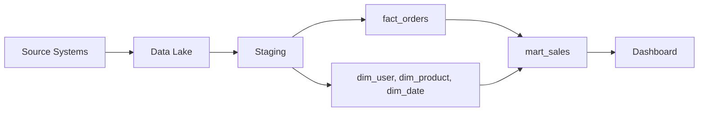

# Warehouse 설계 예제

> Data Warehouse 101 시리즈 (10/10)


## 이 글에서 다룰 문제

개별 개념을 따로 이해하는 것과 실제로 하나의 Warehouse를 설계하는 일은 다릅니다. 하나의 도메인을 처음부터 끝까지 따라가 보면 grain, dimension, schema, 적재 흐름, mart가 왜 그 자리에 놓이는지 훨씬 분명해집니다. 이 마지막 글은 앞선 개념을 한 번에 조립해 보는 예제입니다.

> 좋은 설계는 언제나 grain을 한 줄로 분명하게 적는 일에서 시작합니다.

## 전체 흐름


## Before/After

**Before**: source DB를 직접 조회하며 분석할 때마다 SQL을 새로 작성해 느리고 비싸고 자주 깨집니다.

**After**: Warehouse에 star schema와 mart가 준비되어 있어 분석가가 짧은 SQL로 대시보드를 만듭니다.

## 5단계 설계

### 1단계 — Grain 정의

> *fact_orders 의 grain*: *주문 1건* 당 1행.

### 2단계 — Dimension 식별

```text
dim_user      : 사용자 정보
dim_product   : 상품 정보
dim_date      : 날짜 속성 (year, month, weekday)
dim_channel   : 유입 채널
```

### 3단계 — Star schema 작성

```sql
CREATE TABLE fact_orders (
    order_id      STRING,
    order_date    DATE,
    user_key      INT64,
    product_key   INT64,
    channel_key   INT64,
    quantity      INT64,
    amount        NUMERIC
)
PARTITION BY order_date
CLUSTER BY user_key, product_key;
```

### 4단계 — ETL/ELT 흐름

```text
source.orders  --(append)-->  staging.orders
                              |
                              v
              변환: surrogate key 부여, SCD type 2 처리
                              |
                              v
                        fact_orders / dim_*
```

### 5단계 — Mart + 대시보드

```sql
CREATE OR REPLACE VIEW mart_sales AS
SELECT
    d.year,
    d.month,
    p.category,
    SUM(f.amount) AS revenue
FROM fact_orders f
JOIN dim_date d    ON d.date_key   = f.order_date
JOIN dim_product p ON p.product_key = f.product_key
GROUP BY d.year, d.month, p.category;
```

## 이 코드에서 주목할 점

- grain 한 줄이 fact 구조와 dimension 범위를 함께 결정합니다.
- surrogate key를 두면 source 시스템의 키 변경을 완충할 수 있습니다.
- mart는 raw 데이터를 그대로 노출하는 곳이 아니라 대시보드에 맞춰 준비된 답을 제공하는 계층입니다.

## 자주 하는 실수 5가지

1. **grain을 문서에 명확히 적지 않습니다.** 한 줄 정의가 없으면 모델 경계가 계속 흔들립니다.
2. **모든 컬럼을 fact에 몰아넣습니다.** 속성은 dimension으로 분리해야 모델이 단순해집니다.
3. **source key를 그대로 재사용합니다.** 상위 시스템 변경이 곧바로 Warehouse 문제로 이어질 수 있습니다.
4. **SCD를 고려하지 않습니다.** 과거 기준으로 다시 봐야 할 때 숫자가 어긋납니다.
5. **mart 없이 raw fact를 대시보드에 직접 연결합니다.** 작은 구조 변경도 사용자 화면에 바로 충격을 줍니다.

## 실무에서는 이렇게 쓰입니다

실무에서는 한 페이지 안팎의 design doc에 grain, dimension, partition, owner를 먼저 적는 경우가 많습니다. 리뷰가 끝나면 PR로 DDL과 변환 모델을 올리고, 이어서 ETL DAG를 추가합니다. 대시보드는 가능하면 mart만 바라보도록 경계를 분명히 둡니다.

## 체크리스트

- [ ] Grain을 한 줄 문장으로 적을 수 있다.
- [ ] Conformed dimension의 의미를 설명할 수 있다.
- [ ] Star schema DDL을 직접 작성할 수 있다.
- [ ] Mart와 fact의 차이를 명확히 말할 수 있다.

## 정리 및 다음 단계

이제는 grain에서 시작해 dimension, fact, partition, 적재 흐름, mart, 대시보드까지 하나의 흐름으로 연결해서 볼 수 있어야 합니다. 개별 개념을 외우는 단계보다 중요한 것은 이 연결 관계를 이해하는 일입니다. 다음 시리즈에서는 이렇게 준비한 데이터를 바탕으로 Data Science와 MLOps로 한 걸음 더 나아가겠습니다.

<!-- toc:begin -->
- [Data Warehouse란 무엇인가?](./01-what-is-data-warehouse.md)
- [OLTP와 OLAP](./02-oltp-and-olap.md)
- [Fact와 Dimension](./03-fact-and-dimension.md)
- [Star Schema](./04-star-schema.md)
- [Partition과 Clustering](./05-partition-and-clustering.md)
- [ETL과 ELT](./06-etl-and-elt.md)
- [BI와 Dashboard](./07-bi-and-dashboard.md)
- [Data Mart](./08-data-mart.md)
- [성능 최적화](./09-performance-optimization.md)
- **Warehouse 설계 예제 (현재 글)**
<!-- toc:end -->

## 참고 자료

- [Kimball Group — Dimensional Modeling Techniques](https://www.kimballgroup.com/data-warehouse-business-intelligence-resources/kimball-techniques/dimensional-modeling-techniques/)
- [BigQuery — Schema Design Best Practices](https://cloud.google.com/bigquery/docs/best-practices-schema-design)
- [dbt — How We Structure Our Projects](https://docs.getdbt.com/best-practices/how-we-structure/1-guide-overview)
- [Snowflake — Data Modeling](https://docs.snowflake.com/en/user-guide/table-considerations)

Tags: DataWarehouse, Design, Example, EndToEnd, Analytics
