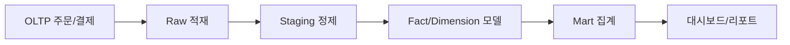

# Data Warehouse 101 (10/10): Warehouse 설계 예제

개별 개념을 따로 이해하는 것과 실제로 하나의 Warehouse를 설계하는 일은 다릅니다. 하나의 도메인을 처음부터 끝까지 따라가 보면 grain, dimension, schema, 적재 흐름, mart가 왜 그 자리에 놓이는지 훨씬 분명해집니다. 이 마지막 글은 앞선 개념을 한 번에 조립해 보는 예제입니다.

이 글은 Data Warehouse 101 시리즈의 마지막 글입니다.


*Data Warehouse 101 10장 흐름 개요*
> 실제 설계는 교과서와 달리 '현재 비용 제약 → 다음 목표 → 마이그레이션 경로'를 순서대로 결정하는 연속입니다.

## 먼저 던지는 질문

- Warehouse 설계는 왜 grain 한 줄에서 시작해야 할까요?
- fact, dimension, schema, partition, ETL, mart는 어떤 순서로 연결될까요?
- 전자상거래 도메인에서 어떤 dimension을 공통 자산으로 볼 수 있을까요?

## 이 글에서 배울 것

- 전자상거래 예제로 end-to-end 설계를 보는 법
- grain → dimension → schema → partition → ETL → mart의 순서
- 각 조각이 대시보드로 어떻게 이어지는지
- 설계 실습 5단계
- 입문 단계에서 자주 나오는 실수 5가지

## 왜 중요한가

개별 개념을 아는 것만으로는 설계를 설명하기 어렵습니다. 실제로는 각 조각이 왜 그 자리에 놓이는지 연결해서 보여 줄 수 있어야 합니다. 마지막 글인 이 예제가 바로 그 조립 과정을 한 번에 보여 줍니다.

> 깔끔한 설계는 거의 항상 grain 한 줄에서 시작합니다.

## 개념 한눈에 보기

실제 온라인 쇼핑몰 데이터 웨어하우스를 예제로, 지금까지의 개념들이 어떻게 조합되고 생명 주기에 따라 어떻게 변하는지 봅니다. 설계 결정의 이유와 트레이드오프를 이해하면 자신의 환경에 맞는 구조를 만들 수 있습니다.

## 핵심 용어

- **Grain**: fact 한 행이 무엇을 의미하는지 적는 설계의 출발점입니다.
- **Conformed dimension**: 여러 fact가 함께 공유하는 차원입니다.
- **Surrogate key**: Warehouse가 발급하는 대체 식별자입니다.
- **Slowly Changing Dimension (SCD)**: 차원 속성 변화를 시간에 따라 기록하는 방식입니다.
- **Mart**: 소비자에게 바로 제공하는 주제별 최종 모델입니다.

## 전후 비교

**Before**: source DB를 직접 조회하며 분석할 때마다 SQL을 새로 작성해 느리고 비싸고 자주 깨집니다.

**After**: Warehouse에 star schema와 mart가 준비되어 있어 분석가가 짧은 SQL로 대시보드를 만듭니다.

## 실습: 5단계 설계

### 1단계 — grain 정의하기

> *fact_orders grain*: one row per *order*.

### 2단계 — dimension 식별하기

```text
dim_user      : user attributes
dim_product   : product attributes
dim_date      : date attributes (year, month, weekday)
dim_channel   : acquisition channel
```

### 3단계 — star schema 작성하기

```sql
CREATE TABLE fact_orders (
    order_id      STRING,
    order_date    DATE,
    user_key      INT64,
    product_key   INT64,
    channel_key   INT64,
    quantity      INT64,
    amount        NUMERIC
)
PARTITION BY order_date
CLUSTER BY user_key, product_key;
```

## 설계 체크리스트

Warehouse 설계를 체계적으로 진행하기 위해 단계별 산출물을 정리한 체크리스트입니다.

| 단계 | 항목 | 산출물 | 확인 대상 |
|---|---|---|---|
| 1. 요구사항 정의 | 비즈니스 질문, KPI, 사용자 페르소나 | 요구사항 문서 | 제품/운영/데이터 팀 |
| 2. 데이터 소스 파악 | OLTP 스키마, API, 파일, 접근 방식 | 데이터 소스 목록 | 데이터 엔지니어 |
| 3. 모델링 (grain, dimension, schema) | Fact 테이블 DDL, Dimension DDL, ERD | 디자인 문서 (1-2페이지) | 데이터 모델러 |
| 4. ETL/ELT 파이프라인 | 적재 흐름, 갱신 주기, 변환 로직 | DAG 코드, dbt 모델 | 데이터 엔지니어 |
| 5. 거버네스 | 권한, 보안, 감사 로그, 데이터 품질 | 권한 테이블, 테스트 코드 | 보안/컴플라이언스 팀 |

각 단계는 순차적으로 진행하며, 이전 단계의 산출물을 기반으로 합니다. 모델링 단계에서 grain을 명확히 정의하지 않으면 나중에 모델 경계가 흔들립니다.

### 4단계 — ETL/ELT 흐름 정리하기

```text
source.orders  --(append)-->  staging.orders
                              |
                              v
              transform: surrogate keys, SCD type 2
                              |
                              v
                       fact_orders / dim_*
```

### 5단계 — mart와 대시보드 연결하기

```sql
CREATE OR REPLACE VIEW mart_sales AS
SELECT
    d.year,
    d.month,
    p.category,
    SUM(f.amount) AS revenue
FROM fact_orders f
JOIN dim_date d    ON d.date_key   = f.order_date
JOIN dim_product p ON p.product_key = f.product_key
GROUP BY d.year, d.month, p.category;
```

## SQL 예제: 전체 스키마 DDL

전자상거래 Warehouse의 전체 스키마를 DDL로 표현하면 다음과 같습니다.

```sql
-- Fact table
CREATE TABLE warehouse.fact_orders (
    order_id      STRING NOT NULL,
    order_date    DATE NOT NULL,
    user_key      INT64 NOT NULL,
    product_key   INT64 NOT NULL,
    channel_key   INT64,
    quantity      INT64,
    amount        NUMERIC(12, 2)
)
PARTITION BY order_date
CLUSTER BY user_key, product_key;

-- Dimension: User
CREATE TABLE warehouse.dim_user (
    user_key      INT64 NOT NULL,
    user_id       STRING NOT NULL,
    name          STRING,
    email         STRING,
    region        STRING,
    created_at    TIMESTAMP,
    valid_from    DATE,
    valid_to      DATE,
    is_current    BOOLEAN
);

-- Dimension: Product
CREATE TABLE warehouse.dim_product (
    product_key   INT64 NOT NULL,
    product_id    STRING NOT NULL,
    name          STRING,
    category      STRING,
    price         NUMERIC(10, 2),
    valid_from    DATE,
    valid_to      DATE,
    is_current    BOOLEAN
);

-- Dimension: Channel
CREATE TABLE warehouse.dim_channel (
    channel_key   INT64 NOT NULL,
    channel_id    STRING NOT NULL,
    name          STRING,
    channel_type  STRING
);

-- Data Mart
CREATE OR REPLACE VIEW marts.monthly_revenue AS
SELECT
    DATE_TRUNC('month', f.order_date) AS month,
    p.category,
    u.region,
    SUM(f.amount) AS revenue,
    COUNT(DISTINCT f.order_id) AS order_count
FROM warehouse.fact_orders f
JOIN warehouse.dim_product p ON p.product_key = f.product_key
JOIN warehouse.dim_user u ON u.user_key = f.user_key
WHERE p.is_current AND u.is_current
GROUP BY 1, 2, 3;
```

이 DDL을 Git에 커밋하면 스키마 변경이 모두 기록되고, 리뷰와 배포가 쉽습니다.

## 이 코드에서 먼저 봐야 할 점

- grain 한 줄이 fact 구조와 dimension 범위를 함께 결정합니다.
- surrogate key를 두면 source 시스템의 키 변경을 완충할 수 있습니다.
- mart는 raw 데이터를 그대로 노출하는 곳이 아니라 대시보드에 맞춰 준비된 답을 제공하는 계층입니다.

## 운영 모범 사례

Warehouse를 설계한 다음에는 운영 단계로 넘어갑니다. 운영 단계에서는 모니터링, 비용 관리, 품질 관리가 핵심입니다.

### 모니터링

```sql
-- 일별 적재 양 확인
SELECT
    DATE(creation_time) AS load_date,
    SUM(total_bytes_processed) / (1024*1024*1024) AS gb_loaded
FROM `region-us`.INFORMATION_SCHEMA.JOBS_BY_PROJECT
WHERE job_type = 'LOAD'
  AND creation_time >= TIMESTAMP_SUB(CURRENT_TIMESTAMP(), INTERVAL 30 DAY)
GROUP BY 1
ORDER BY 1 DESC;
```

적재량이 급증하거나 급감하면 파이프라인 문제를 의심합니다.

```sql
-- 느린 쿼리 Top 10
SELECT
    user_email,
    query,
    total_slot_ms / 1000 AS runtime_seconds,
    total_bytes_processed / (1024*1024*1024) AS gb_scanned
FROM `region-us`.INFORMATION_SCHEMA.JOBS_BY_PROJECT
WHERE creation_time >= TIMESTAMP_SUB(CURRENT_TIMESTAMP(), INTERVAL 7 DAY)
ORDER BY total_slot_ms DESC
LIMIT 10;
```

느린 쿼리를 찾아 EXPLAIN으로 분석하고 최적화합니다.

### 비용 관리

```python
# BigQuery 일별 비용 집계 (Python)
from google.cloud import bigquery
import pandas as pd

client = bigquery.Client()
query = """
SELECT
    DATE(creation_time) AS date,
    SUM(total_bytes_billed) / (1024*1024*1024*1024) AS tb_billed,
    SUM(total_bytes_billed) / (1024*1024*1024*1024) * 5.0 AS cost_usd
FROM `region-us`.INFORMATION_SCHEMA.JOBS_BY_PROJECT
WHERE creation_time >= TIMESTAMP_SUB(CURRENT_TIMESTAMP(), INTERVAL 30 DAY)
GROUP BY 1
ORDER BY 1 DESC
"""
df = client.query(query).to_dataframe()
print(df)
```

비용이 예상보다 높으면 Slack 알람을 보내 비정상 패턴을 조기에 감지합니다.

### 품질 관리

```sql
-- dbt test 예시: null 체크
SELECT COUNT(*)
FROM warehouse.fact_orders
WHERE order_id IS NULL OR amount IS NULL;
```

테스트가 실패하면 파이프라인을 멈추고 알람을 보냅니다. dbt나 Great Expectations 같은 도구를 활용하면 품질 관리가 자동화됩니다.

## 자주 하는 실수 5가지

1. **grain을 문서에 명확히 적지 않습니다.** 한 줄 정의가 없으면 모델 경계가 계속 흔들립니다.
2. **모든 컬럼을 fact에 몰아넣습니다.** 속성은 dimension으로 분리해야 모델이 단순해집니다.
3. **source key를 그대로 재사용합니다.** 상위 시스템 변경이 곧바로 Warehouse 문제로 이어질 수 있습니다.
4. **SCD를 고려하지 않습니다.** 과거 기준으로 다시 봐야 할 때 숫자가 어긋납니다.
5. **mart 없이 raw fact를 대시보드에 직접 연결합니다.** 작은 구조 변경도 사용자 화면에 바로 충격을 줍니다.

## 실무에서는 이렇게 나타납니다

실무에서는 한 페이지 안팎의 design doc에 grain, dimension, partition, owner를 먼저 적는 경우가 많습니다. 리뷰가 끝나면 PR로 DDL과 변환 모델을 올리고, 이어서 ETL DAG를 추가합니다. 대시보드는 가능하면 mart만 바라보도록 경계를 분명히 둡니다.

## 실무에서는 이렇게 생각합니다

- 항상 grain부터 정의합니다.
- Conformed dimension은 조직 전체 자산으로 공유합니다.
- fact/dimension과 mart 사이의 경계를 분명히 둡니다.
- 오너 없는 테이블은 만들지 않습니다.
- 문서 없는 설계는 설계가 아니라고 봅니다.

## 체크리스트

- [ ] Grain을 한 줄 문장으로 적을 수 있다.
- [ ] Conformed dimension의 의미를 설명할 수 있다.
- [ ] Star schema DDL을 직접 작성할 수 있다.
- [ ] Mart와 fact의 차이를 명확히 말할 수 있다.

## 연습 문제

1. 블로그 댓글 시스템의 grain과 dimension을 적어 보세요.
2. 광고 클릭 로그를 위한 fact_clicks를 설계해 보세요.
3. 월간 매출 대시보드를 위한 mart view SQL을 적어 보세요.

## 마무리와 다음 글

이제는 grain에서 시작해 dimension, fact, partition, 적재 흐름, mart, 대시보드까지 하나의 흐름으로 연결해서 볼 수 있어야 합니다. 개별 개념을 외우는 단계보다 중요한 것은 이 연결 관계를 이해하는 일입니다. 다음 시리즈에서는 이렇게 준비한 데이터를 바탕으로 Data Science와 MLOps로 한 걸음 더 나아가겠습니다.

## 모던 데이터 스택 관점에서 설계 확장

마지막 예제에서는 전통적 DW 모델에 더해 현대 데이터 스택 구성요소를 함께 놓고 보는 것이 유익합니다. 도구 이름이 핵심은 아니며, 계층 간 책임을 분명히 두는 것이 핵심입니다.

| 계층 | 대표 도구 예시 | 책임 |
| --- | --- | --- |
| Ingestion | Fivetran, Airbyte, CDC | 원천 데이터 안정적 수집 |
| Storage/Warehouse | BigQuery, Snowflake, Redshift | 대규모 저장/집계 실행 |
| Transform | dbt, SQL jobs | 비즈니스 모델 변환 |
| Orchestration | Airflow, Dagster | 의존성/스케줄/재시도 관리 |
| Serving/BI | Looker, Tableau, Power BI | 지표 소비와 의사결정 지원 |
| Governance | Catalog, lineage tools | 정의/소유권/계보 관리 |

이 표를 보면 아키텍처는 한 제품이 아니라 책임 분할의 집합이라는 점이 분명해집니다.

## 클라우드 DW 선택 관점 비교

플랫폼 선택은 "어느 것이 최고인가"보다 "우리 워크로드와 팀 역량에 무엇이 맞는가" 질문으로 접근해야 합니다.

| 항목 | BigQuery | Snowflake | Redshift |
| --- | --- | --- | --- |
| 운영 모델 | 서버리스 지향 | 멀티클러스터 유연 | AWS 통합 강점 |
| 과금 감각 | 스캔/슬롯 중심 | 웨어하우스 런타임 중심 | 노드/리소스 계획 중심 |
| 생태계 | GCP 연동 강함 | 멀티클라우드 강함 | AWS 주변 서비스 강함 |
| 초기 진입 | 빠름 | 빠름 | 설계 자유도 높음 |

실무에서는 기존 클라우드 계약, 보안 정책, 팀 경험이 기술적 우열보다 더 큰 결정 요인이 되는 경우가 많습니다.

## 설계 의사결정 로그 예시

아키텍처는 문서화하지 않으면 빠르게 잊힙니다. 아래처럼 의사결정 로그를 남기면 이후 변경 시점에 큰 도움이 됩니다.

```yaml
decision_log:
  - id: DW-001
    topic: "fact_orders grain"
    decision: "one row per order line"
    rationale: "refund, discount, quantity 분석 정확도 확보"
    owner: "analytics-engineering"
  - id: DW-002
    topic: "partition key"
    decision: "order_date daily partition"
    rationale: "대부분 질의가 기간 필터 기반"
    owner: "data-platform"
  - id: DW-003
    topic: "mart policy"
    decision: "도메인별 mart 분리 + conformed dimension 공유"
    rationale: "팀 자율성과 지표 일관성 균형"
    owner: "data-governance"
```

이 기록은 신규 인원 온보딩뿐 아니라 "왜 이렇게 만들었는가"를 다시 확인할 때 매우 유용합니다.

## end-to-end 검증 시나리오

설계가 완료되면 반드시 경로 전체를 검증해야 합니다.

1. 원천 주문 이벤트가 raw에 누락 없이 들어오는가
2. staging 캐스팅 오류가 SLA 내에서 처리되는가
3. fact/dim 조인으로 핵심 KPI가 정확히 계산되는가
4. mart 지표가 대시보드와 일치하는가
5. 비용/성능 경고가 임계값을 넘지 않는가

이 검증을 자동화하면 설계는 문서가 아니라 운영 가능한 시스템으로 완성됩니다.

## 아키텍처 대안 비교

같은 도메인이라도 팀 규모와 요구사항에 따라 설계 경로가 달라집니다. 아래 비교는 자주 선택되는 두 가지 경로입니다.

| 항목 | 경량 시작형 | 거버넌스 우선형 |
| --- | --- | --- |
| 초기 목표 | 빠른 가시성 확보 | 장기 일관성 확보 |
| 모델 수 | 적게 시작 | 표준 계층 먼저 구축 |
| 데이터 품질 | 핵심 지표 중심 점검 | 전 계층 테스트 우선 |
| 도입 난이도 | 낮음 | 중간~높음 |
| 확장성 | 점진 확장 필요 | 초기 부담 크나 안정적 |

둘 중 무엇이 정답인지는 조직 상황에 따라 다릅니다. 중요한 것은 선택 근거를 문서화하고, 다음 단계 전환 조건을 미리 정의하는 일입니다.

## 설계 검증 체크리스트 상세

1. grain 정의가 모든 fact 문서에 존재하는가
2. dimension SCD 정책이 컬럼 단위로 명시되어 있는가
3. partition/clustering 선택 근거가 쿼리 패턴과 연결되는가
4. mart 지표가 시맨틱 정의와 일치하는가
5. 비용 경고와 장애 대응 채널이 정해져 있는가

체크리스트를 통과해야 "개념적으로 맞는 설계"에서 "운영 가능한 설계"로 넘어갈 수 있습니다.

## 모던 스택 구성요소 비교 메모

모던 데이터 스택은 도구 다양성이 크기 때문에, 특정 벤더 기능보다 데이터 계약과 운영 규칙을 우선해야 합니다. 예를 들어 ingestion 교체가 필요해도 raw 계약과 mart 계약이 안정적이면 하위 계층만 교체해도 전체 서비스 품질을 유지할 수 있습니다.

## 실무 적용 메모

아래 메모는 해당 장의 개념을 실제 운영 환경에 옮길 때 반복적으로 확인하는 항목을 정리한 것입니다. 단순히 지식을 아는 것과 운영에서 안정적으로 반복하는 것은 다르기 때문에, 팀 단위 규칙으로 문서화해 두는 편이 좋습니다.

| 점검 영역 | 질문 | 권장 기준 |
| --- | --- | --- |
| 데이터 정의 | 같은 용어를 팀마다 다르게 쓰는가 | 용어집과 지표 정의를 단일 출처로 관리 |
| 파이프라인 안정성 | 재실행 시 결과가 동일한가 | idempotent 원칙, 상태 테이블 관리 |
| 비용 통제 | 월별 비용이 예측 가능한가 | 스캔 바이트, 고비용 쿼리 상위 추적 |
| 품질 보증 | 잘못된 데이터 유입을 조기에 잡는가 | null/중복/범위 검증 자동화 |
| 책임 분리 | 장애 시 소유자가 명확한가 | 계층별 owner와 on-call 채널 지정 |

운영에서는 기술 선택보다 경계와 책임이 더 큰 차이를 만듭니다. 예를 들어 모델이 훌륭해도 지표 소유자가 없으면 숫자 불일치 이슈가 장기간 방치될 수 있습니다. 반대로 도구가 완벽하지 않아도 책임 경계가 명확하면 복구 속도와 개선 속도가 빠릅니다.

```yaml
operating_baseline:
  contracts:
    raw: "append-only and replayable"
    transform: "test-required before publish"
    serving: "semantic definitions are versioned"
  quality_checks:
    - not_null
    - unique_key
    - accepted_values
    - referential_integrity
  cost_controls:
    - heavy_query_review_weekly
    - partition_filter_required
    - select_star_block_in_pr
  ownership:
    data_platform: "ingestion and storage"
    analytics_engineering: "transform and marts"
    domain_analytics: "metric definition and dashboard"
```

이 기준을 프로젝트 초기에 합의하면, 시리즈에서 다룬 개념이 문서 지식으로 끝나지 않고 운영 습관으로 정착됩니다. 특히 신규 팀원이 합류했을 때 학습 속도가 빨라지고, 장애나 지표 충돌 같은 사건이 생겨도 공통된 기준으로 빠르게 의사결정을 내릴 수 있습니다.

또한 분기 단위 회고에서는 기술 성능 지표뿐 아니라 의사결정 지표도 함께 보는 것이 좋습니다. 예를 들어 "대시보드 숫자 논쟁으로 소모된 회의 시간", "지표 정의 변경 후 영향 범위 확인 시간", "재처리 요청 처리 리드타임" 같은 운영 지표를 추적하면 데이터 조직의 성숙도를 더 현실적으로 파악할 수 있습니다.

## 실전 앵커: 모델, 파이프라인, 성능 검증

아래 예시는 이 글의 개념을 실제 운영으로 옮길 때 바로 재사용할 수 있는 최소 앵커입니다. 스키마, 적재 설정, 성능 비교를 한 묶음으로 두면 설계 논의가 추상 수준에서 끝나지 않고 실행 가능한 결정으로 이어집니다.

```sql
-- 공통 분석 질의 템플릿: 기간 + 세그먼트 + 지표
WITH scoped AS (
    SELECT
        f.date_key,
        f.amount,
        f.qty,
        c.segment,
        p.category
    FROM fact_sales f
    JOIN dim_customer c ON c.customer_key = f.customer_key
    JOIN dim_product p ON p.product_key = f.product_key
    WHERE f.date_key BETWEEN 20260101 AND 20260331
)
SELECT
    segment,
    category,
    SUM(amount) AS revenue,
    SUM(qty) AS units,
    COUNT(*) AS order_lines,
    ROUND(SUM(amount) / NULLIF(COUNT(*), 0), 2) AS avg_line_amount
FROM scoped
GROUP BY 1, 2
ORDER BY revenue DESC;
```

```yaml
pipeline_contract:
  schedule: "0 * * * *"
  source:
    type: cdc
    lag_slo_minutes: 15
  transform:
    engine: dbt
    model_layers: [stg, int, mart]
  quality_tests:
    - not_null
    - unique
    - relationships
    - accepted_values
  publish:
    target: mart_sales_daily
    strategy: merge
```



성능 비교는 반드시 동일 조건에서 수행해야 합니다. 파티션 필터 유무, 조인 순서, 집계 단위를 고정하지 않으면 숫자가 설계를 설명하지 못합니다.

| 비교 항목 | 조건 A(비최적화) | 조건 B(최적화) | 해석 |
| --- | --- | --- | --- |
| 스캔 바이트 | 480GB | 62GB | 파티션 프루닝이 대부분의 차이를 만듭니다. |
| 실행 시간 | 94초 | 18초 | 집계 이전 필터링으로 셔플 비용이 줄어듭니다. |
| 슬롯/크레딧 사용량 | 높음 | 중간 | 비용 안정성이 높아집니다. |
| 재현성 | 낮음 | 높음 | 표준 템플릿 쿼리 사용 시 비교 가능성이 유지됩니다. |

운영에서는 "정확한 한 번"보다 "안전한 재실행"이 더 중요한 경우가 많습니다. 그래서 적재 키를 두고 upsert 기준을 명확히 정의하는 방식이 필요합니다.

```sql
-- 재실행 가능한 머지 예시
MERGE INTO mart_sales_daily t
USING (
    SELECT
        d.full_date,
        c.segment,
        p.category,
        SUM(f.amount) AS revenue,
        SUM(f.qty) AS units
    FROM fact_sales f
    JOIN dim_date d ON d.date_key = f.date_key
    JOIN dim_customer c ON c.customer_key = f.customer_key
    JOIN dim_product p ON p.product_key = f.product_key
    WHERE d.full_date >= CURRENT_DATE - INTERVAL '7 day'
    GROUP BY 1, 2, 3
) s
ON t.full_date = s.full_date
AND t.segment = s.segment
AND t.category = s.category
WHEN MATCHED THEN UPDATE SET
    revenue = s.revenue,
    units = s.units,
    updated_at = CURRENT_TIMESTAMP
WHEN NOT MATCHED THEN INSERT (
    full_date, segment, category, revenue, units, updated_at
) VALUES (
    s.full_date, s.segment, s.category, s.revenue, s.units, CURRENT_TIMESTAMP
);
```

이 패턴을 기준선으로 두면, 모델 변경이나 파이프라인 장애가 생겨도 영향을 계층별로 좁혀 복구할 수 있습니다. 데이터 웨어하우스 운영은 쿼리 한두 개의 튜닝보다, 반복 가능한 설계 계약을 지키는 과정에 더 가깝습니다.

## 처음 질문으로 돌아가기

- **처음 웨어하우스를 설계할 때 어디서 시작해야 할까요?**
  - 현재의 분석 요구사항과 데이터 규모를 명확히 한 뒤, 가장 중요한 도메인부터 모델링합니다.
- **설계한 스키마를 바꿔야 하면 기존 쿼리와 대시보드는 어떻게 하나요?**
  - 호환성 레이어(뷰, 별칭)를 먼저 만들어 기존 쿼리를 보호한 뒤 점진적으로 이관합니다.
- **설계한 모델이 실제로 작동하는지 어떻게 검증할까요?**
  - 목표 지표들이 예상대로 계산되는지, 예상 쿼리 성능이 나오는지 초기에 충분히 테스트합니다.

<!-- toc:begin -->
## 시리즈 목차

- [Data Warehouse 101 (1/10): Data Warehouse란 무엇인가?](./01-what-is-data-warehouse.md)
- [Data Warehouse 101 (2/10): OLTP와 OLAP](./02-oltp-and-olap.md)
- [Data Warehouse 101 (3/10): Fact와 Dimension](./03-fact-and-dimension.md)
- [Data Warehouse 101 (4/10): Star Schema](./04-star-schema.md)
- [Data Warehouse 101 (5/10): Partition과 Clustering](./05-partition-and-clustering.md)
- [Data Warehouse 101 (6/10): ETL과 ELT](./06-etl-and-elt.md)
- [Data Warehouse 101 (7/10): BI와 Dashboard](./07-bi-and-dashboard.md)
- [Data Warehouse 101 (8/10): Data Mart](./08-data-mart.md)
- [Data Warehouse 101 (9/10): 성능 최적화](./09-performance-optimization.md)
- **Warehouse 설계 예제 (현재 글)**

<!-- toc:end -->

## 참고 자료

- [Kimball Group — Dimensional Modeling Techniques](https://www.kimballgroup.com/data-warehouse-business-intelligence-resources/kimball-techniques/dimensional-modeling-techniques/)
- [BigQuery — Schema Design Best Practices](https://cloud.google.com/bigquery/docs/best-practices-schema-design)
- [dbt — How We Structure Our Projects](https://docs.getdbt.com/best-practices/how-we-structure/1-guide-overview)
- [Snowflake — Data Modeling](https://docs.snowflake.com/en/user-guide/table-considerations)

- [이 시리즈의 예제 코드 (book-examples)](https://github.com/yeongseon-books/book-examples/tree/main/data-warehouse-101/ko)

Tags: DataWarehouse, Design, Example, EndToEnd, Analytics
