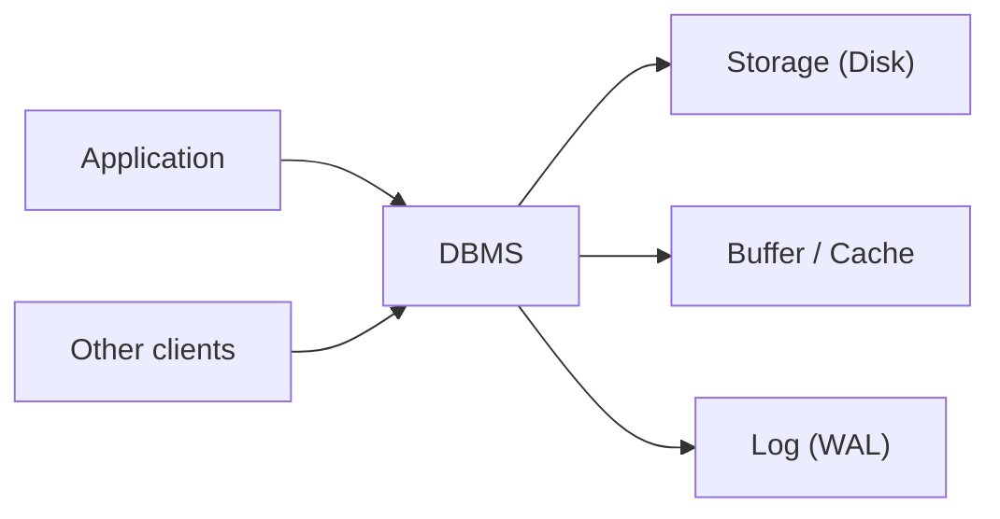

# Database Systems 101 (1/10): What Is a Database System?

This is the first post in the Database Systems 101 series.

> Database Systems 101 series (1/10)

**Core question**: We could just put data in a file. Why do we run a whole separate piece of software called a database?

> A database management system (DBMS) is not just storage. It is software that solves four hard problems together — **concurrent access, crash recovery, consistency, and querying**. A flat file works until two users, a power failure, or a non-trivial question shows up. After that, it does not. This first episode draws that boundary.

## Questions to Keep in Mind

- What boundary should you inspect first when applying What Is a Database System??
- Which signal should the example or diagram make visible for What Is a Database System??
- What failure should be prevented first when What Is a Database System? reaches a real system?

## Big Picture


*database systems 101 chapter 1 flow overview*

This picture places What Is a Database System? inside an operating flow. The point is not to memorize the concept in isolation, but to see how input, processing, verification, and operational signals connect across boundaries.

> The core of What Is a Database System? is not the feature name; it is deciding what to verify at each boundary and which signal to keep.

## What You Will Learn

- The decisive difference between a file and a DBMS
- The four properties a DBMS spends most of its effort guaranteeing
- What relational, document, and key-value stores are good at
- When "a JSON file is enough" is actually true

## Why It Matters

If you treat a database as "the place where data goes," you cannot explain why locks happen, why transactions exist, or why your data survives a power loss. Once you understand what a DBMS is for, the rest of this series — SQL, indexes, transactions, isolation — stops looking like trivia and starts looking like inevitable design.

> "We use a database" really means "we don't write concurrency, crash recovery, and consistency by hand."

## Concept at a Glance



A DBMS sits between the application and the disk, accepting requests from many clients while keeping its cache, log, and on-disk state consistent. The application says **what** it wants in SQL; how to lock and how to write to disk is the DBMS's job.

## Key Terms

- **DBMS**: Database management system — software like PostgreSQL, MySQL, or SQLite.
- **Schema**: A specification of the data's structure: tables, columns, types.
- **Transaction**: A group of SQL statements that must all commit or all be rolled back.
- **Durability**: Once committed, a change survives even an immediate crash.
- **Concurrency control**: The mechanism that keeps results sane when many clients touch the same data at once.

## Before/After

**Before — write to a file directly**

```python
# accounts.py — touch the file ourselves
import json

def deposit(user_id: str, amount: int) -> None:
    with open("accounts.json", "r") as f:
        data = json.load(f)
    data[user_id] = data.get(user_id, 0) + amount
    with open("accounts.json", "w") as f:
        json.dump(data, f)
```

Fine for one user. With two processes, one deposit silently disappears. A crash mid-`json.dump` corrupts the file.

**After — use SQLite**

```python
# accounts.py — DBMS owns concurrency and durability
import sqlite3

def deposit(db: sqlite3.Connection, user_id: str, amount: int) -> None:
    with db:  # transaction
        db.execute(
            "UPDATE accounts SET balance = balance + ? WHERE user_id = ?",
            (amount, user_id),
        )
```

The DBMS takes a lock to handle concurrency and uses a write-ahead log so the change survives a crash. The application states intent.

## Hands-on: Try a Tiny DBMS with SQLite

### Step 1 — Create a database

```bash
python3 -c "import sqlite3; sqlite3.connect('shop.db').close()"
ls -l shop.db
```

`shop.db` is the entire database — one file. SQLite runs in-process, no separate server.

### Step 2 — Define a schema

```python
# init.py
import sqlite3

DDL = """
CREATE TABLE IF NOT EXISTS products (
    id    INTEGER PRIMARY KEY,
    name  TEXT NOT NULL,
    price INTEGER NOT NULL CHECK (price >= 0)
);
"""

with sqlite3.connect("shop.db") as db:
    db.executescript(DDL)
```

Types and constraints (`NOT NULL`, `CHECK`) push bad data back at the database boundary, before it reaches your code.

### Step 3 — Insert and read

```python
# use.py
import sqlite3

with sqlite3.connect("shop.db") as db:
    db.execute("INSERT INTO products (name, price) VALUES (?, ?)", ("apple", 1500))
    db.execute("INSERT INTO products (name, price) VALUES (?, ?)", ("milk", 3200))

with sqlite3.connect("shop.db") as db:
    rows = db.execute("SELECT name, price FROM products ORDER BY price").fetchall()
    for name, price in rows:
        print(name, price)
```

The `?` placeholders matter. Building SQL with string formatting opens the door to SQL injection.

### Step 4 — Feel a transaction

```python
# tx.py
import sqlite3

db = sqlite3.connect("shop.db")
try:
    with db:  # auto BEGIN/COMMIT, ROLLBACK on exception
        db.execute("UPDATE products SET price = price + 100 WHERE name = ?", ("apple",))
        raise RuntimeError("something went wrong")
except RuntimeError:
    pass

print(db.execute("SELECT price FROM products WHERE name='apple'").fetchone())
# unchanged — the update was rolled back
```

This single step is the decisive difference from raw files.

### Step 5 — Two processes at once

```python
# writer.py — run in two terminals at the same time
import sqlite3, time
db = sqlite3.connect("shop.db", timeout=5.0)
with db:
    db.execute("UPDATE products SET price = price + 1 WHERE name='apple'")
    time.sleep(2)
print("done")
```

While one transaction is open, the other waits. With direct file writes one update would have overwritten the other.

## What to Notice in This Code

- The application states **what** it wants. Locking, logging, and disk syncing are the DBMS's responsibility.
- Schema and constraints are the first line of data quality, faster and more consistent than application checks.
- Transactions group any SQL into a single "all or nothing" unit. The application defines the boundary.
- The reason two processes don't clobber the file is that SQLite takes a lock for you.

## Five Common Mistakes

1. **Treating a DBMS as "a fancier file."** A comparison without concurrency and crash recovery is no comparison.
2. **Starting without a schema.** It feels free at first; it costs double when you have to clean it up six months in.
3. **Running every statement in autocommit.** Even two-line updates can leave data inconsistent if one half fails.
4. **Building SQL with string formatting instead of `?` placeholders.** The classic on-ramp for SQL injection.
5. **Never testing recovery.** A backup that has not been restored recently is a hope, not a backup.

## How This Shows Up in Production

Most backends use a relational DBMS (PostgreSQL, MySQL) as the system of record, with a cache like Redis and sometimes a search index in front. "We outgrew SQL" is rarer than "we never indexed properly." Reach for NoSQL when the data shape really is a tree, document, time series, or graph and a specialized engine is genuinely simpler.

In operations, what matters is not how it runs on a calm Tuesday but **whether your data survives a bad day**. WAL, backups, replication, point-in-time recovery — those words come up repeatedly later in this series.

## How a Senior Engineer Thinks

- They first ask, "what would I have to write by hand if I skipped the DBMS?" Locks, WAL, indexes, an optimizer — none of it is realistic to build.
- They treat schema as code: migrations are first-class citizens with reviews and rollback plans.
- They draw transaction boundaries explicitly. Vague boundaries hide bugs.
- They shape the data model around access patterns. Normalization is a default, not a religion.
- They rehearse recovery. "We have backups" is not the same as "we restored one this quarter."

## Checklist

- [ ] Can you state in one sentence why this needs a DBMS, not a file?
- [ ] Are tables and constraints defined?
- [ ] Are all writes inside a transaction?
- [ ] Does user input go through `?` placeholders?
- [ ] Has recovery been tested in the last 90 days?

## Practice Problems

1. Compare a file-based store and a DBMS in one sentence each across four axes: concurrency, durability, consistency, querying.
2. Run the two-process update from Step 5. Note which process commits first. Drop the timeout to zero — what error message do you see?
3. Name two cases where "just a JSON file is fine." For each, state the condition that, if broken, forces you to a DBMS.

## Wrap-up and Next Steps

A DBMS is not a place to put data — it is **software that solves concurrency, durability, consistency, and querying together**. That is what lets your application stay focused on intent. Next we look at the model SQL is built on: the relational model.

## Answering the Opening Questions

- **What boundary should you inspect first when applying What Is a Database System??**
  - The article treats What Is a Database System? as a set of boundaries rather than one abstract idea, then separates input, processing, verification, and operational signals.
- **Which signal should the example or diagram make visible for What Is a Database System??**
  - The example and diagram should make visible what enters the system, where it changes, and which check decides pass or fail.
- **What failure should be prevented first when What Is a Database System? reaches a real system?**
  - In production, keep that decision in checklists, logs, and tests so the same failure does not return after the next change.

<!-- toc:begin -->
## In this series

- **What Is a Database System? (current)**
- The Relational Model (upcoming)
- SQL and Query Processing (upcoming)
- Indexes (upcoming)
- Transactions and ACID (upcoming)
- Isolation Levels (upcoming)
- Normalization and Modeling (upcoming)
- Query Optimization (upcoming)
- Replication and Backup (upcoming)
- OLTP and OLAP (upcoming)

<!-- toc:end -->

## References

- [PostgreSQL Documentation — Concepts](https://www.postgresql.org/docs/current/intro-whatis.html)
- [SQLite — When to Use SQLite](https://www.sqlite.org/whentouse.html)
- [Database System Concepts (Silberschatz)](https://www.db-book.com/)
- [Designing Data-Intensive Applications](https://dataintensive.net/)

Tags: Computer Science, Database, DBMS, Data Model, Durability, Transactions
