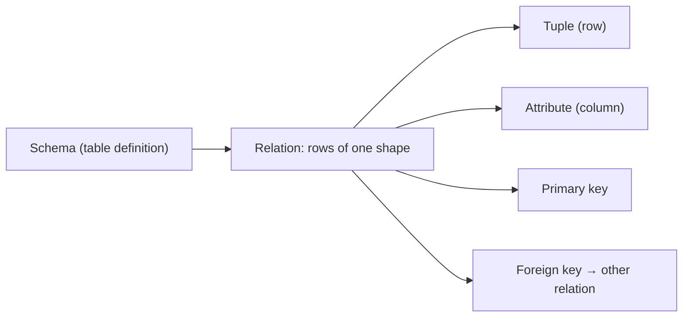

# The Relational Model

This is post 2 in the Database Systems 101 series.

> Database Systems 101 series (2/10)

<!-- a-grade-intro:begin -->

**Core question**: Behind the simple picture of "rows in a table," what is the mathematical model that has lasted half a century?

> The relational model treats data as **sets**. A table is a set of rows; each row is a tuple of the same shape. Keys, foreign keys, normalization, and SQL itself all sit on top of that one promise. Once the model clicks, SQL stops looking like syntax and starts looking like algebra over relations.

<!-- a-grade-intro:end -->

## What You Will Learn

- What "relation," "tuple," and "attribute" actually point to in a table
- What primary keys and foreign keys guarantee
- The meaning of NULL and integrity constraints
- Why SQL looks the way it does, given the model

## Why It Matters

If you blur "table" and "relation," everything that comes later — normalization, indexes, transactions — feels slightly off. Get the model right once and SQL becomes "the language we use to operate on relations," not a list of incantations.

> SQL is not a procedural language. It is a set of operations defined over relations. That is why you describe **what** you want, not **how**.

## Concept at a Glance



One table = one relation. A row in it is a tuple. A cell is an attribute value. A key is the attribute (or set of attributes) that uniquely identifies a row.

## Key Terms

- **Relation**: A set of tuples of the same shape. Everyday word: table.
- **Tuple**: A single row, identified by attribute names rather than positions.
- **Attribute**: A column, with a name and a domain (type).
- **Primary key**: The minimal set of attributes that uniquely identifies a row. Cannot be NULL.
- **Foreign key**: An attribute that points at another relation's primary key, enforcing referential integrity.

## Before/After

**Before — cram everything into one table**

```sql
CREATE TABLE orders (
    id        INTEGER PRIMARY KEY,
    user_name TEXT,
    user_email TEXT,
    product   TEXT,
    price     INTEGER
);
```

The same user ordering twice means storing the email twice. Changing an email touches every order row. The promise "one fact in one place" is broken.

**After — separate into relations**

```sql
CREATE TABLE users (
    id    INTEGER PRIMARY KEY,
    name  TEXT NOT NULL,
    email TEXT NOT NULL UNIQUE
);

CREATE TABLE orders (
    id      INTEGER PRIMARY KEY,
    user_id INTEGER NOT NULL REFERENCES users(id),
    product TEXT    NOT NULL,
    price   INTEGER NOT NULL CHECK (price >= 0)
);
```

Each user lives once in `users`. An order points to a user via foreign key. Changing the email updates exactly one row.

## Hands-on: Build a Tiny Order System on the Relational Model

### Step 1 — Define two tables

```python
# init.py
import sqlite3

DDL = """
PRAGMA foreign_keys = ON;

CREATE TABLE IF NOT EXISTS users (
    id    INTEGER PRIMARY KEY,
    name  TEXT NOT NULL,
    email TEXT NOT NULL UNIQUE
);

CREATE TABLE IF NOT EXISTS orders (
    id      INTEGER PRIMARY KEY,
    user_id INTEGER NOT NULL REFERENCES users(id),
    product TEXT    NOT NULL,
    price   INTEGER NOT NULL CHECK (price >= 0)
);
"""

with sqlite3.connect("shop.db") as db:
    db.executescript(DDL)
```

Do not forget `PRAGMA foreign_keys = ON`. SQLite leaves it off by default.

### Step 2 — Watch keys reject bad data

```python
# keys.py
import sqlite3

with sqlite3.connect("shop.db") as db:
    db.execute("PRAGMA foreign_keys = ON")
    db.execute("INSERT INTO users (name, email) VALUES ('A', 'a@example.com')")
    try:
        db.execute("INSERT INTO users (name, email) VALUES ('B', 'a@example.com')")
    except sqlite3.IntegrityError as e:
        print("UNIQUE violation:", e)
```

The database refuses before the application code ever has to.

### Step 3 — Watch foreign keys enforce referential integrity

```python
# fk.py
import sqlite3

with sqlite3.connect("shop.db") as db:
    db.execute("PRAGMA foreign_keys = ON")
    try:
        db.execute(
            "INSERT INTO orders (user_id, product, price) VALUES (?, ?, ?)",
            (999, "milk", 3200),
        )
    except sqlite3.IntegrityError as e:
        print("FK violation:", e)
```

An order pointing at a non-existent user simply cannot enter the table.

### Step 4 — Combine two relations with a join

```python
import sqlite3

with sqlite3.connect("shop.db") as db:
    rows = db.execute("""
        SELECT u.name, o.product, o.price
        FROM orders o
        JOIN users u ON u.id = o.user_id
        ORDER BY o.id
    """).fetchall()
    for r in rows:
        print(r)
```

The application says "combine two relations on this key." Index choice and join algorithm are the optimizer's decision.

### Step 5 — Try to break integrity

```python
import sqlite3

with sqlite3.connect("shop.db") as db:
    db.execute("PRAGMA foreign_keys = ON")
    try:
        db.execute("DELETE FROM users WHERE email = 'a@example.com'")
    except sqlite3.IntegrityError as e:
        print("Refused — orders still reference this user:", e)
```

Referential integrity is the first line of defense against application bugs corrupting data.

## What to Notice in This Code

- The model's center is "one fact in one place." The user's email lives only in `users`.
- Keys and constraints reject invalid data faster and more uniformly than application checks.
- A join is an operation that combines two relations on a key into a new relation.
- The optimizer is free to choose **how** to compute the same answer faster. That is why you only specify **what**.

## Five Common Mistakes

1. **Disabling foreign keys for convenience.** A small win today; a 3 a.m. dangling-reference page in six months.
2. **Allowing NULL on every column "just in case."** Meaning blurs and queries get harder. NULL should be intentional.
3. **Using natural keys as primary keys.** Emails and phone numbers change. A surrogate key (e.g., integer id) is usually safer.
4. **Duplicating display data across two tables.** The day one side is updated, you have two competing truths.
5. **Avoiding joins and merging in application code.** You get N+1 queries and lose the optimizer.

## How This Shows Up in Production

Most backend modeling lives in two artifacts: a human-readable ER diagram and DDL. New features start as relationships on the diagram and only then become migrations. If "one fact in one place" breaks at the model stage, both code and data start drifting.

Sometimes you **denormalize** for performance. That is fine, but it always pairs with a question: how will the two copies stay in sync, and which one is the truth? Unintentional denormalization is just a future inconsistency bomb.

## How a Senior Engineer Thinks

- They draw the model before writing code. A wrong model cannot be cleaned up by clever code.
- They keep asking, "where does this fact live, and how many places see it?"
- They never disable foreign keys. The debugging bill for a corrupt graph is enormous.
- They check whether NULL is genuinely meaningful before allowing it.
- They denormalize only on purpose, with the sync responsibility written down.

## Checklist

- [ ] Does each fact live in exactly one table?
- [ ] Does every table have a meaningful primary key?
- [ ] Are foreign keys both declared and actively enforced?
- [ ] Is every NULL-allowed column intentional?
- [ ] If you denormalize, is the sync strategy documented?

## Practice Problems

1. In the "Before" single-table model, list two concrete problems that arise when a user changes their email.
2. To imitate the join from Step 4 in application code, how many SQL calls would you need? Describe in one line the N+1 problem that follows.
3. A new feature: "an order can have a note." Compare adding a `note` column to `orders` versus a separate `order_notes` relation in one or two sentences each.

## Wrap-up and Next Steps

The relational model fits in three lines: a table is a set of like-shaped rows; rows are addressed by keys; relationships are represented by foreign keys. That simple promise shapes both SQL and what a DBMS can guarantee. Next we look at SQL itself — how a single SELECT actually gets processed.

<!-- toc:begin -->
- [What Is a Database System?](./01-what-is-a-database.md)
- **The Relational Model (current)**
- SQL and Query Processing (upcoming)
- Indexes (upcoming)
- Transactions and ACID (upcoming)
- Isolation Levels (upcoming)
- Normalization and Modeling (upcoming)
- Query Optimization (upcoming)
- Replication and Backup (upcoming)
- OLTP and OLAP (upcoming)
<!-- toc:end -->

## References

- [Codd 1970 — A Relational Model of Data for Large Shared Data Banks](https://www.seas.upenn.edu/~zives/03f/cis550/codd.pdf)
- [PostgreSQL — Data Definition](https://www.postgresql.org/docs/current/ddl.html)
- [SQLite — Foreign Key Support](https://www.sqlite.org/foreignkeys.html)
- [Database System Concepts (Silberschatz)](https://www.db-book.com/)

Tags: Computer Science, Database, Relational Model, SQL, Integrity, Keys
