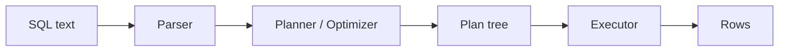

# SQL and Query Processing

This is post 3 in the Database Systems 101 series.

> Database Systems 101 series (3/10)

<!-- a-grade-intro:begin -->

**Core question**: When you type `SELECT * FROM orders WHERE user_id = 7`, what actually happens inside the DBMS before rows come back?

> SQL only states **what** you want. The DBMS turns it into rows in four stages — **parse → analyze → plan → execute** — and the optimizer is allowed to find a cheaper way to compute the same answer. This episode walks those stages and the user-facing window into them: `EXPLAIN`.

<!-- a-grade-intro:end -->

## What You Will Learn

- The consequences of SQL being declarative
- The four stages a query goes through
- How to read the simplest `EXPLAIN` output
- Why the same query can have many valid execution strategies

## Why It Matters

Most performance problems do not come from rewriting SQL. They come from **not knowing what is actually being executed**. Once you can read a plan, "why is this slow?" stops being a guessing game.

> Many SQL queries can produce the same answer, and many execution strategies can produce the same answer for one query. That is exactly why an optimizer exists.

## Concept at a Glance



SQL starts as text and becomes a tree (the plan). The executor walks the tree and emits rows.

## Key Terms

- **DDL/DML**: DDL defines schema (CREATE, ALTER); DML manipulates data (SELECT, INSERT, UPDATE, DELETE).
- **Plan**: The tree of steps the optimizer chose to execute the query.
- **Cost**: The optimizer's estimate it uses to compare plans — a simple I/O and CPU model.
- **Seq Scan vs Index Scan**: Read the whole table, or follow an index.
- **Estimate vs Actual**: The optimizer's expected row count vs what really happened. Big gaps usually mean stale statistics.

## Before/After

**Before — guess at "why slow"**

```sql
SELECT * FROM orders WHERE user_id = 7;
-- slow. Add another index. Still slow. Blame the cache…
```

Touching things you suspect, with no evidence.

**After — read the plan**

```sql
EXPLAIN QUERY PLAN
SELECT * FROM orders WHERE user_id = 7;
-- SCAN orders         ← full scan
-- or
-- SEARCH orders USING INDEX idx_orders_user_id (user_id=?)
```

First you see a full scan; after creating an index, you see the index being used. One line of evidence kills or supports your hypothesis.

## Hands-on: Follow a Single SELECT End to End

### Step 1 — Seed some data

```python
# seed.py
import sqlite3, random

with sqlite3.connect("shop.db") as db:
    db.executescript("""
        DROP TABLE IF EXISTS orders;
        CREATE TABLE orders (
            id      INTEGER PRIMARY KEY,
            user_id INTEGER NOT NULL,
            product TEXT    NOT NULL,
            price   INTEGER NOT NULL
        );
    """)
    rows = [(i, random.randint(1, 1000), "p", random.randint(1, 1000)) for i in range(1, 100001)]
    db.executemany("INSERT INTO orders VALUES (?, ?, ?, ?)", rows)
```

100k rows is enough to see the difference between a scan and an index lookup.

### Step 2 — Query without an index

```python
import sqlite3, time

with sqlite3.connect("shop.db") as db:
    plan = db.execute("EXPLAIN QUERY PLAN SELECT * FROM orders WHERE user_id = 7").fetchall()
    print(plan)

    t = time.time()
    rows = db.execute("SELECT * FROM orders WHERE user_id = 7").fetchall()
    print(len(rows), "rows in", round((time.time()-t)*1000, 1), "ms")
```

You should see `SCAN orders` in the plan. With no index, the optimizer's only choice is to read everything.

### Step 3 — Add an index, see the plan change

```python
with sqlite3.connect("shop.db") as db:
    db.execute("CREATE INDEX IF NOT EXISTS idx_orders_user_id ON orders(user_id)")
    db.execute("ANALYZE")  # refresh statistics

    plan = db.execute("EXPLAIN QUERY PLAN SELECT * FROM orders WHERE user_id = 7").fetchall()
    print(plan)
```

Now you see `SEARCH orders USING INDEX ...`. The SQL did not change; the optimizer's choice did. SQL still only says **what**; **how** is the optimizer's job.

### Step 4 — Inspect a join's plan

```python
with sqlite3.connect("shop.db") as db:
    db.executescript("""
        CREATE TABLE IF NOT EXISTS users (id INTEGER PRIMARY KEY, name TEXT);
        INSERT OR IGNORE INTO users (id, name) SELECT 7, 'Alice';
    """)
    plan = db.execute("""
        EXPLAIN QUERY PLAN
        SELECT u.name, o.product
        FROM orders o JOIN users u ON u.id = o.user_id
        WHERE u.id = 7
    """).fetchall()
    for row in plan:
        print(row)
```

You can see which side of the join is scanned first and how the other side is looked up.

### Step 5 — Same answer, different SQL

```sql
-- A
SELECT * FROM orders WHERE user_id IN (SELECT id FROM users WHERE name = 'Alice');

-- B
SELECT o.* FROM orders o JOIN users u ON u.id = o.user_id WHERE u.name = 'Alice';
```

Both usually produce the same answer. The optimizer may or may not turn them into the same plan. Compare with `EXPLAIN`. This is where you start feeling SQL's freedom and the optimizer's limits at once.

## What to Notice in This Code

- The same SQL can run with very different plans depending on **data volume and statistics**.
- Creating an index is not enough — the optimizer can still ignore it (small tables, stale stats). Sometimes you need `ANALYZE`.
- `EXPLAIN` shows **estimates**. To see real runtimes, use measurement tools like PostgreSQL's `EXPLAIN ANALYZE`.
- The freedom to "compute the same answer differently" is what makes the optimizer worth its weight.

## Five Common Mistakes

1. **Calling a query "slow" without `EXPLAIN`.** No evidence means luck-driven debugging.
2. **Creating an index and being satisfied.** If the optimizer does not pick it, it does nothing. Look at statistics and selectivity.
3. **Selecting all 100 columns (`SELECT *`).** Network and memory cost piles up invisibly. Production SELECTs name their columns.
4. **Building N+1 queries.** SQL inside an application loop means hundreds of round trips per page. Batch with JOIN or IN.
5. **Mixing DDL and DML in one transaction.** Behavior varies subtly by engine. Keep migrations separate.

## How This Shows Up in Production

Performance investigation almost always starts with `EXPLAIN`. On PostgreSQL it is `EXPLAIN (ANALYZE, BUFFERS)`, which shows estimates, actuals, and memory access. Some recurring shapes:

- "Seq Scan + huge row count" → missing index or wrong statistics
- "estimate 1, actual 1,000,000" → stale statistics (`ANALYZE`)
- "Nested Loop on two big sides" → join order or method poorly chosen

Even one engineer on the team who reads plans confidently raises everyone's average SQL by a level.

## How a Senior Engineer Thinks

- They look at `EXPLAIN` first when they suspect something. Hypotheses come second.
- They treat indexes as "good when selective," not "always good."
- They catch N+1 in code review. SQL inside an application loop is a stop sign.
- They paginate. Nobody fetches "everything" at once.
- They trust the optimizer but verify it. Statistics must be alive.

## Checklist

- [ ] Have you actually looked at `EXPLAIN` for the slow query?
- [ ] Are SELECTs naming their columns instead of `*`?
- [ ] Are there any SQL calls inside application loops?
- [ ] After big changes, did `ANALYZE` (or auto-stats) run?
- [ ] Are pagination and LIMIT in place?

## Practice Problems

1. Look at the `EXPLAIN QUERY PLAN` output from Step 2 and explain in one sentence why the optimizer chose a full scan.
2. If two indexes can satisfy the same query, name two criteria the optimizer would use to choose between them.
3. List three reasons not to use `SELECT *`.

## Wrap-up and Next Steps

You write **what**; the DBMS decides **how**. Between text and rows live a parser, an optimizer, and an executor — and `EXPLAIN` is your window. Next we cover the single most powerful lever the optimizer has: indexes.

<!-- toc:begin -->
- [What Is a Database System?](./01-what-is-a-database.md)
- [The Relational Model](./02-relational-model.md)
- **SQL and Query Processing (current)**
- Indexes (upcoming)
- Transactions and ACID (upcoming)
- Isolation Levels (upcoming)
- Normalization and Modeling (upcoming)
- Query Optimization (upcoming)
- Replication and Backup (upcoming)
- OLTP and OLAP (upcoming)
<!-- toc:end -->

## References

- [SQLite — EXPLAIN QUERY PLAN](https://www.sqlite.org/eqp.html)
- [PostgreSQL — Using EXPLAIN](https://www.postgresql.org/docs/current/using-explain.html)
- [Use The Index, Luke!](https://use-the-index-luke.com/)
- [Database System Concepts (Silberschatz)](https://www.db-book.com/)

Tags: Computer Science, Database, SQL, Optimizer, Execution Plan, Queries
