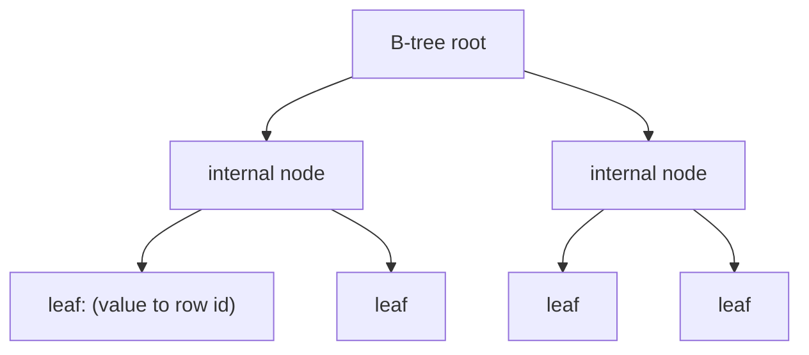

# Indexes

This is post 4 in the Database Systems 101 series.

> Database Systems 101 series (4/10)

<!-- a-grade-intro:begin -->

**Core question**: Why is the index at the back of a book so fast, and why does the same intuition carry directly into database indexes?

> An index is a separate data structure that pre-sorts "value to row location." That is why a full scan is O(N) while an index lookup is O(log N). But indexes are not free. They cost writes and disk space. Good index design is less about "where to add one" and more about "where not to add one."

<!-- a-grade-intro:end -->

## What You Will Learn

- The intuition and limits of B-tree indexes
- The difference between single, composite, and covering indexes
- That selectivity decides whether an index is useful at all
- The cost of indexes and the common anti-patterns

## Why It Matters

Most performance problems come down to "missing index" or "wrong index." At the same time, too many indexes destroy write performance and waste disk. Once the intuition clicks, reading EXPLAIN starts to feel like reading a sentence: you can see why a query did or did not pick the index you expected.

> An index is exactly like the index at the back of a book. It makes one lookup fast, but it makes "read every page once" slower.

## Concept at a Glance



Start at the root and narrow down one level at a time until a leaf gives you the row location. The depth is nearly constant, so even at 100 million rows you reach the answer in just a few steps.

## Key Terms

- **B-tree index**: The most common kind. A balanced tree of sorted keys and pointers.
- **Selectivity**: How many rows a single value points to. 1/1000 is great; 1/2 is essentially useless.
- **Composite index**: An index on several columns. Column order matters.
- **Covering index**: One that includes every column the query needs. The table itself is barely touched.
- **Index-only scan**: The execution path made possible by a covering index.

## Before/After

**Before — looking up 10k rows without an index**

```sql
SELECT * FROM orders WHERE user_id = 7;
-- 100ms (full scan)
```

**After — one well-placed index**

```sql
CREATE INDEX idx_orders_user_id ON orders(user_id);
SELECT * FROM orders WHERE user_id = 7;
-- under 1ms (index lookup)
```

When selectivity is good, a 100x speedup is common.

## Hands-on: See What an Index Does and Does Not Do

### Step 1 — Seed data

```python
# seed.py
import sqlite3, random

with sqlite3.connect("shop.db") as db:
    db.executescript("""
        DROP TABLE IF EXISTS orders;
        CREATE TABLE orders (
            id      INTEGER PRIMARY KEY,
            user_id INTEGER NOT NULL,
            status  TEXT    NOT NULL,
            price   INTEGER NOT NULL
        );
    """)
    rows = [
        (i, random.randint(1, 1000), random.choice(["paid", "pending"]), random.randint(1, 1000))
        for i in range(1, 100001)
    ]
    db.executemany("INSERT INTO orders VALUES (?, ?, ?, ?)", rows)
```

`user_id` has 1000 distinct values (selectivity 1/1000); `status` has only two (selectivity 1/2).

### Step 2 — A good index (high selectivity)

```python
import sqlite3

with sqlite3.connect("shop.db") as db:
    db.execute("CREATE INDEX IF NOT EXISTS idx_user ON orders(user_id)")
    db.execute("ANALYZE")
    plan = db.execute("EXPLAIN QUERY PLAN SELECT * FROM orders WHERE user_id = 7").fetchall()
    print(plan)
```

The optimizer happily picks `idx_user`.

### Step 3 — A bad index (low selectivity)

```python
with sqlite3.connect("shop.db") as db:
    db.execute("CREATE INDEX IF NOT EXISTS idx_status ON orders(status)")
    db.execute("ANALYZE")
    plan = db.execute("EXPLAIN QUERY PLAN SELECT * FROM orders WHERE status = 'paid'").fetchall()
    print(plan)
```

The optimizer is likely to pick a full scan. Pulling half the rows through an index one by one is slower than scanning the whole table.

### Step 4 — Composite index and column order

```python
with sqlite3.connect("shop.db") as db:
    db.execute("CREATE INDEX IF NOT EXISTS idx_user_status ON orders(user_id, status)")
    db.execute("ANALYZE")

    p1 = db.execute("EXPLAIN QUERY PLAN SELECT * FROM orders WHERE user_id=7 AND status='paid'").fetchall()
    p2 = db.execute("EXPLAIN QUERY PLAN SELECT * FROM orders WHERE status='paid'").fetchall()
    print(p1)
    print(p2)
```

The `(user_id, status)` index helps queries that start with `user_id`. Queries that start with `status` get almost no benefit. **The leading column is everything.**

### Step 5 — Covering index

```python
with sqlite3.connect("shop.db") as db:
    db.execute("CREATE INDEX IF NOT EXISTS idx_cover ON orders(user_id, price)")
    db.execute("ANALYZE")
    plan = db.execute("EXPLAIN QUERY PLAN SELECT user_id, price FROM orders WHERE user_id=7").fetchall()
    print(plan)
```

When every column the query needs lives inside the index, the table heap is barely touched. This is the simplest form of an "index-only scan."

## What to Notice in This Code

- An index shines **when selectivity is high**. An index that points at half the table is something the optimizer will deliberately ignore.
- For a composite index, the **leading column** matters most.
- A covering index is the secret weapon of fast reads, but adding columns makes the index itself larger.
- Indexes get updated on every write. INSERT and UPDATE costs climb with every index you add.

## Five Common Mistakes

1. **Indexing every column.** Write costs and disk usage explode, and the optimizer gets confused.
2. **A single-column index on a low-selectivity column.** Things like `is_active` or `gender` are nearly worthless on their own.
3. **Wrong column order in a composite index.** The column most often used in the first condition has to lead.
4. **Creating an index without checking EXPLAIN.** Creating an index does not guarantee the optimizer will use it.
5. **Expecting `LIKE '%foo%'` to use a normal B-tree.** Leading wildcards skip B-tree indexes; you need a full-text index instead.

## How This Shows Up in Production

Whenever a new query enters the system, the routine is the same. (1) Run EXPLAIN on the intended query. (2) Confirm the right index exists, add it if missing, and investigate if it exists but the optimizer skips it. When adding an index, leave a one-line comment that says which query it supports. A year later, you will be able to remove unused indexes safely.

For write-heavy workloads, teams consciously cut indexes back. For read-heavy analytical systems, the answer is often not "more indexes" but columnar storage, materialized views, or summary tables.

## How a Senior Engineer Thinks

- Before adding an index, they ask "what is the selectivity of this column?"
- They validate in both directions: query patterns guide indexes, and existing indexes guide query patterns.
- When an index is not picked, they have a checklist: stale statistics, wrong column order, function calls in WHERE (`WHERE lower(email) = ...`).
- Every new index gets a comment naming the query that justifies it.
- Indexes that nobody uses get removed on a regular schedule.

## Checklist

- [ ] Do frequently used WHERE/JOIN columns have indexes?
- [ ] Is the column for any single-column index selective enough?
- [ ] Does the leading column of each composite index match real query patterns?
- [ ] Have you confirmed via EXPLAIN that each index is actually used?
- [ ] Can the workload absorb the extra write cost?

## Practice Problems

1. You created a single-column index on `is_paid` (true/false). Explain in one sentence why the optimizer ignores it most of the time.
2. With a composite index on `(country, city, age)`, say whether the index helps each of these queries: (a) `WHERE country='KR'`, (b) `WHERE city='Seoul'`, (c) `WHERE country='KR' AND city='Seoul'`.
3. List three side effects of having too many indexes.

## Wrap-up and Next Steps

An index is a sorted "value to row" structure that lets you answer a query in a couple of tree jumps. The biggest wins come from **selectivity** and **leading columns**. Good index design is less "where do I add one" and more "where do I refuse to add one." In the next post we look at the tool that lets multiple writers touch the same data safely: transactions and ACID.

<!-- toc:begin -->
- [What Is a Database System?](./01-what-is-a-database.md)
- [The Relational Model](./02-relational-model.md)
- [SQL and Query Processing](./03-sql-and-query-processing.md)
- **Indexes (current)**
- Transactions and ACID (upcoming)
- Isolation Levels (upcoming)
- Normalization and Modeling (upcoming)
- Query Optimization (upcoming)
- Replication and Backup (upcoming)
- OLTP and OLAP (upcoming)
<!-- toc:end -->

## References

- [Use The Index, Luke!](https://use-the-index-luke.com/)
- [PostgreSQL — Indexes](https://www.postgresql.org/docs/current/indexes.html)
- [SQLite — Query Planning](https://www.sqlite.org/queryplanner.html)
- [MySQL — How MySQL Uses Indexes](https://dev.mysql.com/doc/refman/8.0/en/mysql-indexes.html)

Tags: Computer Science, Database, Index, BTree, Selectivity, Performance
