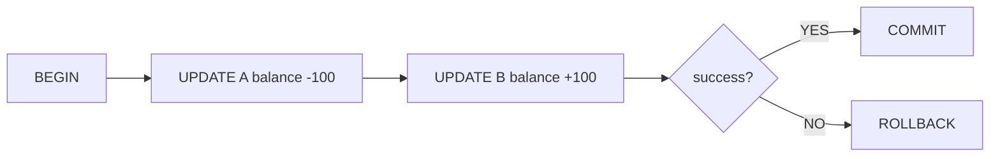

# Transactions and ACID

This is post 5 in the Database Systems 101 series.

> Database Systems 101 series (5/10)

<!-- a-grade-intro:begin -->

**Core question**: Why does a power outage in the middle of a bank transfer not end up "subtracting one hundred dollars twice"?

> A transaction bundles several SQL statements into one unit and promises "all or nothing." The way the database keeps that promise is called ACID. Once you have this vocabulary, concurrency, recovery, and failure scenarios all start sounding like the same conversation.

<!-- a-grade-intro:end -->

## What You Will Learn

- What a transaction is and why we need it
- What the four letters of ACID actually guarantee
- How to use BEGIN, COMMIT, and ROLLBACK
- The intuition behind a Write-Ahead Log (WAL)

## Why It Matters

Almost every business operation — money transfers, inventory adjustments, order creation — has to bundle two or more changes together. Stop in the middle and the data goes inconsistent. Without transactions, the application has to compensate by hand, which in practice does not work.

> "All or nothing." That single phrase is the whole essence of a transaction.

## Concept at a Glance



You begin a transaction, run several changes, then either COMMIT them all at once or ROLLBACK. From the outside, every change appears to happen at the same instant.

## Key Terms

- **Transaction**: A unit of work composed of several SQL statements.
- **Atomicity**: All changes apply, or none do.
- **Consistency**: Integrity constraints must hold before and after the transaction.
- **Isolation**: Concurrent transactions appear as if they ran one after another (deep dive next post).
- **Durability**: A committed change survives a power loss.
- **WAL**: Before changing data, write the intent to a log. The foundation of recovery.

## Before/After

**Before — transferring money without a transaction**

```sql
UPDATE accounts SET balance = balance - 100 WHERE id = 1;
-- (power outage here)
UPDATE accounts SET balance = balance + 100 WHERE id = 2;
-- 100 dollars vanish
```

**After — wrapping the transfer in a transaction**

```sql
BEGIN;
UPDATE accounts SET balance = balance - 100 WHERE id = 1;
UPDATE accounts SET balance = balance + 100 WHERE id = 2;
COMMIT;
-- A power outage rolls everything back to BEGIN. No money lost.
```

That single line of atomicity decides the trustworthiness of the system.

## Hands-on: Working With Transactions

### Step 1 — Set up the accounts table

```python
# setup.py
import sqlite3

with sqlite3.connect("bank.db") as db:
    db.executescript("""
        DROP TABLE IF EXISTS accounts;
        CREATE TABLE accounts (
            id      INTEGER PRIMARY KEY,
            owner   TEXT NOT NULL,
            balance INTEGER NOT NULL CHECK (balance >= 0)
        );
        INSERT INTO accounts VALUES (1, 'Alice', 1000), (2, 'Bob', 1000);
    """)
```

We add a `balance >= 0` constraint to the schema. Soon we will see how it blocks consistency violations (the C in ACID).

### Step 2 — A normal transfer

```python
import sqlite3

def transfer(src: int, dst: int, amount: int) -> None:
    with sqlite3.connect("bank.db") as db:
        try:
            db.execute("BEGIN")
            db.execute("UPDATE accounts SET balance = balance - ? WHERE id = ?", (amount, src))
            db.execute("UPDATE accounts SET balance = balance + ? WHERE id = ?", (amount, dst))
            db.execute("COMMIT")
        except Exception:
            db.execute("ROLLBACK")
            raise

transfer(1, 2, 100)
```

When the two UPDATEs sit between BEGIN and COMMIT, both apply or neither does.

### Step 3 — Consistency violation triggers automatic rollback

```python
try:
    transfer(1, 2, 99999)  # more than Alice has
except sqlite3.IntegrityError as e:
    print("rolled back:", e)

with sqlite3.connect("bank.db") as db:
    print(db.execute("SELECT * FROM accounts").fetchall())
```

The moment the CHECK constraint fails, the transaction breaks and rolls back. Balances stay untouched.

### Step 4 — Explicit ROLLBACK

```python
with sqlite3.connect("bank.db") as db:
    db.execute("BEGIN")
    db.execute("UPDATE accounts SET balance = balance - 50 WHERE id = 1")
    # simulate user cancellation
    db.execute("ROLLBACK")
    print(db.execute("SELECT balance FROM accounts WHERE id = 1").fetchone())
```

ROLLBACK is just "forget every change made since BEGIN." Nothing has actually hit the data file.

### Step 5 — Be conscious of Durability

```python
import sqlite3

with sqlite3.connect("bank.db") as db:
    db.execute("PRAGMA journal_mode=WAL")
    db.execute("BEGIN")
    db.execute("UPDATE accounts SET balance = balance + 1 WHERE id = 1")
    db.execute("COMMIT")
```

WAL mode writes the change to a log before touching the data file. At COMMIT time, all that has to be guaranteed on disk is the log. That is enough for durability.

## What to Notice in This Code

- Transactions are **explicit**. Auto-commit mode is convenient, but it commits one statement at a time.
- If an exception fires, you must ROLLBACK. Otherwise the next call starts in a strange state.
- CHECK and FOREIGN KEY constraints are the practical tools of consistency (C).
- WAL is the practical tool of durability (D).

## Five Common Mistakes

1. **Holding a transaction open too long.** Putting user input or external API calls inside a transaction stretches locks and stalls everyone else.
2. **Forgetting ROLLBACK in the exception path.** Do not assume "it'll roll back implicitly" — make it explicit.
3. **Doing batch work with auto-commit on.** N inserts become N commits, and performance collapses.
4. **Wrapping every SELECT in a transaction.** Keep read-only work short and group writes together.
5. **Treating ROLLBACK as "recovery."** ROLLBACK undoes database changes, not side effects (sent emails, payment calls).

## How This Shows Up in Production

ORMs and frameworks usually start and end transactions per function. Python's SQLAlchemy `Session` and Django's `@transaction.atomic` are typical. The trick is matching transaction boundaries to business units like "create order."

Transactions are also the starting point for incident analysis. Asking "how far did this transaction get?" reveals partial updates, deadlocks, and side-effect ownership. Side effects (email, payment) live outside the transaction whenever possible, with idempotency to make retries safe.

## How a Senior Engineer Thinks

- They line up transaction boundaries with business units.
- They avoid external calls inside a transaction.
- They keep asking "is this rollback safe?" Anything with side effects gets pulled out.
- A long-running transaction triggers immediate suspicion about lock contention.
- Integrity constraints (NOT NULL, CHECK, FK) are defined at the data model layer.

## Checklist

- [ ] Do business units and transaction boundaries match?
- [ ] Does the transaction avoid external calls and user input waits?
- [ ] Is ROLLBACK guaranteed in every exception path?
- [ ] Are integrity constraints in active use?
- [ ] Are side effects handled outside the transaction with idempotency?

## Practice Problems

1. Explain in one sentence why inserting 10,000 rows is much faster inside one transaction than with auto-commit on.
2. A payment API call is wrapped inside a transaction, and a slow response causes the transaction to time out. Describe what could go wrong and how to design it more safely.
3. Which letter of ACID guarantees that "a committed change survives a power outage"?

## Wrap-up and Next Steps

A transaction is the "all or nothing" promise; ACID refines that promise across four properties (atomicity, consistency, isolation, durability). WAL and constraints are the actual mechanisms that keep the promise. The next post zooms into the I — isolation — and walks through what READ COMMITTED, REPEATABLE READ, and SERIALIZABLE prevent and what they still allow.

<!-- toc:begin -->
- [What Is a Database System?](./01-what-is-a-database.md)
- [The Relational Model](./02-relational-model.md)
- [SQL and Query Processing](./03-sql-and-query-processing.md)
- [Indexes](./04-indexes.md)
- **Transactions and ACID (current)**
- Isolation Levels (upcoming)
- Normalization and Modeling (upcoming)
- Query Optimization (upcoming)
- Replication and Backup (upcoming)
- OLTP and OLAP (upcoming)
<!-- toc:end -->

## References

- [PostgreSQL — Transactions](https://www.postgresql.org/docs/current/tutorial-transactions.html)
- [SQLite — Transactions](https://www.sqlite.org/lang_transaction.html)
- [Designing Data-Intensive Applications — Chapter 7](https://dataintensive.net/)
- [Wikipedia — ACID](https://en.wikipedia.org/wiki/ACID)

Tags: Computer Science, Database, Transactions, ACID, WAL, Concurrency
