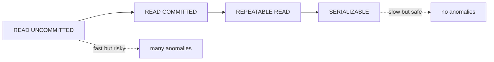

# Database Systems 101 (6/10): Isolation Levels

This is post 6 in the Database Systems 101 series.

> Database Systems 101 series (6/10)

**Core question**: When two transactions touch the same data at the same time, how far does the database go to make each one feel like it is alone?

> Isolation (the I in ACID) is not on/off, it is a dial. Too loose and you get anomalies like dirty reads or phantom reads; too strict and throughput collapses. Isolation levels are the dial that decides where you stop and where you give in.

## Questions to Keep in Mind

- What boundary should you inspect first when applying Isolation Levels?
- Which signal should the example or diagram make visible for Isolation Levels?
- What failure should be prevented first when Isolation Levels reaches a real system?

## Big Picture


*database systems 101 chapter 6 flow overview*

This picture places Isolation Levels inside an operating flow. The point is not to memorize the concept in isolation, but to see how input, processing, verification, and operational signals connect across boundaries.

> The core of Isolation Levels is not the feature name; it is deciding what to verify at each boundary and which signal to keep.

## What You Will Learn

- The four classic concurrency anomalies
- The difference between READ UNCOMMITTED, READ COMMITTED, REPEATABLE READ, and SERIALIZABLE
- How MVCC delivers consistent reads without locking
- Which isolation level fits which kind of workload

## Why It Matters

Without isolation knowledge, half of "we cannot reproduce this bug" tickets stay unexplained. A payment is charged twice, a balance goes negative, the same order is created twice — these are isolation problems. And almost none of them show up in unit tests.

> Concurrency bugs hide in calm weather and hit you at the worst possible moment.

## Concept at a Glance



Left to right means safer but more expensive. Most DBMS defaults sit at READ COMMITTED or REPEATABLE READ.

## Key Terms

- **Dirty Read**: You see another transaction's uncommitted change.
- **Non-repeatable Read**: You read the same row twice and get different values.
- **Phantom Read**: You read with the same predicate twice and get a different number of rows.
- **Lost Update**: Two transactions update the same row concurrently and one update vanishes.
- **MVCC (Multi-Version Concurrency Control)**: Each row holds multiple versions so reads and writes do not block each other.

## Before/After

**Before — wrong isolation: balance debited twice**

```sql
-- T1: SELECT balance FROM accounts WHERE id=1; -- 1000
-- T2: SELECT balance FROM accounts WHERE id=1; -- 1000
-- T1: UPDATE ... SET balance=900 WHERE id=1;
-- T2: UPDATE ... SET balance=900 WHERE id=1;  -- overwrites T1 (Lost Update)
```

**After — SERIALIZABLE or SELECT ... FOR UPDATE**

```sql
BEGIN;
SELECT balance FROM accounts WHERE id=1 FOR UPDATE;
UPDATE accounts SET balance = balance - 100 WHERE id=1;
COMMIT;
```

We lock the row at read time so other transactions cannot touch it.

## Hands-on: Reproduce the Anomalies Yourself

### Step 1 — Two sessions

```python
# Open two psql shells, or two sqlite3 connections.
import sqlite3
c1 = sqlite3.connect("iso.db", isolation_level="DEFERRED")
c2 = sqlite3.connect("iso.db", isolation_level="DEFERRED")

c1.executescript("""
DROP TABLE IF EXISTS counter;
CREATE TABLE counter (id INTEGER PRIMARY KEY, n INTEGER);
INSERT INTO counter VALUES (1, 0);
""")
c1.commit()
```

### Step 2 — Reproduce a Lost Update

```python
c1.execute("BEGIN")
c2.execute("BEGIN")
n1 = c1.execute("SELECT n FROM counter WHERE id=1").fetchone()[0]
n2 = c2.execute("SELECT n FROM counter WHERE id=1").fetchone()[0]
c1.execute("UPDATE counter SET n=? WHERE id=1", (n1 + 1,))
c2.execute("UPDATE counter SET n=? WHERE id=1", (n2 + 1,))
c1.commit()
c2.commit()
print(c1.execute("SELECT n FROM counter").fetchone())  # 1, not 2
```

Both sessions read 0 and each wrote 1. One increment vanished.

### Step 3 — Block it with SELECT ... FOR UPDATE

```python
# PostgreSQL
# T1
# BEGIN;
# SELECT n FROM counter WHERE id=1 FOR UPDATE;  -- lock
# UPDATE counter SET n = n+1 WHERE id=1;
# COMMIT;
# T2: blocks on SELECT ... FOR UPDATE until T1 ends
```

An explicit row lock serializes the two sessions.

### Step 4 — Consistent reads under REPEATABLE READ

```sql
-- T1
BEGIN ISOLATION LEVEL REPEATABLE READ;
SELECT count(*) FROM orders WHERE user_id=7;  -- 10

-- T2 (other session): INSERT INTO orders (user_id, ...) VALUES (7, ...); COMMIT;

-- T1
SELECT count(*) FROM orders WHERE user_id=7;  -- still 10
COMMIT;
```

Under REPEATABLE READ you keep seeing the snapshot from when the transaction started. PostgreSQL implements this lock-free with MVCC.

### Step 5 — The cost of SERIALIZABLE

```sql
-- T1, T2 both SERIALIZABLE.
-- T1: SELECT with a predicate, then INSERT
-- T2: same predicate concurrently, then INSERT
-- If the database detects a conflict, one side fails with SQLSTATE 40001.
-- The application must retry.
```

SERIALIZABLE is safe but pays the cost of conflict detection plus retries.

## What to Notice in This Code

- Isolation level is chosen by **the developer**, not the optimizer.
- Thanks to MVCC, PostgreSQL's default is "reads do not block writes, writes do not block reads."
- `FOR UPDATE` is the most common tool for explicit row locks.
- Using SERIALIZABLE without a retry loop makes the system fragile to occasional failures.

## Five Common Mistakes

1. **Updating a counter or stock without thinking about isolation.** A lost update reproduces exactly.
2. **Using SERIALIZABLE without a retry loop.** Serialization failures bubble straight up to the user.
3. **Assuming REPEATABLE READ blocks phantom reads.** It depends on the DBMS.
4. **Sprinkling `SELECT ... FOR UPDATE` everywhere.** Lock scope grows and concurrency collapses.
5. **Setting isolation level once in some forgotten place.** It becomes unclear which transactions are actually using it.

## How This Shows Up in Production

Most OLTP services use READ COMMITTED by default, plus `SELECT ... FOR UPDATE` on the critical write paths. Analytics queries on the same database take advantage of REPEATABLE READ snapshots.

Domains where correctness is absolute — finance, reservations — default to SERIALIZABLE and wrap every business transaction in a retry loop. In that setting, transactions must be short and idempotent.

## How a Senior Engineer Thinks

- They constantly ask "what breaks if this transaction runs concurrently with another?"
- They keep lock scope small. Row lock should not escalate to page lock to table lock.
- They distinguish retryable failures from non-retryable ones.
- Any change in isolation level is a top-priority code review topic.
- Concurrency bugs are caught with logs, traces, and reproducible scenarios — not by reasoning in your head.

## Checklist

- [ ] Do you know the isolation level on the critical write paths?
- [ ] Are lost-update points protected by a lock or by SERIALIZABLE?
- [ ] If SERIALIZABLE, is there a retry loop?
- [ ] Are transactions short and free of external calls?
- [ ] Do you exercise at least one concurrency scenario in integration tests?

## Practice Problems

1. Name two anomalies that are still possible under READ COMMITTED.
2. In one paragraph, explain how MVCC enables "reads do not block writes, writes do not block reads."
3. Give two ways to safely handle a concurrent INCREMENT on a counter column (locks, atomic UPDATE, etc.).

## Wrap-up and Next Steps

Isolation level is the dial between concurrency safety and throughput. Knowing the anomalies and what each level promises lets you design failure modes ahead of time. The next post climbs one layer up to the quality of the data model itself — normalization and functional dependencies. A good model removes update anomalies and concurrency hazards before they ever happen.

## Answering the Opening Questions

- **What boundary should you inspect first when applying Isolation Levels?**
  - The article treats Isolation Levels as a set of boundaries rather than one abstract idea, then separates input, processing, verification, and operational signals.
- **Which signal should the example or diagram make visible for Isolation Levels?**
  - The example and diagram should make visible what enters the system, where it changes, and which check decides pass or fail.
- **What failure should be prevented first when Isolation Levels reaches a real system?**
  - In production, keep that decision in checklists, logs, and tests so the same failure does not return after the next change.

<!-- toc:begin -->
## In this series

- [Database Systems 101 (1/10): What Is a Database System?](./01-what-is-a-database.md)
- [Database Systems 101 (2/10): The Relational Model](./02-relational-model.md)
- [Database Systems 101 (3/10): SQL and Query Processing](./03-sql-and-query-processing.md)
- [Database Systems 101 (4/10): Indexes](./04-indexes.md)
- [Database Systems 101 (5/10): Transactions and ACID](./05-transactions-and-acid.md)
- **Isolation Levels (current)**
- Normalization and Modeling (upcoming)
- Query Optimization (upcoming)
- Replication and Backup (upcoming)
- OLTP and OLAP (upcoming)

<!-- toc:end -->

## References

- [PostgreSQL — Transaction Isolation](https://www.postgresql.org/docs/current/transaction-iso.html)
- [Jepsen — Consistency Models](https://jepsen.io/consistency)
- [A Critique of ANSI SQL Isolation Levels (Berenson et al.)](https://www.microsoft.com/en-us/research/publication/a-critique-of-ansi-sql-isolation-levels/)
- [Designing Data-Intensive Applications — Chapter 7](https://dataintensive.net/)

Tags: Computer Science, Database, Isolation, MVCC, Concurrency, Anomalies
