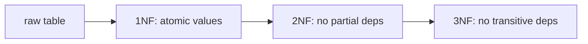

# Database Systems 101 (7/10): Normalization and Modeling

This is post 7 in the Database Systems 101 series.

> Database Systems 101 series (7/10)

**Core question**: Why does cramming everything into one table fall apart so quickly, and how do you split it cleanly?

> Normalization is the principle "record each fact in exactly one place." Done well, it removes update anomalies and gives everyone a single, agreed-on home for each piece of truth. 1NF, 2NF, and 3NF are the step-by-step checklist that codifies the principle.


*database systems 101 chapter 7 flow overview*

## Questions to Keep in Mind

- What boundary should you inspect first when applying Normalization and Modeling?
- Which signal should the example or diagram make visible for Normalization and Modeling?
- What failure should be prevented first when Normalization and Modeling reaches a real system?

## What You Will Learn

- The intuition behind functional dependencies
- The definitions of 1NF, 2NF, and 3NF and what separates them
- When denormalization is justified
- The cost a good data model takes off the table

## Why It Matters

A sloppy model taxes every query. When the same fact is scattered across many places, updates miss rows, and joins return inconsistent answers. Normalization removes that risk at the model layer.

> A good model never puts you in the position of "to change this column, you also have to change N rows in lockstep."



Each stage builds on the previous one with one extra rule. 3NF is usually enough.

## Key Terms

- **Functional Dependency (X → Y)**: equal X means equal Y.
- **Primary Key**: the set of columns that uniquely identifies a row.
- **1NF**: every column holds an atomic value. No arrays or comma-lists.
- **2NF**: 1NF plus no partial dependencies (no column depends on only part of a composite key).
- **3NF**: 2NF plus no transitive dependencies (no non-key column depends on another non-key column).

## Before/After

**Before — everything in one table**

```text
orders(id, user_id, user_email, product_id, product_name, product_price, quantity)
```

`user_email` depends on `user_id`; `product_name` and `product_price` depend on `product_id`. Changing an email forces updating every order row for that user.

**After — split**

```text
users(id, email)
products(id, name, price)
orders(id, user_id, product_id, quantity)
```

Email lives on one row in `users`, and any order query joins back to a single source of truth.

## Hands-on: Normalize Step by Step

### Step 1 — Look at the raw data

```python
# raw.py
rows = [
    (1, 7, "alice@x.com", "P-1, P-2", "Bag, Hat", "20, 5"),
    (2, 7, "alice@x.com", "P-1",       "Bag",      "20"),
]
```

`product_id` is a comma-separated list. That violates 1NF.

### Step 2 — 1NF: unfold into rows

```python
import sqlite3

with sqlite3.connect("shop.db") as db:
    db.executescript("""
        DROP TABLE IF EXISTS order_items_raw;
        CREATE TABLE order_items_raw (
            order_id INTEGER, user_id INTEGER, user_email TEXT,
            product_id TEXT, product_name TEXT, product_price INTEGER
        );
    """)
    db.executemany(
        "INSERT INTO order_items_raw VALUES (?, ?, ?, ?, ?, ?)",
        [
            (1, 7, "alice@x.com", "P-1", "Bag", 20),
            (1, 7, "alice@x.com", "P-2", "Hat", 5),
            (2, 7, "alice@x.com", "P-1", "Bag", 20),
        ],
    )
```

Now each cell has exactly one value.

### Step 3 — 2NF: remove partial dependencies

If we treat `(order_id, product_id)` as the composite key, `product_name` and `product_price` only depend on `product_id`. That is a partial dependency. Split it out.

```python
with sqlite3.connect("shop.db") as db:
    db.executescript("""
        DROP TABLE IF EXISTS products;
        CREATE TABLE products (
            id    TEXT PRIMARY KEY,
            name  TEXT NOT NULL,
            price INTEGER NOT NULL
        );
    """)
    db.execute("INSERT INTO products VALUES ('P-1','Bag',20),('P-2','Hat',5)")
```

### Step 4 — 3NF: remove transitive dependencies

`order_id → user_id → user_email` is transitive. Move user info into its own table.

```python
with sqlite3.connect("shop.db") as db:
    db.executescript("""
        DROP TABLE IF EXISTS users;
        CREATE TABLE users (
            id    INTEGER PRIMARY KEY,
            email TEXT NOT NULL UNIQUE
        );
    """)
    db.execute("INSERT INTO users VALUES (7, 'alice@x.com')")
```

### Step 5 — The final model

```python
with sqlite3.connect("shop.db") as db:
    db.executescript("""
        DROP TABLE IF EXISTS orders;
        DROP TABLE IF EXISTS order_items;
        CREATE TABLE orders (
            id      INTEGER PRIMARY KEY,
            user_id INTEGER NOT NULL REFERENCES users(id)
        );
        CREATE TABLE order_items (
            order_id   INTEGER NOT NULL REFERENCES orders(id),
            product_id TEXT    NOT NULL REFERENCES products(id),
            quantity   INTEGER NOT NULL,
            PRIMARY KEY (order_id, product_id)
        );
    """)
```

Each fact lives in exactly one place. Changing an email is a one-row update on `users`.

## What to Notice in This Code

- Normalization, when you zoom out, is **splitting tables along functional dependencies**.
- Foreign keys are a strong tool for keeping that split consistent.
- 3NF is enough for most OLTP models. BCNF and 4NF only matter when unusual dependencies appear.

## Five Common Mistakes

1. **Modeling many-to-many with comma-separated lists.** It violates 1NF and breaks search and joins.
2. **Duplicating fast-changing fields like email or phone across tables.** Updates miss rows.
3. **Using a natural key (email) as the primary key.** Every change cascades through every foreign key.
4. **Normalizing every table to the maximum.** For analytics, denormalization is often correct.
5. **Splitting tables but turning off foreign key constraints.** That is "fake normalization."

## How This Shows Up in Production

OLTP systems usually start near 3NF. When a particular screen forces too many joins, teams add a deliberate denormalized column or cache table. Denormalization is a decision **after measurement**, not a starting position.

Analytics is different. Reporting builds its own OLAP model (star schema, etc.) and intentionally denormalizes. When OLTP and OLAP live in the same database they keep colliding, which is why most teams move analytics into a separate data warehouse.

## How a Senior Engineer Thinks

- Before adding a new column, they ask "what key does this value depend on?"
- They distrust any model where the same fact lives in two tables.
- They never quietly disable foreign key constraints. If they do, they document why.
- Denormalization only ships when measurement demands it.
- A model change ships together with its migration script.

## Checklist

- [ ] Are all columns atomic?
- [ ] No partial or transitive dependencies?
- [ ] Are foreign key constraints turned on?
- [ ] If a denormalized column exists, is its update owner clear?
- [ ] Is the schema diagram in sync with the code?

## Practice Problems

1. In a table `(order_id, product_id, product_price)`, write one sentence describing which dependency is broken.
2. List the pros and cons of using a surrogate key (auto-increment ID) instead of a natural key.
3. An analytics screen joins five tables and is very slow. List two alternatives to denormalization to consider first.

## Wrap-up and Next Steps

Normalization splits the model along functional dependencies so that "each fact lives in one place." 1NF, 2NF, and 3NF make that principle a step-by-step checklist, and foreign keys enforce it. The next post takes the model and indexes you have built and looks at how the optimizer turns them into a fast execution plan — query optimization.

## Answering the Opening Questions

- **What boundary should you inspect first when applying Normalization and Modeling?**
  - The article treats Normalization and Modeling as a set of boundaries rather than one abstract idea, then separates input, processing, verification, and operational signals.
- **Which signal should the example or diagram make visible for Normalization and Modeling?**
  - The example and diagram should make visible what enters the system, where it changes, and which check decides pass or fail.
- **What failure should be prevented first when Normalization and Modeling reaches a real system?**
  - In production, keep that decision in checklists, logs, and tests so the same failure does not return after the next change.

<!-- toc:begin -->
## In this series

- [Database Systems 101 (1/10): What Is a Database System?](./01-what-is-a-database.md)
- [Database Systems 101 (2/10): The Relational Model](./02-relational-model.md)
- [Database Systems 101 (3/10): SQL and Query Processing](./03-sql-and-query-processing.md)
- [Database Systems 101 (4/10): Indexes](./04-indexes.md)
- [Database Systems 101 (5/10): Transactions and ACID](./05-transactions-and-acid.md)
- [Database Systems 101 (6/10): Isolation Levels](./06-isolation-levels.md)
- **Normalization and Modeling (current)**
- Query Optimization (upcoming)
- Replication and Backup (upcoming)
- OLTP and OLAP (upcoming)

<!-- toc:end -->

## References

- [Wikipedia — Database Normalization](https://en.wikipedia.org/wiki/Database_normalization)
- [PostgreSQL — Data Modeling](https://www.postgresql.org/docs/current/ddl.html)
- [Designing Data-Intensive Applications — Chapter 2](https://dataintensive.net/)
- [Microsoft — Description of the database normalization basics](https://learn.microsoft.com/en-us/office/troubleshoot/access/database-normalization-description)

Tags: Computer Science, Database, Normalization, Modeling, 1NF, Dependencies
