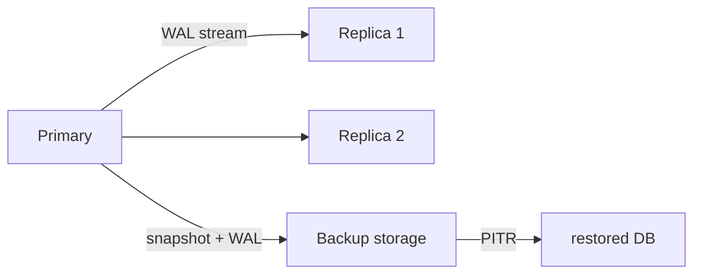

# Database Systems 101 (9/10): Replication and Backup

This is the 9th post in the Database Systems 101 series.

> Database Systems 101 series (9/10)

**Core question**: When a single database dies or a disk vanishes entirely, what does it take to keep the service alive?

> Replication keeps live nodes in lock step on the same data; backups are insurance you can rewind to. Both solve availability and durability, but on different time axes. Neither is enough on its own.


*database systems 101 chapter 9 flow overview*

## Questions to Keep in Mind

- What boundary should you inspect first when applying Replication and Backup?
- Which signal should the example or diagram make visible for Replication and Backup?
- What failure should be prevented first when Replication and Backup reaches a real system?

## What You Will Learn

- How primary-replica replication works and what each role does
- The trade-offs between synchronous and asynchronous replication
- The kinds of backup — full, incremental, and WAL-based PITR
- How to define RPO and RTO

## Why It Matters

Failures happen. Disks die, someone runs the wrong DELETE, an entire region goes down. Replication and backup answer in advance: "when that happens, how much data do we lose, and how fast do we recover?"

> A backup whose restore procedure has never been exercised is not a backup.



Replication moves sideways (space), backup moves backward (time). Together they deliver availability, durability, and recovery.

## Key Terms

- **Primary/Replica**: the node that takes writes and the nodes that follow it.
- **Sync vs Async Replication**: whether a commit has to wait for a replica acknowledgment.
- **PITR (Point-in-Time Recovery)**: base backup plus WAL replay to a chosen instant.
- **RPO (Recovery Point Objective)**: acceptable amount of data loss (in time).
- **RTO (Recovery Time Objective)**: acceptable amount of downtime (in time).

## Before/After

**Before — single instance, backups only**

- A disk failure loses everything since last night's backup; recovery takes 30 minutes.

**After — replica plus regular PITR backups**

- Auto-failover restores writes within 30 seconds.
- A bad DELETE can be rolled back to a five-minute granularity via PITR.

The same data is now protected by two layers of defense.

## Hands-on: Imitating Replication and PITR

### Step 1 — Configure the primary (PostgreSQL)

```ini
# postgresql.conf
wal_level = replica
max_wal_senders = 10
archive_mode = on
archive_command = 'cp %p /var/lib/pgsql/wal_archive/%f'
```

This ships the WAL out to external storage, the foundation of PITR.

### Step 2 — Create a replica

```bash
pg_basebackup -h primary.host -D /var/lib/pgsql/replica -U replicator -P -X stream
```

Take a base backup and start streaming replication. The replica continuously follows the primary's WAL.

### Step 3 — Enable synchronous replication

```ini
# postgresql.conf
synchronous_commit = on
synchronous_standby_names = 'replica1'
```

Now the primary holds COMMIT until `replica1` confirms the WAL. Zero data loss, but writes slow down whenever the replica slows down.

### Step 4 — Base backup and WAL retention

```bash
pg_basebackup -D /backup/base/$(date +%F) -Ft -z -P
ls /var/lib/pgsql/wal_archive | tail
```

The base backup is the snapshot at time t0; the WAL archive is the change log after that.

### Step 5 — PITR to an arbitrary moment

```ini
# recovery.conf or postgresql.auto.conf
restore_command = 'cp /var/lib/pgsql/wal_archive/%f %p'
recovery_target_time = '2026-05-04 03:00:00'
```

Restore the base backup, then replay WAL up to the target time. You can rewind to right before the bad DELETE.

## What to Notice in This Code

- Replication is usually **WAL streaming**. The transaction log is the replication channel.
- Sync replication reduces data loss but slows everyone down when one node lags.
- PITR requires keeping **both** base backups and WAL.
- Restore time is a function of backup size, network speed, and WAL volume.

## Five Common Mistakes

1. **Treating a replica as a backup.** A bad DELETE is replicated immediately.
2. **Never restoring a backup.** "Restorable" is only proven by simulation.
3. **Setting RPO/RTO without consensus.** Business needs and infrastructure cost have to align.
4. **Using only synchronous replication.** One slow replica halts every write. Most teams mix sync + async.
5. **Storing backups only in the same region or account.** A region or account incident wipes them all.

## How This Shows Up in Production

Most OLTP services start with "1 primary + N async replicas + regular PITR backups." Read traffic is spread across replicas, but screens that need immediate consistency read from the primary.

Incident response is rehearsed, not invented in the moment. Failover drills and backup restoration drills run on a schedule. "We have a backup" is only true when "we restored it yesterday" is also true.

## How a Senior Engineer Thinks

- They agree on RPO/RTO as numbers ("RPO 5 min, RTO 30 min").
- They actually run the restore procedure once a quarter.
- Backups live in a different region and a different account.
- Sync replication targets get their own health monitoring.
- Failover is automated, but the manual procedure is also documented.

## Checklist

- [ ] Are RPO/RTO defined explicitly?
- [ ] Are both regular backups and WAL archives in place?
- [ ] Are backups stored in a separate location?
- [ ] Was the last restore drill within six months?
- [ ] Is the failover procedure documented and automated?

## Practice Problems

1. Write one sentence describing the biggest risk of synchronous replication and one for asynchronous.
2. A bad `DELETE FROM users` ran. With only replicas (no backups), what is possible and what is not?
3. In one paragraph, explain why RPO 0 is unrealistic for many systems.

## Wrap-up and Next Steps

Replication owns availability across space, backup owns durability across time. Together they make a system that survives failures. The next post compares the same data under two very different workloads — OLTP and OLAP — and explains why analytics gets its own system.

## Answering the Opening Questions

- **How does Primary-Replica replication work, and what role does each node play?**
  - The Primary accepts writes and generates WAL; the Replica, created via `pg_basebackup`, continuously replays that WAL stream. Replicas serve as read-distribution targets and failover candidates, with `pg_last_xact_replay_timestamp()` monitoring replication lag.
- **What do synchronous and asynchronous replication trade off?**
  - Synchronous replication (`synchronous_commit = on`) has COMMIT wait for the Replica's WAL receipt confirmation—reducing data loss risk. Asynchronous replication lets the Primary commit first for lower latency, but risks losing the last uncommitted changes during failure.
- **How do full backups, incremental backups, and WAL-based PITR differ?**
  - A full backup stores all data at a point in time as a baseline snapshot. Incremental backups store only changes since then, reducing storage cost and time. WAL-based PITR appends WAL archives to a baseline backup and replays to `recovery_target_time`, providing a recovery path to any arbitrary point—like just before an accidental `DELETE`.
<!-- toc:begin -->
## In this series

- [Database Systems 101 (1/10): What Is a Database System?](./01-what-is-a-database.md)
- [Database Systems 101 (2/10): The Relational Model](./02-relational-model.md)
- [Database Systems 101 (3/10): SQL and Query Processing](./03-sql-and-query-processing.md)
- [Database Systems 101 (4/10): Indexes](./04-indexes.md)
- [Database Systems 101 (5/10): Transactions and ACID](./05-transactions-and-acid.md)
- [Database Systems 101 (6/10): Isolation Levels](./06-isolation-levels.md)
- [Database Systems 101 (7/10): Normalization and Modeling](./07-normalization-and-modeling.md)
- [Database Systems 101 (8/10): Query Optimization](./08-query-optimization.md)
- **Replication and Backup (current)**
- OLTP and OLAP (upcoming)

<!-- toc:end -->

## References

- [PostgreSQL — High Availability, Replication](https://www.postgresql.org/docs/current/high-availability.html)
- [PostgreSQL — Continuous Archiving and PITR](https://www.postgresql.org/docs/current/continuous-archiving.html)
- [Designing Data-Intensive Applications — Chapter 5](https://dataintensive.net/)
- [Google SRE Book — Backup and Disaster Recovery](https://sre.google/sre-book/data-integrity/)

Tags: Computer Science, Database, Replication, Backup, Recovery, HA
