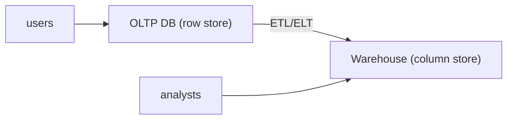

# Database Systems 101 (10/10): OLTP and OLAP

This is the final post in the Database Systems 101 series.

> Database Systems 101 series (10/10)

**Core question**: It is the same data — so why do operational and analytical databases look so different?

> Short, narrow transactions are OLTP; long, wide aggregations are OLAP. The two workloads differ in data model, storage format, and indexing strategy. Once that distinction lands, "why is analytics a separate system" becomes obvious.


*database systems 101 chapter 10 flow overview*

## Questions to Keep in Mind

- What boundary should you inspect first when applying OLTP and OLAP?
- Which signal should the example or diagram make visible for OLTP and OLAP?
- What failure should be prevented first when OLTP and OLAP reaches a real system?

## What You Will Learn

- The fundamental difference between OLTP and OLAP workloads
- The trade-offs between row storage and column storage
- The role of a data warehouse and the place of ETL/ELT
- The problems of running operations and analytics on the same database

## Why It Matters

Operational databases get crushed by analytical queries all the time. One big aggregation grabs locks, blows away the cache, and hurts everyone else. Knowing the OLTP/OLAP split lets you immediately decide "where does this query belong?"

> Putting operations and analytics in the same system is convenient short term, but the two workloads almost always sabotage each other.



OLTP makes single-row queries fast; OLAP makes million-row aggregations fast. They naturally live in different systems.

## Key Terms

- **OLTP (Online Transaction Processing)**: short, frequent reads and writes — placing orders, charging payments.
- **OLAP (Online Analytical Processing)**: large-scale aggregation and filtering — daily revenue, cohort analysis.
- **Row-store vs Column-store**: store by row vs by column. For OLAP, columnar wins by a wide margin.
- **Star Schema**: an analytics model built from a fact table plus dimension tables.
- **ETL/ELT**: pipelines that move and transform data from operational to analytical systems.

## Before/After

**Before — analytics directly on the operational database**

```sql
SELECT date_trunc('day', created_at), sum(total)
FROM orders
GROUP BY 1
ORDER BY 1;
-- 60s, lock contention, hurts production
```

**After — columnar warehouse**

```sql
-- BigQuery, Snowflake, Redshift, etc.
SELECT date_trunc('day', created_at), sum(total)
FROM warehouse.orders
GROUP BY 1
ORDER BY 1;
-- 2s, zero impact on the operational DB
```

The same query, in a different storage format and a different system, can be 30x faster.

## Hands-on: See the Row vs Column Difference

### Step 1 — Seed data

```python
# seed.py
import sqlite3, random, time

with sqlite3.connect("oltp.db") as db:
    db.executescript("""
        DROP TABLE IF EXISTS orders;
        CREATE TABLE orders (
            id INTEGER PRIMARY KEY,
            user_id INTEGER, status TEXT,
            total INTEGER, country TEXT, created_at TEXT
        );
    """)
    rows = [
        (i, random.randint(1, 1000),
         random.choice(["paid","pending","cancelled"]),
         random.randint(1, 1000),
         random.choice(["KR","US","JP"]),
         f"2026-05-{random.randint(1,28):02d}")
        for i in range(1, 1_000_001)
    ]
    db.executemany("INSERT INTO orders VALUES (?,?,?,?,?,?)", rows)
```

One million order rows in SQLite, a row store.

### Step 2 — OLTP-style single-row lookup

```python
import sqlite3, time
with sqlite3.connect("oltp.db") as db:
    db.execute("CREATE INDEX IF NOT EXISTS idx_user ON orders(user_id)")
    t = time.time()
    print(db.execute("SELECT * FROM orders WHERE user_id=7").fetchall()[:3])
    print("OLTP query:", round((time.time()-t)*1000, 2), "ms")
```

A single index jump and the answer comes back instantly. That is the strength of row storage.

### Step 3 — OLAP-style aggregation

```python
import sqlite3, time
with sqlite3.connect("oltp.db") as db:
    t = time.time()
    rows = db.execute("""
        SELECT country, sum(total)
        FROM orders
        WHERE status='paid'
        GROUP BY country
    """).fetchall()
    print(rows)
    print("OLAP query:", round((time.time()-t)*1000, 2), "ms")
```

All million rows have to be scanned. With row storage you also pull every column you do not need. With columnar storage you would touch only `country`, `total`, and `status`.

### Step 4 — Mimic columnar storage with Parquet

```python
import pandas as pd
df = pd.read_sql("SELECT * FROM orders", "sqlite:///oltp.db")
df.to_parquet("orders.parquet")

import duckdb, time
con = duckdb.connect()
t = time.time()
print(con.execute("""
    SELECT country, sum(total)
    FROM 'orders.parquet'
    WHERE status='paid'
    GROUP BY country
""").fetchall())
print("Parquet/DuckDB:", round((time.time()-t)*1000, 2), "ms")
```

The same aggregation runs several times faster. DuckDB combines columnar storage with vectorized execution.

### Step 5 — Sketch a Star Schema

```sql
-- fact_orders + dim_user + dim_product + dim_date
SELECT d.country, sum(f.total)
FROM fact_orders f
JOIN dim_user d ON d.user_id = f.user_id
WHERE f.status='paid'
GROUP BY d.country;
```

Analytics often deliberately denormalizes into a star schema. Fewer joins, faster aggregations.

## What to Notice in This Code

- OLTP is **one index jump**; OLAP is **a large scan**.
- Columnar storage reads only the columns you need, which makes aggregations dramatically faster.
- A star schema is the opposite extreme of normalization — and it is the right call for analytics.
- Splitting operations from analytics makes both systems simpler.

## Five Common Mistakes

1. **Running analytics on the operational database.** Cache, locks, and resources all suffer.
2. **Reusing the OLTP model in OLAP.** Joins explode and aggregations crawl.
3. **Believing columnar is universal.** Single-row updates are far better in row storage.
4. **Running ETL once a night.** Analysts always look at yesterday's data, and decisions lag.
5. **Ignoring warehouse cost.** Many columnar warehouses bill by scan volume.

## How This Shows Up in Production

OLTP defaults to row stores like PostgreSQL or MySQL. Analytics defaults to columnar systems like BigQuery, Snowflake, Redshift, or ClickHouse. ETL/ELT pipelines join the two.

A more recent direction is the "data lakehouse." Columnar files like Parquet sit on object storage, and engines like DuckDB, Trino, Spark, and Snowflake query them. The boundary between operations and analytics is still clear; only the tooling has gotten richer.

## How a Senior Engineer Thinks

- "Is this OLTP or OLAP?" is the first question for routing.
- Analytical queries belong in the analytics system, operational queries in the operational DB.
- They monitor ETL/ELT reliability. Data freshness and accuracy are the key indicators.
- They control columnar cost via scan-column choice and partitioning.
- Schema changes get planned across both worlds at once. Operational changes affect the analytics pipeline.

## Checklist

- [ ] Are analytical queries kept off the operational DB?
- [ ] Is there a separate analytical model (star schema, etc.)?
- [ ] Are ETL/ELT freshness and failure rate monitored?
- [ ] Are scan volumes considered in the columnar warehouse?
- [ ] Are schema changes reviewed against the analytics pipeline?

## Practice Problems

1. Describe a scenario where the same SELECT is fast on the OLTP database and slow on the OLAP one.
2. Explain in one sentence why columnar storage is bad at single-row UPDATEs.
3. Describe how a star schema clashes with normalization, and why analytics still justifies it.

## Wrap-up and Next Steps

OLTP and OLAP are two worlds handling the same data on different time scales and in different shapes. Row storage wins single-row lookups; columnar wins large aggregations. Splitting them and connecting them with ETL/ELT is the standard architecture. With this post we wrap up the Database Systems 101 series. The big map hidden behind the word "database" — model, transactions, indexes, replication, analytics — should now feel like familiar terrain.

## Answering the Opening Questions

- **What boundary should you inspect first when applying OLTP and OLAP?**
  - The article treats OLTP and OLAP as a set of boundaries rather than one abstract idea, then separates input, processing, verification, and operational signals.
- **Which signal should the example or diagram make visible for OLTP and OLAP?**
  - The example and diagram should make visible what enters the system, where it changes, and which check decides pass or fail.
- **What failure should be prevented first when OLTP and OLAP reaches a real system?**
  - In production, keep that decision in checklists, logs, and tests so the same failure does not return after the next change.

<!-- toc:begin -->
## In this series

- [Database Systems 101 (1/10): What Is a Database System?](./01-what-is-a-database.md)
- [Database Systems 101 (2/10): The Relational Model](./02-relational-model.md)
- [Database Systems 101 (3/10): SQL and Query Processing](./03-sql-and-query-processing.md)
- [Database Systems 101 (4/10): Indexes](./04-indexes.md)
- [Database Systems 101 (5/10): Transactions and ACID](./05-transactions-and-acid.md)
- [Database Systems 101 (6/10): Isolation Levels](./06-isolation-levels.md)
- [Database Systems 101 (7/10): Normalization and Modeling](./07-normalization-and-modeling.md)
- [Database Systems 101 (8/10): Query Optimization](./08-query-optimization.md)
- [Database Systems 101 (9/10): Replication and Backup](./09-replication-and-backup.md)
- **OLTP and OLAP (current)**

<!-- toc:end -->

## References

- [Designing Data-Intensive Applications — Chapter 3](https://dataintensive.net/)
- [Snowflake — What Is a Data Warehouse?](https://www.snowflake.com/guides/what-data-warehouse/)
- [DuckDB — Why DuckDB?](https://duckdb.org/why_duckdb)
- [Wikipedia — Online Analytical Processing](https://en.wikipedia.org/wiki/Online_analytical_processing)

Tags: Computer Science, Database, OLTP, OLAP, Columnar, Analytics
