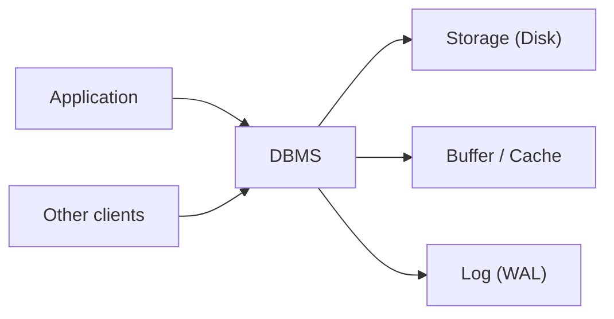

# Database Systems 101 (1/10): 데이터베이스 시스템이란 무엇인가?

파일 하나에 JSON을 저장해도 데이터는 남습니다. 그래서 데이터베이스를 처음 배울 때는 “그냥 파일을 잘 관리하면 되는 것 아닌가?”라는 질문이 자연스럽게 나옵니다. 문제는 시스템이 진짜 시스템처럼 행동하기 시작하는 순간입니다. 사용자 둘이 동시에 같은 값을 바꾸고, 프로세스가 중간에 죽고, “특정 조건을 만족하는 데이터만 빠르게 찾아 달라”는 요구가 붙는 순간부터 파일은 저장소일 뿐이고, 데이터베이스는 별도의 소프트웨어 계층이라는 사실이 드러납니다.

이 글은 Database Systems 101 시리즈의 첫 번째 글입니다.

데이터베이스 관리 시스템(DBMS)은 단순한 저장 엔진이 아닙니다. 동시 접근, 장애 복구, 무결성, 질의 처리라는 네 가지 어려운 문제를 한 번에 맡는 소프트웨어입니다. 이 관점을 먼저 잡아 두면 이후에 나오는 SQL, 인덱스, 트랜잭션, 격리 수준이 왜 필요한지 자연스럽게 이어집니다.


*Database Systems 101 1장 흐름 개요*

## 먼저 던지는 질문

- 파일과 DBMS의 결정적인 차이는 무엇일까요?
- DBMS가 가장 많은 비용을 들여 보장하는 네 가지 성질은 무엇일까요?
- 관계형, 문서형, 키-값 저장소는 각각 어디에 강할까요?

## 이 글에서 배울 내용

- 파일과 DBMS의 결정적인 차이
- DBMS가 가장 많은 비용을 들여 보장하는 네 가지 성질
- 관계형, 문서형, 키-값 저장소가 각각 강한 문제 유형
- “JSON 파일 하나면 충분하다”는 말이 실제로 성립하는 조건

## 왜 중요한가

데이터베이스를 그저 “데이터가 들어가는 곳”으로만 이해하면 왜 락이 생기는지, 왜 트랜잭션이 필요한지, 왜 전원 장애 뒤에도 데이터가 살아남는지를 설명할 수 없습니다. 반대로 DBMS의 존재 이유를 정확히 이해하면 시리즈 뒤쪽의 주제들이 잡학이 아니라 하나의 설계 원리로 보이기 시작합니다.

> “우리는 데이터베이스를 쓴다”는 말은 사실 “동시성 제어, 장애 복구, 일관성을 애플리케이션에서 직접 구현하지 않는다”는 뜻입니다.

## 핵심 개념 한눈에 보기



DBMS는 애플리케이션과 디스크 사이에 위치하면서, 여러 클라이언트의 요청을 받아 캐시와 로그, 온디스크 상태를 일관되게 맞춥니다. 애플리케이션은 SQL로 원하는 결과를 선언하고, 어떻게 잠그고 어떻게 디스크에 기록할지는 DBMS가 책임집니다.

## 핵심 용어

- **DBMS**: PostgreSQL, MySQL, SQLite 같은 데이터베이스 관리 시스템입니다.
- 스키마: 테이블, 컬럼, 타입처럼 데이터 구조를 정의한 명세입니다.
- **트랜잭션**: 모두 반영되거나 모두 취소되어야 하는 SQL 문들의 묶음입니다.
- **영속성(Durability)**: 커밋된 변경이 즉시 장애가 나더라도 살아남는 성질입니다.
- **동시성 제어**: 여러 클라이언트가 동시에 같은 데이터를 다뤄도 결과를 일관되게 유지하는 메커니즘입니다.

## 변경 전/변경 후

**Before — write to a file directly**

```python
# accounts.py — 파일을 직접 다룸
import json

def deposit(user_id: str, amount: int) -> None:
    with open("accounts.json", "r") as f:
        data = json.load(f)
    data[user_id] = data.get(user_id, 0) + amount
    with open("accounts.json", "w") as f:
        json.dump(data, f)
```

사용자가 한 명일 때는 멀쩡해 보입니다. 하지만 두 프로세스가 동시에 실행되면 한쪽 입금이 조용히 사라질 수 있고, `json.dump` 중간에 장애가 나면 파일 자체가 망가질 수 있습니다.

**After — use SQLite**

```python
# account.py — DBMS가 유일한 성과 영속성을 담당합니다
import sqlite3

def deposit(db: sqlite3.Connection, user_id: str, amount: int) -> None:
    with db:  # transaction
        db.execute(
            "UPDATE accounts SET balance = balance + ? WHERE user_id = ?",
            (amount, user_id),
        )
```

이제 동시성 처리는 DBMS가 잠금으로 맡고, 장애 복구는 WAL(Write-Ahead Log) 같은 메커니즘으로 맡습니다. 애플리케이션은 “잔액을 올려 달라”는 의도만 표현합니다.

## 실습: 경량 데이터베이스로 작은 시스템 체험하기

### 1단계 — 데이터베이스 만들기

```bash
python3 -c "import sqlite3; sqlite3.connect('shop.db').close()"
ls -l shop.db
```

`shop.db` 파일 하나가 곧 데이터베이스 전체입니다. SQLite는 별도 서버 프로세스 없이 애플리케이션 안에서 동작합니다.

### 2단계 — 스키마 정의

```python
# init.py
import sqlite3

DDL = """
CREATE TABLE IF NOT EXISTS products (
    id    INTEGER PRIMARY KEY,
    name  TEXT NOT NULL,
    price INTEGER NOT NULL CHECK (price >= 0)
);
"""

with sqlite3.connect("shop.db") as db:
    db.executescript(DDL)
```

`NOT NULL`, `CHECK` 같은 타입과 제약은 잘못된 데이터가 애플리케이션 깊숙이 들어오기 전에 데이터베이스 경계에서 걸러 줍니다.

### 3단계 — 데이터 넣기와 읽기

```python
# use.py
import sqlite3

with sqlite3.connect("shop.db") as db:
    db.execute("INSERT INTO products (name, price) VALUES (?, ?)", ("apple", 1500))
    db.execute("INSERT INTO products (name, price) VALUES (?, ?)", ("milk", 3200))

with sqlite3.connect("shop.db") as db:
    rows = db.execute("SELECT name, price FROM products ORDER BY price").fetchall()
    for name, price in rows:
        print(name, price)
```

여기서 `?` 플레이스홀더가 중요합니다. 문자열 포매팅으로 SQL을 만들면 SQL injection으로 이어지는 가장 고전적인 실수를 열어 두게 됩니다.

### 4단계 — 트랜잭션 감각 익히기

```python
# tx.py
import sqlite3

db = sqlite3.connect("shop.db")
try:
    with db:  # auto BEGIN/COMMIT, ROLLBACK on exception
        db.execute("UPDATE products SET price = price + 100 WHERE name = ?", ("apple",))
        raise RuntimeError("something went wrong")
except RuntimeError:
    pass

print(db.execute("SELECT price FROM products WHERE name='apple'").fetchone())
# 변경 없음 — 업데이트가 롤백되었습니다
```

바로 이 지점이 파일 기반 저장과 DBMS의 결정적인 차이입니다. 실패 중간 상태를 시스템 차원에서 되돌릴 수 있습니다.

### 5단계 — 두 프로세스 동시 실행

```python
# writer.py — 두 터미널에서 동시에 실행합니다
import sqlite3, time
db = sqlite3.connect("shop.db", timeout=5.0)
with db:
    db.execute("UPDATE products SET price = price + 1 WHERE name='apple'")
    time.sleep(2)
print("done")
```

한 트랜잭션이 열린 동안 다른 쪽은 기다립니다. 파일을 직접 쓰는 구조였다면 둘 중 하나의 변경이 다른 쪽을 덮어썼을 가능성이 큽니다.

## 이 코드에서 먼저 봐야 할 점

- 애플리케이션은 원하는 결과만 선언하고, 잠금·로깅·디스크 동기화는 DBMS가 맡습니다.
- 스키마와 제약은 데이터 품질을 지키는 첫 번째 방어선입니다. 애플리케이션 검증보다 빠르고 일관됩니다.
- 트랜잭션은 여러 SQL을 하나의 “전부 또는 전무” 단위로 묶습니다. 그 경계는 애플리케이션이 정합니다.
- 두 프로세스가 파일을 망가뜨리지 않는 이유는 SQLite가 대신 잠금을 잡아 주기 때문입니다.

## 자주 하는 실수 5가지

1. **DBMS를 “조금 더 고급스러운 파일”로 본다.** 동시성과 장애 복구가 빠진 비교는 처음부터 비교가 아닙니다.
2. **스키마 없이 시작한다.** 처음에는 유연해 보여도, 6개월 뒤 정리 비용이 두 배로 돌아옵니다.
3. **모든 쓰기를 자동 커밋에 맡긴다.** 두 줄짜리 갱신도 중간에 실패하면 데이터가 어긋날 수 있습니다.
4. **`?` 플레이스홀더 대신 문자열 포매팅으로 SQL을 만든다.** SQL injection의 정석적인 진입점입니다.
5. **복구를 테스트하지 않는다.** 최근에 복원해 보지 않은 백업은 백업이라기보다 희망 사항에 가깝습니다.

## 실무에서는 이렇게 드러납니다

대부분의 백엔드는 PostgreSQL이나 MySQL 같은 관계형 DBMS를 시스템 오브 레코드로 두고, 앞단에 Redis 같은 캐시를 붙이며, 경우에 따라 검색 인덱스를 별도로 둡니다. 현업에서는 “SQL을 버려야 할 만큼 관계형이 한계”인 경우보다 “인덱스를 제대로 설계하지 않아 느린 경우”가 훨씬 많습니다.

NoSQL이 빛나는 순간도 분명히 있습니다. 데이터 모양이 문서, 트리, 시계열, 그래프에 가깝고 전용 엔진이 문제를 더 단순하게 풀어 주는 경우입니다. 중요한 것은 유행이 아니라 데이터의 형태와 읽기·쓰기 패턴입니다.

운영 관점에서 더 중요한 질문은 “평소에 빠른가?”보다 “나쁜 날에도 데이터가 살아남는가?”입니다. WAL, 백업, 복제, PITR 같은 단어가 시리즈 후반에서 반복해서 등장하는 이유가 바로 여기에 있습니다.

## 시니어 엔지니어는 이렇게 생각합니다

- “DBMS를 쓰지 않으면 내가 직접 구현해야 하는 것이 무엇인가?”부터 떠올립니다. 잠금, WAL, 인덱스, 옵티마이저를 애플리케이션에서 재구현하는 것은 현실적이지 않습니다.
- 스키마를 코드처럼 다룹니다. 마이그레이션은 리뷰와 롤백 계획을 갖춘 1급 산출물입니다.
- 트랜잭션 경계를 명시적으로 그립니다. 흐릿한 경계는 곧 버그입니다.
- 데이터 모델은 접근 패턴에 맞춰 잡되, 정규화는 기본값으로 생각합니다.
- 백업의 존재보다 복원 훈련 여부를 더 신뢰합니다.

## 체크리스트

- [ ] 왜 파일이 아니라 DBMS가 필요한지 한 문장으로 설명할 수 있는가?
- [ ] 테이블과 제약이 정의되어 있는가?
- [ ] 모든 쓰기가 트랜잭션 안에 있는가?
- [ ] 사용자 입력이 `?` 플레이스홀더를 통해 들어가는가?
- [ ] 최근 90일 안에 복구를 실제로 테스트했는가?

## 연습 문제

1. 파일 기반 저장과 DBMS를 동시성, 영속성, 일관성, 질의라는 네 축으로 나눠 한 문장씩 비교해 보세요.
2. 5단계의 두 프로세스 실험을 직접 실행해 보세요. 어느 프로세스가 먼저 커밋되는지 적고, timeout을 0으로 낮추면 어떤 오류가 나는지도 확인해 보세요.
3. “JSON 파일 하나면 충분하다”가 성립하는 경우 두 가지를 적고, 각각 어떤 조건이 깨지면 DBMS로 넘어가야 하는지 설명해 보세요.

## 정리 및 다음 단계

DBMS는 데이터를 넣어 두는 장소가 아니라, 동시성·영속성·일관성·질의를 한꺼번에 해결하는 소프트웨어입니다. 그 덕분에 애플리케이션은 의도에 집중할 수 있고, 어려운 상태 관리는 DBMS에 맡길 수 있습니다. 다음 글에서는 SQL이 기대고 있는 더 근본적인 모델, 관계형 모델을 살펴봅니다.

## 저장소에서 시스템으로 넘어가는 경계

파일 저장은 출발점으로 충분하지만, 다중 사용자와 장애 복구 요구가 붙는 순간부터 시스템 설계가 달라집니다. 아래 예시는 같은 비즈니스 규칙을 파일 기반 접근과 DBMS 접근으로 비교한 것입니다.

```text
파일 기반 접근
1) JSON 파일 읽기
2) 메모리에서 잔액 차감
3) JSON 파일 다시 쓰기
4) 중간 실패 시 수동 복구

DBMS 접근
1) BEGIN
2) UPDATE accounts SET balance = balance - 10000 WHERE id = 1;
3) UPDATE accounts SET balance = balance + 10000 WHERE id = 2;
4) COMMIT (실패 시 자동 ROLLBACK)
```

핵심 차이는 실패 처리 책임의 위치입니다. 파일 기반에서는 실패 복구 책임이 전부 애플리케이션 코드에 남습니다. DBMS에서는 트랜잭션, 로그, 잠금, 복구기가 실패 책임을 분담합니다. 그래서 데이터베이스를 단순 저장소가 아니라 운영 안정성을 위한 시스템 계층으로 봐야 합니다.

## 질의 처리 내부 경로를 짧게 읽어 보기

아래 출력은 작은 사용자 테이블에서 조건 조회를 했을 때의 실행 계획 예시입니다.

```text
EXPLAIN ANALYZE
SELECT * FROM users WHERE email = 'alice@example.com';

Index Scan using idx_users_email on users  (cost=0.28..8.30 rows=1 width=64)
(actual time=0.021..0.023 rows=1 loops=1)
Planning Time: 0.210 ms
Execution Time: 0.049 ms
```

이 한 줄 출력만으로도 세 가지를 판단할 수 있습니다. 첫째, 인덱스를 타는지, 둘째, 예상 행 수와 실제 행 수가 크게 어긋나는지, 셋째, 계획 수립 시간 대비 실행 시간이 비정상적으로 큰지입니다. 데이터베이스 입문 단계에서 이 읽기 습관을 들이면, 이후 주제인 인덱스/트랜잭션/복제 학습이 훨씬 단단해집니다.

## 실전 운영 점검표

운영 환경에서 데이터베이스 품질을 안정적으로 유지하려면, 기능 개발과 별개로 점검 루틴을 명확하게 가져가야 합니다. 아래 항목은 서비스 규모와 상관없이 바로 적용할 수 있는 기준입니다.

- 변경 전에는 항상 기준 지표를 남깁니다. 평균 지연 시간, P95, P99, 초당 트랜잭션 수, 잠금 대기 시간 같은 숫자를 캡처해 둬야 변경 이후를 비교할 수 있습니다.
- 쿼리 튜닝은 SQL 문장 자체보다 실행 계획의 변화를 중심으로 추적합니다. 계획 노드가 바뀌었는지, 예상 행 수와 실제 행 수의 차이가 커졌는지, 정렬이나 해시가 디스크로 내려갔는지를 우선 확인합니다.
- 스키마 변경은 단계적으로 진행합니다. 컬럼 추가, 백필, 코드 전환, 제약 강화 순서로 나누면 장애 반경을 줄일 수 있습니다.
- 장애 대응 문서는 운영자가 밤중에도 바로 실행할 수 있는 형태여야 합니다. 복구 절차, 롤백 절차, 검증 SQL을 같은 문서에 둬야 실제 상황에서 흔들리지 않습니다.

아래 예시는 팀이 릴리스 전후에 반복적으로 실행하는 최소 점검 SQL입니다.

```sql
-- 최근 10분 동안 느린 쿼리 확인(엔진별 뷰 이름은 다를 수 있음)
SELECT query, calls, mean_exec_time, rows
FROM pg_stat_statements
ORDER BY mean_exec_time DESC
LIMIT 20;

-- 잠금 대기 체인 확인
SELECT now(), pid, wait_event_type, wait_event, state, query
FROM pg_stat_activity
WHERE wait_event_type IS NOT NULL;

-- 인덱스 사용률 점검
SELECT relname AS table_name, seq_scan, idx_scan
FROM pg_stat_user_tables
ORDER BY seq_scan DESC
LIMIT 20;
```

이 점검 루틴을 자동화 파이프라인에 연결하면, 성능 저하를 "느낌"이 아니라 "증거"로 관리할 수 있습니다. 결국 장기 운영에서 중요한 것은 뛰어난 한 번의 튜닝이 아니라, 작은 검증을 꾸준히 반복해 위험을 조기에 감지하는 습관입니다.
## 운영 리허설 시나리오

문서만 읽고 끝내면 운영에서 다시 같은 실수를 반복하기 쉽습니다. 아래 시나리오는 팀 온보딩과 장애 대응 훈련에 바로 사용할 수 있는 공통 리허설 절차입니다.

### 시나리오 1: 느려진 조회 원인 찾기

1. 문제 쿼리를 식별합니다. 애플리케이션 로그의 요청 식별자와 데이터베이스 쿼리 로그를 매칭합니다.
2. 같은 파라미터로 `EXPLAIN ANALYZE`를 실행합니다.
3. 계획 노드 중 시간이 큰 지점을 찾고, 해당 노드가 인덱스/통계/정렬 중 무엇과 관련 있는지 분류합니다.
4. 개선안을 한 번에 하나만 적용합니다. 인덱스 추가, 통계 갱신, 질의문 재작성 가운데 하나만 바꿔 결과를 비교합니다.

```text
개선 전
Seq Scan on events  (actual time=0.030..842.112 rows=12000)

개선 후
Index Scan using idx_events_tenant_created on events
(actual time=0.041..21.553 rows=12000)
```

### 시나리오 2: 동시성 문제 재현과 완화

1. 두 세션에서 같은 행을 거의 동시에 수정합니다.
2. 격리 수준을 바꿔 가며 결과를 비교합니다.
3. 필요하면 `FOR UPDATE` 잠금 조회 또는 낙관적 잠금 버전 컬럼을 적용합니다.
4. 재시도 정책과 타임아웃 기준을 코드와 운영 문서에 같이 기록합니다.

```sql
-- 낙관적 잠금 예시
UPDATE inventory
SET qty = qty - 1, version = version + 1
WHERE sku = 'A-100' AND version = 17;
```

영향 받은 행 수가 0이면 이미 다른 트랜잭션이 갱신한 것이므로, 재조회 후 재시도합니다. 이 패턴은 잠금 경합을 낮추면서도 정합성을 지키는 데 효과적입니다.

### 시나리오 3: 복구 가능성 검증

1. 최신 베이스 백업으로 테스트 인스턴스를 띄웁니다.
2. 지정 시점까지 로그를 재적용합니다.
3. 핵심 비즈니스 검증 SQL을 실행합니다.
4. 복구 시간(RTO)과 데이터 유실 허용치(RPO)를 실제 숫자로 기록합니다.

```sql
-- 검증 SQL 예시
SELECT COUNT(*) FROM orders WHERE created_at >= now() - interval '1 day';
SELECT SUM(amount) FROM payments WHERE status = 'SUCCESS';
SELECT COUNT(*) FROM users WHERE deleted_at IS NULL;
```

복구 리허설에서 가장 중요한 점은 성공 여부 자체보다, 누가 어떤 순서로 무엇을 확인했는지를 재현 가능하게 남기는 것입니다. 절차가 사람마다 다르면 실제 장애에서 속도와 품질이 동시에 무너집니다.

## 체크리스트: 배포 전 최소 검증

- 대표 조회 5개에 대해 실행 계획을 저장합니다.
- 트랜잭션 경계가 긴 코드 경로를 식별합니다.
- 잠금 대기 알람 임계치를 설정합니다.
- 스키마 변경의 롤백 경로를 문서화합니다.
- 백업 복구 리허설 최근 실행일을 확인합니다.

이 체크리스트는 거창한 체계를 요구하지 않습니다. 작은 팀도 주 1회 반복하면 데이터 사고 빈도를 눈에 띄게 줄일 수 있습니다. 데이터베이스 운영의 본질은 "고급 기능을 많이 아는 것"이 아니라, "반복 가능한 검증 루프를 끊기지 않게 유지하는 것"입니다.

## 처음 질문으로 돌아가기

- **파일과 DBMS의 결정적인 차이는 무엇일까요?**
  - 파일 저장에서는 `accounts.json`을 읽고 다시 쓰는 코드가 동시 실행과 중간 장애를 직접 감당해야 했습니다. 반면 SQLite 예제에서는 `with db:` 트랜잭션, 잠금, WAL이 이 책임을 맡아서 애플리케이션이 `UPDATE accounts SET balance = balance + ?` 같은 의도만 표현하면 됩니다.
- **DBMS가 가장 많은 비용을 들여 보장하는 네 가지 성질은 무엇일까요?**
  - 이 글에서 반복해서 등장한 축은 동시성 제어, 장애 복구와 영속성, 무결성, 질의 처리입니다. `CHECK (price >= 0)` 같은 제약, 트랜잭션 롤백 예제, `EXPLAIN ANALYZE`의 `Index Scan` 출력이 각각 그 비용이 어디에 쓰이는지 보여 줍니다.
- **관계형, 문서형, 키-값 저장소는 각각 어디에 강할까요?**
  - 관계형 DBMS는 주문·계좌처럼 제약과 JOIN이 중요한 시스템 오브 레코드에 강합니다. 문서형 저장소는 문서·트리처럼 구조가 유연한 데이터를 다루기 좋고, 키-값 저장소는 Redis처럼 단순 조회와 캐시에 특히 강합니다.

<!-- toc:begin -->
## 시리즈 목차

- **데이터베이스 시스템이란 무엇인가? (현재 글)**
- 관계형 모델 (예정)
- SQL과 쿼리 처리 (예정)
- 인덱스 (예정)
- 트랜잭션과 ACID (예정)
- 격리 수준 (예정)
- 정규화와 모델링 (예정)
- 쿼리 최적화 (예정)
- 복제와 백업 (예정)
- OLTP와 OLAP (예정)

<!-- toc:end -->

## 참고 자료

- [database-systems-101 예제 코드 (book-examples)](https://github.com/yeongseon-books/book-examples/tree/main/database-systems-101/ko)
- [PostgreSQL Documentation — Concepts](https://www.postgresql.org/docs/current/intro-whatis.html)
- [SQLite — When to Use SQLite](https://www.sqlite.org/whentouse.html)
- [Database System Concepts (Silberschatz)](https://www.db-book.com/)
- [Designing Data-Intensive Applications](https://dataintensive.net/)

Tags: Computer Science, Database, DBMS, 데이터모델, 영속성, 트랜잭션
