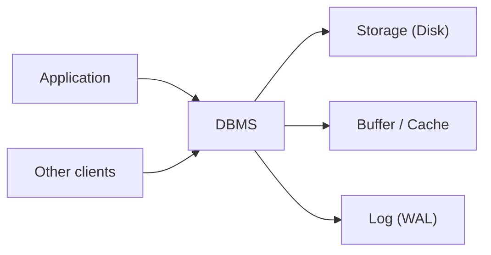

# Database Systems 101 (1/10): 데이터베이스 시스템이란 무엇인가?

이 글은 Database Systems 101 시리즈의 첫 번째 글입니다.

파일 하나에 JSON을 저장해도 데이터는 남습니다. 그래서 데이터베이스를 처음 배울 때는 “그냥 파일을 잘 관리하면 되는 것 아닌가?”라는 질문이 자연스럽게 나옵니다. 문제는 시스템이 진짜 시스템처럼 행동하기 시작하는 순간입니다. 사용자 둘이 동시에 같은 값을 바꾸고, 프로세스가 중간에 죽고, “특정 조건을 만족하는 데이터만 빠르게 찾아 달라”는 요구가 붙는 순간부터 파일은 저장소일 뿐이고, 데이터베이스는 별도의 소프트웨어 계층이라는 사실이 드러납니다.

데이터베이스 관리 시스템(DBMS)은 단순한 저장 엔진이 아닙니다. 동시 접근, 장애 복구, 무결성, 질의 처리라는 네 가지 어려운 문제를 한 번에 맡는 소프트웨어입니다. 이 관점을 먼저 잡아 두면 이후에 나오는 SQL, 인덱스, 트랜잭션, 격리 수준이 왜 필요한지 자연스럽게 이어집니다.

## 먼저 던지는 질문

- 파일과 DBMS의 결정적인 차이는 무엇일까요?
- DBMS가 가장 많은 비용을 들여 보장하는 네 가지 성질은 무엇일까요?
- 관계형, 문서형, 키-값 저장소는 각각 어디에 강할까요?

## 큰 그림


*Database Systems 101 1장 흐름 개요*

## 이 글에서 배울 내용

- 파일과 DBMS의 결정적인 차이
- DBMS가 가장 많은 비용을 들여 보장하는 네 가지 성질
- 관계형, 문서형, 키-값 저장소가 각각 강한 문제 유형
- “JSON 파일 하나면 충분하다”는 말이 실제로 성립하는 조건

## 왜 중요한가

데이터베이스를 그저 “데이터가 들어가는 곳”으로만 이해하면 왜 락이 생기는지, 왜 트랜잭션이 필요한지, 왜 전원 장애 뒤에도 데이터가 살아남는지를 설명할 수 없습니다. 반대로 DBMS의 존재 이유를 정확히 이해하면 시리즈 뒤쪽의 주제들이 잡학이 아니라 하나의 설계 원리로 보이기 시작합니다.

> “우리는 데이터베이스를 쓴다”는 말은 사실 “동시성 제어, 장애 복구, 일관성을 애플리케이션에서 직접 구현하지 않는다”는 뜻입니다.

## 핵심 개념 한눈에 보기



DBMS는 애플리케이션과 디스크 사이에 위치하면서, 여러 클라이언트의 요청을 받아 캐시와 로그, 온디스크 상태를 일관되게 맞춥니다. 애플리케이션은 SQL로 원하는 결과를 선언하고, 어떻게 잠그고 어떻게 디스크에 기록할지는 DBMS가 책임집니다.

## 핵심 용어

- **DBMS**: PostgreSQL, MySQL, SQLite 같은 데이터베이스 관리 시스템입니다.
- 스키마: 테이블, 컬럼, 타입처럼 데이터 구조를 정의한 명세입니다.
- **트랜잭션**: 모두 반영되거나 모두 취소되어야 하는 SQL 문들의 묶음입니다.
- **영속성(Durability)**: 커밋된 변경이 즉시 장애가 나더라도 살아남는 성질입니다.
- **동시성 제어**: 여러 클라이언트가 동시에 같은 데이터를 다뤄도 결과를 일관되게 유지하는 메커니즘입니다.

## Before/After

**Before — write to a file directly**

```python
# accounts.py — touch the file ourselves
import json

def deposit(user_id: str, amount: int) -> None:
    with open("accounts.json", "r") as f:
        data = json.load(f)
    data[user_id] = data.get(user_id, 0) + amount
    with open("accounts.json", "w") as f:
        json.dump(data, f)
```

사용자가 한 명일 때는 멀쩡해 보입니다. 하지만 두 프로세스가 동시에 실행되면 한쪽 입금이 조용히 사라질 수 있고, `json.dump` 중간에 장애가 나면 파일 자체가 망가질 수 있습니다.

**After — use SQLite**

```python
# accounts.py — DBMS owns concurrency and durability
import sqlite3

def deposit(db: sqlite3.Connection, user_id: str, amount: int) -> None:
    with db:  # transaction
        db.execute(
            "UPDATE accounts SET balance = balance + ? WHERE user_id = ?",
            (amount, user_id),
        )
```

이제 동시성 처리는 DBMS가 잠금으로 맡고, 장애 복구는 WAL(Write-Ahead Log) 같은 메커니즘으로 맡습니다. 애플리케이션은 “잔액을 올려 달라”는 의도만 표현합니다.

## 실습: SQLite로 작은 DBMS 체험하기

### 1단계 — 데이터베이스 만들기

```bash
python3 -c "import sqlite3; sqlite3.connect('shop.db').close()"
ls -l shop.db
```

`shop.db` 파일 하나가 곧 데이터베이스 전체입니다. SQLite는 별도 서버 프로세스 없이 애플리케이션 안에서 동작합니다.

### 2단계 — 스키마 정의

```python
# init.py
import sqlite3

DDL = """
CREATE TABLE IF NOT EXISTS products (
    id    INTEGER PRIMARY KEY,
    name  TEXT NOT NULL,
    price INTEGER NOT NULL CHECK (price >= 0)
);
"""

with sqlite3.connect("shop.db") as db:
    db.executescript(DDL)
```

`NOT NULL`, `CHECK` 같은 타입과 제약은 잘못된 데이터가 애플리케이션 깊숙이 들어오기 전에 데이터베이스 경계에서 걸러 줍니다.

### 3단계 — 데이터 넣기와 읽기

```python
# use.py
import sqlite3

with sqlite3.connect("shop.db") as db:
    db.execute("INSERT INTO products (name, price) VALUES (?, ?)", ("apple", 1500))
    db.execute("INSERT INTO products (name, price) VALUES (?, ?)", ("milk", 3200))

with sqlite3.connect("shop.db") as db:
    rows = db.execute("SELECT name, price FROM products ORDER BY price").fetchall()
    for name, price in rows:
        print(name, price)
```

여기서 `?` 플레이스홀더가 중요합니다. 문자열 포매팅으로 SQL을 만들면 SQL injection으로 이어지는 가장 고전적인 실수를 열어 두게 됩니다.

### 4단계 — 트랜잭션 감각 익히기

```python
# tx.py
import sqlite3

db = sqlite3.connect("shop.db")
try:
    with db:  # auto BEGIN/COMMIT, ROLLBACK on exception
        db.execute("UPDATE products SET price = price + 100 WHERE name = ?", ("apple",))
        raise RuntimeError("something went wrong")
except RuntimeError:
    pass

print(db.execute("SELECT price FROM products WHERE name='apple'").fetchone())
# unchanged — the update was rolled back
```

바로 이 지점이 파일 기반 저장과 DBMS의 결정적인 차이입니다. 실패 중간 상태를 시스템 차원에서 되돌릴 수 있습니다.

### 5단계 — 두 프로세스 동시 실행

```python
# writer.py — run in two terminals at the same time
import sqlite3, time
db = sqlite3.connect("shop.db", timeout=5.0)
with db:
    db.execute("UPDATE products SET price = price + 1 WHERE name='apple'")
    time.sleep(2)
print("done")
```

한 트랜잭션이 열린 동안 다른 쪽은 기다립니다. 파일을 직접 쓰는 구조였다면 둘 중 하나의 변경이 다른 쪽을 덮어썼을 가능성이 큽니다.

## 이 코드에서 먼저 봐야 할 점

- 애플리케이션은 원하는 결과만 선언하고, 잠금·로깅·디스크 동기화는 DBMS가 맡습니다.
- 스키마와 제약은 데이터 품질을 지키는 첫 번째 방어선입니다. 애플리케이션 검증보다 빠르고 일관됩니다.
- 트랜잭션은 여러 SQL을 하나의 “전부 또는 전무” 단위로 묶습니다. 그 경계는 애플리케이션이 정합니다.
- 두 프로세스가 파일을 망가뜨리지 않는 이유는 SQLite가 대신 잠금을 잡아 주기 때문입니다.

## 자주 하는 실수 5가지

1. **DBMS를 “조금 더 고급스러운 파일”로 본다.** 동시성과 장애 복구가 빠진 비교는 처음부터 비교가 아닙니다.
2. **스키마 없이 시작한다.** 처음에는 유연해 보여도, 6개월 뒤 정리 비용이 두 배로 돌아옵니다.
3. **모든 쓰기를 자동 커밋에 맡긴다.** 두 줄짜리 갱신도 중간에 실패하면 데이터가 어긋날 수 있습니다.
4. **`?` 플레이스홀더 대신 문자열 포매팅으로 SQL을 만든다.** SQL injection의 정석적인 진입점입니다.
5. **복구를 테스트하지 않는다.** 최근에 복원해 보지 않은 백업은 백업이라기보다 희망 사항에 가깝습니다.

## 실무에서는 이렇게 드러납니다

대부분의 백엔드는 PostgreSQL이나 MySQL 같은 관계형 DBMS를 시스템 오브 레코드로 두고, 앞단에 Redis 같은 캐시를 붙이며, 경우에 따라 검색 인덱스를 별도로 둡니다. 현업에서는 “SQL을 버려야 할 만큼 관계형이 한계”인 경우보다 “인덱스를 제대로 설계하지 않아 느린 경우”가 훨씬 많습니다.

NoSQL이 빛나는 순간도 분명히 있습니다. 데이터 모양이 문서, 트리, 시계열, 그래프에 가깝고 전용 엔진이 문제를 더 단순하게 풀어 주는 경우입니다. 중요한 것은 유행이 아니라 데이터의 형태와 읽기·쓰기 패턴입니다.

운영 관점에서 더 중요한 질문은 “평소에 빠른가?”보다 “나쁜 날에도 데이터가 살아남는가?”입니다. WAL, 백업, 복제, PITR 같은 단어가 시리즈 후반에서 반복해서 등장하는 이유가 바로 여기에 있습니다.

## 시니어 엔지니어는 이렇게 생각합니다

- “DBMS를 쓰지 않으면 내가 직접 구현해야 하는 것이 무엇인가?”부터 떠올립니다. 잠금, WAL, 인덱스, 옵티마이저를 애플리케이션에서 재구현하는 것은 현실적이지 않습니다.
- 스키마를 코드처럼 다룹니다. 마이그레이션은 리뷰와 롤백 계획을 갖춘 1급 산출물입니다.
- 트랜잭션 경계를 명시적으로 그립니다. 흐릿한 경계는 곧 버그입니다.
- 데이터 모델은 접근 패턴에 맞춰 잡되, 정규화는 기본값으로 생각합니다.
- 백업의 존재보다 복원 훈련 여부를 더 신뢰합니다.

## 체크리스트

- [ ] 왜 파일이 아니라 DBMS가 필요한지 한 문장으로 설명할 수 있는가?
- [ ] 테이블과 제약이 정의되어 있는가?
- [ ] 모든 쓰기가 트랜잭션 안에 있는가?
- [ ] 사용자 입력이 `?` 플레이스홀더를 통해 들어가는가?
- [ ] 최근 90일 안에 복구를 실제로 테스트했는가?

## 연습 문제

1. 파일 기반 저장과 DBMS를 동시성, 영속성, 일관성, 질의라는 네 축으로 나눠 한 문장씩 비교해 보세요.
2. 5단계의 두 프로세스 실험을 직접 실행해 보세요. 어느 프로세스가 먼저 커밋되는지 적고, timeout을 0으로 낮추면 어떤 오류가 나는지도 확인해 보세요.
3. “JSON 파일 하나면 충분하다”가 성립하는 경우 두 가지를 적고, 각각 어떤 조건이 깨지면 DBMS로 넘어가야 하는지 설명해 보세요.

## 정리 및 다음 단계

DBMS는 데이터를 넣어 두는 장소가 아니라, 동시성·영속성·일관성·질의를 한꺼번에 해결하는 소프트웨어입니다. 그 덕분에 애플리케이션은 의도에 집중할 수 있고, 어려운 상태 관리는 DBMS에 맡길 수 있습니다. 다음 글에서는 SQL이 기대고 있는 더 근본적인 모델, 관계형 모델을 살펴봅니다.

## 실전 보강: 실행 계획과 트랜잭션 설계를 한 번에 보는 연습

아래 예시는 관계형 데이터베이스를 운영할 때 자주 만나는 세 가지 질문을 한 번에 다룹니다. 첫째, 이 쿼리가 왜 느린지, 둘째, 어떤 인덱스가 실제로 선택되는지, 셋째, 실패 시 데이터가 어디까지 보존되는지입니다.

### 1) 조건과 정렬을 함께 고려한 인덱스 전략

```sql
-- 주문 조회 API: 특정 사용자 최근 주문 20건
SELECT id, user_id, status, created_at, total_amount
FROM orders
WHERE user_id = 42 AND status = 'paid'
ORDER BY created_at DESC
LIMIT 20;
```

이 쿼리는 보통 `user_id`, `status`, `created_at`의 순서를 가진 복합 인덱스 후보를 만듭니다.

```sql
CREATE INDEX idx_orders_user_status_created
ON orders (user_id, status, created_at DESC);
```

핵심은 **필터링 컬럼을 앞쪽에**, 정렬 컬럼을 그다음에 배치하는 것입니다. 이렇게 하면 WHERE와 ORDER BY를 동시에 만족해 추가 정렬 비용을 줄일 수 있습니다.

### 2) EXPLAIN으로 계획 비교하기

```sql
EXPLAIN ANALYZE
SELECT id, user_id, status, created_at, total_amount
FROM orders
WHERE user_id = 42 AND status = 'paid'
ORDER BY created_at DESC
LIMIT 20;
```

계획을 읽을 때는 다음 순서를 고정해 확인합니다.

| 확인 항목 | 의미 | 실무 해석 |
| --- | --- | --- |
| Scan 종류 | Seq Scan / Index Scan / Index Only Scan | 인덱스가 실제 사용되는지 |
| Rows (estimate vs actual) | 예상 행 수와 실제 행 수 차이 | 통계 갱신 필요 여부 판단 |
| Sort 노드 유무 | 별도 정렬 발생 여부 | 인덱스 컬럼 순서 재검토 |
| Loop 횟수 | 반복 수행 정도 | Nested Loop 과비용 여부 |

예상 행 수와 실제 행 수가 크게 어긋나면 `ANALYZE` 또는 통계 정책을 먼저 점검합니다. 인덱스를 추가하기 전에 통계부터 정상화하는 편이 안전합니다.

### 3) 트랜잭션 경계와 실패 처리 패턴

```python
import sqlite3

def create_order(db: sqlite3.Connection, user_id: int, amount: int) -> None:
    try:
        db.execute("BEGIN")
        db.execute(
            "INSERT INTO orders(user_id, status, total_amount) VALUES (?, 'paid', ?)",
            (user_id, amount),
        )
        db.execute(
            "UPDATE inventory SET stock = stock - 1 WHERE sku = ? AND stock > 0",
            ("SKU-001",),
        )
        changed = db.execute("SELECT changes()").fetchone()[0]
        if changed != 1:
            raise RuntimeError("재고 부족")
        db.execute("COMMIT")
    except Exception:
        db.execute("ROLLBACK")
        raise
```

이 패턴의 의도는 명확합니다. 주문 생성과 재고 차감을 **하나의 원자 단위**로 묶고, 조건이 맞지 않으면 전체를 되돌립니다. 트랜잭션 안에서 외부 API 호출을 하지 않는 것도 중요합니다. 잠금 시간이 길어지면 동시성 충돌이 급격히 늘어납니다.

### 4) 운영에서 자주 쓰는 진단 SQL

```sql
-- 값 분포 확인(선택성 감각)
SELECT status, COUNT(*) FROM orders GROUP BY status;

-- 최근 7일 데이터 비율 확인(파티션/인덱스 필요성 판단)
SELECT COUNT(*) FILTER (WHERE created_at >= NOW() - INTERVAL '7 days') AS recent,
       COUNT(*) AS total
FROM orders;

-- 특정 조건의 실제 데이터량 확인
SELECT COUNT(*)
FROM orders
WHERE user_id = 42 AND status = 'paid';
```

인덱스 설계는 문법 문제가 아니라 **분포 문제**입니다. 어떤 값이 얼마나 자주 등장하는지 모르면, 좋은 인덱스 순서를 고르기 어렵습니다.

### 5) 읽기/쓰기 균형 체크

| 판단 질문 | 읽기 중심 시스템 | 쓰기 중심 시스템 |
| --- | --- | --- |
| 인덱스 수 | 상대적으로 많아도 감당 가능 | 최소화가 우선 |
| 커버링 인덱스 | 적극 검토 | 신중 검토 |
| 배치 업데이트 | 야간 일괄 가능 | 짧은 배치로 분할 필요 |
| 통계 갱신 | 주기적 자동 갱신 | 대량 쓰기 직후 즉시 갱신 |

결론적으로 데이터베이스 튜닝은 “인덱스를 늘린다”가 아니라 “실행 계획을 읽고, 트랜잭션 경계를 짧게 유지하고, 분포를 근거로 선택한다”의 반복입니다.

## 처음 질문으로 돌아가기

- **파일과 DBMS의 결정적인 차이는 무엇일까요?**
  - 본문의 기준은 데이터베이스 시스템이란 무엇인가?를 한 덩어리 개념으로 보지 않고 입력, 처리, 검증, 운영 신호가 만나는 경계로 나누어 확인하는 것입니다.
- **DBMS가 가장 많은 비용을 들여 보장하는 네 가지 성질은 무엇일까요?**
  - 예제와 그림에서는 어떤 값이 들어오고, 어느 단계에서 바뀌며, 어떤 기준으로 통과 또는 실패하는지를 먼저 확인해야 합니다.
- **관계형, 문서형, 키-값 저장소는 각각 어디에 강할까요?**
  - 운영에서는 이 판단을 체크리스트, 로그, 테스트로 남겨 다음 변경에서도 같은 실패가 반복되지 않게 막아야 합니다.

<!-- toc:begin -->
## 시리즈 목차

- **데이터베이스 시스템이란 무엇인가? (현재 글)**
- 관계형 모델 (예정)
- SQL과 쿼리 처리 (예정)
- 인덱스 (예정)
- 트랜잭션과 ACID (예정)
- 격리 수준 (예정)
- 정규화와 모델링 (예정)
- 쿼리 최적화 (예정)
- 복제와 백업 (예정)
- OLTP와 OLAP (예정)

<!-- toc:end -->

## 참고 자료

- [PostgreSQL Documentation — Concepts](https://www.postgresql.org/docs/current/intro-whatis.html)
- [SQLite — When to Use SQLite](https://www.sqlite.org/whentouse.html)
- [Database System Concepts (Silberschatz)](https://www.db-book.com/)
- [Designing Data-Intensive Applications](https://dataintensive.net/)

Tags: Computer Science, Database, DBMS, 데이터모델, 영속성, 트랜잭션
