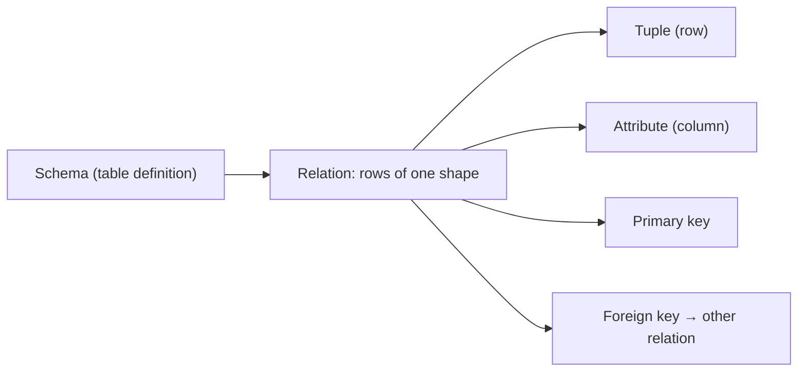

# 관계형 모델

이 글은 Database Systems 101 시리즈의 두 번째 글입니다.

테이블은 익숙합니다. 하지만 관계형 데이터베이스를 오래 다루는 팀일수록 “행과 열의 모음”이라는 표현만으로는 만족하지 않습니다. 왜냐하면 관계형 모델의 진짜 힘은 화면에 보이는 표 모양이 아니라, 그 표 뒤에서 무엇을 하나의 사실로 보고 어떤 키와 제약으로 연결할지를 명확하게 강제하는 데 있기 때문입니다.

이 관점을 잡고 나면 SQL도 덜 임의적으로 보입니다. SELECT, JOIN, 제약, 정규화가 모두 한 모델 위에 올라가 있다는 사실이 보이기 때문입니다. 이 글에서는 관계, 튜플, 속성, 기본키, 외래키라는 단어를 “시험용 용어”가 아니라 실제 설계 판단의 기준으로 연결해 보겠습니다.

## 이 글에서 다룰 문제

- 테이블에서 말하는 관계, 튜플, 속성은 각각 무엇을 가리킬까요?
- 기본키와 외래키는 정확히 무엇을 보장할까요?
- NULL과 무결성 제약은 어떤 의미를 가질까요?
- 관계형 모델을 이해하면 SQL의 모양이 왜 그렇게 생겼는지 어떻게 설명할 수 있을까요?

> **멘탈 모델**: 관계형 모델의 핵심 약속은 “같은 사실은 한 곳에만 둔다”입니다. 테이블은 같은 모양의 행들의 집합이고, 키는 그 행을 식별하며, 외래키는 다른 관계와의 연결을 안전하게 유지합니다. SQL은 이 관계들 위에서 연산을 수행하는 언어입니다.

## 이 글에서 배울 내용

- 관계, 튜플, 속성이 테이블에서 정확히 무엇을 가리키는지
- 기본키와 외래키가 실제로 보장하는 것
- NULL과 무결성 제약의 의미
- 관계형 모델을 이해할 때 SQL이 왜 지금의 모양을 갖는지

## 왜 중요한가

테이블과 관계를 흐릿하게 섞어 쓰면 뒤이어 나오는 정규화, 인덱스, 트랜잭션이 계속 어딘가 어긋나게 느껴집니다. 반대로 모델을 한 번 정확히 이해하면 SQL은 “주문처럼 외워야 하는 문법”이 아니라 “관계 위에서 수행하는 연산”으로 읽히기 시작합니다.

> SQL은 절차형 언어가 아닙니다. 관계 위에 정의된 연산 집합이기 때문에, 어떻게가 아니라 무엇을 기술합니다.

## 핵심 개념 한눈에 보기



테이블 하나가 곧 하나의 관계이고, 그 안의 한 행이 튜플이며, 각 컬럼이 속성입니다. 키는 특정 행을 유일하게 식별하는 속성 또는 속성 집합입니다.

## 핵심 용어

- **관계(Relation)**: 같은 모양의 튜플들의 집합입니다. 일상적으로는 테이블이라고 부릅니다.
- **튜플(Tuple)**: 하나의 행입니다. 단순한 위치가 아니라 속성 이름으로 해석되는 값 묶음입니다.
- **속성(Attribute)**: 이름과 도메인(타입)을 가진 컬럼입니다.
- **기본키(Primary Key)**: 한 행을 유일하게 식별하는 최소 속성 집합입니다. NULL이 될 수 없습니다.
- **외래키(Foreign Key)**: 다른 관계의 기본키를 가리키는 속성으로, 참조 무결성을 강제합니다.

## Before/After

**Before — cram everything into one table**

```sql
CREATE TABLE orders (
    id        INTEGER PRIMARY KEY,
    user_name TEXT,
    user_email TEXT,
    product   TEXT,
    price     INTEGER
);
```

한 사용자가 두 번 주문하면 이메일이 두 번 저장됩니다. 이메일이 바뀌면 모든 주문 행을 수정해야 합니다. “한 사실은 한 곳에”라는 약속이 처음부터 깨집니다.

**After — separate into relations**

```sql
CREATE TABLE users (
    id    INTEGER PRIMARY KEY,
    name  TEXT NOT NULL,
    email TEXT NOT NULL UNIQUE
);

CREATE TABLE orders (
    id      INTEGER PRIMARY KEY,
    user_id INTEGER NOT NULL REFERENCES users(id),
    product TEXT    NOT NULL,
    price   INTEGER NOT NULL CHECK (price >= 0)
);
```

사용자 정보는 `users`에 한 번만 존재하고, 주문은 외래키로 그 사용자를 참조합니다. 이메일 변경은 한 행 수정으로 끝납니다.

## 실습: 관계형 모델로 작은 주문 시스템 만들기

### 1단계 — 두 테이블 정의

```python
# init.py
import sqlite3

DDL = """
PRAGMA foreign_keys = ON;

CREATE TABLE IF NOT EXISTS users (
    id    INTEGER PRIMARY KEY,
    name  TEXT NOT NULL,
    email TEXT NOT NULL UNIQUE
);

CREATE TABLE IF NOT EXISTS orders (
    id      INTEGER PRIMARY KEY,
    user_id INTEGER NOT NULL REFERENCES users(id),
    product TEXT    NOT NULL,
    price   INTEGER NOT NULL CHECK (price >= 0)
);
"""

with sqlite3.connect("shop.db") as db:
    db.executescript(DDL)
```

SQLite에서는 `PRAGMA foreign_keys = ON`을 잊지 않는 것이 중요합니다. 이 설정이 빠지면 외래키 선언이 있어도 실제 검사가 비활성화됩니다.

### 2단계 — 키가 잘못된 데이터를 거절하는지 보기

```python
# keys.py
import sqlite3

with sqlite3.connect("shop.db") as db:
    db.execute("PRAGMA foreign_keys = ON")
    db.execute("INSERT INTO users (name, email) VALUES ('A', 'a@example.com')")
    try:
        db.execute("INSERT INTO users (name, email) VALUES ('B', 'a@example.com')")
    except sqlite3.IntegrityError as e:
        print("UNIQUE violation:", e)
```

애플리케이션 코드가 별도 검증을 하지 않아도 데이터베이스가 먼저 무결성을 지킵니다.

### 3단계 — 외래키가 참조 무결성을 강제하는지 보기

```python
# fk.py
import sqlite3

with sqlite3.connect("shop.db") as db:
    db.execute("PRAGMA foreign_keys = ON")
    try:
        db.execute(
            "INSERT INTO orders (user_id, product, price) VALUES (?, ?, ?)",
            (999, "milk", 3200),
        )
    except sqlite3.IntegrityError as e:
        print("FK violation:", e)
```

존재하지 않는 사용자를 가리키는 주문은 테이블 안으로 들어올 수 없습니다. 참조 무결성은 애플리케이션의 선의가 아니라 데이터베이스의 강제력으로 지켜야 합니다.

### 4단계 — 두 관계를 JOIN으로 합치기

```python
import sqlite3

with sqlite3.connect("shop.db") as db:
    rows = db.execute("""
        SELECT u.name, o.product, o.price
        FROM orders o
        JOIN users u ON u.id = o.user_id
        ORDER BY o.id
    """).fetchall()
    for r in rows:
        print(r)
```

애플리케이션은 “어떤 키로 두 관계를 합칠지”만 적습니다. 인덱스를 어떻게 쓰고 어떤 조인 알고리즘을 택할지는 옵티마이저의 몫입니다.

### 5단계 — 무결성을 일부러 깨 보려 하기

```python
import sqlite3

with sqlite3.connect("shop.db") as db:
    db.execute("PRAGMA foreign_keys = ON")
    try:
        db.execute("DELETE FROM users WHERE email = 'a@example.com'")
    except sqlite3.IntegrityError as e:
        print("Refused — orders still reference this user:", e)
```

참조 무결성은 애플리케이션 버그가 데이터를 망가뜨리기 전에 막아 주는 첫 번째 방어선입니다.

## 이 코드에서 먼저 봐야 할 점

- 관계형 모델의 중심은 “한 사실은 한 곳에”입니다. 사용자 이메일은 `users`에만 존재해야 합니다.
- 키와 제약은 애플리케이션 검증보다 더 빠르고 더 균일하게 잘못된 데이터를 거절합니다.
- JOIN은 두 관계를 키 기준으로 결합해 새로운 관계를 만드는 연산입니다.
- 옵티마이저는 같은 답을 더 빠르게 만들 자유를 갖습니다. 그래서 SQL은 어떻게가 아니라 무엇을 적습니다.

## 자주 하는 실수 5가지

1. **편의를 이유로 외래키를 끈다.** 오늘의 작은 편의가 몇 달 뒤 dangling reference 디버깅 비용으로 돌아옵니다.
2. **모든 컬럼에 NULL을 허용한다.** 의미가 흐려지고 쿼리는 더 복잡해집니다. NULL은 의도적으로만 허용해야 합니다.
3. **이메일이나 전화번호 같은 자연키를 기본키로 쓴다.** 값이 바뀔 수 있는 키는 참조 비용을 키웁니다.
4. **표시용 데이터를 여러 테이블에 중복 저장한다.** 한쪽만 수정되는 순간 진실이 둘이 됩니다.
5. **JOIN을 피하려고 애플리케이션 코드에서 데이터를 합친다.** N+1 쿼리와 최적화 손실이 동시에 생깁니다.

## 실무에서는 이렇게 드러납니다

대부분의 백엔드 모델링은 사람이 읽는 ER 다이어그램과 실제 DDL 두 산출물로 굴러갑니다. 좋은 팀은 새 기능을 만들 때 먼저 관계를 그리고, 그 다음에 마이그레이션을 작성합니다. 모델 단계에서 “한 사실은 한 곳에”가 깨지면 그 뒤의 코드와 데이터는 같이 흔들립니다.

성능 때문에 비정규화를 선택할 수도 있습니다. 다만 그 순간에는 반드시 두 질문이 따라붙어야 합니다. “두 복사본을 어떻게 동기화할 것인가?”, “어느 쪽이 진실인가?” 의도 없는 비정규화는 성능 최적화가 아니라 미래의 데이터 불일치 예약입니다.

## 시니어 엔지니어는 이렇게 생각합니다

- 코드를 쓰기 전에 먼저 모델을 그립니다. 잘못된 모델은 똑똑한 코드로도 구조적으로 만회되지 않습니다.
- “이 사실은 어디에 살고, 몇 군데에서 보이는가?”를 반복해서 묻습니다.
- 외래키를 끄는 선택을 거의 하지 않습니다. 깨진 참조 그래프를 복구하는 비용이 너무 크기 때문입니다.
- NULL 허용은 의미가 있을 때만 넣습니다.
- 비정규화는 측정 결과가 요구할 때만, 동기화 책임을 문서로 남기면서 도입합니다.

## 체크리스트

- [ ] 각 사실이 정확히 한 테이블에만 존재하는가?
- [ ] 모든 테이블에 의미 있는 기본키가 있는가?
- [ ] 외래키 제약이 선언만이 아니라 실제로 강제되고 있는가?
- [ ] NULL 허용 컬럼은 모두 의도가 분명한가?
- [ ] 비정규화가 있다면 동기화 전략이 문서화되어 있는가?

## 연습 문제

1. Before의 단일 테이블 모델에서 사용자가 이메일을 바꿀 때 생기는 구체적인 문제 두 가지를 적어 보세요.
2. 4단계의 JOIN을 애플리케이션 코드로 흉내 내려면 SQL 호출이 몇 번 필요할지 생각해 보고, 거기서 N+1 문제가 왜 생기는지 한 줄로 설명해 보세요.
3. “주문에는 메모를 달 수 있다”는 요구가 생겼습니다. `orders`에 `note` 컬럼을 바로 넣는 방식과 `order_notes` 관계를 따로 두는 방식을 각각 1~2문장으로 비교해 보세요.

## 정리 및 다음 단계

관계형 모델은 “테이블은 같은 모양의 행들의 집합이고, 행은 키로 식별되며, 관계는 외래키로 표현된다”는 단순한 약속으로 요약됩니다. 이 약속이 SQL의 모양도 만들고, DBMS가 무엇을 보장할 수 있는지도 결정합니다. 다음 글에서는 그 모델 위에서 실제로 실행되는 언어, SQL과 쿼리 처리 과정을 살펴봅니다.

<!-- toc:begin -->
- [데이터베이스 시스템이란 무엇인가?](./01-what-is-a-database.md)
- **관계형 모델 (현재 글)**
- SQL과 쿼리 처리 (예정)
- 인덱스 (예정)
- 트랜잭션과 ACID (예정)
- isolation level (예정)
- 정규화와 모델링 (예정)
- 쿼리 최적화 (예정)
- 복제와 백업 (예정)
- OLTP와 OLAP (예정)
<!-- toc:end -->

## 참고 자료

- [Codd 1970 — A Relational Model of Data for Large Shared Data Banks](https://www.seas.upenn.edu/~zives/03f/cis550/codd.pdf)
- [PostgreSQL — Data Definition](https://www.postgresql.org/docs/current/ddl.html)
- [SQLite — Foreign Key Support](https://www.sqlite.org/foreignkeys.html)
- [Database System Concepts (Silberschatz)](https://www.db-book.com/)

Tags: Computer Science, Database, 관계형모델, SQL, 무결성, 키
