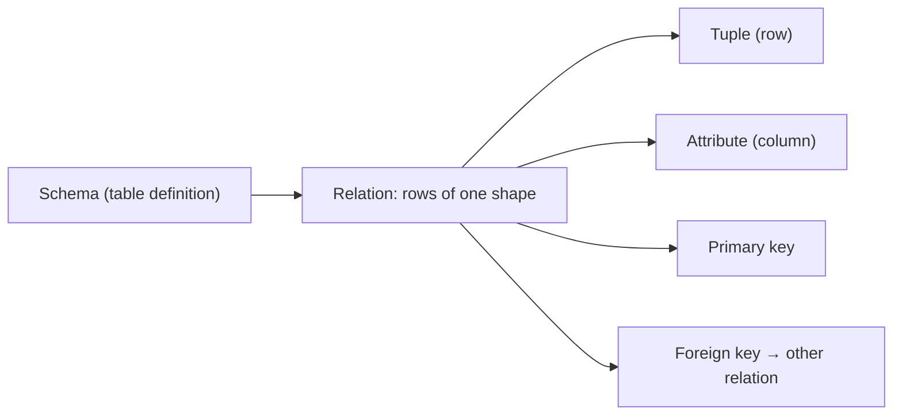

# Database Systems 101 (2/10): 관계형 모델

이 글은 Database Systems 101 시리즈의 두 번째 글입니다.

테이블은 익숙합니다. 하지만 관계형 데이터베이스를 오래 다루는 팀일수록 “행과 열의 모음”이라는 표현만으로는 만족하지 않습니다. 왜냐하면 관계형 모델의 진짜 힘은 화면에 보이는 표 모양이 아니라, 그 표 뒤에서 무엇을 하나의 사실로 보고 어떤 키와 제약으로 연결할지를 명확하게 강제하는 데 있기 때문입니다.

이 관점을 잡고 나면 SQL도 덜 임의적으로 보입니다. SELECT, JOIN, 제약, 정규화가 모두 한 모델 위에 올라가 있다는 사실이 보이기 때문입니다. 이 글에서는 관계, 튜플, 속성, 기본키, 외래키라는 단어를 “시험용 용어”가 아니라 실제 설계 판단의 기준으로 연결해 보겠습니다.

## 먼저 던지는 질문

- 테이블에서 말하는 관계, 튜플, 속성은 각각 무엇을 가리킬까요?
- 기본키와 외래키는 정확히 무엇을 보장할까요?
- NULL과 무결성 제약은 어떤 의미를 가질까요?

## 큰 그림


*Database Systems 101 2장 흐름 개요*

## 이 글에서 배울 내용

- 관계, 튜플, 속성이 테이블에서 정확히 무엇을 가리키는지
- 기본키와 외래키가 실제로 보장하는 것
- NULL과 무결성 제약의 의미
- 관계형 모델을 이해할 때 SQL이 왜 지금의 모양을 갖는지

## 왜 중요한가

테이블과 관계를 흐릿하게 섞어 쓰면 뒤이어 나오는 정규화, 인덱스, 트랜잭션이 계속 어딘가 어긋나게 느껴집니다. 반대로 모델을 한 번 정확히 이해하면 SQL은 “주문처럼 외워야 하는 문법”이 아니라 “관계 위에서 수행하는 연산”으로 읽히기 시작합니다.

> SQL은 절차형 언어가 아닙니다. 관계 위에 정의된 연산 집합이기 때문에, 어떻게가 아니라 무엇을 기술합니다.

## 핵심 개념 한눈에 보기



테이블 하나가 곧 하나의 관계이고, 그 안의 한 행이 튜플이며, 각 컬럼이 속성입니다. 키는 특정 행을 유일하게 식별하는 속성 또는 속성 집합입니다.

## 핵심 용어

- **관계(Relation)**: 같은 모양의 튜플들의 집합입니다. 일상적으로는 테이블이라고 부릅니다.
- **튜플(Tuple)**: 하나의 행입니다. 단순한 위치가 아니라 속성 이름으로 해석되는 값 묶음입니다.
- **속성(Attribute)**: 이름과 도메인(타입)을 가진 컬럼입니다.
- **기본키(Primary Key)**: 한 행을 유일하게 식별하는 최소 속성 집합입니다. NULL이 될 수 없습니다.
- **외래키(Foreign Key)**: 다른 관계의 기본키를 가리키는 속성으로, 참조 무결성을 강제합니다.

## 변경 전/변경 후

**Before — cram everything into one table**

```sql
CREATE TABLE orders (
    id        INTEGER PRIMARY KEY,
    user_name TEXT,
    user_email TEXT,
    product   TEXT,
    price     INTEGER
);
```

한 사용자가 두 번 주문하면 이메일이 두 번 저장됩니다. 이메일이 바뀌면 모든 주문 행을 수정해야 합니다. “한 사실은 한 곳에”라는 약속이 처음부터 깨집니다.

**After — separate into relations**

```sql
CREATE TABLE users (
    id    INTEGER PRIMARY KEY,
    name  TEXT NOT NULL,
    email TEXT NOT NULL UNIQUE
);

CREATE TABLE orders (
    id      INTEGER PRIMARY KEY,
    user_id INTEGER NOT NULL REFERENCES users(id),
    product TEXT    NOT NULL,
    price   INTEGER NOT NULL CHECK (price >= 0)
);
```

사용자 정보는 `users`에 한 번만 존재하고, 주문은 외래키로 그 사용자를 참조합니다. 이메일 변경은 한 행 수정으로 끝납니다.

## 실습: 관계형 모델로 작은 주문 시스템 만들기

### 1단계 — 두 테이블 정의

```python
# init.py
import sqlite3

DDL = """
PRAGMA foreign_keys = ON;

CREATE TABLE IF NOT EXISTS users (
    id    INTEGER PRIMARY KEY,
    name  TEXT NOT NULL,
    email TEXT NOT NULL UNIQUE
);

CREATE TABLE IF NOT EXISTS orders (
    id      INTEGER PRIMARY KEY,
    user_id INTEGER NOT NULL REFERENCES users(id),
    product TEXT    NOT NULL,
    price   INTEGER NOT NULL CHECK (price >= 0)
);
"""

with sqlite3.connect("shop.db") as db:
    db.executescript(DDL)
```

SQLite에서는 `PRAGMA foreign_keys = ON`을 잊지 않는 것이 중요합니다. 이 설정이 빠지면 외래키 선언이 있어도 실제 검사가 비활성화됩니다.

### 2단계 — 키가 잘못된 데이터를 거절하는지 보기

```python
# keys.py
import sqlite3

with sqlite3.connect("shop.db") as db:
    db.execute("PRAGMA foreign_keys = ON")
    db.execute("INSERT INTO users (name, email) VALUES ('A', 'a@example.com')")
    try:
        db.execute("INSERT INTO users (name, email) VALUES ('B', 'a@example.com')")
    except sqlite3.IntegrityError as e:
        print("UNIQUE violation:", e)
```

애플리케이션 코드가 별도 검증을 하지 않아도 데이터베이스가 먼저 무결성을 지킵니다.

### 3단계 — 외래키가 참조 무결성을 강제하는지 보기

```python
# fk.py
import sqlite3

with sqlite3.connect("shop.db") as db:
    db.execute("PRAGMA foreign_keys = ON")
    try:
        db.execute(
            "INSERT INTO orders (user_id, product, price) VALUES (?, ?, ?)",
            (999, "milk", 3200),
        )
    except sqlite3.IntegrityError as e:
        print("FK violation:", e)
```

존재하지 않는 사용자를 가리키는 주문은 테이블 안으로 들어올 수 없습니다. 참조 무결성은 애플리케이션의 선의가 아니라 데이터베이스의 강제력으로 지켜야 합니다.

### 4단계 — 두 관계를 조인으로 합치기

```python
import sqlite3

with sqlite3.connect("shop.db") as db:
    rows = db.execute("""
        SELECT u.name, o.product, o.price
        FROM orders o
        JOIN users u ON u.id = o.user_id
        ORDER BY o.id
    """).fetchall()
    for r in rows:
        print(r)
```

애플리케이션은 “어떤 키로 두 관계를 합칠지”만 적습니다. 인덱스를 어떻게 쓰고 어떤 조인 알고리즘을 택할지는 옵티마이저의 몫입니다.

### 5단계 — 무결성을 일부러 깨 보려 하기

```python
import sqlite3

with sqlite3.connect("shop.db") as db:
    db.execute("PRAGMA foreign_keys = ON")
    try:
        db.execute("DELETE FROM users WHERE email = 'a@example.com'")
    except sqlite3.IntegrityError as e:
        print("Refused — orders still reference this user:", e)
```

참조 무결성은 애플리케이션 버그가 데이터를 망가뜨리기 전에 막아 주는 첫 번째 방어선입니다.

## 이 코드에서 먼저 봐야 할 점

- 관계형 모델의 중심은 “한 사실은 한 곳에”입니다. 사용자 이메일은 `users`에만 존재해야 합니다.
- 키와 제약은 애플리케이션 검증보다 더 빠르고 더 균일하게 잘못된 데이터를 거절합니다.
- JOIN은 두 관계를 키 기준으로 결합해 새로운 관계를 만드는 연산입니다.
- 옵티마이저는 같은 답을 더 빠르게 만들 자유를 갖습니다. 그래서 SQL은 어떻게가 아니라 무엇을 적습니다.

## 자주 하는 실수 5가지

1. **편의를 이유로 외래키를 끈다.** 오늘의 작은 편의가 몇 달 뒤 dangling reference 디버깅 비용으로 돌아옵니다.
2. **모든 컬럼에 NULL을 허용한다.** 의미가 흐려지고 쿼리는 더 복잡해집니다. NULL은 의도적으로만 허용해야 합니다.
3. **이메일이나 전화번호 같은 자연키를 기본키로 쓴다.** 값이 바뀔 수 있는 키는 참조 비용을 키웁니다.
4. **표시용 데이터를 여러 테이블에 중복 저장한다.** 한쪽만 수정되는 순간 진실이 둘이 됩니다.
5. **JOIN을 피하려고 애플리케이션 코드에서 데이터를 합친다.** N+1 쿼리와 최적화 손실이 동시에 생깁니다.

## 실무에서는 이렇게 드러납니다

대부분의 백엔드 모델링은 사람이 읽는 ER 다이어그램과 실제 DDL 두 산출물로 굴러갑니다. 좋은 팀은 새 기능을 만들 때 먼저 관계를 그리고, 그 다음에 마이그레이션을 작성합니다. 모델 단계에서 “한 사실은 한 곳에”가 깨지면 그 뒤의 코드와 데이터는 같이 흔들립니다.

성능 때문에 비정규화를 선택할 수도 있습니다. 다만 그 순간에는 반드시 두 질문이 따라붙어야 합니다. “두 복사본을 어떻게 동기화할 것인가?”, “어느 쪽이 진실인가?” 의도 없는 비정규화는 성능 최적화가 아니라 미래의 데이터 불일치 예약입니다.

## 시니어 엔지니어는 이렇게 생각합니다

- 코드를 쓰기 전에 먼저 모델을 그립니다. 잘못된 모델은 똑똑한 코드로도 구조적으로 만회되지 않습니다.
- “이 사실은 어디에 살고, 몇 군데에서 보이는가?”를 반복해서 묻습니다.
- 외래키를 끄는 선택을 거의 하지 않습니다. 깨진 참조 그래프를 복구하는 비용이 너무 크기 때문입니다.
- NULL 허용은 의미가 있을 때만 넣습니다.
- 비정규화는 측정 결과가 요구할 때만, 동기화 책임을 문서로 남기면서 도입합니다.

## 체크리스트

- [ ] 각 사실이 정확히 한 테이블에만 존재하는가?
- [ ] 모든 테이블에 의미 있는 기본키가 있는가?
- [ ] 외래키 제약이 선언만이 아니라 실제로 강제되고 있는가?
- [ ] NULL 허용 컬럼은 모두 의도가 분명한가?
- [ ] 비정규화가 있다면 동기화 전략이 문서화되어 있는가?

## 연습 문제

1. Before의 단일 테이블 모델에서 사용자가 이메일을 바꿀 때 생기는 구체적인 문제 두 가지를 적어 보세요.
2. 4단계의 JOIN을 애플리케이션 코드로 흉내 내려면 SQL 호출이 몇 번 필요할지 생각해 보고, 거기서 N+1 문제가 왜 생기는지 한 줄로 설명해 보세요.
3. “주문에는 메모를 달 수 있다”는 요구가 생겼습니다. `orders`에 `note` 컬럼을 바로 넣는 방식과 `order_notes` 관계를 따로 두는 방식을 각각 1~2문장으로 비교해 보세요.

## 정리 및 다음 단계

관계형 모델은 “테이블은 같은 모양의 행들의 집합이고, 행은 키로 식별되며, 관계는 외래키로 표현된다”는 단순한 약속으로 요약됩니다. 이 약속이 SQL의 모양도 만들고, DBMS가 무엇을 보장할 수 있는지도 결정합니다. 다음 글에서는 그 모델 위에서 실제로 실행되는 언어, SQL과 쿼리 처리 과정을 살펴봅니다.

## 실전 보강: 실행 계획과 트랜잭션 설계를 한 번에 보는 연습

아래 예시는 관계형 데이터베이스를 운영할 때 자주 만나는 세 가지 질문을 한 번에 다룹니다. 첫째, 이 쿼리가 왜 느린지, 둘째, 어떤 인덱스가 실제로 선택되는지, 셋째, 실패 시 데이터가 어디까지 보존되는지입니다.

### 1) 조건과 정렬을 함께 고려한 인덱스 전략

```sql
-- 주문 조회 API: 특정 사용자 최근 주문 20건
SELECT id, user_id, status, created_at, total_amount
FROM orders
WHERE user_id = 42 AND status = 'paid'
ORDER BY created_at DESC
LIMIT 20;
```

이 쿼리는 보통 `user_id`, `status`, `created_at`의 순서를 가진 복합 인덱스 후보를 만듭니다.

```sql
CREATE INDEX idx_orders_user_status_created
ON orders (user_id, status, created_at DESC);
```

핵심은 **필터링 컬럼을 앞쪽에**, 정렬 컬럼을 그다음에 배치하는 것입니다. 이렇게 하면 WHERE와 ORDER BY를 동시에 만족해 추가 정렬 비용을 줄일 수 있습니다.

### 2) 실행 계획 비교하기

```sql
EXPLAIN ANALYZE
SELECT id, user_id, status, created_at, total_amount
FROM orders
WHERE user_id = 42 AND status = 'paid'
ORDER BY created_at DESC
LIMIT 20;
```

계획을 읽을 때는 다음 순서를 고정해 확인합니다.

| 확인 항목 | 의미 | 실무 해석 |
| --- | --- | --- |
| Scan 종류 | Seq Scan / Index Scan / Index Only Scan | 인덱스가 실제 사용되는지 |
| Rows (estimate vs actual) | 예상 행 수와 실제 행 수 차이 | 통계 갱신 필요 여부 판단 |
| Sort 노드 유무 | 별도 정렬 발생 여부 | 인덱스 컬럼 순서 재검토 |
| Loop 횟수 | 반복 수행 정도 | Nested Loop 과비용 여부 |

예상 행 수와 실제 행 수가 크게 어긋나면 `ANALYZE` 또는 통계 정책을 먼저 점검합니다. 인덱스를 추가하기 전에 통계부터 정상화하는 편이 안전합니다.

### 3) 트랜잭션 경계와 실패 처리 패턴

```python
import sqlite3

def create_order(db: sqlite3.Connection, user_id: int, amount: int) -> None:
    try:
        db.execute("BEGIN")
        db.execute(
            "INSERT INTO orders(user_id, status, total_amount) VALUES (?, 'paid', ?)",
            (user_id, amount),
        )
        db.execute(
            "UPDATE inventory SET stock = stock - 1 WHERE sku = ? AND stock > 0",
            ("SKU-001",),
        )
        changed = db.execute("SELECT changes()").fetchone()[0]
        if changed != 1:
            raise RuntimeError("재고 부족")
        db.execute("COMMIT")
    except Exception:
        db.execute("ROLLBACK")
        raise
```

이 패턴의 의도는 명확합니다. 주문 생성과 재고 차감을 **하나의 원자 단위**로 묶고, 조건이 맞지 않으면 전체를 되돌립니다. 트랜잭션 안에서 외부 API 호출을 하지 않는 것도 중요합니다. 잠금 시간이 길어지면 동시성 충돌이 급격히 늘어납니다.

### 4) 운영에서 자주 쓰는 진단 질의문

```sql
-- 값 분포 확인(선택성 감각)
SELECT status, COUNT(*) FROM orders GROUP BY status;

-- 최근 7일 데이터 비율 확인(파티션/인덱스 필요성 판단)
SELECT COUNT(*) FILTER (WHERE created_at >= NOW() - INTERVAL '7 days') AS recent,
       COUNT(*) AS total
FROM orders;

-- 특정 조건의 실제 데이터량 확인
SELECT COUNT(*)
FROM orders
WHERE user_id = 42 AND status = 'paid';
```

인덱스 설계는 문법 문제가 아니라 **분포 문제**입니다. 어떤 값이 얼마나 자주 등장하는지 모르면, 좋은 인덱스 순서를 고르기 어렵습니다.

### 5) 읽기/쓰기 균형 체크

| 판단 질문 | 읽기 중심 시스템 | 쓰기 중심 시스템 |
| --- | --- | --- |
| 인덱스 수 | 상대적으로 많아도 감당 가능 | 최소화가 우선 |
| 커버링 인덱스 | 적극 검토 | 신중 검토 |
| 배치 업데이트 | 야간 일괄 가능 | 짧은 배치로 분할 필요 |
| 통계 갱신 | 주기적 자동 갱신 | 대량 쓰기 직후 즉시 갱신 |

결론적으로 데이터베이스 튜닝은 “인덱스를 늘린다”가 아니라 “실행 계획을 읽고, 트랜잭션 경계를 짧게 유지하고, 분포를 근거로 선택한다”의 반복입니다.

## 무결성을 눈으로 확인하는 모델링 예시

관계형 모델의 장점은 "제약을 코드 밖으로 올린다"는 점입니다. 아래처럼 주문과 주문 항목을 나누고 외래키를 강제하면, 애플리케이션 실수로 고아 데이터를 만드는 일을 크게 줄일 수 있습니다.

```sql
CREATE TABLE orders (
  id BIGINT PRIMARY KEY,
  user_id BIGINT NOT NULL,
  created_at TIMESTAMP NOT NULL
);

CREATE TABLE order_items (
  id BIGINT PRIMARY KEY,
  order_id BIGINT NOT NULL REFERENCES orders(id),
  sku TEXT NOT NULL,
  qty INTEGER NOT NULL CHECK (qty > 0)
);
```

```sql
-- 존재하지 않는 주문에 항목을 넣으면 즉시 실패
INSERT INTO order_items (id, order_id, sku, qty)
VALUES (1, 999999, 'SKU-1', 1);
```

관계형 모델을 잘 쓴다는 것은 JOIN을 많이 쓴다는 뜻이 아니라, 사실의 소유 위치를 명확히 정해 같은 사실을 한 곳에서만 관리한다는 뜻입니다. 이 규칙이 서면 읽기 쿼리는 조금 길어져도, 갱신 오류와 정합성 문제는 눈에 띄게 줄어듭니다.

## 조인 계획에서 보는 관계형 모델의 효과

```text
EXPLAIN ANALYZE
SELECT o.id, oi.sku, oi.qty
FROM orders o
JOIN order_items oi ON oi.order_id = o.id
WHERE o.user_id = 42;

Nested Loop  (cost=0.56..42.11 rows=16 width=48)
(actual time=0.041..0.105 rows=12 loops=1)
  -> Index Scan using idx_orders_user_id on orders o
  -> Index Scan using idx_order_items_order_id on order_items oi
Planning Time: 0.380 ms
Execution Time: 0.149 ms
```

외래키 자체가 자동으로 빠른 조인을 보장하지는 않지만, 관계가 명확하면 인덱스 설계 기준이 또렷해집니다. 즉 모델이 좋을수록 실행 계획도 예측 가능해집니다.

## 실전 운영 점검표

운영 환경에서 데이터베이스 품질을 안정적으로 유지하려면, 기능 개발과 별개로 점검 루틴을 명확하게 가져가야 합니다. 아래 항목은 서비스 규모와 상관없이 바로 적용할 수 있는 기준입니다.

- 변경 전에는 항상 기준 지표를 남깁니다. 평균 지연 시간, P95, P99, 초당 트랜잭션 수, 잠금 대기 시간 같은 숫자를 캡처해 둬야 변경 이후를 비교할 수 있습니다.
- 쿼리 튜닝은 SQL 문장 자체보다 실행 계획의 변화를 중심으로 추적합니다. 계획 노드가 바뀌었는지, 예상 행 수와 실제 행 수의 차이가 커졌는지, 정렬이나 해시가 디스크로 내려갔는지를 우선 확인합니다.
- 스키마 변경은 단계적으로 진행합니다. 컬럼 추가, 백필, 코드 전환, 제약 강화 순서로 나누면 장애 반경을 줄일 수 있습니다.
- 장애 대응 문서는 운영자가 밤중에도 바로 실행할 수 있는 형태여야 합니다. 복구 절차, 롤백 절차, 검증 SQL을 같은 문서에 둬야 실제 상황에서 흔들리지 않습니다.

아래 예시는 팀이 릴리스 전후에 반복적으로 실행하는 최소 점검 SQL입니다.

```sql
-- 최근 10분 동안 느린 쿼리 확인(엔진별 뷰 이름은 다를 수 있음)
SELECT query, calls, mean_exec_time, rows
FROM pg_stat_statements
ORDER BY mean_exec_time DESC
LIMIT 20;

-- 잠금 대기 체인 확인
SELECT now(), pid, wait_event_type, wait_event, state, query
FROM pg_stat_activity
WHERE wait_event_type IS NOT NULL;

-- 인덱스 사용률 점검
SELECT relname AS table_name, seq_scan, idx_scan
FROM pg_stat_user_tables
ORDER BY seq_scan DESC
LIMIT 20;
```

이 점검 루틴을 자동화 파이프라인에 연결하면, 성능 저하를 "느낌"이 아니라 "증거"로 관리할 수 있습니다. 결국 장기 운영에서 중요한 것은 뛰어난 한 번의 튜닝이 아니라, 작은 검증을 꾸준히 반복해 위험을 조기에 감지하는 습관입니다.
## 운영 리허설 시나리오

문서만 읽고 끝내면 운영에서 다시 같은 실수를 반복하기 쉽습니다. 아래 시나리오는 팀 온보딩과 장애 대응 훈련에 바로 사용할 수 있는 공통 리허설 절차입니다.

### 시나리오 1: 느려진 조회 원인 찾기

1. 문제 쿼리를 식별합니다. 애플리케이션 로그의 요청 식별자와 데이터베이스 쿼리 로그를 매칭합니다.
2. 같은 파라미터로 `EXPLAIN ANALYZE`를 실행합니다.
3. 계획 노드 중 시간이 큰 지점을 찾고, 해당 노드가 인덱스/통계/정렬 중 무엇과 관련 있는지 분류합니다.
4. 개선안을 한 번에 하나만 적용합니다. 인덱스 추가, 통계 갱신, 질의문 재작성 가운데 하나만 바꿔 결과를 비교합니다.

```text
개선 전
Seq Scan on events  (actual time=0.030..842.112 rows=12000)

개선 후
Index Scan using idx_events_tenant_created on events
(actual time=0.041..21.553 rows=12000)
```

### 시나리오 2: 동시성 문제 재현과 완화

1. 두 세션에서 같은 행을 거의 동시에 수정합니다.
2. 격리 수준을 바꿔 가며 결과를 비교합니다.
3. 필요하면 `FOR UPDATE` 잠금 조회 또는 낙관적 잠금 버전 컬럼을 적용합니다.
4. 재시도 정책과 타임아웃 기준을 코드와 운영 문서에 같이 기록합니다.

```sql
-- 낙관적 잠금 예시
UPDATE inventory
SET qty = qty - 1, version = version + 1
WHERE sku = 'A-100' AND version = 17;
```

영향 받은 행 수가 0이면 이미 다른 트랜잭션이 갱신한 것이므로, 재조회 후 재시도합니다. 이 패턴은 잠금 경합을 낮추면서도 정합성을 지키는 데 효과적입니다.

### 시나리오 3: 복구 가능성 검증

1. 최신 베이스 백업으로 테스트 인스턴스를 띄웁니다.
2. 지정 시점까지 로그를 재적용합니다.
3. 핵심 비즈니스 검증 SQL을 실행합니다.
4. 복구 시간(RTO)과 데이터 유실 허용치(RPO)를 실제 숫자로 기록합니다.

```sql
-- 검증 SQL 예시
SELECT COUNT(*) FROM orders WHERE created_at >= now() - interval '1 day';
SELECT SUM(amount) FROM payments WHERE status = 'SUCCESS';
SELECT COUNT(*) FROM users WHERE deleted_at IS NULL;
```

복구 리허설에서 가장 중요한 점은 성공 여부 자체보다, 누가 어떤 순서로 무엇을 확인했는지를 재현 가능하게 남기는 것입니다. 절차가 사람마다 다르면 실제 장애에서 속도와 품질이 동시에 무너집니다.

## 체크리스트: 배포 전 최소 검증

- 대표 조회 5개에 대해 실행 계획을 저장합니다.
- 트랜잭션 경계가 긴 코드 경로를 식별합니다.
- 잠금 대기 알람 임계치를 설정합니다.
- 스키마 변경의 롤백 경로를 문서화합니다.
- 백업 복구 리허설 최근 실행일을 확인합니다.

이 체크리스트는 거창한 체계를 요구하지 않습니다. 작은 팀도 주 1회 반복하면 데이터 사고 빈도를 눈에 띄게 줄일 수 있습니다. 데이터베이스 운영의 본질은 "고급 기능을 많이 아는 것"이 아니라, "반복 가능한 검증 루프를 끊기지 않게 유지하는 것"입니다.


## 처음 질문으로 돌아가기

- **테이블에서 말하는 관계, 튜플, 속성은 각각 무엇을 가리킬까요?**
  - 본문의 기준은 관계형 모델를 한 덩어리 개념으로 보지 않고 입력, 처리, 검증, 운영 신호가 만나는 경계로 나누어 확인하는 것입니다.
- **기본키와 외래키는 정확히 무엇을 보장할까요?**
  - 예제와 그림에서는 어떤 값이 들어오고, 어느 단계에서 바뀌며, 어떤 기준으로 통과 또는 실패하는지를 먼저 확인해야 합니다.
- **NULL과 무결성 제약은 어떤 의미를 가질까요?**
  - 운영에서는 이 판단을 체크리스트, 로그, 테스트로 남겨 다음 변경에서도 같은 실패가 반복되지 않게 막아야 합니다.

<!-- toc:begin -->
## 시리즈 목차

- [Database Systems 101 (1/10): 데이터베이스 시스템이란 무엇인가?](./01-what-is-a-database.md)
- **관계형 모델 (현재 글)**
- SQL과 쿼리 처리 (예정)
- 인덱스 (예정)
- 트랜잭션과 ACID (예정)
- 격리 수준 (예정)
- 정규화와 모델링 (예정)
- 쿼리 최적화 (예정)
- 복제와 백업 (예정)
- OLTP와 OLAP (예정)

<!-- toc:end -->

## 참고 자료

- [database-systems-101 예제 코드 (book-examples)](https://github.com/yeongseon-books/book-examples/tree/main/database-systems-101/ko)
- [Codd 1970 — A Relational Model of Data for Large Shared Data Banks](https://www.seas.upenn.edu/~zives/03f/cis550/codd.pdf)
- [PostgreSQL — Data Definition](https://www.postgresql.org/docs/current/ddl.html)
- [SQLite — Foreign Key Support](https://www.sqlite.org/foreignkeys.html)
- [Database System Concepts (Silberschatz)](https://www.db-book.com/)

Tags: Computer Science, Database, 관계형모델, SQL, 무결성, 키
