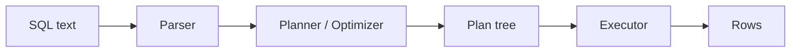

# SQL과 쿼리 처리

이 글은 Database Systems 101 시리즈의 세 번째 글입니다.

`SELECT * FROM orders WHERE user_id = 7` 같은 SQL 한 줄은 너무 단순해 보여서, 많은 입문자가 “그냥 데이터베이스가 알아서 찾아 오겠지” 정도로 생각합니다. 맞는 말이지만, 바로 그 “알아서”가 어디까지를 뜻하는지 모르면 성능 문제를 만났을 때 손댈 수 있는 지점이 거의 없어집니다.

SQL은 절차를 적는 언어가 아닙니다. 원하는 결과를 선언하면 DBMS가 그것을 파싱하고, 의미를 해석하고, 가능한 실행 계획들 중 하나를 고른 뒤, 실제로 행을 만들어 냅니다. 이 글의 목표는 SQL 문법을 다시 가르치는 것이 아니라, SQL 텍스트가 결과 행이 되기까지의 내부 경로를 EXPLAIN이라는 창으로 읽을 수 있게 만드는 데 있습니다.

## 이 글에서 다룰 문제

- SQL이 선언형 언어라는 사실은 어떤 결과를 낳을까요?
- 쿼리는 어떤 네 단계를 거쳐 실행될까요?
- 가장 단순한 `EXPLAIN` 출력은 어떻게 읽어야 할까요?
- 같은 쿼리에 대해 여러 실행 전략이 가능한 이유는 무엇일까요?

> **멘탈 모델**: SQL은 “무엇을 원한다”는 문장이고, DBMS는 그 문장을 파싱해 실행 계획 트리로 바꾼 뒤 한 노드씩 따라가며 결과 행을 만듭니다. 성능 문제를 이해한다는 것은 결국 “지금 어떤 계획 트리가 실행되고 있는가”를 읽는 일입니다.

## 이 글에서 배울 내용

- SQL이 선언형 언어라는 사실이 만드는 결과
- 쿼리가 거치는 네 단계
- 가장 단순한 `EXPLAIN` 출력 읽는 법
- 같은 쿼리에 여러 실행 전략이 가능한 이유

## 왜 중요한가

성능 문제 대부분은 SQL을 다시 쓰는 일보다, 실제로 무엇이 실행되고 있는지 모르는 데서 시작합니다. 실행 계획을 읽을 수 있게 되면 “왜 느리지?”라는 질문이 더 이상 감에 기대는 추측 게임이 아니라, 증거를 기반으로 한 분석 작업이 됩니다.

> 같은 결과를 만드는 SQL은 여러 개일 수 있고, 같은 SQL을 실행하는 방법도 여러 개일 수 있습니다. 옵티마이저는 그 가능성들 사이에서 하나를 고르는 엔진입니다.

## 핵심 개념 한눈에 보기



SQL은 텍스트에서 시작해 실행 계획 트리로 바뀌고, 실행기는 그 트리를 따라가며 결과 행을 생산합니다.

## 핵심 용어

- **DDL/DML**: DDL은 스키마를 정의하고(CREATE, ALTER), DML은 데이터를 읽고 바꿉니다(SELECT, INSERT, UPDATE, DELETE).
- **실행 계획(Plan)**: 옵티마이저가 선택한 쿼리 실행 단계의 트리입니다.
- **비용(Cost)**: 여러 계획을 비교하기 위해 옵티마이저가 사용하는 추정치입니다. 보통 I/O와 CPU 모델이 반영됩니다.
- **Seq Scan vs Index Scan**: 테이블 전체를 읽을지, 인덱스를 따라 필요한 부분만 읽을지의 차이입니다.
- **Estimate vs Actual**: 옵티마이저가 예상한 행 수와 실제 행 수입니다. 차이가 크면 통계가 낡았을 가능성이 큽니다.

## Before/After

**Before — guess at "why slow"**

```sql
SELECT * FROM orders WHERE user_id = 7;
-- slow. Add another index. Still slow. Blame the cache…
```

증거 없이 의심되는 부분을 하나씩 건드리는 상태입니다.

**After — read the plan**

```sql
EXPLAIN QUERY PLAN
SELECT * FROM orders WHERE user_id = 7;
-- SCAN orders         ← full scan
-- or
-- SEARCH orders USING INDEX idx_orders_user_id (user_id=?)
```

처음에는 전체 스캔이 보이고, 인덱스를 만든 뒤에는 인덱스를 사용했다는 증거가 보입니다. 한 줄의 계획 출력이 가설을 살리거나 죽입니다.

## 실습: 한 SELECT가 끝까지 가는 과정을 따라가기

### 1단계 — 데이터 준비

```python
# seed.py
import sqlite3, random

with sqlite3.connect("shop.db") as db:
    db.executescript("""
        DROP TABLE IF EXISTS orders;
        CREATE TABLE orders (
            id      INTEGER PRIMARY KEY,
            user_id INTEGER NOT NULL,
            product TEXT    NOT NULL,
            price   INTEGER NOT NULL
        );
    """)
    rows = [(i, random.randint(1, 1000), "p", random.randint(1, 1000)) for i in range(1, 100001)]
    db.executemany("INSERT INTO orders VALUES (?, ?, ?, ?)", rows)
```

10만 행 정도면 풀스캔과 인덱스 조회의 차이가 숫자로도, 계획으로도 분명하게 보이기 시작합니다.

### 2단계 — 인덱스 없이 조회

```python
import sqlite3, time

with sqlite3.connect("shop.db") as db:
    plan = db.execute("EXPLAIN QUERY PLAN SELECT * FROM orders WHERE user_id = 7").fetchall()
    print(plan)

    t = time.time()
    rows = db.execute("SELECT * FROM orders WHERE user_id = 7").fetchall()
    print(len(rows), "rows in", round((time.time()-t)*1000, 1), "ms")
```

계획에 `SCAN orders`가 보일 것입니다. 인덱스가 없으니 옵티마이저 입장에서는 전부 읽는 것 외에 다른 선택지가 없습니다.

### 3단계 — 인덱스를 만들고 계획 변화 보기

```python
with sqlite3.connect("shop.db") as db:
    db.execute("CREATE INDEX IF NOT EXISTS idx_orders_user_id ON orders(user_id)")
    db.execute("ANALYZE")  # refresh statistics

    plan = db.execute("EXPLAIN QUERY PLAN SELECT * FROM orders WHERE user_id = 7").fetchall()
    print(plan)
```

이제 `SEARCH orders USING INDEX ...`가 보입니다. SQL은 그대로인데, 옵티마이저의 선택만 바뀐 것입니다. SQL은 여전히 무엇만 말하고, 어떻게는 옵티마이저가 정합니다.

### 4단계 — JOIN 계획 읽기

```python
with sqlite3.connect("shop.db") as db:
    db.executescript("""
        CREATE TABLE IF NOT EXISTS users (id INTEGER PRIMARY KEY, name TEXT);
        INSERT OR IGNORE INTO users (id, name) SELECT 7, 'Alice';
    """)
    plan = db.execute("""
        EXPLAIN QUERY PLAN
        SELECT u.name, o.product
        FROM orders o JOIN users u ON u.id = o.user_id
        WHERE u.id = 7
    """).fetchall()
    for row in plan:
        print(row)
```

조인의 어느 쪽을 먼저 스캔하고, 반대쪽을 어떤 방식으로 조회하는지가 계획에 드러납니다. 이 시점부터 JOIN 성능도 “직감”이 아니라 “트리 읽기”의 문제로 바뀝니다.

### 5단계 — 같은 답, 다른 SQL

```sql
-- A
SELECT * FROM orders WHERE user_id IN (SELECT id FROM users WHERE name = 'Alice');

-- B
SELECT o.* FROM orders o JOIN users u ON u.id = o.user_id WHERE u.name = 'Alice';
```

두 쿼리는 보통 같은 결과를 냅니다. 다만 옵티마이저가 둘을 같은 계획으로 바꿀 수도 있고 아닐 수도 있습니다. 여기서 SQL의 자유도와 옵티마이저의 한계를 동시에 체감하게 됩니다.

## 이 코드에서 먼저 봐야 할 점

- 같은 SQL도 **데이터 양과 통계**에 따라 전혀 다른 계획으로 실행될 수 있습니다.
- 인덱스를 만들었다고 끝이 아닙니다. 작은 테이블이거나 통계가 낡으면 옵티마이저는 인덱스를 무시할 수 있습니다.
- `EXPLAIN`은 추정치 중심입니다. 실제 시간을 보려면 PostgreSQL의 `EXPLAIN ANALYZE` 같은 측정형 도구가 필요합니다.
- “같은 답을 다르게 계산할 수 있다”는 자유가 바로 옵티마이저의 존재 이유입니다.

## 자주 하는 실수 5가지

1. **`EXPLAIN`도 보지 않고 쿼리를 느리다고 단정한다.** 증거 없는 튜닝은 운에 기대는 디버깅입니다.
2. **인덱스를 만들고 안심한다.** 옵티마이저가 선택하지 않으면 그 인덱스는 사실상 존재하지 않는 것과 같습니다.
3. **`SELECT *`를 습관처럼 쓴다.** 네트워크, 메모리, 캐시 비용이 조용히 쌓입니다.
4. **애플리케이션 루프 안에서 SQL을 반복 호출한다.** N+1 문제는 대개 코드 리뷰 단계에서 막아야 합니다.
5. **DDL과 DML을 한 트랜잭션에 섞는다.** 엔진마다 동작 차이가 생기기 쉬워 운영 위험이 커집니다.

## 실무에서는 이렇게 드러납니다

성능 분석은 거의 항상 `EXPLAIN`으로 시작합니다. PostgreSQL에서는 `EXPLAIN (ANALYZE, BUFFERS)`를 통해 추정치, 실제 실행 수치, 메모리 접근량까지 함께 봅니다. 실무에서 자주 보이는 패턴은 명확합니다.

- “Seq Scan + 큰 row count” → 인덱스가 없거나 통계가 잘못됨
- “estimate 1, actual 1,000,000” → 통계가 낡았음
- “큰 두 입력에 Nested Loop” → 조인 순서나 조인 방식 선택이 어긋남

팀 안에 실행 계획을 자신 있게 읽는 사람이 한 명만 있어도 SQL 품질의 평균이 눈에 띄게 올라갑니다. 그 정도로 계획 읽기는 개인 기술이 아니라 팀 생산성에 직접 연결됩니다.

## 시니어 엔지니어는 이렇게 생각합니다

- 무언가 이상하다고 느끼면 가장 먼저 `EXPLAIN`을 봅니다. 가설은 그다음입니다.
- 인덱스를 “항상 좋은 것”이 아니라 “선택성이 좋을 때 좋은 것”으로 봅니다.
- 애플리케이션 루프 안의 SQL 호출을 코드 리뷰에서 바로 잡습니다.
- 페이지네이션과 LIMIT를 기본값처럼 생각합니다. 아무도 운영에서 “전부 다”를 한 번에 가져오지 않습니다.
- 옵티마이저를 신뢰하되 맹신하지 않습니다. 통계는 살아 있어야 합니다.

## 체크리스트

- [ ] 느린 쿼리에 대해 실제로 `EXPLAIN`을 확인했는가?
- [ ] `SELECT *` 대신 필요한 컬럼을 명시하고 있는가?
- [ ] 애플리케이션 루프 안에 SQL 호출이 숨어 있지 않은가?
- [ ] 큰 데이터 변경 뒤 `ANALYZE` 또는 자동 통계 갱신이 수행되었는가?
- [ ] LIMIT와 페이지네이션이 적용되어 있는가?

## 연습 문제

1. 2단계의 `EXPLAIN QUERY PLAN` 출력에서 옵티마이저가 왜 풀스캔을 골랐는지 한 문장으로 설명해 보세요.
2. 같은 쿼리를 만족하는 두 인덱스가 있다면, 옵티마이저는 어떤 기준 두 가지 이상으로 둘 사이를 고를지 적어 보세요.
3. `SELECT *`를 피해야 하는 이유를 세 가지 적어 보세요.

## 정리 및 다음 단계

여러분은 SQL로 무엇을 쓰고, DBMS는 어떻게 실행할지를 정합니다. 그 사이에는 파서, 옵티마이저, 실행기가 있고, `EXPLAIN`은 그 과정을 들여다보는 가장 중요한 창입니다. 다음 글에서는 옵티마이저가 가장 강력하게 활용하는 도구인 인덱스를 다룹니다.

<!-- toc:begin -->
- [데이터베이스 시스템이란 무엇인가?](./01-what-is-a-database.md)
- [관계형 모델](./02-relational-model.md)
- **SQL과 쿼리 처리 (현재 글)**
- 인덱스 (예정)
- 트랜잭션과 ACID (예정)
- isolation level (예정)
- 정규화와 모델링 (예정)
- 쿼리 최적화 (예정)
- 복제와 백업 (예정)
- OLTP와 OLAP (예정)
<!-- toc:end -->

## 참고 자료

- [SQLite — EXPLAIN QUERY PLAN](https://www.sqlite.org/eqp.html)
- [PostgreSQL — Using EXPLAIN](https://www.postgresql.org/docs/current/using-explain.html)
- [Use The Index, Luke!](https://use-the-index-luke.com/)
- [Database System Concepts (Silberschatz)](https://www.db-book.com/)

Tags: Computer Science, Database, SQL, Optimizer, 실행계획, 쿼리
