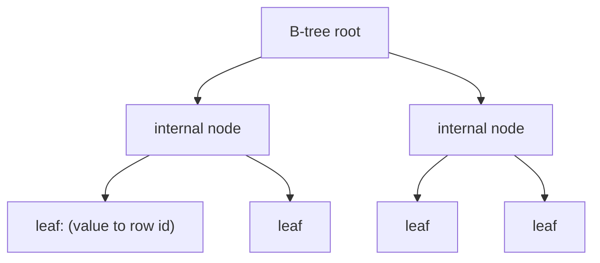

# Database Systems 101 (4/10): 인덱스

데이터베이스 성능 이야기를 시작하면 거의 항상 인덱스로 돌아옵니다. 실제로 많은 느린 쿼리는 “인덱스가 없어서” 혹은 “있지만 잘못 설계되어서” 생깁니다. 동시에, 인덱스를 무턱대고 늘리면 쓰기 성능이 망가지고 디스크 사용량이 불어나며, 옵티마이저 판단도 오히려 흐려질 수 있습니다.

그래서 인덱스를 배울 때 중요한 것은 “어디에 하나 더 붙일까?”보다 “어떤 쿼리에 정말 필요한가, 어디에는 일부러 만들지 말아야 하는가”를 먼저 보는 감각입니다. 이 글에서는 B-tree 인덱스의 직관, 선택성, 복합 인덱스의 선두 컬럼, 커버링 인덱스까지 한 번에 연결해 보겠습니다.


*Database Systems 101 4장 흐름 개요*

## 먼저 던지는 질문

- B-tree 인덱스는 어떤 직관으로 이해하면 좋을까요?
- 단일 인덱스, 복합 인덱스, 커버링 인덱스는 무엇이 다를까요?
- 어떤 경우에는 인덱스가 사실상 의미가 없어질까요?

## 이 글에서 배울 내용

- B-tree 인덱스의 직관과 한계
- 단일, 복합, 커버링 인덱스의 차이
- 선택성이 인덱스 효율을 좌우하는 이유
- 인덱스 비용과 대표적인 안티패턴

## 왜 중요한가

실무 성능 문제의 상당수는 “빠져 있는 인덱스” 아니면 “잘못된 인덱스”로 귀결됩니다. 반대로 인덱스가 너무 많아도 쓰기 비용과 저장 비용이 커지고, 쿼리 계획은 더 복잡해집니다. 인덱스의 직관이 잡히면 EXPLAIN을 읽을 때 “왜 이 인덱스를 안 탔지?”라는 질문이 훨씬 선명해집니다.

> 인덱스는 책 뒤의 색인과 정확히 같습니다. 특정 단어 하나를 찾는 일은 빨라지지만, 책 전체를 처음부터 끝까지 한 번 읽는 일은 오히려 더 느려질 수 있습니다.

## 핵심 개념 한눈에 보기



루트에서 시작해 내부 노드를 한 단계씩 좁혀 가면, 리프 노드에서 실제 행 위치를 얻습니다. 트리 깊이가 거의 일정하기 때문에 데이터가 매우 커져도 몇 번의 점프로 원하는 지점에 도달할 수 있습니다.

## 핵심 용어

- **B-tree 인덱스**: 가장 흔한 인덱스 형태입니다. 정렬된 키와 포인터를 균형 트리 구조로 유지합니다.
- **선택성(Selectivity)**: 특정 값이 전체 테이블 중 얼마나 적은 행을 가리키는지를 뜻합니다. 1/1000이면 좋고, 1/2면 거의 쓸모가 없습니다.
- **복합 인덱스(Composite Index)**: 여러 컬럼을 함께 묶은 인덱스입니다. 컬럼 순서가 매우 중요합니다.
- **커버링 인덱스(Covering Index)**: 쿼리에 필요한 컬럼이 모두 인덱스 안에 들어 있는 경우입니다.
- **Index-only scan**: 커버링 인덱스 덕분에 테이블 본체를 거의 읽지 않아도 되는 실행 경로입니다.

## 변경 전/변경 후

**Before — looking up 10k rows without an index**

```sql
SELECT * FROM orders WHERE user_id = 7;
-- 100ms (full scan)
```

**After — one well-placed index**

```sql
CREATE INDEX idx_orders_user_id ON orders(user_id);
SELECT * FROM orders WHERE user_id = 7;
-- under 1ms (index lookup)
```

선택성이 좋은 컬럼에 적절한 인덱스 하나만 있어도 100배 가까운 차이가 나는 경우는 드물지 않습니다.

## 실습: 인덱스가 해 주는 일과 못 해 주는 일 보기

### 1단계 — 데이터 준비

```python
# seed.py
import sqlite3, random

with sqlite3.connect("shop.db") as db:
    db.executescript("""
        DROP TABLE IF EXISTS orders;
        CREATE TABLE orders (
            id      INTEGER PRIMARY KEY,
            user_id INTEGER NOT NULL,
            status  TEXT    NOT NULL,
            price   INTEGER NOT NULL
        );
    """)
    rows = [
        (i, random.randint(1, 1000), random.choice(["paid", "pending"]), random.randint(1, 1000))
        for i in range(1, 100001)
    ]
    db.executemany("INSERT INTO orders VALUES (?, ?, ?, ?)", rows)
```

여기서 `user_id`는 1000개의 서로 다른 값을 가지므로 선택성이 높고, `status`는 두 값만 가지므로 선택성이 매우 낮습니다. 이 차이가 옵티마이저의 선택을 갈라놓습니다.

### 2단계 — 좋은 인덱스(선택성 높음)

```python
import sqlite3

with sqlite3.connect("shop.db") as db:
    db.execute("CREATE INDEX IF NOT EXISTS idx_user ON orders(user_id)")
    db.execute("ANALYZE")
    plan = db.execute("EXPLAIN QUERY PLAN SELECT * FROM orders WHERE user_id = 7").fetchall()
    print(plan)
```

옵티마이저는 대체로 `idx_user`를 기꺼이 선택합니다. 한 값이 전체의 극히 일부만 가리키기 때문입니다.

### 3단계 — 나쁜 인덱스(선택성 낮음)

```python
with sqlite3.connect("shop.db") as db:
    db.execute("CREATE INDEX IF NOT EXISTS idx_status ON orders(status)")
    db.execute("ANALYZE")
    plan = db.execute("EXPLAIN QUERY PLAN SELECT * FROM orders WHERE status = 'paid'").fetchall()
    print(plan)
```

이 경우 옵티마이저는 풀스캔을 선택할 가능성이 큽니다. 테이블 절반을 인덱스로 하나씩 따라가는 것보다, 처음부터 끝까지 한 번 읽는 편이 더 쌀 수 있기 때문입니다.

### 4단계 — 복합 인덱스와 컬럼 순서

```python
with sqlite3.connect("shop.db") as db:
    db.execute("CREATE INDEX IF NOT EXISTS idx_user_status ON orders(user_id, status)")
    db.execute("ANALYZE")

    p1 = db.execute("EXPLAIN QUERY PLAN SELECT * FROM orders WHERE user_id=7 AND status='paid'").fetchall()
    p2 = db.execute("EXPLAIN QUERY PLAN SELECT * FROM orders WHERE status='paid'").fetchall()
    print(p1)
    print(p2)
```

`(user_id, status)` 인덱스는 `user_id`로 시작하는 조건에는 강하지만, `status`만으로 시작하는 쿼리에는 거의 도움이 되지 않습니다. 복합 인덱스에서 선두 컬럼은 사실상 설계의 핵심입니다.

### 5단계 — 커버링 인덱스

```python
with sqlite3.connect("shop.db") as db:
    db.execute("CREATE INDEX IF NOT EXISTS idx_cover ON orders(user_id, price)")
    db.execute("ANALYZE")
    plan = db.execute("EXPLAIN QUERY PLAN SELECT user_id, price FROM orders WHERE user_id=7").fetchall()
    print(plan)
```

쿼리에 필요한 컬럼이 인덱스 안에 모두 들어 있으면 테이블 본체를 거의 보지 않아도 됩니다. 읽기 성능에서 매우 강력한 패턴이지만, 그만큼 인덱스 자체는 커집니다.

## 이 코드에서 먼저 봐야 할 점

- 인덱스는 **선택성이 높을 때** 진가를 발휘합니다.
- 복합 인덱스에서는 **선두 컬럼**이 거의 전부라고 해도 과장이 아닙니다.
- 커버링 인덱스는 빠른 읽기의 비밀 무기지만, 컬럼을 더 넣을수록 인덱스도 비대해집니다.
- 인덱스는 모든 INSERT와 UPDATE 때 함께 갱신되므로, 읽기 이점의 반대편에는 항상 쓰기 비용이 있습니다.

## 자주 하는 실수 5가지

1. **모든 컬럼에 인덱스를 건다.** 쓰기 비용과 디스크 사용량이 폭증하고 옵티마이저도 더 헷갈립니다.
2. **선택성이 낮은 컬럼에 단일 인덱스를 건다.** `is_active`, `status`, `gender` 같은 컬럼은 단독 인덱스로는 거의 힘을 못 씁니다.
3. **복합 인덱스 컬럼 순서를 실제 질의 패턴과 다르게 둔다.** 가장 자주 첫 조건으로 쓰이는 컬럼이 앞에 와야 합니다.
4. **인덱스를 만든 뒤 EXPLAIN을 확인하지 않는다.** 인덱스가 있다고 해서 자동으로 쓰이는 것은 아닙니다.
5. **`LIKE '%foo%'`가 일반 B-tree를 탈 것이라 기대한다.** 선행 와일드카드는 풀텍스트 인덱스 같은 별도 도구가 필요합니다.

## 실무에서는 이렇게 드러납니다

새 쿼리가 시스템에 들어오면 보통 절차는 같습니다. 먼저 EXPLAIN으로 계획을 읽고, 필요한 인덱스가 없으면 추가하며, 있는데도 안 타면 통계나 선택성, 컬럼 순서를 의심합니다. 좋은 팀은 인덱스를 추가할 때 “어떤 쿼리를 위해 만들었는가”를 한 줄로 남깁니다. 그래야 1년 뒤 안 쓰는 인덱스를 안전하게 정리할 수 있습니다.

쓰기 비중이 큰 서비스라면 인덱스를 줄이는 것도 중요한 최적화입니다. 반대로 읽기 중심 분석 시스템에서는 정답이 “인덱스를 더 추가”가 아니라 컬럼 저장, 물리화 뷰, 요약 테이블인 경우가 많습니다. 즉 인덱스는 강력하지만, 모든 성능 문제의 만능 열쇠는 아닙니다.

## 시니어 엔지니어는 이렇게 생각합니다

- 인덱스를 추가하기 전에 “이 컬럼의 선택성은 충분한가?”를 먼저 묻습니다.
- 질의 패턴이 인덱스를 이끌고, 기존 인덱스 구조가 다시 질의 설계를 제약한다는 양방향 관계를 이해합니다.
- 인덱스가 선택되지 않으면 통계, 컬럼 순서, WHERE 함수 호출을 체크리스트처럼 확인합니다.
- 새 인덱스에는 반드시 그 인덱스를 정당화하는 쿼리 이름을 남깁니다.
- 사용되지 않는 인덱스는 주기적으로 제거합니다.

## 체크리스트

- [ ] 자주 쓰는 WHERE/JOIN 컬럼에 인덱스가 있는가?
- [ ] 단일 인덱스 대상 컬럼의 선택성이 충분한가?
- [ ] 복합 인덱스의 선두 컬럼이 실제 질의 패턴과 맞는가?
- [ ] EXPLAIN으로 인덱스 사용 여부를 직접 확인했는가?
- [ ] 워크로드가 추가 쓰기 비용을 감당할 수 있는가?

## 연습 문제

1. `is_paid`(true/false) 컬럼에 단일 인덱스를 만들었을 때 옵티마이저가 이를 자주 무시하는 이유를 한 문장으로 설명해 보세요.
2. `(country, city, age)` 복합 인덱스가 있을 때 다음 쿼리에 도움이 되는지 판단해 보세요. (a) `WHERE country='KR'`, (b) `WHERE city='Seoul'`, (c) `WHERE country='KR' AND city='Seoul'`.
3. 인덱스가 너무 많을 때 생기는 부작용 세 가지를 적어 보세요.

## 정리 및 다음 단계

인덱스는 정렬된 “값 → 행” 구조를 통해 몇 번의 트리 점프로 원하는 데이터를 찾게 해 주는 도구입니다. 가장 큰 차이는 선택성과 선두 컬럼에서 나오며, 좋은 인덱스 설계는 “어디에 만들까”보다 “어디에는 만들지 않을까”의 판단에 가깝습니다. 다음 글에서는 여러 쓰기 작업을 안전하게 묶는 핵심 메커니즘, 트랜잭션과 ACID를 다룹니다.

## 비트리 인덱스 구조를 그림으로 이해하기

인덱스의 핵심은 "정렬된 경로를 짧게 타기"입니다. 아래는 단순화한 비트리 구조 예시입니다.

```text
[루트 페이지]
  keys: 100 | 500
   /          |          [리프A]    [리프B]     [리프C]
1..99       100..499     500..
```

`WHERE customer_id = 377` 조건은 루트에서 100과 500 사이 분기를 고른 뒤, 해당 리프 범위에서 짧게 찾습니다. 반면 인덱스가 없으면 전체 행을 순차 스캔해야 합니다.

## 복합 인덱스 선두 컬럼 규칙을 실측으로 확인하기

```sql
CREATE INDEX idx_orders_tenant_status_created
ON orders (tenant_id, status, created_at);
```

- `WHERE tenant_id = 10`은 인덱스 범위 탐색이 가능합니다.
- `WHERE tenant_id = 10 AND status = 'PAID'`는 더 좁은 범위를 타므로 효율적입니다.
- `WHERE status = 'PAID'`만 있는 경우 선두 컬럼이 없어 인덱스 효율이 급락할 수 있습니다.

```text
EXPLAIN ANALYZE
SELECT * FROM orders
WHERE tenant_id = 10 AND status = 'PAID'
ORDER BY created_at DESC
LIMIT 50;

Index Scan using idx_orders_tenant_status_created on orders
(actual time=0.061..0.733 rows=50 loops=1)
```

인덱스는 "많을수록 좋다"가 아니라 "대표 쿼리의 필터와 정렬 순서를 따라 설계한다"가 정답입니다.

## 실전 운영 점검표

운영 환경에서 데이터베이스 품질을 안정적으로 유지하려면, 기능 개발과 별개로 점검 루틴을 명확하게 가져가야 합니다. 아래 항목은 서비스 규모와 상관없이 바로 적용할 수 있는 기준입니다.

- 변경 전에는 항상 기준 지표를 남깁니다. 평균 지연 시간, P95, P99, 초당 트랜잭션 수, 잠금 대기 시간 같은 숫자를 캡처해 둬야 변경 이후를 비교할 수 있습니다.
- 쿼리 튜닝은 SQL 문장 자체보다 실행 계획의 변화를 중심으로 추적합니다. 계획 노드가 바뀌었는지, 예상 행 수와 실제 행 수의 차이가 커졌는지, 정렬이나 해시가 디스크로 내려갔는지를 우선 확인합니다.
- 스키마 변경은 단계적으로 진행합니다. 컬럼 추가, 백필, 코드 전환, 제약 강화 순서로 나누면 장애 반경을 줄일 수 있습니다.
- 장애 대응 문서는 운영자가 밤중에도 바로 실행할 수 있는 형태여야 합니다. 복구 절차, 롤백 절차, 검증 SQL을 같은 문서에 둬야 실제 상황에서 흔들리지 않습니다.

아래 예시는 팀이 릴리스 전후에 반복적으로 실행하는 최소 점검 SQL입니다.

```sql
-- 최근 10분 동안 느린 쿼리 확인(엔진별 뷰 이름은 다를 수 있음)
SELECT query, calls, mean_exec_time, rows
FROM pg_stat_statements
ORDER BY mean_exec_time DESC
LIMIT 20;

-- 잠금 대기 체인 확인
SELECT now(), pid, wait_event_type, wait_event, state, query
FROM pg_stat_activity
WHERE wait_event_type IS NOT NULL;

-- 인덱스 사용률 점검
SELECT relname AS table_name, seq_scan, idx_scan
FROM pg_stat_user_tables
ORDER BY seq_scan DESC
LIMIT 20;
```

이 점검 루틴을 자동화 파이프라인에 연결하면, 성능 저하를 "느낌"이 아니라 "증거"로 관리할 수 있습니다. 결국 장기 운영에서 중요한 것은 뛰어난 한 번의 튜닝이 아니라, 작은 검증을 꾸준히 반복해 위험을 조기에 감지하는 습관입니다.
## 운영 리허설 시나리오

문서만 읽고 끝내면 운영에서 다시 같은 실수를 반복하기 쉽습니다. 아래 시나리오는 팀 온보딩과 장애 대응 훈련에 바로 사용할 수 있는 공통 리허설 절차입니다.

### 시나리오 1: 느려진 조회 원인 찾기

1. 문제 쿼리를 식별합니다. 애플리케이션 로그의 요청 식별자와 데이터베이스 쿼리 로그를 매칭합니다.
2. 같은 파라미터로 `EXPLAIN ANALYZE`를 실행합니다.
3. 계획 노드 중 시간이 큰 지점을 찾고, 해당 노드가 인덱스/통계/정렬 중 무엇과 관련 있는지 분류합니다.
4. 개선안을 한 번에 하나만 적용합니다. 인덱스 추가, 통계 갱신, 질의문 재작성 가운데 하나만 바꿔 결과를 비교합니다.

```text
개선 전
Seq Scan on events  (actual time=0.030..842.112 rows=12000)

개선 후
Index Scan using idx_events_tenant_created on events
(actual time=0.041..21.553 rows=12000)
```

### 시나리오 2: 동시성 문제 재현과 완화

1. 두 세션에서 같은 행을 거의 동시에 수정합니다.
2. 격리 수준을 바꿔 가며 결과를 비교합니다.
3. 필요하면 `FOR UPDATE` 잠금 조회 또는 낙관적 잠금 버전 컬럼을 적용합니다.
4. 재시도 정책과 타임아웃 기준을 코드와 운영 문서에 같이 기록합니다.

```sql
-- 낙관적 잠금 예시
UPDATE inventory
SET qty = qty - 1, version = version + 1
WHERE sku = 'A-100' AND version = 17;
```

영향 받은 행 수가 0이면 이미 다른 트랜잭션이 갱신한 것이므로, 재조회 후 재시도합니다. 이 패턴은 잠금 경합을 낮추면서도 정합성을 지키는 데 효과적입니다.

### 시나리오 3: 복구 가능성 검증

1. 최신 베이스 백업으로 테스트 인스턴스를 띄웁니다.
2. 지정 시점까지 로그를 재적용합니다.
3. 핵심 비즈니스 검증 SQL을 실행합니다.
4. 복구 시간(RTO)과 데이터 유실 허용치(RPO)를 실제 숫자로 기록합니다.

```sql
-- 검증 SQL 예시
SELECT COUNT(*) FROM orders WHERE created_at >= now() - interval '1 day';
SELECT SUM(amount) FROM payments WHERE status = 'SUCCESS';
SELECT COUNT(*) FROM users WHERE deleted_at IS NULL;
```

복구 리허설에서 가장 중요한 점은 성공 여부 자체보다, 누가 어떤 순서로 무엇을 확인했는지를 재현 가능하게 남기는 것입니다. 절차가 사람마다 다르면 실제 장애에서 속도와 품질이 동시에 무너집니다.

## 체크리스트: 배포 전 최소 검증

- 대표 조회 5개에 대해 실행 계획을 저장합니다.
- 트랜잭션 경계가 긴 코드 경로를 식별합니다.
- 잠금 대기 알람 임계치를 설정합니다.
- 스키마 변경의 롤백 경로를 문서화합니다.
- 백업 복구 리허설 최근 실행일을 확인합니다.

이 체크리스트는 거창한 체계를 요구하지 않습니다. 작은 팀도 주 1회 반복하면 데이터 사고 빈도를 눈에 띄게 줄일 수 있습니다. 데이터베이스 운영의 본질은 "고급 기능을 많이 아는 것"이 아니라, "반복 가능한 검증 루프를 끊기지 않게 유지하는 것"입니다.

## 처음 질문으로 돌아가기

- **B-tree 인덱스는 어떤 직관으로 이해하면 좋을까요?**
  - B-tree 인덱스는 책 뒤의 색인처럼 정렬된 경로를 짧게 타고 내려가는 구조로 이해하면 됩니다. 글의 그림과 `customer_id = 377` 예시처럼 루트와 내부 노드를 거쳐 리프 범위만 확인하므로, 전체 테이블을 처음부터 끝까지 읽지 않아도 됩니다.
- **단일 인덱스, 복합 인덱스, 커버링 인덱스는 무엇이 다를까요?**
  - 단일 인덱스는 `idx_user ON orders(user_id)`처럼 한 컬럼 조건을 빠르게 좁히는 데 쓰입니다. 복합 인덱스는 `(user_id, status)`처럼 선두 컬럼 순서가 핵심이고, 커버링 인덱스는 `(user_id, price)`처럼 조회에 필요한 컬럼을 인덱스 안에 모두 넣어 테이블 본체 접근을 거의 없애는 방식입니다.
- **어떤 경우에는 인덱스가 사실상 의미가 없어질까요?**
  - `status`처럼 값 종류가 두 개뿐인 낮은 선택성 컬럼은 인덱스를 만들어도 풀스캔이 더 싸다고 판단되기 쉽습니다. 또 복합 인덱스에서 선두 컬럼 없이 `status`만 찾거나 `LIKE '%foo%'`, `lower(email)` 같은 패턴을 쓰면 일반 B-tree 효율이 급격히 떨어집니다.

<!-- toc:begin -->
## 시리즈 목차

- [Database Systems 101 (1/10): 데이터베이스 시스템이란 무엇인가?](./01-what-is-a-database.md)
- [Database Systems 101 (2/10): 관계형 모델](./02-relational-model.md)
- [Database Systems 101 (3/10): SQL과 쿼리 처리](./03-sql-and-query-processing.md)
- **인덱스 (현재 글)**
- 트랜잭션과 ACID (예정)
- 격리 수준 (예정)
- 정규화와 모델링 (예정)
- 쿼리 최적화 (예정)
- 복제와 백업 (예정)
- OLTP와 OLAP (예정)

<!-- toc:end -->

## 참고 자료

- [database-systems-101 예제 코드 (book-examples)](https://github.com/yeongseon-books/book-examples/tree/main/database-systems-101/ko)
- [Use The Index, Luke!](https://use-the-index-luke.com/)
- [PostgreSQL — Indexes](https://www.postgresql.org/docs/current/indexes.html)
- [SQLite — Query Planning](https://www.sqlite.org/queryplanner.html)
- [MySQL — How MySQL Uses Indexes](https://dev.mysql.com/doc/refman/8.0/en/mysql-indexes.html)

Tags: Computer Science, Database, Index, BTree, 선택성, 성능
