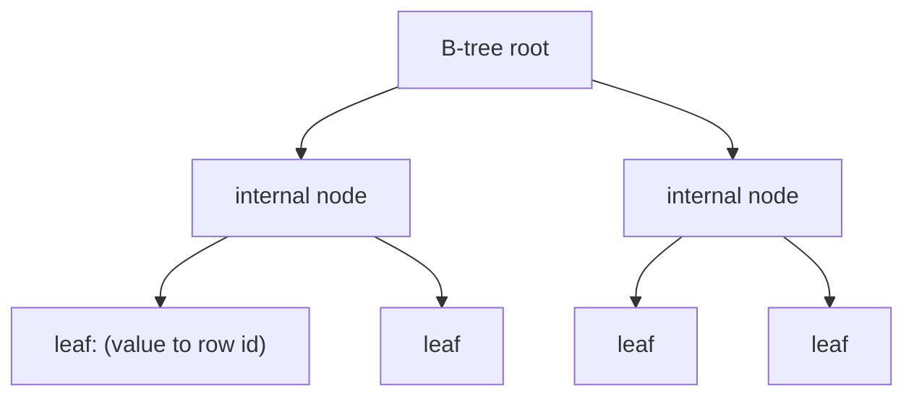

# Database Systems 101 (4/10): 인덱스

데이터베이스 성능 이야기를 시작하면 거의 항상 인덱스로 돌아옵니다. 실제로 많은 느린 쿼리는 "인덱스가 없어서" 혹은 "있지만 잘못 설계되어서" 생깁니다. 동시에, 인덱스를 무턱대고 늘리면 쓰기 성능이 망가지고 디스크 사용량이 불어나며, 옵티마이저 판단도 오히려 흐려질 수 있습니다.

이 글은 Database Systems 101 시리즈의 4번째 글입니다.

그래서 인덱스를 배울 때 중요한 것은 "어디에 하나 더 붙일까?"보다 "어떤 쿼리에 정말 필요한가, 어디에는 일부러 만들지 말아야 하는가"를 먼저 보는 감각입니다. 이 글에서는 B-tree 인덱스의 직관, 선택성, 복합 인덱스의 선두 컬럼, 커버링 인덱스까지 한 번에 연결해 보겠습니다.


*Database Systems 101 4장 흐름 개요*

## 이 글에서 다룰 문제

- B-tree 인덱스는 어떤 직관으로 이해하면 좋을까요?
- 단일 인덱스, 복합 인덱스, 커버링 인덱스는 무엇이 다를까요?
- 어떤 경우에는 인덱스가 사실상 의미가 없어질까요?
- 이 개념을 실무에서 잘못 적용하면 어떤 문제가 생길까요?
- 이 주제에서 초보자가 가장 자주 놓치는 포인트는 무엇일까요?

## 이 글에서 배울 내용

- B-tree 인덱스의 직관과 한계
- 단일, 복합, 커버링 인덱스의 차이
- 선택성이 인덱스 효율을 좌우하는 이유
- 인덱스 비용과 대표적인 안티패턴

실무 성능 문제의 상당수는 "빠져 있는 인덱스" 아니면 "잘못된 인덱스"로 귀결됩니다. 반대로 인덱스가 너무 많아도 쓰기 비용과 저장 비용이 커지고, 쿼리 계획은 더 복잡해집니다. 인덱스의 직관이 잡히면 EXPLAIN을 읽을 때 "왜 이 인덱스를 안 탔지?"라는 질문이 훨씬 선명해집니다.

> 인덱스는 책 뒤의 색인과 정확히 같습니다. 특정 단어 하나를 찾는 일은 빨라지지만, 책 전체를 처음부터 끝까지 한 번 읽는 일은 오히려 더 느려질 수 있습니다.


```mermaid
flowchart TB
    A["B-tree root"] --> B["internal node"]
    A --> C["internal node"]
    B --> D["leaf: (value to row id)"]
    B --> E["leaf"]
    C --> F["leaf"]
    C --> G["leaf"]
```

루트에서 시작해 내부 노드를 한 단계씩 좁혀 가면, 리프 노드에서 실제 행 위치를 얻습니다. 트리 깊이가 거의 일정하기 때문에 데이터가 매우 커져도 몇 번의 점프로 원하는 지점에 도달할 수 있습니다.

- **B-tree 인덱스**: 가장 흔한 인덱스 형태입니다. 정렬된 키와 포인터를 균형 트리 구조로 유지합니다.
- **선택성(Selectivity)**: 특정 값이 전체 테이블 중 얼마나 적은 행을 가리키는지를 뜻합니다. 1/1000이면 좋고, 1/2면 거의 쓸모가 없습니다.
- **복합 인덱스(Composite Index)**: 여러 컬럼을 함께 묶은 인덱스입니다. 컬럼 순서가 매우 중요합니다.
- **커버링 인덱스(Covering Index)**: 쿼리에 필요한 컬럼이 모두 인덱스 안에 들어 있는 경우입니다.
- **Index-only scan**: 커버링 인덱스 덕분에 테이블 본체를 거의 읽지 않아도 되는 실행 경로입니다.

## 인덱스 전후 성능 비교

**Before — looking up rows without an index**

```sql
SELECT * FROM orders WHERE user_id = 7;
-- 100ms (full table scan: 100,000 rows)
```

**After — one well-placed index**

```sql
CREATE INDEX idx_orders_user_id ON orders(user_id);
SELECT * FROM orders WHERE user_id = 7;
-- under 1ms (index lookup: log N jumps)
```

선택성이 좋은 컬럼에 적절한 인덱스 하나만 있어도 100배 가까운 차이가 나는 경우는 드물지 않습니다.

## 실습: 인덱스가 해 주는 일과 못 해 주는 일 보기

### 1단계 — 데이터 준비

```python
# seed.py
import sqlite3, random

with sqlite3.connect("shop.db") as db:
    db.executescript("""
        DROP TABLE IF EXISTS orders;
        CREATE TABLE orders (
            id      INTEGER PRIMARY KEY,
            user_id INTEGER NOT NULL,
            status  TEXT    NOT NULL,
            price   INTEGER NOT NULL
        );
    """)
    rows = [
        (i, random.randint(1, 1000), random.choice(["paid", "pending"]), random.randint(1, 1000))
        for i in range(1, 100001)
    ]
    db.executemany("INSERT INTO orders VALUES (?, ?, ?, ?)", rows)
```

여기서 `user_id`는 1000개의 서로 다른 값을 가지므로 선택성이 높고, `status`는 두 값만 가지므로 선택성이 매우 낮습니다. 이 차이가 옵티마이저의 선택을 갈라놓습니다.

### 2단계 — 좋은 인덱스(선택성 높음)

```python
import sqlite3

with sqlite3.connect("shop.db") as db:
    db.execute("CREATE INDEX IF NOT EXISTS idx_user ON orders(user_id)")
    db.execute("ANALYZE")
    plan = db.execute("EXPLAIN QUERY PLAN SELECT * FROM orders WHERE user_id = 7").fetchall()
    print(plan)
```

옵티마이저는 대체로 `idx_user`를 기꺼이 선택합니다. 한 값이 전체의 극히 일부만 가리키기 때문입니다.

### 3단계 — 나쁜 인덱스(선택성 낮음)

```python
with sqlite3.connect("shop.db") as db:
    db.execute("CREATE INDEX IF NOT EXISTS idx_status ON orders(status)")
    db.execute("ANALYZE")
    plan = db.execute("EXPLAIN QUERY PLAN SELECT * FROM orders WHERE status = 'paid'").fetchall()
    print(plan)
```

이 경우 옵티마이저는 풀스캔을 선택할 가능성이 큽니다. 테이블 절반을 인덱스로 하나씩 따라가는 것보다, 처음부터 끝까지 한 번 읽는 편이 더 쌀 수 있기 때문입니다.

### 4단계 — 복합 인덱스와 컬럼 순서

```python
with sqlite3.connect("shop.db") as db:
    db.execute("CREATE INDEX IF NOT EXISTS idx_user_status ON orders(user_id, status)")
    db.execute("ANALYZE")

    p1 = db.execute("EXPLAIN QUERY PLAN SELECT * FROM orders WHERE user_id=7 AND status='paid'").fetchall()
    p2 = db.execute("EXPLAIN QUERY PLAN SELECT * FROM orders WHERE status='paid'").fetchall()
    print("user_id + status:", p1)
    print("status only:", p2)
```

`(user_id, status)` 인덱스는 `user_id`로 시작하는 조건에는 강하지만, `status`만으로 시작하는 쿼리에는 거의 도움이 되지 않습니다. 복합 인덱스에서 선두 컬럼은 사실상 설계의 핵심입니다.

### 5단계 — 커버링 인덱스

```python
with sqlite3.connect("shop.db") as db:
    db.execute("CREATE INDEX IF NOT EXISTS idx_cover ON orders(user_id, price)")
    db.execute("ANALYZE")
    plan = db.execute("EXPLAIN QUERY PLAN SELECT user_id, price FROM orders WHERE user_id=7").fetchall()
    print(plan)
```

쿼리에 필요한 컬럼이 인덱스 안에 모두 들어 있으면 테이블 본체를 거의 보지 않아도 됩니다. 읽기 성능에서 매우 강력한 패턴이지만, 그만큼 인덱스 자체는 커집니다.

## 인덱스 전략별 SQL 예시

### 단일 컬럼 인덱스

```sql
-- 자주 조회하는 외래키
CREATE INDEX idx_orders_user_id ON orders(user_id);

-- 정렬과 범위 조회에 활용
CREATE INDEX idx_orders_created_at ON orders(created_at);

-- 이메일 로그인 조회
CREATE UNIQUE INDEX idx_users_email ON users(email);
```

### 복합 인덱스 — 선두 컬럼 규칙

```sql
-- tenant_id → status → created_at 순서로 설계
CREATE INDEX idx_orders_tenant_status_created
ON orders (tenant_id, status, created_at);

-- 이 인덱스가 활용되는 쿼리 패턴
SELECT * FROM orders
WHERE tenant_id = 10                        -- 선두 컬럼 O
  AND status = 'PAID'                       -- 두 번째 컬럼 O
ORDER BY created_at DESC LIMIT 50;          -- 세 번째 컬럼 O (정렬 이용)

-- 이 쿼리는 인덱스 효율 저하
SELECT * FROM orders WHERE status = 'PAID'; -- 선두 컬럼 누락
```

```text
EXPLAIN ANALYZE
SELECT * FROM orders
WHERE tenant_id = 10 AND status = 'PAID'
ORDER BY created_at DESC LIMIT 50;

Index Scan using idx_orders_tenant_status_created on orders
(actual time=0.061..0.733 rows=50 loops=1)
```

### 커버링 인덱스

```sql
-- 목록 조회 API: id, user_id, status, created_at만 반환하는 경우
CREATE INDEX idx_orders_list
ON orders (user_id, created_at DESC)
INCLUDE (status, total);  -- PostgreSQL 11+

-- 이 쿼리는 테이블 본체를 거의 읽지 않아도 됨
SELECT id, status, total, created_at
FROM orders
WHERE user_id = 42
ORDER BY created_at DESC
LIMIT 20;
```

### 부분 인덱스(Partial Index)

```sql
-- 미처리 주문만 인덱싱: 전체 대비 소수만 해당
CREATE INDEX idx_orders_pending
ON orders (created_at)
WHERE status = 'PENDING';

-- 삭제되지 않은 사용자만 인덱싱
CREATE INDEX idx_users_active_email
ON users (email)
WHERE deleted_at IS NULL;
```

부분 인덱스는 조건에 맞는 행만 포함하므로 크기가 작고 갱신 비용도 낮습니다.

### 함수 기반 인덱스

```sql
-- 대소문자 무관 이메일 검색
CREATE INDEX idx_users_email_lower ON users (lower(email));

-- 이제 이 쿼리가 인덱스를 탐
SELECT * FROM users WHERE lower(email) = 'alice@example.com';

-- 날짜 부분 추출 인덱스
CREATE INDEX idx_orders_year_month ON orders (date_trunc('month', created_at));
```

## 인덱스 사용률 모니터링

```sql
-- PostgreSQL: 테이블별 인덱스 사용 현황
SELECT
    schemaname,
    tablename,
    indexname,
    idx_scan,
    idx_tup_read,
    idx_tup_fetch
FROM pg_stat_user_indexes
ORDER BY idx_scan ASC
LIMIT 20;

-- 사용되지 않는 인덱스 찾기 (idx_scan = 0)
SELECT indexname, tablename
FROM pg_stat_user_indexes
WHERE idx_scan = 0
  AND indexrelname NOT LIKE 'pg_%';

-- 중복 가능성이 있는 인덱스 확인
SELECT indrelid::regclass AS table_name,
       array_agg(indexrelid::regclass) AS indexes
FROM pg_index
GROUP BY indrelid, indkey
HAVING count(*) > 1;
```

## 자주 하는 실수

| 실수 | 증상 | 올바른 접근 |
|------|------|-------------|
| 모든 컬럼에 인덱스를 건다 | INSERT/UPDATE 속도 급락, 디스크 낭비 | 실제 쿼리 패턴 기반으로 최소한의 인덱스만 |
| 선택성 낮은 컬럼에 단일 인덱스 | 옵티마이저가 인덱스 무시, 효과 없음 | 복합 인덱스의 두 번째 컬럼으로 활용 |
| 복합 인덱스 순서가 쿼리 패턴과 불일치 | 선두 컬럼 없이 사용 불가 | 가장 자주 필터링하는 컬럼을 앞에 배치 |
| 인덱스 추가 후 EXPLAIN 미확인 | 인덱스가 있어도 옵티마이저가 무시 | 인덱스 추가 + ANALYZE + EXPLAIN 순서 준수 |
| `LIKE '%foo%'` 패턴에 B-tree 기대 | 풀스캔 발생 | 전문 검색 인덱스(GIN, 풀텍스트) 사용 |

## 핵심 요약

- 인덱스는 **선택성이 높을 때** 진가를 발휘합니다.
- 복합 인덱스에서는 **선두 컬럼**이 거의 전부라고 해도 과장이 아닙니다.
- 커버링 인덱스는 빠른 읽기의 비밀 무기지만, 컬럼을 더 넣을수록 인덱스도 비대해집니다.
- 인덱스는 모든 INSERT와 UPDATE 때 함께 갱신되므로, 읽기 이점의 반대편에는 항상 쓰기 비용이 있습니다.
- 사용되지 않는 인덱스는 주기적으로 제거합니다.

## 시니어 엔지니어는 이렇게 생각합니다

- 인덱스를 추가하기 전에 "이 컬럼의 선택성은 충분한가?"를 먼저 묻습니다.
- 질의 패턴이 인덱스를 이끌고, 기존 인덱스 구조가 다시 질의 설계를 제약한다는 양방향 관계를 이해합니다.
- 인덱스가 선택되지 않으면 통계, 컬럼 순서, WHERE 함수 호출을 체크리스트처럼 확인합니다.
- 새 인덱스에는 반드시 그 인덱스를 정당화하는 쿼리 이름을 남깁니다.
- 사용되지 않는 인덱스는 주기적으로 제거합니다.

## 운영 체크리스트

- [ ] 자주 쓰는 WHERE/JOIN 컬럼에 인덱스가 있는가?
- [ ] 단일 인덱스 대상 컬럼의 선택성이 충분한가?
- [ ] 복합 인덱스의 선두 컬럼이 실제 질의 패턴과 맞는가?
- [ ] EXPLAIN으로 인덱스 사용 여부를 직접 확인했는가?
- [ ] 워크로드가 추가 쓰기 비용을 감당할 수 있는가?

## 연습 문제

1. `is_paid`(true/false) 컬럼에 단일 인덱스를 만들었을 때 옵티마이저가 이를 자주 무시하는 이유를 한 문장으로 설명해 보세요.
2. `(country, city, age)` 복합 인덱스가 있을 때 다음 쿼리에 도움이 되는지 판단해 보세요. (a) `WHERE country='KR'`, (b) `WHERE city='Seoul'`, (c) `WHERE country='KR' AND city='Seoul'`.
3. 인덱스가 너무 많을 때 생기는 부작용 세 가지를 적어 보세요.

## 정리 및 다음 단계

인덱스는 정렬된 "값 → 행" 구조를 통해 몇 번의 트리 점프로 원하는 데이터를 찾게 해 주는 도구입니다. 가장 큰 차이는 선택성과 선두 컬럼에서 나오며, 좋은 인덱스 설계는 "어디에 만들까"보다 "어디에는 만들지 않을까"의 판단에 가깝습니다. 다음 글에서는 여러 쓰기 작업을 안전하게 묶는 핵심 메커니즘, 트랜잭션과 ACID를 다룹니다.

<!-- toc:begin -->
## 시리즈 목차

- [Database Systems 101 (1/10): 데이터베이스 시스템이란 무엇인가?](./01-what-is-a-database.md)
- [Database Systems 101 (2/10): 관계형 모델](./02-relational-model.md)
- [Database Systems 101 (3/10): SQL과 쿼리 처리](./03-sql-and-query-processing.md)
- **Database Systems 101 (4/10): 인덱스 (현재 글)**
- [Database Systems 101 (5/10): 트랜잭션과 ACID](./05-transactions-and-acid.md)
- [Database Systems 101 (6/10): 격리 수준](./06-isolation-levels.md)
- [Database Systems 101 (7/10): 정규화와 모델링](./07-normalization-and-modeling.md)
- [Database Systems 101 (8/10): 쿼리 최적화](./08-query-optimization.md)
- [Database Systems 101 (9/10): 복제와 백업](./09-replication-and-backup.md)
- [Database Systems 101 (10/10): OLTP와 OLAP](./10-oltp-and-olap.md)

<!-- toc:end -->

## 참고 자료

- [database-systems-101 예제 코드 (book-examples)](https://github.com/yeongseon-books/book-examples/tree/main/database-systems-101/ko)
- [Use The Index, Luke!](https://use-the-index-luke.com/)
- [PostgreSQL — Indexes](https://www.postgresql.org/docs/current/indexes.html)
- [SQLite — Query Planning](https://www.sqlite.org/queryplanner.html)
- [MySQL — How MySQL Uses Indexes](https://dev.mysql.com/doc/refman/8.0/en/mysql-indexes.html)

Tags: Computer Science, Database, Index, BTree, 선택성, 성능
