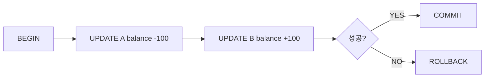

# 트랜잭션과 ACID

> Database Systems 101 시리즈 (5/10)

<!-- a-grade-intro:begin -->

**핵심 질문**: 송금 도중에 정전이 나도 "100원을 두 번 빼는" 일이 생기지 않는 이유는 무엇일까요?

> 트랜잭션은 여러 SQL 문을 하나의 단위로 묶어 "전부 성공하거나, 전부 없던 일로" 만드는 약속입니다. 이 약속을 데이터베이스가 지켜 주는 방식이 ACID입니다. 한 번 익혀 두면 동시성, 복구, 장애 시나리오를 같은 언어로 이야기할 수 있습니다.

<!-- a-grade-intro:end -->

## 이 글에서 배울 것

- 트랜잭션이 무엇이고 왜 필요한가
- ACID 네 글자가 실제로 보장하는 것
- BEGIN/COMMIT/ROLLBACK의 사용법
- WAL(Write-Ahead Log)의 직관

## 왜 중요한가

송금, 재고 차감, 주문 생성 같은 거의 모든 비즈니스 로직은 두 개 이상의 변경을 묶어야 합니다. 중간에서 멈추면 데이터가 어그러집니다. 트랜잭션이 없으면 이런 케이스를 애플리케이션이 직접 보정해야 하고, 사실상 불가능합니다.

> "전부 또는 전무." 이 한 마디가 트랜잭션의 본질입니다.

## 개념 한눈에 보기



`BEGIN`으로 시작해 여러 변경을 모은 뒤, 끝에서 한 번에 `COMMIT`하거나 `ROLLBACK`합니다. 외부에서 보기에는 모든 변경이 동시에 일어난 것처럼 보입니다.

## 핵심 용어 정리

- **Transaction**: 여러 SQL을 하나로 묶은 작업 단위.
- **Atomicity(원자성)**: 전부 적용되거나 전부 취소된다.
- **Consistency(일관성)**: 트랜잭션 전후의 무결성 제약이 깨지지 않는다.
- **Isolation(격리성)**: 동시에 실행돼도 서로 간섭하지 않는 것처럼 보인다 (다음 글에서 자세히).
- **Durability(영속성)**: COMMIT한 변경은 정전이 나도 살아남는다.
- **WAL**: 데이터를 바꾸기 전에 변경 의도를 먼저 로그에 기록한다. 복구의 토대.

## Before/After

**Before — 트랜잭션 없이 송금**

```sql
UPDATE accounts SET balance = balance - 100 WHERE id = 1;
-- (여기서 정전)
UPDATE accounts SET balance = balance + 100 WHERE id = 2;
-- 100이 사라짐
```

**After — 트랜잭션으로 송금**

```sql
BEGIN;
UPDATE accounts SET balance = balance - 100 WHERE id = 1;
UPDATE accounts SET balance = balance + 100 WHERE id = 2;
COMMIT;
-- 정전이 나면 BEGIN 직후로 되돌아감. 100이 사라지지 않음.
```

원자성 한 줄이 시스템 신뢰를 결정합니다.

## 실습: 트랜잭션 직접 다뤄 보기

### 1단계 — 계좌 테이블 준비

```python
# setup.py
import sqlite3

with sqlite3.connect("bank.db") as db:
    db.executescript("""
        DROP TABLE IF EXISTS accounts;
        CREATE TABLE accounts (
            id      INTEGER PRIMARY KEY,
            owner   TEXT NOT NULL,
            balance INTEGER NOT NULL CHECK (balance >= 0)
        );
        INSERT INTO accounts VALUES (1, 'Alice', 1000), (2, 'Bob', 1000);
    """)
```

`balance >= 0`이라는 무결성 제약을 걸어 둡니다. 일관성(C)을 깨는 시도가 차단되는지 곧 보겠습니다.

### 2단계 — 정상적인 송금

```python
import sqlite3

def transfer(src: int, dst: int, amount: int) -> None:
    with sqlite3.connect("bank.db") as db:
        try:
            db.execute("BEGIN")
            db.execute("UPDATE accounts SET balance = balance - ? WHERE id = ?", (amount, src))
            db.execute("UPDATE accounts SET balance = balance + ? WHERE id = ?", (amount, dst))
            db.execute("COMMIT")
        except Exception:
            db.execute("ROLLBACK")
            raise

transfer(1, 2, 100)
```

`BEGIN`/`COMMIT` 사이에 두 UPDATE를 묶으면 둘 다 적용되거나 둘 다 안 됩니다.

### 3단계 — 일관성 위반 → 자동 롤백

```python
try:
    transfer(1, 2, 99999)  # Alice의 잔액보다 큰 금액
except sqlite3.IntegrityError as e:
    print("rolled back:", e)

with sqlite3.connect("bank.db") as db:
    print(db.execute("SELECT * FROM accounts").fetchall())
```

CHECK 제약을 위반하는 순간 트랜잭션은 깨지고 ROLLBACK됩니다. 잔액은 변하지 않습니다.

### 4단계 — 명시적 ROLLBACK

```python
with sqlite3.connect("bank.db") as db:
    db.execute("BEGIN")
    db.execute("UPDATE accounts SET balance = balance - 50 WHERE id = 1")
    # 사용자 취소를 시뮬레이션
    db.execute("ROLLBACK")
    print(db.execute("SELECT balance FROM accounts WHERE id = 1").fetchone())
```

ROLLBACK은 단순히 "지금까지의 변경을 잊는다"입니다. 디스크에는 변경이 반영되지 않은 상태로 남습니다.

### 5단계 — Durability를 의식해 보기

```python
import sqlite3

with sqlite3.connect("bank.db") as db:
    db.execute("PRAGMA journal_mode=WAL")
    db.execute("BEGIN")
    db.execute("UPDATE accounts SET balance = balance + 1 WHERE id = 1")
    db.execute("COMMIT")
```

WAL 모드는 변경을 데이터 파일에 직접 쓰기 전에 로그에 먼저 기록합니다. COMMIT 시점에는 로그가 디스크에 안전하게 기록되었다는 보장만 있어도 영속성이 성립합니다.

## 이 코드에서 주목할 점

- 트랜잭션은 **명시적**입니다. 자동 커밋 모드는 편하지만 한 줄 단위로 동작합니다.
- 예외가 나면 반드시 ROLLBACK해야 합니다. 안 그러면 다음 호출이 어색한 상태에서 시작합니다.
- CHECK·FOREIGN KEY 같은 제약은 일관성(C)의 실질적 도구입니다.
- WAL은 영속성(D)의 핵심 메커니즘입니다.

## 자주 하는 실수 5가지

1. **트랜잭션을 너무 길게 연다.** 사용자 입력이나 외부 API 호출을 트랜잭션 안에 넣으면 잠금이 길어져 다른 사용자가 멈춥니다.
2. **예외 처리에서 ROLLBACK을 빼먹는다.** "암묵적으로 되겠지" 라고 가정하지 말고 명시합니다.
3. **자동 커밋 모드를 끄지 않고 묶음 작업을 한다.** N번의 INSERT가 N번 커밋되어 느려집니다.
4. **모든 SELECT까지 트랜잭션으로 감싼다.** 읽기 전용 작업은 짧게, 쓰기는 묶음으로.
5. **롤백을 "복구"라고 오해한다.** 롤백은 "안 일어난 일"로 만드는 것이지, 부수 효과(이메일 발송, 결제 호출)를 되돌리지는 않습니다.

## 실무에서는 이렇게 쓰입니다

ORM/프레임워크는 보통 함수 단위로 트랜잭션을 시작·종료합니다. Python의 SQLAlchemy `Session`이나 Django의 `@transaction.atomic`이 그 예입니다. 핵심은 트랜잭션 경계를 비즈니스 단위(예: "주문 생성")에 맞추는 일입니다.

장애 분석에서도 트랜잭션이 출발점입니다. "이 트랜잭션은 어디까지 갔는가?"를 물으면 부분 갱신, 데드락, 외부 효과의 책임 소재가 보입니다. 외부 효과(메일, 결제)는 가능하면 트랜잭션 밖으로 빼서 idempotent하게 만듭니다.

## 시니어 엔지니어는 이렇게 생각합니다

- 트랜잭션 경계와 비즈니스 단위를 같이 봅니다.
- 트랜잭션 안에서는 외부 호출을 피합니다.
- "ROLLBACK이 안전한가?"를 항상 묻습니다. 부수 효과가 있는 단계는 트랜잭션 바깥으로 분리합니다.
- 긴 트랜잭션을 발견하면 잠금 영향을 의심합니다.
- 일관성 제약(NOT NULL, CHECK, FK)을 데이터 모델 단계에서 정의해 둡니다.

## 체크리스트

- [ ] 비즈니스 단위와 트랜잭션 경계가 일치하는가?
- [ ] 트랜잭션 안에서 외부 API 호출, 사용자 입력 대기를 하지 않는가?
- [ ] 예외 경로에서 ROLLBACK이 보장되는가?
- [ ] 무결성 제약을 활용하고 있는가?
- [ ] 부수 효과를 트랜잭션 밖에서 idempotent하게 처리하는가?

## 연습 문제

1. 자동 커밋 모드에서 1만 건을 INSERT할 때와, 한 트랜잭션으로 묶어 INSERT할 때의 성능 차이가 큰 이유를 한 줄로 설명하세요.
2. 트랜잭션 안에서 결제 API를 호출하고, 응답이 늦어 트랜잭션이 타임아웃됐습니다. 어떤 문제가 발생할 수 있고, 어떻게 설계해야 안전할지 적어 보세요.
3. ACID 중 어느 글자가 "정전이 나도 COMMIT한 변경은 살아남는다"를 보장하나요?

## 정리 및 다음 단계

트랜잭션은 "전부 또는 전무"의 약속이고, ACID는 그 약속을 네 가지 측면(원자성·일관성·격리성·영속성)에서 정밀화한 것입니다. WAL과 제약은 그 약속을 실제로 지키는 도구입니다. 다음 글에서는 ACID의 I — 격리성 — 을 깊게 봅니다. READ COMMITTED, REPEATABLE READ, SERIALIZABLE이 각각 무엇을 막고 무엇을 허용하는지를 정리합니다.

<!-- toc:begin -->
- [데이터베이스 시스템이란 무엇인가?](./01-what-is-a-database.md)
- [관계형 모델](./02-relational-model.md)
- [SQL과 쿼리 처리](./03-sql-and-query-processing.md)
- [인덱스](./04-indexes.md)
- **트랜잭션과 ACID (현재 글)**
- isolation level (예정)
- 정규화와 모델링 (예정)
- 쿼리 최적화 (예정)
- 복제와 백업 (예정)
- OLTP와 OLAP (예정)
<!-- toc:end -->

## 참고 자료

- [PostgreSQL — Transactions](https://www.postgresql.org/docs/current/tutorial-transactions.html)
- [SQLite — Transactions](https://www.sqlite.org/lang_transaction.html)
- [Designing Data-Intensive Applications — Chapter 7](https://dataintensive.net/)
- [Wikipedia — ACID](https://en.wikipedia.org/wiki/ACID)

Tags: Computer Science, Database, 트랜잭션, ACID, WAL, 동시성
