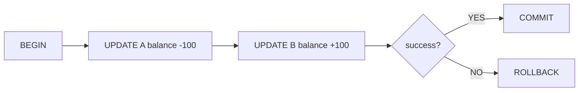

# 트랜잭션과 ACID

이 글은 Database Systems 101 시리즈의 다섯 번째 글입니다.

비즈니스 시스템에서 중요한 작업은 거의 항상 두 단계 이상입니다. 송금은 한 계좌에서 차감하고 다른 계좌에 더해야 하고, 주문 생성은 주문 행과 재고 차감, 결제 기록이 함께 움직여야 합니다. 이런 작업이 중간에서 끊기면 데이터는 금방 이상한 상태가 됩니다.

트랜잭션은 이런 여러 SQL 문을 하나의 작업 단위로 묶는 장치입니다. 그리고 ACID는 그 약속을 네 가지 관점에서 더 정밀하게 설명하는 언어입니다. 이 글에서는 “전부 또는 전무”라는 문장이 실제 시스템에서 어떻게 구현되는지, 그리고 WAL과 무결성 제약이 왜 그 약속의 핵심 메커니즘인지 연결해 보겠습니다.

## 이 글에서 다룰 문제

- 트랜잭션은 정확히 무엇이며 왜 필요할까요?
- ACID 네 글자는 실제로 무엇을 보장할까요?
- `BEGIN`, `COMMIT`, `ROLLBACK`은 어떻게 사용해야 할까요?
- WAL(Write-Ahead Log)은 어떤 직관으로 이해하면 좋을까요?

> **멘탈 모델**: 트랜잭션은 여러 SQL 문을 하나의 “전부 적용되거나 전부 취소되는” 단위로 묶습니다. 애플리케이션은 경계를 정하고, 데이터베이스는 제약과 WAL, 잠금을 이용해 그 경계를 실제로 지킵니다.

## 이 글에서 배울 내용

- 트랜잭션이 무엇이고 왜 필요한지
- ACID 네 글자가 실제로 보장하는 것
- `BEGIN`, `COMMIT`, `ROLLBACK` 사용법
- WAL을 이해하는 기본 직관

## 왜 중요한가

송금, 재고 차감, 주문 생성처럼 실무의 거의 모든 핵심 작업은 두 개 이상의 변경을 함께 묶어야 합니다. 중간에서 멈추면 데이터는 바로 불일치 상태가 됩니다. 트랜잭션이 없으면 애플리케이션이 이를 일일이 보정해야 하는데, 운영 현실에서는 거의 항상 실패합니다.

> “전부 또는 전무.” 이 한 문장이 트랜잭션의 본질을 가장 정확하게 설명합니다.

## 핵심 개념 한눈에 보기



트랜잭션을 시작한 뒤 여러 변경을 수행하고, 마지막에 한 번에 COMMIT하거나 ROLLBACK합니다. 외부에서는 모든 변경이 한 시점에 반영된 것처럼 보입니다.

## 핵심 용어

- **트랜잭션**: 여러 SQL 문으로 구성된 하나의 작업 단위입니다.
- **원자성(Atomicity)**: 모든 변경이 적용되거나, 아무것도 적용되지 않는 성질입니다.
- **일관성(Consistency)**: 트랜잭션 전후로 무결성 제약이 유지되는 성질입니다.
- **격리성(Isolation)**: 동시에 실행되는 트랜잭션들이 마치 순차적으로 실행된 것처럼 보이게 하는 성질입니다.
- **영속성(Durability)**: 커밋된 변경이 전원 장애 이후에도 살아남는 성질입니다.
- **WAL**: 데이터를 바꾸기 전에 변경 의도를 로그에 먼저 쓰는 방식으로, 복구의 토대입니다.

## Before/After

**Before — transferring money without a transaction**

```sql
UPDATE accounts SET balance = balance - 100 WHERE id = 1;
-- (power outage here)
UPDATE accounts SET balance = balance + 100 WHERE id = 2;
-- 100 dollars vanish
```

**After — wrapping the transfer in a transaction**

```sql
BEGIN;
UPDATE accounts SET balance = balance - 100 WHERE id = 1;
UPDATE accounts SET balance = balance + 100 WHERE id = 2;
COMMIT;
-- A power outage rolls everything back to BEGIN. No money lost.
```

이 한 줄의 원자성이 시스템의 신뢰도를 가릅니다.

## 실습: 트랜잭션 직접 다뤄 보기

### 1단계 — 계좌 테이블 준비

```python
# setup.py
import sqlite3

with sqlite3.connect("bank.db") as db:
    db.executescript("""
        DROP TABLE IF EXISTS accounts;
        CREATE TABLE accounts (
            id      INTEGER PRIMARY KEY,
            owner   TEXT NOT NULL,
            balance INTEGER NOT NULL CHECK (balance >= 0)
        );
        INSERT INTO accounts VALUES (1, 'Alice', 1000), (2, 'Bob', 1000);
    """)
```

`balance >= 0` 제약을 스키마에 넣어 둡니다. 곧 이 제약이 ACID의 C, 즉 일관성을 어떻게 현실적으로 지키는지 보게 됩니다.

### 2단계 — 정상적인 송금

```python
import sqlite3

def transfer(src: int, dst: int, amount: int) -> None:
    with sqlite3.connect("bank.db") as db:
        try:
            db.execute("BEGIN")
            db.execute("UPDATE accounts SET balance = balance - ? WHERE id = ?", (amount, src))
            db.execute("UPDATE accounts SET balance = balance + ? WHERE id = ?", (amount, dst))
            db.execute("COMMIT")
        except Exception:
            db.execute("ROLLBACK")
            raise

transfer(1, 2, 100)
```

두 UPDATE가 `BEGIN`과 `COMMIT` 사이에 놓여 있으므로 둘 다 적용되거나 둘 다 취소됩니다.

### 3단계 — 일관성 위반이 자동 롤백을 유발하는지 보기

```python
try:
    transfer(1, 2, 99999)  # more than Alice has
except sqlite3.IntegrityError as e:
    print("rolled back:", e)

with sqlite3.connect("bank.db") as db:
    print(db.execute("SELECT * FROM accounts").fetchall())
```

CHECK 제약이 깨지는 순간 트랜잭션 전체가 실패하고 롤백됩니다. 덕분에 잔액은 일관된 상태로 남습니다.

### 4단계 — 명시적 ROLLBACK

```python
with sqlite3.connect("bank.db") as db:
    db.execute("BEGIN")
    db.execute("UPDATE accounts SET balance = balance - 50 WHERE id = 1")
    # simulate user cancellation
    db.execute("ROLLBACK")
    print(db.execute("SELECT balance FROM accounts WHERE id = 1").fetchone())
```

ROLLBACK은 “BEGIN 이후의 변경을 모두 잊는다”는 뜻입니다. 데이터 파일에 반영되지 않은 것으로 되돌립니다.

### 5단계 — Durability를 의식해 보기

```python
import sqlite3

with sqlite3.connect("bank.db") as db:
    db.execute("PRAGMA journal_mode=WAL")
    db.execute("BEGIN")
    db.execute("UPDATE accounts SET balance = balance + 1 WHERE id = 1")
    db.execute("COMMIT")
```

WAL 모드에서는 데이터 파일을 건드리기 전에 로그에 먼저 변경을 남깁니다. COMMIT 시점에 로그가 안전하게 기록되어 있으면, 그 자체로 영속성을 보장할 수 있습니다.

## 이 코드에서 먼저 봐야 할 점

- 트랜잭션은 기본적으로 **명시적 경계**를 갖습니다. 자동 커밋은 편하지만 문장 단위로 잘게 끊깁니다.
- 예외 경로에서 ROLLBACK은 반드시 보장되어야 합니다. 그렇지 않으면 연결 상태가 꼬이기 쉽습니다.
- CHECK, FOREIGN KEY 같은 제약은 ACID의 C를 실무에서 지키는 가장 현실적인 도구입니다.
- WAL은 ACID의 D를 떠받치는 핵심 메커니즘입니다.

## 자주 하는 실수 5가지

1. **트랜잭션을 너무 오래 연다.** 사용자 입력 대기나 외부 API 호출을 안에 넣으면 잠금이 길어지고 다른 작업이 막힙니다.
2. **예외 처리에서 ROLLBACK을 빠뜨린다.** 암묵적 정리를 믿지 말고 명시적으로 다뤄야 합니다.
3. **자동 커밋 상태로 배치 작업을 돌린다.** N개의 INSERT가 N번의 커밋이 되어 성능이 급격히 나빠집니다.
4. **모든 SELECT까지 트랜잭션으로 과하게 감싼다.** 읽기는 짧게, 쓰기는 비즈니스 단위로 묶는 것이 기본입니다.
5. **ROLLBACK을 “복구”라고 오해한다.** 데이터베이스 변경은 되돌리지만, 이메일 발송이나 결제 호출 같은 부수 효과는 되돌리지 못합니다.

## 실무에서는 이렇게 드러납니다

대부분의 ORM과 프레임워크는 함수나 요청 단위로 트랜잭션 경계를 제공합니다. SQLAlchemy의 `Session`, Django의 `@transaction.atomic`이 대표적입니다. 하지만 도구가 자동으로 경계를 제공한다고 해서, 비즈니스 경계 설계까지 대신해 주는 것은 아닙니다. “주문 생성”이 하나의 트랜잭션이어야 하는지, “주문 생성 + 메일 발송”까지 하나로 볼 것인지 판단은 여전히 애플리케이션 설계의 몫입니다.

장애 분석에서도 트랜잭션은 출발점입니다. “이 트랜잭션이 어디까지 갔는가?”를 물으면 부분 갱신, 데드락, 부수 효과 책임이 빠르게 드러납니다. 그래서 강한 팀은 데이터베이스 안의 작업과 데이터베이스 밖의 부수 효과를 분리하고, 후자는 재시도 가능한 멱등 작업으로 설계합니다.

## 시니어 엔지니어는 이렇게 생각합니다

- 트랜잭션 경계를 비즈니스 단위와 맞춥니다.
- 외부 호출은 가능한 한 트랜잭션 밖으로 뺍니다.
- “이 롤백은 정말 안전한가?”를 계속 묻습니다. 부수 효과가 섞이면 바로 경계 재검토 신호입니다.
- 오래 걸리는 트랜잭션은 곧바로 잠금 경합 후보로 봅니다.
- NOT NULL, CHECK, FK 같은 무결성 제약을 애플리케이션 코드가 아니라 데이터 모델에 둡니다.

## 체크리스트

- [ ] 비즈니스 단위와 트랜잭션 경계가 맞아떨어지는가?
- [ ] 트랜잭션 안에 외부 호출이나 사용자 입력 대기가 없는가?
- [ ] 모든 예외 경로에서 ROLLBACK이 보장되는가?
- [ ] 무결성 제약이 실제로 활용되고 있는가?
- [ ] 부수 효과는 트랜잭션 밖에서 멱등하게 처리되는가?

## 연습 문제

1. 10,000건 INSERT가 자동 커밋 상태보다 하나의 트랜잭션 안에서 훨씬 빠른 이유를 한 문장으로 설명해 보세요.
2. 결제 API 호출을 트랜잭션 안에 넣었는데 응답이 느려 타임아웃이 났습니다. 어떤 문제가 생길 수 있고, 더 안전한 설계는 무엇인지 설명해 보세요.
3. “커밋된 변경은 전원 장애 뒤에도 살아남는다”를 보장하는 ACID의 글자는 무엇인가요?

## 정리 및 다음 단계

트랜잭션은 “전부 또는 전무”의 약속이고, ACID는 그 약속을 원자성·일관성·격리성·영속성으로 풀어 쓴 언어입니다. WAL과 무결성 제약은 그 약속을 실제로 지키는 메커니즘입니다. 다음 글에서는 ACID의 I, 격리성으로 들어가서 READ COMMITTED, REPEATABLE READ, SERIALIZABLE이 각각 무엇을 막고 무엇을 허용하는지 살펴봅니다.

<!-- toc:begin -->
- [데이터베이스 시스템이란 무엇인가?](./01-what-is-a-database.md)
- [관계형 모델](./02-relational-model.md)
- [SQL과 쿼리 처리](./03-sql-and-query-processing.md)
- [인덱스](./04-indexes.md)
- **트랜잭션과 ACID (현재 글)**
- isolation level (예정)
- 정규화와 모델링 (예정)
- 쿼리 최적화 (예정)
- 복제와 백업 (예정)
- OLTP와 OLAP (예정)
<!-- toc:end -->

## 참고 자료

- [PostgreSQL — Transactions](https://www.postgresql.org/docs/current/tutorial-transactions.html)
- [SQLite — Transactions](https://www.sqlite.org/lang_transaction.html)
- [Designing Data-Intensive Applications — Chapter 7](https://dataintensive.net/)
- [Wikipedia — ACID](https://en.wikipedia.org/wiki/ACID)

Tags: Computer Science, Database, 트랜잭션, ACID, WAL, 동시성
