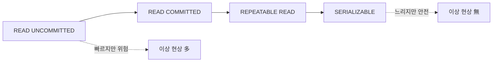

# 격리 수준

> Database Systems 101 시리즈 (6/10)

<!-- a-grade-intro:begin -->

**핵심 질문**: 두 트랜잭션이 동시에 같은 데이터를 만질 때, 데이터베이스는 어디까지 "혼자 일하는 척"을 보장할까요?

> 격리성(I)은 흑백이 아니라 단계입니다. 너무 느슨하면 더티 리드, 팬텀 리드 같은 이상 현상이 생기고, 너무 엄격하면 처리량이 무너집니다. 격리 수준은 "어디서 멈추고 어디서 양보할지"를 정하는 다이얼입니다.

<!-- a-grade-intro:end -->

## 이 글에서 배울 것

- 동시성에서 발생하는 4가지 이상 현상
- READ UNCOMMITTED, READ COMMITTED, REPEATABLE READ, SERIALIZABLE의 차이
- MVCC가 어떻게 잠금 없이 일관성 있는 읽기를 만드는가
- 워크로드별로 어떤 격리 수준을 골라야 하는가

## 왜 중요한가

격리 수준을 모르면 "재현 안 되는 버그"의 절반은 설명되지 않습니다. 결제가 두 번 차감된다, 잔액이 음수가 된다, 같은 주문이 두 번 만들어진다 — 모두 격리 수준 문제일 수 있습니다. 그리고 이 문제들은 단위 테스트에서 거의 안 보입니다.

> 동시성 버그는 평소에는 안 보이고, 가장 비싼 순간에 나타납니다.

## 개념 한눈에 보기



왼쪽에서 오른쪽으로 갈수록 안전하지만 비용이 큽니다. 대부분의 DBMS 기본값은 READ COMMITTED 또는 REPEATABLE READ입니다.

## 핵심 용어 정리

- **Dirty Read**: 다른 트랜잭션의 미커밋 변경을 본다.
- **Non-repeatable Read**: 같은 행을 두 번 읽었는데 값이 다르다.
- **Phantom Read**: 같은 조건으로 읽었는데 결과 행 수가 달라진다.
- **Lost Update**: 두 트랜잭션이 같은 행을 동시에 수정해 한쪽이 사라진다.
- **MVCC(Multi-Version Concurrency Control)**: 한 행에 여러 버전을 두어 읽기와 쓰기가 서로 막지 않게 한다.

## Before/After

**Before — 잘못된 격리: 잔액 두 번 차감**

```sql
-- T1: SELECT balance FROM accounts WHERE id=1; -- 1000
-- T2: SELECT balance FROM accounts WHERE id=1; -- 1000
-- T1: UPDATE ... SET balance=900 WHERE id=1;
-- T2: UPDATE ... SET balance=900 WHERE id=1;  -- T1의 변경을 덮음 (Lost Update)
```

**After — SERIALIZABLE 또는 SELECT ... FOR UPDATE**

```sql
BEGIN;
SELECT balance FROM accounts WHERE id=1 FOR UPDATE;
UPDATE accounts SET balance = balance - 100 WHERE id=1;
COMMIT;
```

읽기 시점에 잠금을 걸어 다른 트랜잭션이 같은 행을 만지지 못하게 합니다.

## 실습: 이상 현상을 직접 재현해 보기

### 1단계 — 두 세션 준비

```python
# psql 두 개를 띄우거나, sqlite3에서 두 connection을 생성합니다.
import sqlite3
c1 = sqlite3.connect("iso.db", isolation_level="DEFERRED")
c2 = sqlite3.connect("iso.db", isolation_level="DEFERRED")

c1.executescript("""
DROP TABLE IF EXISTS counter;
CREATE TABLE counter (id INTEGER PRIMARY KEY, n INTEGER);
INSERT INTO counter VALUES (1, 0);
""")
c1.commit()
```

### 2단계 — Lost Update 재현

```python
c1.execute("BEGIN")
c2.execute("BEGIN")
n1 = c1.execute("SELECT n FROM counter WHERE id=1").fetchone()[0]
n2 = c2.execute("SELECT n FROM counter WHERE id=1").fetchone()[0]
c1.execute("UPDATE counter SET n=? WHERE id=1", (n1 + 1,))
c2.execute("UPDATE counter SET n=? WHERE id=1", (n2 + 1,))
c1.commit()
c2.commit()
print(c1.execute("SELECT n FROM counter").fetchone())  # 1 (2가 아님)
```

두 세션 모두 0을 읽고 각자 1을 썼습니다. 한 번의 증가가 사라졌습니다.

### 3단계 — SELECT ... FOR UPDATE로 막기

```python
# PostgreSQL 가정
# T1
# BEGIN;
# SELECT n FROM counter WHERE id=1 FOR UPDATE;  -- 잠금
# UPDATE counter SET n = n+1 WHERE id=1;
# COMMIT;
# T2: T1이 끝날 때까지 SELECT ... FOR UPDATE에서 대기
```

읽기 잠금을 명시적으로 잡으면 두 세션이 직렬화됩니다.

### 4단계 — REPEATABLE READ에서의 일관 읽기

```sql
-- T1
BEGIN ISOLATION LEVEL REPEATABLE READ;
SELECT count(*) FROM orders WHERE user_id=7;  -- 10

-- T2 (다른 세션): INSERT INTO orders (user_id, ...) VALUES (7, ...); COMMIT;

-- T1
SELECT count(*) FROM orders WHERE user_id=7;  -- 여전히 10
COMMIT;
```

REPEATABLE READ에서는 트랜잭션 시작 시점의 스냅샷을 계속 봅니다. PostgreSQL은 MVCC로 이를 잠금 없이 구현합니다.

### 5단계 — SERIALIZABLE의 비용

```sql
-- T1, T2 모두 SERIALIZABLE.
-- T1: 같은 조건의 SELECT 후 INSERT
-- T2: 동시에 같은 조건으로 SELECT 후 INSERT
-- 데이터베이스가 충돌을 감지하면 한쪽이 SQLSTATE 40001로 실패합니다.
-- 애플리케이션은 재시도해야 합니다.
```

SERIALIZABLE은 안전하지만 충돌 감지에 의해 일부 트랜잭션이 재시도되는 비용을 받아들입니다.

## 이 코드에서 주목할 점

- 격리 수준은 옵티마이저가 아니라 **개발자가** 정합니다.
- MVCC 덕분에 PostgreSQL은 "읽기는 쓰기를 막지 않고, 쓰기는 읽기를 막지 않는다"가 기본입니다.
- `FOR UPDATE`는 행 잠금을 잡는 가장 흔한 도구입니다.
- 재시도 로직 없이 SERIALIZABLE을 쓰면 산발적인 실패에 시스템이 약해집니다.

## 자주 하는 실수 5가지

1. **격리 수준을 의식하지 않고 카운터·재고 업데이트를 한다.** Lost update가 정확히 재현됩니다.
2. **SERIALIZABLE을 쓰면서 재시도 로직을 안 만든다.** 직렬화 실패가 곧장 사용자 에러로 갑니다.
3. **REPEATABLE READ에서 팬텀이 안 생긴다고 가정한다.** DBMS마다 다릅니다.
4. **`SELECT ... FOR UPDATE`를 단순 SELECT처럼 남발한다.** 잠금 폭이 넓어져 동시성이 무너집니다.
5. **격리 수준을 코드 어딘가에 한 번만 설정한다.** 설정이 어느 트랜잭션에 적용됐는지가 모호해집니다.

## 실무에서는 이렇게 쓰입니다

대부분의 OLTP 서비스는 READ COMMITTED 기본 + 핵심 쓰기에 `SELECT ... FOR UPDATE`를 조합합니다. 분석 쿼리를 같은 DB에서 돌리면 REPEATABLE READ 스냅샷을 활용합니다.

금융·예약 시스템처럼 정확성이 절대적인 도메인은 SERIALIZABLE을 기본으로 두고, 모든 비즈니스 트랜잭션에 재시도 루프를 갖춥니다. 이 경우 트랜잭션은 짧고 멱등(idempotent)해야 합니다.

## 시니어 엔지니어는 이렇게 생각합니다

- "이 트랜잭션이 다른 트랜잭션과 동시에 일어나면 무엇이 깨질 수 있나?"를 항상 묻습니다.
- 잠금 범위를 작게 유지합니다. 행 잠금 → 페이지 잠금 → 테이블 잠금으로 번지지 않게.
- 재시도 가능한 실패와 그렇지 않은 실패를 구분합니다.
- 격리 수준 변경은 코드 리뷰의 1급 토픽입니다.
- 동시성 버그는 로그·trace·재현 시나리오로 잡습니다. 머리로 잡지 않습니다.

## 체크리스트

- [ ] 핵심 쓰기 경로의 격리 수준을 알고 있는가?
- [ ] Lost update가 가능한 지점에 잠금이나 SERIALIZABLE이 있는가?
- [ ] SERIALIZABLE을 쓴다면 재시도 루프가 있는가?
- [ ] 트랜잭션이 짧고 외부 호출이 없는가?
- [ ] 동시성 시나리오를 적어도 한 번 통합 테스트로 검증하는가?

## 연습 문제

1. READ COMMITTED에서 가능한 이상 현상 두 가지를 적어 보세요.
2. MVCC 환경에서 "읽기는 쓰기를 막지 않고, 쓰기는 읽기를 막지 않는다"가 어떻게 가능한지 한 단락으로 설명하세요.
3. 카운터 컬럼에 동시 INCREMENT를 안전하게 처리하는 방법 두 가지를 적어 보세요. (잠금, 원자 UPDATE 등)

## 정리 및 다음 단계

격리 수준은 동시성 안전과 처리량 사이의 다이얼입니다. 이상 현상의 종류와 각 수준의 약속을 알면 실패 모드를 미리 설계할 수 있습니다. 다음 글에서는 한 단계 위로 올라가 데이터 모델 자체의 품질 — 정규화와 함수 종속 — 을 다룹니다. 좋은 모델은 동시성 문제와 갱신 이상 현상을 처음부터 줄여 줍니다.

<!-- toc:begin -->
- [데이터베이스 시스템이란 무엇인가?](./01-what-is-a-database.md)
- [관계형 모델](./02-relational-model.md)
- [SQL과 쿼리 처리](./03-sql-and-query-processing.md)
- [인덱스](./04-indexes.md)
- [트랜잭션과 ACID](./05-transactions-and-acid.md)
- **isolation level (현재 글)**
- 정규화와 모델링 (예정)
- 쿼리 최적화 (예정)
- 복제와 백업 (예정)
- OLTP와 OLAP (예정)
<!-- toc:end -->

## 참고 자료

- [PostgreSQL — Transaction Isolation](https://www.postgresql.org/docs/current/transaction-iso.html)
- [Jepsen — Consistency Models](https://jepsen.io/consistency)
- [A Critique of ANSI SQL Isolation Levels (Berenson et al.)](https://www.microsoft.com/en-us/research/publication/a-critique-of-ansi-sql-isolation-levels/)
- [Designing Data-Intensive Applications — Chapter 7](https://dataintensive.net/)

Tags: Computer Science, Database, Isolation, MVCC, 동시성, 이상현상
