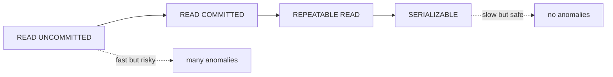

# 격리 수준

이 글은 Database Systems 101 시리즈의 여섯 번째 글입니다.

동시성 버그는 이상하게도 한가할 때는 잘 보이지 않습니다. 그런데 부하가 몰리고, 두 사용자가 같은 자원을 동시에 만지고, 특정 타이밍이 겹치는 순간 갑자기 잔액이 이상해지고 재고가 음수가 되며 같은 주문이 두 번 생깁니다. 이때 많은 팀이 애플리케이션 코드만 뒤지지만, 실제 원인은 데이터베이스의 격리 수준 선택에 있는 경우가 많습니다.

격리성은 켜고 끄는 스위치가 아니라, 안전성과 처리량 사이를 조정하는 다이얼에 가깝습니다. 너무 느슨하면 이상 현상이 남고, 너무 엄격하면 처리량이 급격히 떨어집니다. 이 글에서는 그 다이얼을 어떻게 읽어야 하는지, 그리고 MVCC와 행 잠금이 어떤 역할을 하는지 정리합니다.

## 이 글에서 다룰 문제

- 고전적인 동시성 이상 현상 네 가지는 무엇일까요?
- READ UNCOMMITTED, READ COMMITTED, REPEATABLE READ, SERIALIZABLE은 무엇이 다를까요?
- MVCC는 어떻게 일관된 읽기를 잠금 없이 제공할까요?
- 어떤 워크로드에 어떤 격리 수준이 어울릴까요?

> **멘탈 모델**: 격리 수준은 “다른 트랜잭션이 동시에 존재한다는 사실을 얼마나 감춰 줄 것인가”를 정하는 설정입니다. 왼쪽으로 갈수록 빠르지만 위험하고, 오른쪽으로 갈수록 안전하지만 충돌과 재시도 비용이 커집니다.

## 이 글에서 배울 내용

- 고전적인 동시성 이상 현상 네 가지
- 주요 격리 수준들의 차이
- MVCC가 잠금 없이 일관된 읽기를 제공하는 방식
- 워크로드별로 격리 수준을 고르는 감각

## 왜 중요한가

격리 수준을 모르면 “재현되지 않는 버그”의 절반은 설명되지 않습니다. 결제가 두 번 청구되거나, 잔액이 음수가 되거나, 같은 주문이 중복 생성되는 문제는 대개 단위 테스트만으로는 드러나지 않습니다. 동시성 문제는 평온한 환경에서 숨어 있다가, 가장 비싼 순간에 터집니다.

> 동시성 버그는 조용한 날에는 숨어 있다가, 시스템이 가장 바쁠 때 얼굴을 드러냅니다.

## 핵심 개념 한눈에 보기



왼쪽에서 오른쪽으로 갈수록 더 안전하지만 비용도 커집니다. 대부분의 DBMS 기본값은 READ COMMITTED 또는 REPEATABLE READ에 놓여 있습니다.

## 핵심 용어

- **Dirty Read**: 다른 트랜잭션이 아직 커밋하지 않은 값을 읽는 현상입니다.
- **Non-repeatable Read**: 같은 행을 두 번 읽었는데 값이 달라지는 현상입니다.
- **Phantom Read**: 같은 조건으로 두 번 읽었는데 행 개수가 달라지는 현상입니다.
- **Lost Update**: 두 트랜잭션이 같은 행을 동시에 갱신해 한쪽 변경이 사라지는 현상입니다.
- **MVCC**: 한 행의 여러 버전을 유지해 읽기와 쓰기가 서로를 덜 막도록 하는 방식입니다.

## Before/After

**Before — wrong isolation: balance debited twice**

```sql
-- T1: SELECT balance FROM accounts WHERE id=1; -- 1000
-- T2: SELECT balance FROM accounts WHERE id=1; -- 1000
-- T1: UPDATE ... SET balance=900 WHERE id=1;
-- T2: UPDATE ... SET balance=900 WHERE id=1;  -- overwrites T1 (Lost Update)
```

**After — SERIALIZABLE or SELECT ... FOR UPDATE**

```sql
BEGIN;
SELECT balance FROM accounts WHERE id=1 FOR UPDATE;
UPDATE accounts SET balance = balance - 100 WHERE id=1;
COMMIT;
```

읽는 순간 행 잠금을 잡아 두면, 다른 트랜잭션이 같은 행을 건드리지 못하게 할 수 있습니다.

## 실습: 이상 현상을 직접 재현해 보기

### 1단계 — 두 세션 준비

```python
# Open two psql shells, or two sqlite3 connections.
import sqlite3
c1 = sqlite3.connect("iso.db", isolation_level="DEFERRED")
c2 = sqlite3.connect("iso.db", isolation_level="DEFERRED")

c1.executescript("""
DROP TABLE IF EXISTS counter;
CREATE TABLE counter (id INTEGER PRIMARY KEY, n INTEGER);
INSERT INTO counter VALUES (1, 0);
""")
c1.commit()
```

두 세션이 같은 데이터를 동시에 만지는 상황을 의도적으로 만들기 위한 준비입니다.

### 2단계 — Lost Update 재현

```python
c1.execute("BEGIN")
c2.execute("BEGIN")
n1 = c1.execute("SELECT n FROM counter WHERE id=1").fetchone()[0]
n2 = c2.execute("SELECT n FROM counter WHERE id=1").fetchone()[0]
c1.execute("UPDATE counter SET n=? WHERE id=1", (n1 + 1,))
c2.execute("UPDATE counter SET n=? WHERE id=1", (n2 + 1,))
c1.commit()
c2.commit()
print(c1.execute("SELECT n FROM counter").fetchone())  # 1, not 2
```

두 세션 모두 0을 읽고 각자 1을 썼기 때문에, 한 번의 증가가 사라졌습니다.

### 3단계 — SELECT ... FOR UPDATE로 막기

```python
# PostgreSQL
# T1
# BEGIN;
# SELECT n FROM counter WHERE id=1 FOR UPDATE;  -- lock
# UPDATE counter SET n = n+1 WHERE id=1;
# COMMIT;
# T2: blocks on SELECT ... FOR UPDATE until T1 ends
```

명시적 행 잠금은 두 세션을 사실상 직렬화해 Lost Update를 막는 가장 흔한 도구입니다.

### 4단계 — REPEATABLE READ의 일관 읽기

```sql
-- T1
BEGIN ISOLATION LEVEL REPEATABLE READ;
SELECT count(*) FROM orders WHERE user_id=7;  -- 10

-- T2 (other session): INSERT INTO orders (user_id, ...) VALUES (7, ...); COMMIT;

-- T1
SELECT count(*) FROM orders WHERE user_id=7;  -- still 10
COMMIT;
```

REPEATABLE READ에서는 트랜잭션 시작 시점의 스냅샷을 계속 봅니다. PostgreSQL은 이를 MVCC로 구현해 읽기와 쓰기가 서로를 덜 막도록 만듭니다.

### 5단계 — SERIALIZABLE의 비용

```sql
-- T1, T2 both SERIALIZABLE.
-- T1: SELECT with a predicate, then INSERT
-- T2: same predicate concurrently, then INSERT
-- If the database detects a conflict, one side fails with SQLSTATE 40001.
-- The application must retry.
```

SERIALIZABLE은 가장 안전하지만, 충돌 감지와 재시도라는 운영 비용을 반드시 동반합니다.

## 이 코드에서 먼저 봐야 할 점

- 격리 수준은 옵티마이저가 아니라 **개발자와 시스템 설계자**가 선택합니다.
- MVCC 덕분에 PostgreSQL에서는 “읽기는 쓰기를 막지 않고, 쓰기는 읽기를 막지 않는다”는 기본 감각이 가능합니다.
- `FOR UPDATE`는 행 잠금을 잡는 가장 실용적인 수단입니다.
- SERIALIZABLE을 재시도 로직 없이 쓰면, 시스템은 산발적 실패에 매우 약해집니다.

## 자주 하는 실수 5가지

1. **격리 수준을 의식하지 않고 카운터나 재고를 갱신한다.** Lost Update는 생각보다 쉽게 재현됩니다.
2. **SERIALIZABLE을 켜고 재시도 루프를 만들지 않는다.** 직렬화 실패가 곧바로 사용자 오류가 됩니다.
3. **REPEATABLE READ가 모든 DBMS에서 팬텀까지 막는다고 단정한다.** 구현은 엔진마다 다릅니다.
4. **`SELECT ... FOR UPDATE`를 과하게 남발한다.** 잠금 범위가 넓어지면 동시성이 급격히 나빠집니다.
5. **격리 수준 설정을 코드 어딘가에 묻어 둔다.** 어떤 트랜잭션이 어떤 수준으로 실행되는지 설명하기 어려워집니다.

## 실무에서는 이렇게 드러납니다

대부분의 OLTP 서비스는 READ COMMITTED를 기본으로 두고, 정말 중요한 쓰기 경로에서만 `SELECT ... FOR UPDATE`를 사용합니다. 반면 분석 쿼리나 스냅샷 일관성이 필요한 읽기에는 REPEATABLE READ가 잘 맞는 경우가 있습니다.

정확성이 절대적인 금융·예약 시스템은 SERIALIZABLE을 기본으로 두고, 애플리케이션 레벨에서 재시도 루프를 갖추기도 합니다. 이 경우에는 트랜잭션을 더 짧고 더 멱등하게 설계해야 합니다. 격리 수준을 올리는 선택은 데이터베이스 옵션 하나로 끝나는 일이 아니라, 애플리케이션 재시도 정책과 함께 설계되어야 합니다.

## 시니어 엔지니어는 이렇게 생각합니다

- “이 트랜잭션이 다른 트랜잭션과 동시에 돌면 무엇이 깨질까?”를 반복해서 묻습니다.
- 잠금 범위를 작게 유지하려고 합니다. 행 잠금이 페이지 잠금, 테이블 잠금처럼 커지는 상황을 경계합니다.
- 재시도 가능한 실패와 불가능한 실패를 명확히 구분합니다.
- 격리 수준 변경은 최우선 코드 리뷰 주제로 다룹니다.
- 동시성 버그는 머릿속 추론만으로 끝내지 않고, 로그와 재현 시나리오로 검증합니다.

## 체크리스트

- [ ] 핵심 쓰기 경로의 격리 수준을 정확히 알고 있는가?
- [ ] Lost Update 가능 지점에 잠금 또는 SERIALIZABLE이 적용되어 있는가?
- [ ] SERIALIZABLE을 쓴다면 재시도 루프가 준비되어 있는가?
- [ ] 트랜잭션이 짧고 외부 호출이 없는가?
- [ ] 적어도 하나 이상의 동시성 시나리오를 통합 테스트로 검증하는가?

## 연습 문제

1. READ COMMITTED에서 여전히 가능한 이상 현상 두 가지를 적어 보세요.
2. MVCC가 어떻게 “읽기는 쓰기를 막지 않고, 쓰기는 읽기를 막지 않는다”를 가능하게 하는지 한 단락으로 설명해 보세요.
3. 카운터 컬럼의 동시 INCREMENT를 안전하게 처리하는 방법 두 가지를 적어 보세요.

## 정리 및 다음 단계

격리 수준은 동시성 안전성과 처리량 사이의 다이얼입니다. 이상 현상과 각 수준의 약속을 이해하면 장애를 만난 뒤에 수습하는 대신, 애초에 실패 모드를 설계할 수 있습니다. 다음 글에서는 한 단계 위로 올라가 데이터 모델 자체의 품질, 즉 정규화와 함수 종속을 살펴봅니다.

<!-- toc:begin -->
- [데이터베이스 시스템이란 무엇인가?](./01-what-is-a-database.md)
- [관계형 모델](./02-relational-model.md)
- [SQL과 쿼리 처리](./03-sql-and-query-processing.md)
- [인덱스](./04-indexes.md)
- [트랜잭션과 ACID](./05-transactions-and-acid.md)
- **isolation level (현재 글)**
- 정규화와 모델링 (예정)
- 쿼리 최적화 (예정)
- 복제와 백업 (예정)
- OLTP와 OLAP (예정)
<!-- toc:end -->

## 참고 자료

- [PostgreSQL — Transaction Isolation](https://www.postgresql.org/docs/current/transaction-iso.html)
- [Jepsen — Consistency Models](https://jepsen.io/consistency)
- [A Critique of ANSI SQL Isolation Levels (Berenson et al.)](https://www.microsoft.com/en-us/research/publication/a-critique-of-ansi-sql-isolation-levels/)
- [Designing Data-Intensive Applications — Chapter 7](https://dataintensive.net/)

Tags: Computer Science, Database, Isolation, MVCC, 동시성, 이상현상
