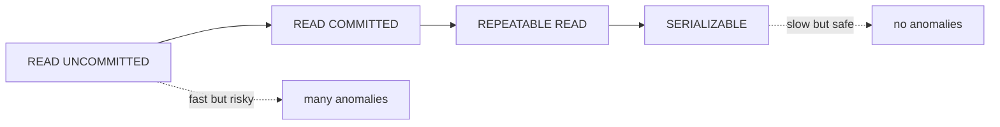

# Database Systems 101 (6/10): 격리 수준

동시성 버그는 이상하게도 한가할 때는 잘 보이지 않습니다. 그런데 부하가 몰리고, 두 사용자가 같은 자원을 동시에 만지고, 특정 타이밍이 겹치는 순간 갑자기 잔액이 이상해지고 재고가 음수가 되며 같은 주문이 두 번 생깁니다. 이때 많은 팀이 애플리케이션 코드만 뒤지지만, 실제 원인은 데이터베이스의 격리 수준 선택에 있는 경우가 많습니다.

이 글은 Database Systems 101 시리즈의 6번째 글입니다.

격리성은 켜고 끄는 스위치가 아니라, 안전성과 처리량 사이를 조정하는 다이얼에 가깝습니다. 너무 느슨하면 이상 현상이 남고, 너무 엄격하면 처리량이 급격히 떨어집니다. 이 글에서는 그 다이얼을 어떻게 읽어야 하는지, 그리고 MVCC와 행 잠금이 어떤 역할을 하는지 정리합니다.


*Database Systems 101 6장 흐름 개요*

## 먼저 던지는 질문

- 고전적인 동시성 이상 현상 네 가지는 무엇일까요?
- READ UNCOMMITTED, READ COMMITTED, REPEATABLE READ, SERIALIZABLE은 무엇이 다를까요?
- MVCC는 어떻게 일관된 읽기를 잠금 없이 제공할까요?

## 이 글에서 배울 내용

- 고전적인 동시성 이상 현상 네 가지
- 주요 격리 수준들의 차이
- MVCC가 잠금 없이 일관된 읽기를 제공하는 방식
- 워크로드별로 격리 수준을 고르는 감각

## 왜 중요한가

격리 수준을 모르면 “재현되지 않는 버그”의 절반은 설명되지 않습니다. 결제가 두 번 청구되거나, 잔액이 음수가 되거나, 같은 주문이 중복 생성되는 문제는 대개 단위 테스트만으로는 드러나지 않습니다. 동시성 문제는 평온한 환경에서 숨어 있다가, 가장 비싼 순간에 터집니다.

> 동시성 버그는 조용한 날에는 숨어 있다가, 시스템이 가장 바쁠 때 얼굴을 드러냅니다.

## 핵심 개념 한눈에 보기



왼쪽에서 오른쪽으로 갈수록 더 안전하지만 비용도 커집니다. 대부분의 DBMS 기본값은 READ COMMITTED 또는 REPEATABLE READ에 놓여 있습니다.

## 핵심 용어

- **Dirty Read**: 다른 트랜잭션이 아직 커밋하지 않은 값을 읽는 현상입니다.
- **Non-repeatable Read**: 같은 행을 두 번 읽었는데 값이 달라지는 현상입니다.
- **Phantom Read**: 같은 조건으로 두 번 읽었는데 행 개수가 달라지는 현상입니다.
- **Lost Update**: 두 트랜잭션이 같은 행을 동시에 갱신해 한쪽 변경이 사라지는 현상입니다.
- **MVCC**: 한 행의 여러 버전을 유지해 읽기와 쓰기가 서로를 덜 막도록 하는 방식입니다.

## 변경 전/변경 후

**Before — wrong isolation: balance debited twice**

```sql
-- T1: SELECT balance FROM accounts WHERE id=1; -- 1000
-- T2: SELECT balance FROM accounts WHERE id=1; -- 1000
-- T1: UPDATE ... SET balance=900 WHERE id=1;
-- T2: UPDATE ... SET balance=900 WHERE id=1;  -- overwrites T1 (Lost Update)
```

**After — SERIALIZABLE or SELECT ... FOR UPDATE**

```sql
BEGIN;
SELECT balance FROM accounts WHERE id=1 FOR UPDATE;
UPDATE accounts SET balance = balance - 100 WHERE id=1;
COMMIT;
```

읽는 순간 행 잠금을 잡아 두면, 다른 트랜잭션이 같은 행을 건드리지 못하게 할 수 있습니다.

## 실습: 이상 현상을 직접 재현해 보기

### 1단계 — 두 세션 준비

```python
# psql 쉘 두 개, 또는 sqlite3 연결 두 개를 연다.
import sqlite3
c1 = sqlite3.connect("iso.db", isolation_level="DEFERRED")
c2 = sqlite3.connect("iso.db", isolation_level="DEFERRED")

c1.executescript("""
DROP TABLE IF EXISTS counter;
CREATE TABLE counter (id INTEGER PRIMARY KEY, n INTEGER);
INSERT INTO counter VALUES (1, 0);
""")
c1.commit()
```

두 세션이 같은 데이터를 동시에 만지는 상황을 의도적으로 만들기 위한 준비입니다.

### 2단계 — 갱신 손실 재현

```python
c1.execute("BEGIN")
c2.execute("BEGIN")
n1 = c1.execute("SELECT n FROM counter WHERE id=1").fetchone()[0]
n2 = c2.execute("SELECT n FROM counter WHERE id=1").fetchone()[0]
c1.execute("UPDATE counter SET n=? WHERE id=1", (n1 + 1,))
c2.execute("UPDATE counter SET n=? WHERE id=1", (n2 + 1,))
c1.commit()
c2.commit()
print(c1.execute("SELECT n FROM counter").fetchone())  # 1, not 2
```

두 세션 모두 0을 읽고 각자 1을 썼기 때문에, 한 번의 증가가 사라졌습니다.

### 3단계 — 잠금 조회로 막기

```python
# PostgreSQL
# T1
# BEGIN;
# SELECT n FROM 카운터 WHERE id=1 FOR UPDATE;  -- 잠그다
# 업데이트 카운터 SET n = n+1 WHERE id=1;
# COMMIT;
# T2: T1이 끝날 때까지 SELECT ... FOR UPDATE를 차단합니다.
```

명시적 행 잠금은 두 세션을 사실상 직렬화해 Lost Update를 막는 가장 흔한 도구입니다.

### 4단계 — 반복 가능 읽기의 일관성

```sql
-- T1
BEGIN ISOLATION LEVEL REPEATABLE READ;
SELECT count(*) FROM orders WHERE user_id=7;  -- 10

-- T2 (other session): INSERT INTO orders (user_id, ...) VALUES (7, ...); COMMIT;

-- T1
SELECT count(*) FROM orders WHERE user_id=7;  -- still 10
COMMIT;
```

REPEATABLE READ에서는 트랜잭션 시작 시점의 스냅샷을 계속 봅니다. PostgreSQL은 이를 MVCC로 구현해 읽기와 쓰기가 서로를 덜 막도록 만듭니다.

### 5단계 — 직렬화 가능 수준의 비용

```sql
-- T1, T2 both SERIALIZABLE.
-- T1: SELECT with a predicate, then INSERT
-- T2: same predicate concurrently, then INSERT
-- If the database detects a conflict, one side fails with SQLSTATE 40001.
-- The application must retry.
```

SERIALIZABLE은 가장 안전하지만, 충돌 감지와 재시도라는 운영 비용을 반드시 동반합니다.

## 이 코드에서 먼저 봐야 할 점

- 격리 수준은 옵티마이저가 아니라 **개발자와 시스템 설계자**가 선택합니다.
- MVCC 덕분에 PostgreSQL에서는 “읽기는 쓰기를 막지 않고, 쓰기는 읽기를 막지 않는다”는 기본 감각이 가능합니다.
- `FOR UPDATE`는 행 잠금을 잡는 가장 실용적인 수단입니다.
- SERIALIZABLE을 재시도 로직 없이 쓰면, 시스템은 산발적 실패에 매우 약해집니다.

## 자주 하는 실수 5가지

1. **격리 수준을 의식하지 않고 카운터나 재고를 갱신한다.** Lost Update는 생각보다 쉽게 재현됩니다.
2. **SERIALIZABLE을 켜고 재시도 루프를 만들지 않는다.** 직렬화 실패가 곧바로 사용자 오류가 됩니다.
3. **REPEATABLE READ가 모든 DBMS에서 팬텀까지 막는다고 단정한다.** 구현은 엔진마다 다릅니다.
4. **`SELECT ... FOR UPDATE`를 과하게 남발한다.** 잠금 범위가 넓어지면 동시성이 급격히 나빠집니다.
5. **격리 수준 설정을 코드 어딘가에 묻어 둔다.** 어떤 트랜잭션이 어떤 수준으로 실행되는지 설명하기 어려워집니다.

## 실무에서는 이렇게 드러납니다

대부분의 OLTP 서비스는 READ COMMITTED를 기본으로 두고, 정말 중요한 쓰기 경로에서만 `SELECT ... FOR UPDATE`를 사용합니다. 반면 분석 쿼리나 스냅샷 일관성이 필요한 읽기에는 REPEATABLE READ가 잘 맞는 경우가 있습니다.

정확성이 절대적인 금융·예약 시스템은 SERIALIZABLE을 기본으로 두고, 애플리케이션 레벨에서 재시도 루프를 갖추기도 합니다. 이 경우에는 트랜잭션을 더 짧고 더 멱등하게 설계해야 합니다. 격리 수준을 올리는 선택은 데이터베이스 옵션 하나로 끝나는 일이 아니라, 애플리케이션 재시도 정책과 함께 설계되어야 합니다.

## 시니어 엔지니어는 이렇게 생각합니다

- “이 트랜잭션이 다른 트랜잭션과 동시에 돌면 무엇이 깨질까?”를 반복해서 묻습니다.
- 잠금 범위를 작게 유지하려고 합니다. 행 잠금이 페이지 잠금, 테이블 잠금처럼 커지는 상황을 경계합니다.
- 재시도 가능한 실패와 불가능한 실패를 명확히 구분합니다.
- 격리 수준 변경은 최우선 코드 리뷰 주제로 다룹니다.
- 동시성 버그는 머릿속 추론만으로 끝내지 않고, 로그와 재현 시나리오로 검증합니다.

## 체크리스트

- [ ] 핵심 쓰기 경로의 격리 수준을 정확히 알고 있는가?
- [ ] Lost Update 가능 지점에 잠금 또는 SERIALIZABLE이 적용되어 있는가?
- [ ] SERIALIZABLE을 쓴다면 재시도 루프가 준비되어 있는가?
- [ ] 트랜잭션이 짧고 외부 호출이 없는가?
- [ ] 적어도 하나 이상의 동시성 시나리오를 통합 테스트로 검증하는가?

## 연습 문제

1. READ COMMITTED에서 여전히 가능한 이상 현상 두 가지를 적어 보세요.
2. MVCC가 어떻게 “읽기는 쓰기를 막지 않고, 쓰기는 읽기를 막지 않는다”를 가능하게 하는지 한 단락으로 설명해 보세요.
3. 카운터 컬럼의 동시 INCREMENT를 안전하게 처리하는 방법 두 가지를 적어 보세요.

## 정리 및 다음 단계

격리 수준은 동시성 안전성과 처리량 사이의 다이얼입니다. 이상 현상과 각 수준의 약속을 이해하면 장애를 만난 뒤에 수습하는 대신, 애초에 실패 모드를 설계할 수 있습니다. 다음 글에서는 한 단계 위로 올라가 데이터 모델 자체의 품질, 즉 정규화와 함수 종속을 살펴봅니다.

## 격리 수준 데모: 같은 데이터, 다른 결과

아래는 `READ COMMITTED`에서 발생 가능한 갱신 충돌 예시입니다.

```sql
-- 트랜잭션 A
BEGIN;
SELECT balance FROM accounts WHERE id = 1; -- 100
-- 애플리케이션 계산 후
UPDATE accounts SET balance = 90 WHERE id = 1;
COMMIT;

-- 트랜잭션 B(거의 동시에)
BEGIN;
SELECT balance FROM accounts WHERE id = 1; -- 100
UPDATE accounts SET balance = 80 WHERE id = 1;
COMMIT;
```

두 트랜잭션이 서로의 계산 근거를 모른 채 커밋하면 마지막 쓰기만 남는 문제가 생길 수 있습니다. 이를 줄이기 위해 아래처럼 잠금 읽기를 사용합니다.

```sql
BEGIN;
SELECT balance FROM accounts WHERE id = 1 FOR UPDATE;
UPDATE accounts SET balance = balance - 10 WHERE id = 1;
COMMIT;
```

## 다중 버전 동시성 제어 관찰 포인트

MVCC 환경에서는 읽기와 쓰기가 버전 단위로 분리됩니다. 같은 시점 스냅샷을 기준으로 읽기 때문에, 읽기 트랜잭션이 쓰기 트랜잭션을 과도하게 막지 않습니다. 다만 오래 열린 트랜잭션은 정리 대상 버전을 붙잡아 저장소 팽창을 유발할 수 있으므로 운영 기준이 필요합니다.

- 트랜잭션 최대 유지 시간을 정합니다.
- 배치 작업은 구간을 나눠 짧게 커밋합니다.
- 격리 수준 변경은 반드시 부하 테스트와 함께 검증합니다.

## 실전 운영 점검표

운영 환경에서 데이터베이스 품질을 안정적으로 유지하려면, 기능 개발과 별개로 점검 루틴을 명확하게 가져가야 합니다. 아래 항목은 서비스 규모와 상관없이 바로 적용할 수 있는 기준입니다.

- 변경 전에는 항상 기준 지표를 남깁니다. 평균 지연 시간, P95, P99, 초당 트랜잭션 수, 잠금 대기 시간 같은 숫자를 캡처해 둬야 변경 이후를 비교할 수 있습니다.
- 쿼리 튜닝은 SQL 문장 자체보다 실행 계획의 변화를 중심으로 추적합니다. 계획 노드가 바뀌었는지, 예상 행 수와 실제 행 수의 차이가 커졌는지, 정렬이나 해시가 디스크로 내려갔는지를 우선 확인합니다.
- 스키마 변경은 단계적으로 진행합니다. 컬럼 추가, 백필, 코드 전환, 제약 강화 순서로 나누면 장애 반경을 줄일 수 있습니다.
- 장애 대응 문서는 운영자가 밤중에도 바로 실행할 수 있는 형태여야 합니다. 복구 절차, 롤백 절차, 검증 SQL을 같은 문서에 둬야 실제 상황에서 흔들리지 않습니다.

아래 예시는 팀이 릴리스 전후에 반복적으로 실행하는 최소 점검 SQL입니다.

```sql
-- 최근 10분 동안 느린 쿼리 확인(엔진별 뷰 이름은 다를 수 있음)
SELECT query, calls, mean_exec_time, rows
FROM pg_stat_statements
ORDER BY mean_exec_time DESC
LIMIT 20;

-- 잠금 대기 체인 확인
SELECT now(), pid, wait_event_type, wait_event, state, query
FROM pg_stat_activity
WHERE wait_event_type IS NOT NULL;

-- 인덱스 사용률 점검
SELECT relname AS table_name, seq_scan, idx_scan
FROM pg_stat_user_tables
ORDER BY seq_scan DESC
LIMIT 20;
```

이 점검 루틴을 자동화 파이프라인에 연결하면, 성능 저하를 "느낌"이 아니라 "증거"로 관리할 수 있습니다. 결국 장기 운영에서 중요한 것은 뛰어난 한 번의 튜닝이 아니라, 작은 검증을 꾸준히 반복해 위험을 조기에 감지하는 습관입니다.
## 운영 리허설 시나리오

문서만 읽고 끝내면 운영에서 다시 같은 실수를 반복하기 쉽습니다. 아래 시나리오는 팀 온보딩과 장애 대응 훈련에 바로 사용할 수 있는 공통 리허설 절차입니다.

### 시나리오 1: 느려진 조회 원인 찾기

1. 문제 쿼리를 식별합니다. 애플리케이션 로그의 요청 식별자와 데이터베이스 쿼리 로그를 매칭합니다.
2. 같은 파라미터로 `EXPLAIN ANALYZE`를 실행합니다.
3. 계획 노드 중 시간이 큰 지점을 찾고, 해당 노드가 인덱스/통계/정렬 중 무엇과 관련 있는지 분류합니다.
4. 개선안을 한 번에 하나만 적용합니다. 인덱스 추가, 통계 갱신, 질의문 재작성 가운데 하나만 바꿔 결과를 비교합니다.

```text
개선 전
Seq Scan on events  (actual time=0.030..842.112 rows=12000)

개선 후
Index Scan using idx_events_tenant_created on events
(actual time=0.041..21.553 rows=12000)
```

### 시나리오 2: 동시성 문제 재현과 완화

1. 두 세션에서 같은 행을 거의 동시에 수정합니다.
2. 격리 수준을 바꿔 가며 결과를 비교합니다.
3. 필요하면 `FOR UPDATE` 잠금 조회 또는 낙관적 잠금 버전 컬럼을 적용합니다.
4. 재시도 정책과 타임아웃 기준을 코드와 운영 문서에 같이 기록합니다.

```sql
-- 낙관적 잠금 예시
UPDATE inventory
SET qty = qty - 1, version = version + 1
WHERE sku = 'A-100' AND version = 17;
```

영향 받은 행 수가 0이면 이미 다른 트랜잭션이 갱신한 것이므로, 재조회 후 재시도합니다. 이 패턴은 잠금 경합을 낮추면서도 정합성을 지키는 데 효과적입니다.

### 시나리오 3: 복구 가능성 검증

1. 최신 베이스 백업으로 테스트 인스턴스를 띄웁니다.
2. 지정 시점까지 로그를 재적용합니다.
3. 핵심 비즈니스 검증 SQL을 실행합니다.
4. 복구 시간(RTO)과 데이터 유실 허용치(RPO)를 실제 숫자로 기록합니다.

```sql
-- 검증 SQL 예시
SELECT COUNT(*) FROM orders WHERE created_at >= now() - interval '1 day';
SELECT SUM(amount) FROM payments WHERE status = 'SUCCESS';
SELECT COUNT(*) FROM users WHERE deleted_at IS NULL;
```

복구 리허설에서 가장 중요한 점은 성공 여부 자체보다, 누가 어떤 순서로 무엇을 확인했는지를 재현 가능하게 남기는 것입니다. 절차가 사람마다 다르면 실제 장애에서 속도와 품질이 동시에 무너집니다.

## 체크리스트: 배포 전 최소 검증

- 대표 조회 5개에 대해 실행 계획을 저장합니다.
- 트랜잭션 경계가 긴 코드 경로를 식별합니다.
- 잠금 대기 알람 임계치를 설정합니다.
- 스키마 변경의 롤백 경로를 문서화합니다.
- 백업 복구 리허설 최근 실행일을 확인합니다.

이 체크리스트는 거창한 체계를 요구하지 않습니다. 작은 팀도 주 1회 반복하면 데이터 사고 빈도를 눈에 띄게 줄일 수 있습니다. 데이터베이스 운영의 본질은 "고급 기능을 많이 아는 것"이 아니라, "반복 가능한 검증 루프를 끊기지 않게 유지하는 것"입니다.

## 추가 실습 기록 템플릿

아래 템플릿은 팀 위키에 그대로 붙여 넣어 실습 결과를 남길 때 사용합니다.

```text
[실습 이름]
- 실행 일시:
- 실행 환경:
- 입력 데이터 규모:
- 대표 SQL:
- EXPLAIN ANALYZE 핵심 노드:
- 개선 전/후 실행 시간:
- 적용 변경 사항:
- 부작용 또는 주의점:
- 다음 점검 항목:
```

실습 기록을 남기면 지식이 개인 경험으로 소모되지 않고 팀 자산으로 누적됩니다. 특히 실행 계획 캡처와 복구 절차 검증 결과를 함께 보관하면, 다음 장애 대응에서 판단 속도를 크게 높일 수 있습니다.

## 처음 질문으로 돌아가기

- **고전적인 동시성 이상 현상 네 가지는 무엇일까요?**
  - 이 글은 Dirty Read, Non-repeatable Read, Phantom Read, Lost Update를 고전적인 네 가지 이상 현상으로 정리했습니다. 특히 `counter` 예시에서 두 세션이 모두 0을 읽고 1을 써서 최종 값이 2가 아니라 1이 되는 장면이 Lost Update를 가장 직접적으로 보여 줍니다.
- **READ UNCOMMITTED, READ COMMITTED, REPEATABLE READ, SERIALIZABLE은 무엇이 다를까요?**
  - 왼쪽에서 오른쪽으로 갈수록 더 많은 이상 현상을 막지만 처리량 비용도 커집니다. READ COMMITTED는 보통 기본값으로 쓰이고, REPEATABLE READ는 같은 트랜잭션 안에서 같은 스냅샷을 유지하며, SERIALIZABLE은 가장 안전한 대신 충돌 시 `SQLSTATE 40001` 재시도를 애플리케이션이 감당해야 합니다.
- **MVCC는 어떻게 일관된 읽기를 잠금 없이 제공할까요?**
  - MVCC는 한 행의 여러 버전을 유지해 읽기 트랜잭션이 시작 시점의 스냅샷을 계속 보게 만듭니다. 그래서 PostgreSQL의 REPEATABLE READ 예시처럼 다른 세션이 `INSERT`를 커밋해도 현재 트랜잭션은 기존 결과를 유지할 수 있고, 대신 오래 열린 트랜잭션은 정리되지 못한 버전을 붙잡는 비용을 남깁니다.

<!-- toc:begin -->
## 시리즈 목차

- [Database Systems 101 (1/10): 데이터베이스 시스템이란 무엇인가?](./01-what-is-a-database.md)
- [Database Systems 101 (2/10): 관계형 모델](./02-relational-model.md)
- [Database Systems 101 (3/10): SQL과 쿼리 처리](./03-sql-and-query-processing.md)
- [Database Systems 101 (4/10): 인덱스](./04-indexes.md)
- [Database Systems 101 (5/10): 트랜잭션과 ACID](./05-transactions-and-acid.md)
- **격리 수준 (현재 글)**
- 정규화와 모델링 (예정)
- 쿼리 최적화 (예정)
- 복제와 백업 (예정)
- OLTP와 OLAP (예정)

<!-- toc:end -->

## 참고 자료

- [database-systems-101 예제 코드 (book-examples)](https://github.com/yeongseon-books/book-examples/tree/main/database-systems-101/ko)
- [PostgreSQL — Transaction Isolation](https://www.postgresql.org/docs/current/transaction-iso.html)
- [Jepsen — Consistency Models](https://jepsen.io/consistency)
- [A Critique of ANSI SQL Isolation Levels (Berenson et al.)](https://www.microsoft.com/en-us/research/publication/a-critique-of-ansi-sql-isolation-levels/)
- [Designing Data-Intensive Applications — Chapter 7](https://dataintensive.net/)

Tags: Computer Science, Database, Isolation, MVCC, 동시성, 이상현상
