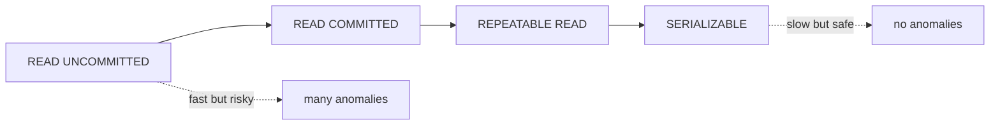

# Database Systems 101 (6/10): 격리 수준

동시성 버그는 이상하게도 한가할 때는 잘 보이지 않습니다. 그런데 부하가 몰리고, 두 사용자가 같은 자원을 동시에 만지고, 특정 타이밍이 겹치는 순간 갑자기 잔액이 이상해지고 재고가 음수가 되며 같은 주문이 두 번 생깁니다. 이때 많은 팀이 애플리케이션 코드만 뒤지지만, 실제 원인은 데이터베이스의 격리 수준 선택에 있는 경우가 많습니다.

이 글은 Database Systems 101 시리즈의 6번째 글입니다.

격리성은 켜고 끄는 스위치가 아니라, 안전성과 처리량 사이를 조정하는 다이얼에 가깝습니다. 너무 느슨하면 이상 현상이 남고, 너무 엄격하면 처리량이 급격히 떨어집니다. 이 글에서는 그 다이얼을 어떻게 읽어야 하는지, 그리고 MVCC와 행 잠금이 어떤 역할을 하는지 정리합니다.


*Database Systems 101 6장 흐름 개요*

## 이 글에서 다룰 문제

- 고전적인 동시성 이상 현상 네 가지는 무엇일까요?
- READ UNCOMMITTED, READ COMMITTED, REPEATABLE READ, SERIALIZABLE은 무엇이 다를까요?
- MVCC는 어떻게 일관된 읽기를 잠금 없이 제공할까요?
- 이 개념을 실무에서 잘못 적용하면 어떤 문제가 생길까요?
- 이 주제에서 초보자가 가장 자주 놓치는 포인트는 무엇일까요?

## 이 글에서 배울 내용

- 고전적인 동시성 이상 현상 네 가지
- 주요 격리 수준들의 차이
- MVCC가 잠금 없이 일관된 읽기를 제공하는 방식
- 워크로드별로 격리 수준을 고르는 감각

격리 수준을 모르면 "재현되지 않는 버그"의 절반은 설명되지 않습니다. 결제가 두 번 청구되거나, 잔액이 음수가 되거나, 같은 주문이 중복 생성되는 문제는 대개 단위 테스트만으로는 드러나지 않습니다. 동시성 문제는 평온한 환경에서 숨어 있다가, 가장 비싼 순간에 터집니다.

> 동시성 버그는 조용한 날에는 숨어 있다가, 시스템이 가장 바쁠 때 얼굴을 드러냅니다.


```mermaid
flowchart LR
    A["READ UNCOMMITTED"] --> B["READ COMMITTED"]
    B --> C["REPEATABLE READ"]
    C --> D["SERIALIZABLE"]
    A -.->|"fast but risky"| E["many anomalies"]
    D -.->|"slow but safe"| F["no anomalies"]
```

왼쪽에서 오른쪽으로 갈수록 더 안전하지만 비용도 커집니다. 대부분의 DBMS 기본값은 READ COMMITTED 또는 REPEATABLE READ에 놓여 있습니다.

- **Dirty Read**: 다른 트랜잭션이 아직 커밋하지 않은 값을 읽는 현상입니다.
- **Non-repeatable Read**: 같은 행을 두 번 읽었는데 값이 달라지는 현상입니다.
- **Phantom Read**: 같은 조건으로 두 번 읽었는데 행 개수가 달라지는 현상입니다.
- **Lost Update**: 두 트랜잭션이 같은 행을 동시에 갱신해 한쪽 변경이 사라지는 현상입니다.
- **MVCC**: 한 행의 여러 버전을 유지해 읽기와 쓰기가 서로를 덜 막도록 하는 방식입니다.

## 이상 현상과 격리 수준의 관계

**Before — wrong isolation: balance debited twice**

```sql
-- T1: SELECT balance FROM accounts WHERE id=1; -- 1000
-- T2: SELECT balance FROM accounts WHERE id=1; -- 1000
-- T1: UPDATE ... SET balance=900 WHERE id=1;
-- T2: UPDATE ... SET balance=900 WHERE id=1;  -- overwrites T1 (Lost Update)
```

**After — SELECT ... FOR UPDATE**

```sql
BEGIN;
SELECT balance FROM accounts WHERE id=1 FOR UPDATE;
-- 이 시점에 T2가 같은 행에 접근하면 T1 COMMIT까지 대기
UPDATE accounts SET balance = balance - 100 WHERE id=1;
COMMIT;
```

읽는 순간 행 잠금을 잡아 두면, 다른 트랜잭션이 같은 행을 건드리지 못하게 할 수 있습니다.

## 실습: 이상 현상을 직접 재현해 보기

### 1단계 — 두 세션 준비

```python
import sqlite3
c1 = sqlite3.connect("iso.db", isolation_level="DEFERRED")
c2 = sqlite3.connect("iso.db", isolation_level="DEFERRED")

c1.executescript("""
DROP TABLE IF EXISTS counter;
CREATE TABLE counter (id INTEGER PRIMARY KEY, n INTEGER);
INSERT INTO counter VALUES (1, 0);
""")
c1.commit()
```

두 세션이 같은 데이터를 동시에 만지는 상황을 의도적으로 만들기 위한 준비입니다.

### 2단계 — 갱신 손실 재현

```python
c1.execute("BEGIN")
c2.execute("BEGIN")
n1 = c1.execute("SELECT n FROM counter WHERE id=1").fetchone()[0]
n2 = c2.execute("SELECT n FROM counter WHERE id=1").fetchone()[0]
c1.execute("UPDATE counter SET n=? WHERE id=1", (n1 + 1,))
c2.execute("UPDATE counter SET n=? WHERE id=1", (n2 + 1,))
c1.commit()
c2.commit()
print(c1.execute("SELECT n FROM counter").fetchone())  # 1, not 2
```

두 세션 모두 0을 읽고 각자 1을 썼기 때문에, 한 번의 증가가 사라졌습니다.

### 3단계 — 갱신 손실 방지: 원자적 갱신

```sql
-- 애플리케이션에서 값을 읽지 않고 DB 안에서 원자적으로 증가
UPDATE counter SET n = n + 1 WHERE id = 1;
-- 이 방식은 읽기-수정-쓰기 사이클이 없어 Lost Update 불가
```

### 4단계 — 반복 가능 읽기의 일관성

```sql
-- T1
BEGIN ISOLATION LEVEL REPEATABLE READ;
SELECT count(*) FROM orders WHERE user_id=7;  -- 10

-- T2 (other session): INSERT INTO orders (user_id, ...) VALUES (7, ...); COMMIT;

-- T1
SELECT count(*) FROM orders WHERE user_id=7;  -- still 10 (스냅샷 유지)
COMMIT;
```

REPEATABLE READ에서는 트랜잭션 시작 시점의 스냅샷을 계속 봅니다. PostgreSQL은 이를 MVCC로 구현해 읽기와 쓰기가 서로를 덜 막도록 만듭니다.

### 5단계 — SERIALIZABLE과 재시도

```sql
-- T1, T2 모두 SERIALIZABLE 수준
-- T1: 조건 읽기 후 INSERT
-- T2: 같은 조건 동시 읽기 후 INSERT
-- 충돌 감지 시 한쪽이 SQLSTATE 40001로 실패 → 애플리케이션 재시도 필요
```

SERIALIZABLE은 가장 안전하지만, 충돌 감지와 재시도라는 운영 비용을 반드시 동반합니다.

## 격리 수준별 이상 현상 허용 여부

| 격리 수준 | Dirty Read | Non-repeatable Read | Phantom Read | Lost Update |
|-----------|-----------|---------------------|--------------|-------------|
| READ UNCOMMITTED | 허용 | 허용 | 허용 | 허용 |
| READ COMMITTED | 방지 | 허용 | 허용 | 허용 |
| REPEATABLE READ | 방지 | 방지 | 엔진별 상이 | 방지 |
| SERIALIZABLE | 방지 | 방지 | 방지 | 방지 |

PostgreSQL의 REPEATABLE READ는 팬텀 읽기도 MVCC로 방지하지만, 표준 SQL에서는 REPEATABLE READ가 팬텀을 허용합니다.

## MVCC 동작 원리

```sql
-- 같은 시점에 두 트랜잭션이 동일 행을 다르게 봄
-- T1 (txid=100): REPEATABLE READ
BEGIN;
SELECT balance FROM accounts WHERE id=1;
-- 스냅샷: txid < 100에서 커밋된 버전만 읽음

-- T2 (txid=101): balance를 800으로 수정 후 COMMIT
UPDATE accounts SET balance=800 WHERE id=1;
COMMIT;

-- T1: 여전히 이전 버전(txid 100 기준 스냅샷)을 읽음
SELECT balance FROM accounts WHERE id=1;  -- 1000 (버전 체인에서 찾음)
COMMIT;
```

MVCC 덕분에 PostgreSQL에서는 "읽기는 쓰기를 막지 않고, 쓰기는 읽기를 막지 않는다"는 기본 감각이 가능합니다.

## 동시성 제어 패턴

### 낙관적 잠금(Optimistic Locking)

```sql
-- version 컬럼으로 충돌 감지
CREATE TABLE inventory (
    sku     TEXT PRIMARY KEY,
    qty     INTEGER NOT NULL CHECK (qty >= 0),
    version INTEGER NOT NULL DEFAULT 0
);

-- 읽기 시 version 기억
SELECT qty, version FROM inventory WHERE sku = 'A-100';
-- qty=10, version=17

-- 수정 시 version 확인 후 갱신
UPDATE inventory
SET qty = qty - 1, version = version + 1
WHERE sku = 'A-100' AND version = 17;
-- 영향받은 행이 0이면 다른 트랜잭션이 먼저 수정 → 재시도
```

### 비관적 잠금(Pessimistic Locking)

```sql
-- FOR UPDATE로 행 잠금 획득
BEGIN;
SELECT qty FROM inventory WHERE sku = 'A-100' FOR UPDATE;
-- 이 시점에 다른 트랜잭션은 같은 행에 접근 불가

UPDATE inventory SET qty = qty - 1 WHERE sku = 'A-100';
COMMIT;
```

### SKIP LOCKED 패턴 (작업 큐)

```sql
-- 여러 워커가 동시에 처리할 작업을 충돌 없이 가져가는 패턴
BEGIN;
SELECT id, payload
FROM job_queue
WHERE status = 'PENDING'
ORDER BY created_at
LIMIT 1
FOR UPDATE SKIP LOCKED;  -- 잠긴 행은 건너뜀

UPDATE job_queue SET status = 'PROCESSING' WHERE id = ?;
COMMIT;
```

## 자주 하는 실수

| 실수 | 증상 | 올바른 접근 |
|------|------|-------------|
| 격리 수준 의식 없이 카운터·재고 갱신 | Lost Update 발생 (잔액 불일치, 재고 음수) | 원자적 갱신(`n = n + 1`) 또는 FOR UPDATE 사용 |
| SERIALIZABLE 켜고 재시도 루프 미구현 | 직렬화 실패가 사용자 오류로 표출 | 재시도 루프 + 지수 백오프 구현 필수 |
| 모든 DBMS에서 REPEATABLE READ가 팬텀 방지 | 엔진별 상이한 동작으로 버그 발생 | 실제 DBMS 문서 확인, 테스트로 검증 |
| FOR UPDATE를 과하게 남발 | 잠금 범위 확대로 동시성 급락 | 정말 필요한 행에만 선택적으로 적용 |
| 격리 수준 설정을 코드 안에 묻어둔다 | 어떤 트랜잭션이 어떤 수준인지 파악 불가 | 명시적 설정과 문서화 |

## 핵심 요약

- 격리 수준은 옵티마이저가 아니라 **개발자와 시스템 설계자**가 선택합니다.
- MVCC 덕분에 PostgreSQL에서는 읽기와 쓰기가 서로를 덜 막습니다.
- `FOR UPDATE`는 행 잠금을 잡는 가장 실용적인 수단입니다.
- SERIALIZABLE을 재시도 로직 없이 쓰면, 시스템은 산발적 실패에 매우 약해집니다.
- 오래 열린 트랜잭션은 MVCC 버전 체인을 붙잡아 저장소를 팽창시킬 수 있습니다.

## 시니어 엔지니어는 이렇게 생각합니다

- "이 트랜잭션이 다른 트랜잭션과 동시에 돌면 무엇이 깨질까?"를 반복해서 묻습니다.
- 잠금 범위를 작게 유지하려고 합니다.
- 재시도 가능한 실패와 불가능한 실패를 명확히 구분합니다.
- 격리 수준 변경은 최우선 코드 리뷰 주제로 다룹니다.
- 동시성 버그는 머릿속 추론만으로 끝내지 않고, 로그와 재현 시나리오로 검증합니다.

## 운영 체크리스트

- [ ] 핵심 쓰기 경로의 격리 수준을 정확히 알고 있는가?
- [ ] Lost Update 가능 지점에 잠금 또는 원자적 갱신이 적용되어 있는가?
- [ ] SERIALIZABLE을 쓴다면 재시도 루프가 준비되어 있는가?
- [ ] 트랜잭션이 짧고 외부 호출이 없는가?
- [ ] 적어도 하나 이상의 동시성 시나리오를 통합 테스트로 검증하는가?

## 연습 문제

1. READ COMMITTED에서 여전히 가능한 이상 현상 두 가지를 적어 보세요.
2. MVCC가 어떻게 "읽기는 쓰기를 막지 않고, 쓰기는 읽기를 막지 않는다"를 가능하게 하는지 한 단락으로 설명해 보세요.
3. 카운터 컬럼의 동시 INCREMENT를 안전하게 처리하는 방법 두 가지를 적어 보세요.

## 정리 및 다음 단계

격리 수준은 동시성 안전성과 처리량 사이의 다이얼입니다. 이상 현상과 각 수준의 약속을 이해하면 장애를 만난 뒤에 수습하는 대신, 애초에 실패 모드를 설계할 수 있습니다. 다음 글에서는 한 단계 위로 올라가 데이터 모델 자체의 품질, 즉 정규화와 함수 종속을 살펴봅니다.

<!-- toc:begin -->
## 시리즈 목차

- [Database Systems 101 (1/10): 데이터베이스 시스템이란 무엇인가?](./01-what-is-a-database.md)
- [Database Systems 101 (2/10): 관계형 모델](./02-relational-model.md)
- [Database Systems 101 (3/10): SQL과 쿼리 처리](./03-sql-and-query-processing.md)
- [Database Systems 101 (4/10): 인덱스](./04-indexes.md)
- [Database Systems 101 (5/10): 트랜잭션과 ACID](./05-transactions-and-acid.md)
- **Database Systems 101 (6/10): 격리 수준 (현재 글)**
- [Database Systems 101 (7/10): 정규화와 모델링](./07-normalization-and-modeling.md)
- [Database Systems 101 (8/10): 쿼리 최적화](./08-query-optimization.md)
- [Database Systems 101 (9/10): 복제와 백업](./09-replication-and-backup.md)
- [Database Systems 101 (10/10): OLTP와 OLAP](./10-oltp-and-olap.md)

<!-- toc:end -->

## 참고 자료

- [database-systems-101 예제 코드 (book-examples)](https://github.com/yeongseon-books/book-examples/tree/main/database-systems-101/ko)
- [PostgreSQL — Transaction Isolation](https://www.postgresql.org/docs/current/transaction-iso.html)
- [Jepsen — Consistency Models](https://jepsen.io/consistency)
- [A Critique of ANSI SQL Isolation Levels (Berenson et al.)](https://www.microsoft.com/en-us/research/publication/a-critique-of-ansi-sql-isolation-levels/)
- [Designing Data-Intensive Applications — Chapter 7](https://dataintensive.net/)

Tags: Computer Science, Database, Isolation, MVCC, 동시성, 이상현상
