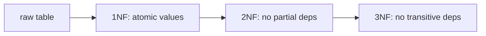

# Database Systems 101 (7/10): 정규화와 모델링

데이터 모델이 엉성하면 모든 쿼리가 그 대가를 치릅니다. 같은 사실이 여러 곳에 흩어져 있으면 갱신은 빠뜨리기 쉽고, JOIN 결과는 상황에 따라 다르게 보이며, 동시성 문제도 더 자주 생깁니다. 그래서 좋은 모델링은 단순히 테이블을 예쁘게 나누는 일이 아니라, 시스템이 장기적으로 일관성을 유지하게 만드는 가장 저렴한 보험입니다.

이 글은 Database Systems 101 시리즈의 7번째 글입니다.

정규화는 이 문제를 푸는 고전적 도구입니다. “각 사실은 정확히 한 곳에 둔다”는 원칙을 1NF, 2NF, 3NF라는 단계별 규칙으로 풀어낸 것이기 때문입니다. 이 글에서는 함수 종속을 중심 축으로 잡고, 왜 테이블을 쪼개야 하는지와 어디까지 쪼개야 하는지를 설명하겠습니다.


*Database Systems 101 7장 흐름 개요*

## 먼저 던지는 질문

- 함수 종속은 어떤 직관으로 이해하면 좋을까요?
- 1NF, 2NF, 3NF는 각각 무엇을 금지할까요?
- 비정규화는 언제 정당화될까요?

## 이 글에서 배울 내용

- 함수 종속의 기본 직관
- 1NF, 2NF, 3NF의 차이
- 비정규화가 정당화되는 시점
- 좋은 데이터 모델이 줄여 주는 비용

## 왜 중요한가

엉성한 모델은 모든 쿼리에 세금을 매깁니다. 같은 사실이 여러 테이블이나 여러 행에 흩어져 있으면, 수정은 누락되고 조회는 일관되지 않으며 버그는 늦게 발견됩니다. 정규화는 그 위험을 애플리케이션 코드가 아니라 모델 계층에서 먼저 제거합니다.

> 좋은 모델은 “이 값을 바꾸려면 N개의 행을 동시에 수정해야 한다”는 상황을 가능하면 만들지 않습니다.

## 핵심 개념 한눈에 보기



각 단계는 바로 앞 단계를 만족한 상태에서 한 가지 규칙을 더합니다. 대부분의 OLTP 모델에는 3NF면 충분합니다.

## 핵심 용어

- **함수 종속(X → Y)**: X가 같으면 Y도 같아야 하는 관계입니다.
- 기본키: 한 행을 유일하게 식별하는 컬럼 집합입니다.
- **1NF**: 모든 컬럼이 원자 값을 가져야 합니다. 배열이나 콤마 리스트를 두지 않습니다.
- **2NF**: 1NF를 만족하면서, 복합키의 일부에만 의존하는 부분 종속이 없어야 합니다.
- **3NF**: 2NF를 만족하면서, 비키 컬럼이 다른 비키 컬럼에 의존하는 이행 종속이 없어야 합니다.

## 변경 전/변경 후

**Before — everything in one table**

```text
orders(id, user_id, user_email, product_id, product_name, product_price, quantity)
```

`user_email`은 `user_id`에 종속되고, `product_name`과 `product_price`는 `product_id`에 종속됩니다. 사용자의 이메일을 바꾸려면 그 사용자의 모든 주문 행을 수정해야 합니다.

**After — split**

```text
users(id, email)
products(id, name, price)
orders(id, user_id, product_id, quantity)
```

이제 이메일은 `users`의 한 행에만 존재하고, 주문 조회는 필요할 때 JOIN으로 진실의 원본에 다시 연결됩니다.

## 실습: 단계별로 정규화해 보기

### 1단계 — 원시 데이터 보기

```python
# raw.py
rows = [
    (1, 7, "alice@x.com", "P-1, P-2", "Bag, Hat", "20, 5"),
    (2, 7, "alice@x.com", "P-1",       "Bag",      "20"),
]
```

`product_id`가 콤마 구분 문자열로 들어 있습니다. 이 한 장면만으로도 1NF 위반이라는 것을 알아야 합니다.

### 2단계 — 제1정규형: 행으로 펼치기

```python
import sqlite3

with sqlite3.connect("shop.db") as db:
    db.executescript("""
        DROP TABLE IF EXISTS order_items_raw;
        CREATE TABLE order_items_raw (
            order_id INTEGER, user_id INTEGER, user_email TEXT,
            product_id TEXT, product_name TEXT, product_price INTEGER
        );
    """)
    db.executemany(
        "INSERT INTO order_items_raw VALUES (?, ?, ?, ?, ?, ?)",
        [
            (1, 7, "alice@x.com", "P-1", "Bag", 20),
            (1, 7, "alice@x.com", "P-2", "Hat", 5),
            (2, 7, "alice@x.com", "P-1", "Bag", 20),
        ],
    )
```

이제 각 셀은 정확히 하나의 값만 담습니다. 정규화는 늘 이 원자성 확보에서 출발합니다.

### 3단계 — 제2정규형: 부분 종속 제거

`(order_id, product_id)`를 복합키로 본다면 `product_name`, `product_price`는 `product_id`에만 의존합니다. 이는 부분 종속이므로 별도 관계로 분리해야 합니다.

```python
with sqlite3.connect("shop.db") as db:
    db.executescript("""
        DROP TABLE IF EXISTS products;
        CREATE TABLE products (
            id    TEXT PRIMARY KEY,
            name  TEXT NOT NULL,
            price INTEGER NOT NULL
        );
    """)
    db.execute("INSERT INTO products VALUES ('P-1','Bag',20),('P-2','Hat',5)")
```

### 4단계 — 제3정규형: 이행 종속 제거

`order_id → user_id → user_email`은 이행 종속입니다. 사용자 정보는 주문과 별도 관계로 두는 것이 맞습니다.

```python
with sqlite3.connect("shop.db") as db:
    db.executescript("""
        DROP TABLE IF EXISTS users;
        CREATE TABLE users (
            id    INTEGER PRIMARY KEY,
            email TEXT NOT NULL UNIQUE
        );
    """)
    db.execute("INSERT INTO users VALUES (7, 'alice@x.com')")
```

### 5단계 — 최종 모델

```python
with sqlite3.connect("shop.db") as db:
    db.executescript("""
        DROP TABLE IF EXISTS orders;
        DROP TABLE IF EXISTS order_items;
        CREATE TABLE orders (
            id      INTEGER PRIMARY KEY,
            user_id INTEGER NOT NULL REFERENCES users(id)
        );
        CREATE TABLE order_items (
            order_id   INTEGER NOT NULL REFERENCES orders(id),
            product_id TEXT    NOT NULL REFERENCES products(id),
            quantity   INTEGER NOT NULL,
            PRIMARY KEY (order_id, product_id)
        );
    """)
```

이제 각 사실은 정확히 한 곳에만 존재합니다. 이메일 변경은 `users`의 한 행 수정으로 끝나고, 상품 가격도 `products` 한 군데에서만 관리됩니다.

## 이 코드에서 먼저 봐야 할 점

- 정규화는 크게 보면 **함수 종속을 따라 테이블을 나누는 작업**입니다.
- 외래키는 그렇게 나눈 모델을 다시 일관되게 묶어 주는 강력한 도구입니다.
- 대부분의 OLTP 모델은 3NF면 충분합니다. BCNF나 4NF는 특이한 종속이 나올 때 고민하면 됩니다.

## 자주 하는 실수 5가지

1. **콤마 리스트로 다대다를 표현한다.** 1NF를 깨고, 검색과 조인을 모두 불편하게 만듭니다.
2. **이메일·전화번호처럼 자주 바뀌는 값을 여러 테이블에 중복 저장한다.** 갱신 누락이 필연적으로 생깁니다.
3. **자연키를 기본키로 쓴다.** 값 변경이 모든 참조를 흔들 수 있습니다.
4. **모든 모델을 무조건 끝까지 정규화한다.** 분석 워크로드에서는 비정규화가 더 적절할 수 있습니다.
5. **테이블은 나눴지만 외래키는 꺼 둔다.** 이는 정규화가 아니라 “정규화된 척”입니다.

## 실무에서는 이렇게 드러납니다

OLTP 시스템은 대체로 3NF 근처에서 출발합니다. 이후 특정 화면이나 API가 너무 많은 JOIN을 요구할 때, 측정 결과를 바탕으로 비정규화 컬럼이나 캐시 테이블을 추가합니다. 핵심은 비정규화가 출발점이 아니라, 측정 이후의 의도적 선택이어야 한다는 사실입니다.

반대로 분석 시스템은 정규화보다 집계 효율을 우선시합니다. 그래서 스타 스키마처럼 의도적으로 비정규화된 구조를 채택합니다. 운영 모델과 분석 모델이 서로 다른 이유는, 둘이 다뤄야 하는 질문의 종류가 다르기 때문입니다.

## 시니어 엔지니어는 이렇게 생각합니다

- 새 컬럼을 추가하기 전에 “이 값은 어떤 키에 종속되는가?”를 먼저 묻습니다.
- 같은 사실이 두 테이블에 사는 모델을 기본적으로 의심합니다.
- 외래키를 끄는 선택은 매우 드물고, 한다면 이유를 문서로 남깁니다.
- 비정규화는 측정이 요구할 때만 배포합니다.
- 모델 변경은 항상 마이그레이션 스크립트와 함께 갑니다.

## 체크리스트

- [ ] 모든 컬럼이 원자 값을 가지는가?
- [ ] 부분 종속과 이행 종속이 제거되었는가?
- [ ] 외래키 제약이 실제로 켜져 있는가?
- [ ] 비정규화 컬럼이 있다면 갱신 책임이 명확한가?
- [ ] 스키마 다이어그램이 코드와 동기화되어 있는가?

## 연습 문제

1. `(order_id, product_id, product_price)` 테이블에서 어떤 종속이 깨져 있는지 한 문장으로 설명해 보세요.
2. surrogate key(자동 증가 ID)를 자연키 대신 쓸 때의 장점과 단점을 적어 보세요.
3. 다섯 테이블 JOIN이 필요한 분석 화면이 매우 느립니다. 비정규화 전에 먼저 고려할 수 있는 대안 두 가지를 적어 보세요.

## 정리 및 다음 단계

정규화는 함수 종속을 따라 모델을 분리해 “각 사실은 한 곳에만 존재한다”는 원칙을 지키는 작업입니다. 1NF, 2NF, 3NF는 그 원칙을 단계별로 점검하는 체크리스트이고, 외래키는 그 결과를 강제하는 도구입니다. 다음 글에서는 이렇게 만든 모델과 인덱스를 바탕으로, 옵티마이저가 실제로 어떻게 빠른 계획을 고르는지 살펴봅니다.

## 정규화 예시: 한 테이블에서 세 테이블로

정규화는 추상 이론이 아니라 갱신 이상을 줄이는 실무 장치입니다. 아래 반정규 형태를 보겠습니다.

```text
orders_raw(order_id, user_id, user_email, item_sku, item_name, item_price, qty)
```

이 구조는 같은 사용자 이메일과 상품 가격이 주문 행마다 반복됩니다. 값이 바뀔 때 일부 행만 수정되면 즉시 불일치가 생깁니다.

```text
1NF 이후
- orders(order_id, user_id, created_at)
- order_items(order_id, item_sku, qty, item_price_at_order)
- users(user_id, user_email)
```

이렇게 분리하면 책임 경계가 분명해집니다. 사용자 이메일은 `users`에서, 주문 당시 가격은 `order_items`에서 관리합니다.

## 비정규화를 선택할 때의 기준

분석 조회가 매우 빈번하고 JOIN 비용이 반복적으로 문제라면, 읽기 모델에 한해 제한적 비정규화를 적용할 수 있습니다. 다만 원천 데이터의 정합성은 정규화된 쓰기 모델에서 유지해야 합니다.

- 쓰기 모델: 정규화 우선, 무결성 제약 강하게 유지
- 읽기 모델: 조회 패턴 중심으로 요약 테이블 또는 머티리얼라이즈드 뷰 사용
- 동기화 방식: 지연 허용 시간과 재계산 비용을 명시

정규화와 비정규화는 대립이 아니라 역할 분담입니다.

## 실전 운영 점검표

운영 환경에서 데이터베이스 품질을 안정적으로 유지하려면, 기능 개발과 별개로 점검 루틴을 명확하게 가져가야 합니다. 아래 항목은 서비스 규모와 상관없이 바로 적용할 수 있는 기준입니다.

- 변경 전에는 항상 기준 지표를 남깁니다. 평균 지연 시간, P95, P99, 초당 트랜잭션 수, 잠금 대기 시간 같은 숫자를 캡처해 둬야 변경 이후를 비교할 수 있습니다.
- 쿼리 튜닝은 SQL 문장 자체보다 실행 계획의 변화를 중심으로 추적합니다. 계획 노드가 바뀌었는지, 예상 행 수와 실제 행 수의 차이가 커졌는지, 정렬이나 해시가 디스크로 내려갔는지를 우선 확인합니다.
- 스키마 변경은 단계적으로 진행합니다. 컬럼 추가, 백필, 코드 전환, 제약 강화 순서로 나누면 장애 반경을 줄일 수 있습니다.
- 장애 대응 문서는 운영자가 밤중에도 바로 실행할 수 있는 형태여야 합니다. 복구 절차, 롤백 절차, 검증 SQL을 같은 문서에 둬야 실제 상황에서 흔들리지 않습니다.

아래 예시는 팀이 릴리스 전후에 반복적으로 실행하는 최소 점검 SQL입니다.

```sql
-- 최근 10분 동안 느린 쿼리 확인(엔진별 뷰 이름은 다를 수 있음)
SELECT query, calls, mean_exec_time, rows
FROM pg_stat_statements
ORDER BY mean_exec_time DESC
LIMIT 20;

-- 잠금 대기 체인 확인
SELECT now(), pid, wait_event_type, wait_event, state, query
FROM pg_stat_activity
WHERE wait_event_type IS NOT NULL;

-- 인덱스 사용률 점검
SELECT relname AS table_name, seq_scan, idx_scan
FROM pg_stat_user_tables
ORDER BY seq_scan DESC
LIMIT 20;
```

이 점검 루틴을 자동화 파이프라인에 연결하면, 성능 저하를 "느낌"이 아니라 "증거"로 관리할 수 있습니다. 결국 장기 운영에서 중요한 것은 뛰어난 한 번의 튜닝이 아니라, 작은 검증을 꾸준히 반복해 위험을 조기에 감지하는 습관입니다.
## 운영 리허설 시나리오

문서만 읽고 끝내면 운영에서 다시 같은 실수를 반복하기 쉽습니다. 아래 시나리오는 팀 온보딩과 장애 대응 훈련에 바로 사용할 수 있는 공통 리허설 절차입니다.

### 시나리오 1: 느려진 조회 원인 찾기

1. 문제 쿼리를 식별합니다. 애플리케이션 로그의 요청 식별자와 데이터베이스 쿼리 로그를 매칭합니다.
2. 같은 파라미터로 `EXPLAIN ANALYZE`를 실행합니다.
3. 계획 노드 중 시간이 큰 지점을 찾고, 해당 노드가 인덱스/통계/정렬 중 무엇과 관련 있는지 분류합니다.
4. 개선안을 한 번에 하나만 적용합니다. 인덱스 추가, 통계 갱신, 질의문 재작성 가운데 하나만 바꿔 결과를 비교합니다.

```text
개선 전
Seq Scan on events  (actual time=0.030..842.112 rows=12000)

개선 후
Index Scan using idx_events_tenant_created on events
(actual time=0.041..21.553 rows=12000)
```

### 시나리오 2: 동시성 문제 재현과 완화

1. 두 세션에서 같은 행을 거의 동시에 수정합니다.
2. 격리 수준을 바꿔 가며 결과를 비교합니다.
3. 필요하면 `FOR UPDATE` 잠금 조회 또는 낙관적 잠금 버전 컬럼을 적용합니다.
4. 재시도 정책과 타임아웃 기준을 코드와 운영 문서에 같이 기록합니다.

```sql
-- 낙관적 잠금 예시
UPDATE inventory
SET qty = qty - 1, version = version + 1
WHERE sku = 'A-100' AND version = 17;
```

영향 받은 행 수가 0이면 이미 다른 트랜잭션이 갱신한 것이므로, 재조회 후 재시도합니다. 이 패턴은 잠금 경합을 낮추면서도 정합성을 지키는 데 효과적입니다.

### 시나리오 3: 복구 가능성 검증

1. 최신 베이스 백업으로 테스트 인스턴스를 띄웁니다.
2. 지정 시점까지 로그를 재적용합니다.
3. 핵심 비즈니스 검증 SQL을 실행합니다.
4. 복구 시간(RTO)과 데이터 유실 허용치(RPO)를 실제 숫자로 기록합니다.

```sql
-- 검증 SQL 예시
SELECT COUNT(*) FROM orders WHERE created_at >= now() - interval '1 day';
SELECT SUM(amount) FROM payments WHERE status = 'SUCCESS';
SELECT COUNT(*) FROM users WHERE deleted_at IS NULL;
```

복구 리허설에서 가장 중요한 점은 성공 여부 자체보다, 누가 어떤 순서로 무엇을 확인했는지를 재현 가능하게 남기는 것입니다. 절차가 사람마다 다르면 실제 장애에서 속도와 품질이 동시에 무너집니다.

## 체크리스트: 배포 전 최소 검증

- 대표 조회 5개에 대해 실행 계획을 저장합니다.
- 트랜잭션 경계가 긴 코드 경로를 식별합니다.
- 잠금 대기 알람 임계치를 설정합니다.
- 스키마 변경의 롤백 경로를 문서화합니다.
- 백업 복구 리허설 최근 실행일을 확인합니다.

이 체크리스트는 거창한 체계를 요구하지 않습니다. 작은 팀도 주 1회 반복하면 데이터 사고 빈도를 눈에 띄게 줄일 수 있습니다. 데이터베이스 운영의 본질은 "고급 기능을 많이 아는 것"이 아니라, "반복 가능한 검증 루프를 끊기지 않게 유지하는 것"입니다.

## 추가 실습 기록 템플릿

아래 템플릿은 팀 위키에 그대로 붙여 넣어 실습 결과를 남길 때 사용합니다.

```text
[실습 이름]
- 실행 일시:
- 실행 환경:
- 입력 데이터 규모:
- 대표 SQL:
- EXPLAIN ANALYZE 핵심 노드:
- 개선 전/후 실행 시간:
- 적용 변경 사항:
- 부작용 또는 주의점:
- 다음 점검 항목:
```

실습 기록을 남기면 지식이 개인 경험으로 소모되지 않고 팀 자산으로 누적됩니다. 특히 실행 계획 캡처와 복구 절차 검증 결과를 함께 보관하면, 다음 장애 대응에서 판단 속도를 크게 높일 수 있습니다.

## 처음 질문으로 돌아가기

- **함수 종속은 어떤 직관으로 이해하면 좋을까요?**
  - 함수 종속은 어떤 값이 정해지면 다른 값도 함께 정해지는 관계로 보면 됩니다. 이 글의 예시에서는 `user_id`가 같으면 `user_email`도 같아야 하고, `product_id`가 같으면 `product_name`과 `product_price`도 같아야 한다는 식으로 읽었습니다.
- **1NF, 2NF, 3NF는 각각 무엇을 금지할까요?**
  - 1NF는 `"P-1, P-2"` 같은 콤마 리스트처럼 한 셀에 여러 값을 넣는 것을 금지합니다. 2NF는 `(order_id, product_id)` 복합키 일부에만 의존하는 `product_name` 같은 부분 종속을 금지하고, 3NF는 `order_id → user_id → user_email`처럼 비키 컬럼을 거치는 이행 종속을 분리하라고 요구합니다.
- **비정규화는 언제 정당화될까요?**
  - 비정규화는 출발점이 아니라, 정규화된 모델 위에서 실제 JOIN 비용이나 분석 조회 비용이 반복해서 문제일 때 선택하는 후속 최적화입니다. 글에서도 쓰기 모델은 정규화를 유지하고, 읽기 모델에는 요약 테이블이나 머티리얼라이즈드 뷰 같은 별도 구조를 두는 방식이 더 안전하다고 설명했습니다.

<!-- toc:begin -->
## 시리즈 목차

- [Database Systems 101 (1/10): 데이터베이스 시스템이란 무엇인가?](./01-what-is-a-database.md)
- [Database Systems 101 (2/10): 관계형 모델](./02-relational-model.md)
- [Database Systems 101 (3/10): SQL과 쿼리 처리](./03-sql-and-query-processing.md)
- [Database Systems 101 (4/10): 인덱스](./04-indexes.md)
- [Database Systems 101 (5/10): 트랜잭션과 ACID](./05-transactions-and-acid.md)
- [Database Systems 101 (6/10): 격리 수준](./06-isolation-levels.md)
- **정규화와 모델링 (현재 글)**
- 쿼리 최적화 (예정)
- 복제와 백업 (예정)
- OLTP와 OLAP (예정)

<!-- toc:end -->

## 참고 자료

- [database-systems-101 예제 코드 (book-examples)](https://github.com/yeongseon-books/book-examples/tree/main/database-systems-101/ko)
- [Wikipedia — Database Normalization](https://en.wikipedia.org/wiki/Database_normalization)
- [PostgreSQL — Data Modeling](https://www.postgresql.org/docs/current/ddl.html)
- [Designing Data-Intensive Applications — Chapter 2](https://dataintensive.net/)
- [Microsoft — Description of the database normalization basics](https://learn.microsoft.com/en-us/office/troubleshoot/access/database-normalization-description)

Tags: Computer Science, Database, 정규화, 모델링, 1NF, 의존성
