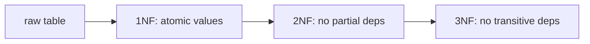

# 정규화와 모델링

이 글은 Database Systems 101 시리즈의 일곱 번째 글입니다.

데이터 모델이 엉성하면 모든 쿼리가 그 대가를 치릅니다. 같은 사실이 여러 곳에 흩어져 있으면 갱신은 빠뜨리기 쉽고, JOIN 결과는 상황에 따라 다르게 보이며, 동시성 문제도 더 자주 생깁니다. 그래서 좋은 모델링은 단순히 테이블을 예쁘게 나누는 일이 아니라, 시스템이 장기적으로 일관성을 유지하게 만드는 가장 저렴한 보험입니다.

정규화는 이 문제를 푸는 고전적 도구입니다. “각 사실은 정확히 한 곳에 둔다”는 원칙을 1NF, 2NF, 3NF라는 단계별 규칙으로 풀어낸 것이기 때문입니다. 이 글에서는 함수 종속을 중심 축으로 잡고, 왜 테이블을 쪼개야 하는지와 어디까지 쪼개야 하는지를 설명하겠습니다.

## 이 글에서 다룰 문제

- 함수 종속은 어떤 직관으로 이해하면 좋을까요?
- 1NF, 2NF, 3NF는 각각 무엇을 금지할까요?
- 비정규화는 언제 정당화될까요?
- 좋은 데이터 모델은 어떤 비용을 아예 테이블 위로 올려놓지 않을까요?

> **멘탈 모델**: 정규화는 결국 함수 종속을 따라 테이블을 분리해 “같은 사실은 한 곳에만 존재하게 만드는 작업”입니다. 모델이 좋아지면 UPDATE 이상 현상과 중복, 일부 동시성 위험이 애초에 발생하기 어려워집니다.

## 이 글에서 배울 내용

- 함수 종속의 기본 직관
- 1NF, 2NF, 3NF의 차이
- 비정규화가 정당화되는 시점
- 좋은 데이터 모델이 줄여 주는 비용

## 왜 중요한가

엉성한 모델은 모든 쿼리에 세금을 매깁니다. 같은 사실이 여러 테이블이나 여러 행에 흩어져 있으면, 수정은 누락되고 조회는 일관되지 않으며 버그는 늦게 발견됩니다. 정규화는 그 위험을 애플리케이션 코드가 아니라 모델 계층에서 먼저 제거합니다.

> 좋은 모델은 “이 값을 바꾸려면 N개의 행을 동시에 수정해야 한다”는 상황을 가능하면 만들지 않습니다.

## 핵심 개념 한눈에 보기



각 단계는 바로 앞 단계를 만족한 상태에서 한 가지 규칙을 더합니다. 대부분의 OLTP 모델에는 3NF면 충분합니다.

## 핵심 용어

- **함수 종속(X → Y)**: X가 같으면 Y도 같아야 하는 관계입니다.
- 기본키: 한 행을 유일하게 식별하는 컬럼 집합입니다.
- **1NF**: 모든 컬럼이 원자 값을 가져야 합니다. 배열이나 콤마 리스트를 두지 않습니다.
- **2NF**: 1NF를 만족하면서, 복합키의 일부에만 의존하는 부분 종속이 없어야 합니다.
- **3NF**: 2NF를 만족하면서, 비키 컬럼이 다른 비키 컬럼에 의존하는 이행 종속이 없어야 합니다.

## Before/After

**Before — everything in one table**

```
orders(id, user_id, user_email, product_id, product_name, product_price, quantity)
```

`user_email`은 `user_id`에 종속되고, `product_name`과 `product_price`는 `product_id`에 종속됩니다. 사용자의 이메일을 바꾸려면 그 사용자의 모든 주문 행을 수정해야 합니다.

**After — split**

```
users(id, email)
products(id, name, price)
orders(id, user_id, product_id, quantity)
```

이제 이메일은 `users`의 한 행에만 존재하고, 주문 조회는 필요할 때 JOIN으로 진실의 원본에 다시 연결됩니다.

## 실습: 단계별로 정규화해 보기

### 1단계 — 원시 데이터 보기

```python
# raw.py
rows = [
    (1, 7, "alice@x.com", "P-1, P-2", "Bag, Hat", "20, 5"),
    (2, 7, "alice@x.com", "P-1",       "Bag",      "20"),
]
```

`product_id`가 콤마 구분 문자열로 들어 있습니다. 이 한 장면만으로도 1NF 위반이라는 것을 알아야 합니다.

### 2단계 — 1NF: 행으로 펼치기

```python
import sqlite3

with sqlite3.connect("shop.db") as db:
    db.executescript("""
        DROP TABLE IF EXISTS order_items_raw;
        CREATE TABLE order_items_raw (
            order_id INTEGER, user_id INTEGER, user_email TEXT,
            product_id TEXT, product_name TEXT, product_price INTEGER
        );
    """)
    db.executemany(
        "INSERT INTO order_items_raw VALUES (?, ?, ?, ?, ?, ?)",
        [
            (1, 7, "alice@x.com", "P-1", "Bag", 20),
            (1, 7, "alice@x.com", "P-2", "Hat", 5),
            (2, 7, "alice@x.com", "P-1", "Bag", 20),
        ],
    )
```

이제 각 셀은 정확히 하나의 값만 담습니다. 정규화는 늘 이 원자성 확보에서 출발합니다.

### 3단계 — 2NF: 부분 종속 제거

`(order_id, product_id)`를 복합키로 본다면 `product_name`, `product_price`는 `product_id`에만 의존합니다. 이는 부분 종속이므로 별도 관계로 분리해야 합니다.

```python
with sqlite3.connect("shop.db") as db:
    db.executescript("""
        DROP TABLE IF EXISTS products;
        CREATE TABLE products (
            id    TEXT PRIMARY KEY,
            name  TEXT NOT NULL,
            price INTEGER NOT NULL
        );
    """)
    db.execute("INSERT INTO products VALUES ('P-1','Bag',20),('P-2','Hat',5)")
```

### 4단계 — 3NF: 이행 종속 제거

`order_id → user_id → user_email`은 이행 종속입니다. 사용자 정보는 주문과 별도 관계로 두는 것이 맞습니다.

```python
with sqlite3.connect("shop.db") as db:
    db.executescript("""
        DROP TABLE IF EXISTS users;
        CREATE TABLE users (
            id    INTEGER PRIMARY KEY,
            email TEXT NOT NULL UNIQUE
        );
    """)
    db.execute("INSERT INTO users VALUES (7, 'alice@x.com')")
```

### 5단계 — 최종 모델

```python
with sqlite3.connect("shop.db") as db:
    db.executescript("""
        DROP TABLE IF EXISTS orders;
        DROP TABLE IF EXISTS order_items;
        CREATE TABLE orders (
            id      INTEGER PRIMARY KEY,
            user_id INTEGER NOT NULL REFERENCES users(id)
        );
        CREATE TABLE order_items (
            order_id   INTEGER NOT NULL REFERENCES orders(id),
            product_id TEXT    NOT NULL REFERENCES products(id),
            quantity   INTEGER NOT NULL,
            PRIMARY KEY (order_id, product_id)
        );
    """)
```

이제 각 사실은 정확히 한 곳에만 존재합니다. 이메일 변경은 `users`의 한 행 수정으로 끝나고, 상품 가격도 `products` 한 군데에서만 관리됩니다.

## 이 코드에서 먼저 봐야 할 점

- 정규화는 크게 보면 **함수 종속을 따라 테이블을 나누는 작업**입니다.
- 외래키는 그렇게 나눈 모델을 다시 일관되게 묶어 주는 강력한 도구입니다.
- 대부분의 OLTP 모델은 3NF면 충분합니다. BCNF나 4NF는 특이한 종속이 나올 때 고민하면 됩니다.

## 자주 하는 실수 5가지

1. **콤마 리스트로 다대다를 표현한다.** 1NF를 깨고, 검색과 조인을 모두 불편하게 만듭니다.
2. **이메일·전화번호처럼 자주 바뀌는 값을 여러 테이블에 중복 저장한다.** 갱신 누락이 필연적으로 생깁니다.
3. **자연키를 기본키로 쓴다.** 값 변경이 모든 참조를 흔들 수 있습니다.
4. **모든 모델을 무조건 끝까지 정규화한다.** 분석 워크로드에서는 비정규화가 더 적절할 수 있습니다.
5. **테이블은 나눴지만 외래키는 꺼 둔다.** 이는 정규화가 아니라 “정규화된 척”입니다.

## 실무에서는 이렇게 드러납니다

OLTP 시스템은 대체로 3NF 근처에서 출발합니다. 이후 특정 화면이나 API가 너무 많은 JOIN을 요구할 때, 측정 결과를 바탕으로 비정규화 컬럼이나 캐시 테이블을 추가합니다. 핵심은 비정규화가 출발점이 아니라, 측정 이후의 의도적 선택이어야 한다는 점입니다.

반대로 분석 시스템은 정규화보다 집계 효율을 우선시합니다. 그래서 스타 스키마처럼 의도적으로 비정규화된 구조를 채택합니다. 운영 모델과 분석 모델이 서로 다른 이유는, 둘이 다뤄야 하는 질문의 종류가 다르기 때문입니다.

## 시니어 엔지니어는 이렇게 생각합니다

- 새 컬럼을 추가하기 전에 “이 값은 어떤 키에 종속되는가?”를 먼저 묻습니다.
- 같은 사실이 두 테이블에 사는 모델을 기본적으로 의심합니다.
- 외래키를 끄는 선택은 매우 드물고, 한다면 이유를 문서로 남깁니다.
- 비정규화는 측정이 요구할 때만 배포합니다.
- 모델 변경은 항상 마이그레이션 스크립트와 함께 갑니다.

## 체크리스트

- [ ] 모든 컬럼이 원자 값을 가지는가?
- [ ] 부분 종속과 이행 종속이 제거되었는가?
- [ ] 외래키 제약이 실제로 켜져 있는가?
- [ ] 비정규화 컬럼이 있다면 갱신 책임이 명확한가?
- [ ] 스키마 다이어그램이 코드와 동기화되어 있는가?

## 연습 문제

1. `(order_id, product_id, product_price)` 테이블에서 어떤 종속이 깨져 있는지 한 문장으로 설명해 보세요.
2. surrogate key(자동 증가 ID)를 자연키 대신 쓸 때의 장점과 단점을 적어 보세요.
3. 다섯 테이블 JOIN이 필요한 분석 화면이 매우 느립니다. 비정규화 전에 먼저 고려할 수 있는 대안 두 가지를 적어 보세요.

## 정리 및 다음 단계

정규화는 함수 종속을 따라 모델을 분리해 “각 사실은 한 곳에만 존재한다”는 원칙을 지키는 작업입니다. 1NF, 2NF, 3NF는 그 원칙을 단계별로 점검하는 체크리스트이고, 외래키는 그 결과를 강제하는 도구입니다. 다음 글에서는 이렇게 만든 모델과 인덱스를 바탕으로, 옵티마이저가 실제로 어떻게 빠른 계획을 고르는지 살펴봅니다.

<!-- toc:begin -->
- [데이터베이스 시스템이란 무엇인가?](./01-what-is-a-database.md)
- [관계형 모델](./02-relational-model.md)
- [SQL과 쿼리 처리](./03-sql-and-query-processing.md)
- [인덱스](./04-indexes.md)
- [트랜잭션과 ACID](./05-transactions-and-acid.md)
- [isolation level](./06-isolation-levels.md)
- **정규화와 모델링 (현재 글)**
- 쿼리 최적화 (예정)
- 복제와 백업 (예정)
- OLTP와 OLAP (예정)
<!-- toc:end -->

## 참고 자료

- [Wikipedia — Database Normalization](https://en.wikipedia.org/wiki/Database_normalization)
- [PostgreSQL — Data Modeling](https://www.postgresql.org/docs/current/ddl.html)
- [Designing Data-Intensive Applications — Chapter 2](https://dataintensive.net/)
- [Microsoft — Description of the database normalization basics](https://learn.microsoft.com/en-us/office/troubleshoot/access/database-normalization-description)

Tags: Computer Science, Database, 정규화, 모델링, 1NF, 의존성
