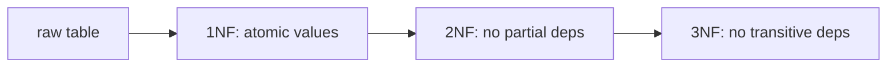

# Database Systems 101 (7/10): 정규화와 모델링

데이터 모델이 엉성하면 모든 쿼리가 그 대가를 치릅니다. 같은 사실이 여러 곳에 흩어져 있으면 갱신은 빠뜨리기 쉽고, JOIN 결과는 상황에 따라 다르게 보이며, 동시성 문제도 더 자주 생깁니다. 그래서 좋은 모델링은 단순히 테이블을 예쁘게 나누는 일이 아니라, 시스템이 장기적으로 일관성을 유지하게 만드는 가장 저렴한 보험입니다.

이 글은 Database Systems 101 시리즈의 7번째 글입니다.

정규화는 이 문제를 푸는 고전적 도구입니다. "각 사실은 정확히 한 곳에 둔다"는 원칙을 1NF, 2NF, 3NF라는 단계별 규칙으로 풀어낸 것이기 때문입니다. 이 글에서는 함수 종속을 중심 축으로 잡고, 왜 테이블을 쪼개야 하는지와 어디까지 쪼개야 하는지를 설명하겠습니다.


*Database Systems 101 7장 흐름 개요*

## 이 글에서 다룰 문제

- 함수 종속은 어떤 직관으로 이해하면 좋을까요?
- 1NF, 2NF, 3NF는 각각 무엇을 금지할까요?
- 비정규화는 언제 정당화될까요?
- 이 개념을 실무에서 잘못 적용하면 어떤 문제가 생길까요?
- 이 주제에서 초보자가 가장 자주 놓치는 포인트는 무엇일까요?

## 이 글에서 배울 내용

- 함수 종속의 기본 직관
- 1NF, 2NF, 3NF의 차이
- 비정규화가 정당화되는 시점
- 좋은 데이터 모델이 줄여 주는 비용

엉성한 모델은 모든 쿼리에 세금을 매깁니다. 같은 사실이 여러 테이블이나 여러 행에 흩어져 있으면, 수정은 누락되고 조회는 일관되지 않으며 버그는 늦게 발견됩니다. 정규화는 그 위험을 애플리케이션 코드가 아니라 모델 계층에서 먼저 제거합니다.

> 좋은 모델은 "이 값을 바꾸려면 N개의 행을 동시에 수정해야 한다"는 상황을 가능하면 만들지 않습니다.


```mermaid
flowchart LR
    A["raw table"] --> B["1NF: atomic values"]
    B --> C["2NF: no partial deps"]
    C --> D["3NF: no transitive deps"]
```

각 단계는 바로 앞 단계를 만족한 상태에서 한 가지 규칙을 더합니다. 대부분의 OLTP 모델에는 3NF면 충분합니다.

- **함수 종속(X → Y)**: X가 같으면 Y도 같아야 하는 관계입니다.
- **기본키**: 한 행을 유일하게 식별하는 컬럼 집합입니다.
- **1NF**: 모든 컬럼이 원자 값을 가져야 합니다. 배열이나 콤마 리스트를 두지 않습니다.
- **2NF**: 1NF를 만족하면서, 복합키의 일부에만 의존하는 부분 종속이 없어야 합니다.
- **3NF**: 2NF를 만족하면서, 비키 컬럼이 다른 비키 컬럼에 의존하는 이행 종속이 없어야 합니다.

## 한 테이블에서 세 테이블로

**Before — everything in one table**

```text
orders(id, user_id, user_email, product_id, product_name, product_price, quantity)
```

`user_email`은 `user_id`에 종속되고, `product_name`과 `product_price`는 `product_id`에 종속됩니다. 사용자의 이메일을 바꾸려면 그 사용자의 모든 주문 행을 수정해야 합니다.

**After — split**

```text
users(id, email)
products(id, name, price)
orders(id, user_id, product_id, quantity)
```

이제 이메일은 `users`의 한 행에만 존재하고, 주문 조회는 필요할 때 JOIN으로 진실의 원본에 다시 연결됩니다.

## 실습: 단계별로 정규화해 보기

### 1단계 — 원시 데이터 보기

```python
# raw.py
rows = [
    (1, 7, "alice@x.com", "P-1, P-2", "Bag, Hat", "20, 5"),
    (2, 7, "alice@x.com", "P-1",       "Bag",      "20"),
]
```

`product_id`가 콤마 구분 문자열로 들어 있습니다. 이 한 장면만으로도 1NF 위반이라는 것을 알아야 합니다.

### 2단계 — 제1정규형: 행으로 펼치기

```python
import sqlite3

with sqlite3.connect("shop.db") as db:
    db.executescript("""
        DROP TABLE IF EXISTS order_items_raw;
        CREATE TABLE order_items_raw (
            order_id INTEGER, user_id INTEGER, user_email TEXT,
            product_id TEXT, product_name TEXT, product_price INTEGER
        );
    """)
    db.executemany(
        "INSERT INTO order_items_raw VALUES (?, ?, ?, ?, ?, ?)",
        [
            (1, 7, "alice@x.com", "P-1", "Bag", 20),
            (1, 7, "alice@x.com", "P-2", "Hat", 5),
            (2, 7, "alice@x.com", "P-1", "Bag", 20),
        ],
    )
```

이제 각 셀은 정확히 하나의 값만 담습니다. 정규화는 늘 이 원자성 확보에서 출발합니다.

### 3단계 — 제2정규형: 부분 종속 제거

`(order_id, product_id)`를 복합키로 본다면 `product_name`, `product_price`는 `product_id`에만 의존합니다. 이는 부분 종속이므로 별도 관계로 분리해야 합니다.

```sql
CREATE TABLE products (
    id    TEXT PRIMARY KEY,
    name  TEXT NOT NULL,
    price INTEGER NOT NULL CHECK (price >= 0)
);

-- product_name, product_price는 이제 products에서 관리
INSERT INTO products VALUES ('P-1','Bag',20),('P-2','Hat',5);
```

### 4단계 — 제3정규형: 이행 종속 제거

`order_id → user_id → user_email`은 이행 종속입니다. 사용자 정보는 주문과 별도 관계로 두는 것이 맞습니다.

```sql
CREATE TABLE users (
    id    INTEGER PRIMARY KEY,
    email TEXT NOT NULL UNIQUE
);

INSERT INTO users VALUES (7, 'alice@x.com');
```

### 5단계 — 최종 정규화 모델

```sql
CREATE TABLE orders (
    id         INTEGER PRIMARY KEY,
    user_id    INTEGER NOT NULL REFERENCES users(id),
    created_at TIMESTAMP NOT NULL DEFAULT now()
);

CREATE TABLE order_items (
    order_id   INTEGER NOT NULL REFERENCES orders(id),
    product_id TEXT    NOT NULL REFERENCES products(id),
    quantity   INTEGER NOT NULL CHECK (quantity > 0),
    unit_price INTEGER NOT NULL CHECK (unit_price >= 0),  -- 주문 당시 가격
    PRIMARY KEY (order_id, product_id)
);
```

이제 각 사실은 정확히 한 곳에만 존재합니다. 이메일 변경은 `users`의 한 행 수정으로 끝나고, 상품 가격도 `products` 한 군데에서만 관리됩니다. `unit_price`를 `order_items`에 두는 것은 의도적 비정규화입니다. 주문 당시의 가격을 고정해야 하기 때문입니다.

## 함수 종속 분석 예시

정규화를 적용하기 전에 함수 종속을 분석하는 방법을 SQL 주석으로 표현합니다.

```sql
-- 비정규화 테이블 분석
-- order_items_raw(order_id, user_id, user_email, product_id, product_name, product_price)

-- 함수 종속 목록:
-- order_id → user_id                         (주문이 특정 사용자에 속함)
-- user_id → user_email                        (이행 종속! order_id → user_id → user_email)
-- product_id → product_name, product_price    (부분 종속! 복합키 일부에만 의존)
-- (order_id, product_id) → quantity           (완전 함수 종속)

-- 정규화 후: 각 종속을 별도 테이블로
-- users(user_id → user_email)
-- products(product_id → product_name, product_price)
-- orders(order_id → user_id)
-- order_items((order_id, product_id) → quantity, unit_price)
```

## 비정규화를 선택할 때의 기준

분석 조회가 매우 빈번하고 JOIN 비용이 반복적으로 문제라면, 읽기 모델에 한해 제한적 비정규화를 적용할 수 있습니다.

```sql
-- 쓰기 모델 (정규화): 원본 데이터 무결성 유지
CREATE TABLE orders (
    id      BIGINT PRIMARY KEY,
    user_id BIGINT NOT NULL REFERENCES users(id),
    status  TEXT   NOT NULL,
    total   NUMERIC(15,2) NOT NULL
);

-- 읽기 모델 (비정규화): 대시보드용 요약 테이블
CREATE MATERIALIZED VIEW order_summary AS
SELECT
    o.id,
    o.status,
    o.total,
    u.name    AS user_name,
    u.email   AS user_email,
    o.created_at
FROM orders o
JOIN users u ON u.id = o.user_id;

-- 주기적 갱신
REFRESH MATERIALIZED VIEW order_summary;
```

- 쓰기 모델: 정규화 우선, 무결성 제약 강하게 유지
- 읽기 모델: 조회 패턴 중심으로 요약 테이블 또는 머티리얼라이즈드 뷰 사용
- 동기화 방식: 지연 허용 시간과 재계산 비용을 명시

## 실무 모델링 체크포인트

```sql
-- 고아 데이터 감지: FK가 켜져 있다면 발생 불가하지만 레거시 DB에서는 확인 필요
SELECT o.id
FROM orders o
LEFT JOIN users u ON u.id = o.user_id
WHERE u.id IS NULL;

-- 중복 사실 감지: 같은 이메일이 여러 테이블에 있는지 확인
SELECT email, count(*) as cnt
FROM (
    SELECT email FROM users
    UNION ALL
    SELECT billing_email AS email FROM subscriptions
) t
GROUP BY email
HAVING count(*) > 1;

-- 1NF 위반 의심: 컬럼에 구분자 포함 여부
SELECT id, tags FROM articles WHERE tags LIKE '%,%';
```

## 자주 하는 실수

| 실수 | 증상 | 올바른 접근 |
|------|------|-------------|
| 콤마 리스트로 다대다 표현 | 검색·조인 불가, 1NF 위반 | 중간 테이블(junction table)로 분리 |
| 자주 바뀌는 값을 여러 테이블에 중복 저장 | 갱신 누락으로 불일치 | 진실의 원본 하나, 나머지는 참조 |
| 자연키를 기본키로 사용 | 값 변경 시 모든 참조 수정 필요 | 자동 증가 surrogate key 사용 |
| 모든 모델을 무조건 끝까지 정규화 | 분석 워크로드에서 JOIN 과부하 | 워크로드 특성에 맞게 정규화 수준 조절 |
| 테이블은 나눴지만 외래키는 꺼둠 | "정규화된 척"에 불과, 참조 무결성 없음 | FK 제약을 반드시 켜고 검증 |

## 핵심 요약

- 정규화는 크게 보면 **함수 종속을 따라 테이블을 나누는 작업**입니다.
- 외래키는 그렇게 나눈 모델을 다시 일관되게 묶어 주는 강력한 도구입니다.
- 대부분의 OLTP 모델은 3NF면 충분합니다.
- 비정규화는 출발점이 아니라, 측정 이후의 의도적 선택이어야 합니다.
- 정규화와 비정규화는 대립이 아니라 역할 분담입니다.

## 시니어 엔지니어는 이렇게 생각합니다

- 새 컬럼을 추가하기 전에 "이 값은 어떤 키에 종속되는가?"를 먼저 묻습니다.
- 같은 사실이 두 테이블에 사는 모델을 기본적으로 의심합니다.
- 외래키를 끄는 선택은 매우 드물고, 한다면 이유를 문서로 남깁니다.
- 비정규화는 측정이 요구할 때만 배포합니다.
- 모델 변경은 항상 마이그레이션 스크립트와 함께 갑니다.

## 운영 체크리스트

- [ ] 모든 컬럼이 원자 값을 가지는가?
- [ ] 부분 종속과 이행 종속이 제거되었는가?
- [ ] 외래키 제약이 실제로 켜져 있는가?
- [ ] 비정규화 컬럼이 있다면 갱신 책임이 명확한가?
- [ ] 스키마 다이어그램이 코드와 동기화되어 있는가?

## 연습 문제

1. `(order_id, product_id, product_price)` 테이블에서 어떤 종속이 깨져 있는지 한 문장으로 설명해 보세요.
2. surrogate key(자동 증가 ID)를 자연키 대신 쓸 때의 장점과 단점을 적어 보세요.
3. 다섯 테이블 JOIN이 필요한 분석 화면이 매우 느립니다. 비정규화 전에 먼저 고려할 수 있는 대안 두 가지를 적어 보세요.

## 정리 및 다음 단계

정규화는 함수 종속을 따라 모델을 분리해 "각 사실은 한 곳에만 존재한다"는 원칙을 지키는 작업입니다. 1NF, 2NF, 3NF는 그 원칙을 단계별로 점검하는 체크리스트이고, 외래키는 그 결과를 강제하는 도구입니다. 다음 글에서는 이렇게 만든 모델과 인덱스를 바탕으로, 옵티마이저가 실제로 어떻게 빠른 계획을 고르는지 살펴봅니다.

<!-- toc:begin -->
## 시리즈 목차

- [Database Systems 101 (1/10): 데이터베이스 시스템이란 무엇인가?](./01-what-is-a-database.md)
- [Database Systems 101 (2/10): 관계형 모델](./02-relational-model.md)
- [Database Systems 101 (3/10): SQL과 쿼리 처리](./03-sql-and-query-processing.md)
- [Database Systems 101 (4/10): 인덱스](./04-indexes.md)
- [Database Systems 101 (5/10): 트랜잭션과 ACID](./05-transactions-and-acid.md)
- [Database Systems 101 (6/10): 격리 수준](./06-isolation-levels.md)
- **Database Systems 101 (7/10): 정규화와 모델링 (현재 글)**
- [Database Systems 101 (8/10): 쿼리 최적화](./08-query-optimization.md)
- [Database Systems 101 (9/10): 복제와 백업](./09-replication-and-backup.md)
- [Database Systems 101 (10/10): OLTP와 OLAP](./10-oltp-and-olap.md)

<!-- toc:end -->

## 참고 자료

- [database-systems-101 예제 코드 (book-examples)](https://github.com/yeongseon-books/book-examples/tree/main/database-systems-101/ko)
- [Wikipedia — Database Normalization](https://en.wikipedia.org/wiki/Database_normalization)
- [PostgreSQL — Data Modeling](https://www.postgresql.org/docs/current/ddl.html)
- [Designing Data-Intensive Applications — Chapter 2](https://dataintensive.net/)
- [Microsoft — Description of the database normalization basics](https://learn.microsoft.com/en-us/office/troubleshoot/access/database-normalization-description)

Tags: Computer Science, Database, 정규화, 모델링, 1NF, 의존성
