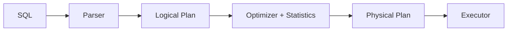

# Database Systems 101 (8/10): 쿼리 최적화

같은 SQL이 어제는 1ms였는데 오늘은 10초가 되는 일은 생각보다 흔합니다. 대부분의 경우 애플리케이션 코드가 갑자기 나빠진 것이 아니라, 옵티마이저가 다른 실행 계획을 골랐기 때문입니다. 통계가 낡았거나, 데이터 분포가 바뀌었거나, 인덱스가 추가되거나 사라졌거나, 파라미터 조건이 달라졌기 때문입니다.

그래서 쿼리 최적화의 핵심은 “더 멋진 SQL을 쓰는 법”보다 “옵티마이저가 무슨 근거로 이 계획을 골랐는지 읽는 법”에 가깝습니다. 이 글에서는 통계, 비용 모델, 계획 노드, EXPLAIN ANALYZE를 하나의 흐름으로 묶어 보겠습니다.


*Database Systems 101 8장 흐름 개요*

## 먼저 던지는 질문

- 옵티마이저는 어떤 큰 그림으로 실행 계획을 고를까요?
- 통계는 왜 그렇게 결정적인 역할을 할까요?
- EXPLAIN과 EXPLAIN ANALYZE는 어떻게 읽어야 할까요?

## 이 글에서 배울 내용

- 옵티마이저가 실행 계획을 고르는 큰 그림
- 통계가 결정적인 이유
- EXPLAIN과 EXPLAIN ANALYZE 읽는 법
- 실무 튜닝에서 반복해서 보는 네 가지 신호

## 왜 중요한가

같은 SQL이 갑자기 느려질 때 원인은 대개 “옵티마이저가 다른 길을 택했기 때문”입니다. 통계, 데이터 양, 인덱스 변화, 데이터 분포 변화가 모두 그 선택을 흔듭니다. EXPLAIN 없이 튜닝을 시도하는 것은 지도 없이 길을 맞추려는 일과 비슷합니다.

> 튜닝의 대부분은 “옵티마이저가 지금 무엇을 알고 있고, 무엇을 모르고 있는가”를 이해하는 데서 시작합니다.

## 핵심 개념 한눈에 보기



하나의 논리 계획에서 여러 물리 계획이 나올 수 있습니다. 옵티마이저는 통계 기반 비용 모델을 사용해 그중 하나를 선택합니다.

## 핵심 용어

- **옵티마이저**: 후보 실행 계획들 중 가장 싸 보이는 계획을 고르는 모듈입니다.
- 통계: 컬럼 값 분포, 행 수, 인덱스 선택성 같은 메타데이터입니다.
- **카디널리티 추정**: 각 계획 단계에서 몇 행이 나올지에 대한 옵티마이저의 예상입니다.
- **계획 노드**: Seq Scan, Index Scan, Hash Join, Nested Loop, Sort, Aggregate 같은 실행 단계입니다.
- **EXPLAIN ANALYZE**: 계획과 함께 실제 실행 수치까지 보여 주는 명령입니다.

## 변경 전/변경 후

**Before — stale stats lead to a full scan**

```sql
EXPLAIN ANALYZE SELECT * FROM orders WHERE user_id = 7;
-- Seq Scan on orders ... (cost=... rows=50000) (actual rows=50)
```

**After — ANALYZE then index scan**

```sql
ANALYZE orders;
EXPLAIN ANALYZE SELECT * FROM orders WHERE user_id = 7;
-- Index Scan using idx_user on orders ... (cost=... rows=60) (actual rows=50)
```

예상 행 수와 실제 행 수가 가까워지자, 옵티마이저는 인덱스 계획이 더 낫다고 판단합니다.

## 실습: 실행 계획으로 경로 읽기

### 1단계 — 데이터와 인덱스 준비

```python
# setup.py
import sqlite3, random

with sqlite3.connect("opt.db") as db:
    db.executescript("""
        DROP TABLE IF EXISTS orders;
        CREATE TABLE orders (
            id INTEGER PRIMARY KEY,
            user_id INTEGER NOT NULL,
            status TEXT NOT NULL,
            total INTEGER NOT NULL
        );
    """)
    rows = [
        (i, random.randint(1, 1000), random.choice(["paid","pending","cancelled"]), random.randint(1,1000))
        for i in range(1, 100001)
    ]
    db.executemany("INSERT INTO orders VALUES (?,?,?,?)", rows)
    db.execute("CREATE INDEX idx_user ON orders(user_id)")
    db.execute("ANALYZE")
```

이 준비 단계는 이후의 모든 설명을 가능하게 합니다. 통계가 살아 있고 인덱스가 있을 때 옵티마이저가 어떻게 판단하는지를 관찰할 수 있기 때문입니다.

### 2단계 — 단순 인덱스 스캔

```python
import sqlite3
with sqlite3.connect("opt.db") as db:
    plan = db.execute("EXPLAIN QUERY PLAN SELECT * FROM orders WHERE user_id=7").fetchall()
    for row in plan:
        print(row)
```

플랜에 `SEARCH orders USING INDEX idx_user`가 보이면, 최소한 이 쿼리에서는 인덱스가 실제로 채택되었다는 뜻입니다.

### 3단계 — 조인 알고리즘 비교

```sql
EXPLAIN ANALYZE
SELECT u.email, count(*)
FROM users u
JOIN orders o ON o.user_id = u.id
GROUP BY u.email;
```

데이터 양과 인덱스 상태에 따라 Nested Loop, Hash Join, Merge Join 중 하나가 선택됩니다. 좋은 튜닝 감각은 “왜 이 방식이 선택됐는가”를 통계로 설명할 수 있는 상태입니다.

### 4단계 — 통계 갱신 효과 보기

```sql
-- after a bulk INSERT
ANALYZE orders;
EXPLAIN ANALYZE SELECT * FROM orders WHERE user_id = 7;
```

ANALYZE는 옵티마이저가 보는 세계의 해상도를 높입니다. 자동 통계가 있더라도, 대량 데이터 변경 직후에는 수동 ANALYZE가 유효한 경우가 많습니다.

### 5단계 — 함수 호출이 인덱스를 죽이는 패턴

```sql
EXPLAIN ANALYZE SELECT * FROM users WHERE lower(email) = 'a@x.com';
-- Seq Scan (the index is not used)

CREATE INDEX idx_users_email_lower ON users (lower(email));
EXPLAIN ANALYZE SELECT * FROM users WHERE lower(email) = 'a@x.com';
-- Index Scan
```

WHERE 컬럼을 함수로 감싸면 일반 인덱스는 보통 무력화됩니다. 함수형 인덱스나 계산된 컬럼 같은 별도 설계가 필요합니다.

## 이 코드에서 먼저 봐야 할 점

- 옵티마이저의 가장 중요한 입력은 통계입니다. 통계가 낡으면 좋은 계획도 나오지 않습니다.
- 예상 행 수와 실제 행 수의 큰 차이는 거의 항상 문제 신호입니다.
- 같은 쿼리도 데이터 분포가 바뀌면 다른 계획으로 갈 수 있습니다.
- WHERE의 함수 호출과 형 변환은 인덱스가 무시되는 가장 흔한 원인입니다.

## 자주 하는 실수 5가지

1. **EXPLAIN도 보지 않고 “느리다”고 말한다.** 추측 기반 튜닝은 대부분 실패합니다.
2. **인덱스만 추가하고 ANALYZE를 하지 않는다.** 옵티마이저는 새 인덱스를 통계와 함께 봐야 제대로 판단합니다.
3. **WHERE 컬럼을 함수로 감싼다.** `WHERE lower(email)=?` 패턴은 인덱스를 쉽게 죽입니다.
4. **`SELECT *`를 남발한다.** 커버링 인덱스 기회를 잃고 네트워크 비용도 커집니다.
5. **OR 조건과 IN을 같은 것으로 취급한다.** 옵티마이저는 다르게 다룰 수 있으므로 항상 EXPLAIN으로 확인해야 합니다.

## 실무에서는 이렇게 드러납니다

쿼리 튜닝은 보통 네 단계 루프로 굴러갑니다. 먼저 슬로우 쿼리 로그나 APM, `pg_stat_statements`로 느린 쿼리를 찾고, 대표 쿼리에 EXPLAIN ANALYZE를 돌리며, 추정과 실제의 차이를 바탕으로 통계·인덱스·쿼리 형태를 조정한 뒤, 변경 전후를 측정합니다.

운영에서는 “튜닝” 못지않게 “회귀 감지”가 중요합니다. 원래 1ms이던 쿼리가 어느 날 100ms가 되었다면, 그 원인은 대개 코드가 아니라 통계 변화나 데이터 분포 변화입니다. 자동 통계 갱신, 인덱스 모니터링, 슬로우 쿼리 알람은 함께 묶여 움직여야 합니다.

## 시니어 엔지니어는 이렇게 생각합니다

- 새 쿼리는 머지 전에 EXPLAIN ANALYZE로 검증합니다.
- estimate와 actual이 10배 이상 벌어지면 바로 통계 또는 분포 문제를 의심합니다.
- 인덱스 PR에는 반드시 어떤 쿼리를 위한 것인지 설명을 남깁니다.
- optimizer hint는 최후의 수단으로 보고, 먼저 모델·인덱스·통계를 바로잡습니다.
- “오늘 빠르다”는 “내일도 빠르다”를 뜻하지 않음을 전제로 모니터링합니다.

## 체크리스트

- [ ] 핵심 쿼리에 EXPLAIN ANALYZE를 최소 한 번은 실행해 봤는가?
- [ ] 통계가 정기적으로 갱신되고 있는가?
- [ ] WHERE 컬럼에 함수 호출이나 형 변환이 없는가?
- [ ] 슬로우 쿼리 로그를 모니터링하는가?
- [ ] 인덱스를 추가할 때 어떤 쿼리를 위한 것인지 기록하는가?

## 연습 문제

1. EXPLAIN ANALYZE에서 `rows=10`으로 추정했지만 `actual rows=10000`이 나왔다면, 가장 먼저 무엇을 의심해야 할까요?
2. `SELECT *` 대신 필요한 컬럼만 나열하면 옵티마이저가 활용할 수 있는 최적화 한 가지를 적어 보세요.
3. `WHERE id IN (1,2,3)`과 `WHERE id=1 OR id=2 OR id=3`이 다르게 동작할 수 있는 이유를 한 문장으로 설명해 보세요.

## 정리 및 다음 단계

옵티마이저는 통계 기반 비용 모델로 여러 후보 계획 중 하나를 선택하고, EXPLAIN ANALYZE는 그 결정을 검증하는 가장 신뢰할 만한 창입니다. 다음 글에서는 단일 데이터베이스 내부를 넘어, 시스템을 빠르면서도 안전하게 유지하는 두 축인 복제와 백업을 다룹니다.

## 통계 오차가 계획을 바꾸는 사례

옵티마이저는 실제 데이터를 읽기 전에 통계로 비용을 추정합니다. 통계가 낡으면 작은 조건을 큰 조건으로 오판해 비싼 계획을 선택할 수 있습니다.

```sql
ANALYZE orders;

EXPLAIN ANALYZE
SELECT * FROM orders
WHERE status = 'FAILED' AND created_at >= now() - interval '1 day';
```

```text
Bitmap Heap Scan on orders
  Recheck Cond: (status = 'FAILED')
  -> Bitmap Index Scan on idx_orders_status
(actual rows=182, estimated rows=12450)
```

예상과 실제가 크게 어긋나면, 컬럼 통계 타깃 조정이나 다중 컬럼 통계를 고려합니다.

## 실행 분석 해석 체크리스트

- `actual rows`와 `estimated rows`의 비율
- 노드별 `actual time`과 병목 지점
- 정렬/해시 노드의 메모리 사용과 디스크 스필 여부
- 병렬 실행 시 워커 분배 균형

튜닝은 SQL 문장 미세 수정보다, 통계와 계획 해석 루프를 짧게 돌리는 운영 습관에서 성과가 납니다.

## 실전 운영 점검표

운영 환경에서 데이터베이스 품질을 안정적으로 유지하려면, 기능 개발과 별개로 점검 루틴을 명확하게 가져가야 합니다. 아래 항목은 서비스 규모와 상관없이 바로 적용할 수 있는 기준입니다.

- 변경 전에는 항상 기준 지표를 남깁니다. 평균 지연 시간, P95, P99, 초당 트랜잭션 수, 잠금 대기 시간 같은 숫자를 캡처해 둬야 변경 이후를 비교할 수 있습니다.
- 쿼리 튜닝은 SQL 문장 자체보다 실행 계획의 변화를 중심으로 추적합니다. 계획 노드가 바뀌었는지, 예상 행 수와 실제 행 수의 차이가 커졌는지, 정렬이나 해시가 디스크로 내려갔는지를 우선 확인합니다.
- 스키마 변경은 단계적으로 진행합니다. 컬럼 추가, 백필, 코드 전환, 제약 강화 순서로 나누면 장애 반경을 줄일 수 있습니다.
- 장애 대응 문서는 운영자가 밤중에도 바로 실행할 수 있는 형태여야 합니다. 복구 절차, 롤백 절차, 검증 SQL을 같은 문서에 둬야 실제 상황에서 흔들리지 않습니다.

아래 예시는 팀이 릴리스 전후에 반복적으로 실행하는 최소 점검 SQL입니다.

```sql
-- 최근 10분 동안 느린 쿼리 확인(엔진별 뷰 이름은 다를 수 있음)
SELECT query, calls, mean_exec_time, rows
FROM pg_stat_statements
ORDER BY mean_exec_time DESC
LIMIT 20;

-- 잠금 대기 체인 확인
SELECT now(), pid, wait_event_type, wait_event, state, query
FROM pg_stat_activity
WHERE wait_event_type IS NOT NULL;

-- 인덱스 사용률 점검
SELECT relname AS table_name, seq_scan, idx_scan
FROM pg_stat_user_tables
ORDER BY seq_scan DESC
LIMIT 20;
```

이 점검 루틴을 자동화 파이프라인에 연결하면, 성능 저하를 "느낌"이 아니라 "증거"로 관리할 수 있습니다. 결국 장기 운영에서 중요한 것은 뛰어난 한 번의 튜닝이 아니라, 작은 검증을 꾸준히 반복해 위험을 조기에 감지하는 습관입니다.
## 운영 리허설 시나리오

문서만 읽고 끝내면 운영에서 다시 같은 실수를 반복하기 쉽습니다. 아래 시나리오는 팀 온보딩과 장애 대응 훈련에 바로 사용할 수 있는 공통 리허설 절차입니다.

### 시나리오 1: 느려진 조회 원인 찾기

1. 문제 쿼리를 식별합니다. 애플리케이션 로그의 요청 식별자와 데이터베이스 쿼리 로그를 매칭합니다.
2. 같은 파라미터로 `EXPLAIN ANALYZE`를 실행합니다.
3. 계획 노드 중 시간이 큰 지점을 찾고, 해당 노드가 인덱스/통계/정렬 중 무엇과 관련 있는지 분류합니다.
4. 개선안을 한 번에 하나만 적용합니다. 인덱스 추가, 통계 갱신, 질의문 재작성 가운데 하나만 바꿔 결과를 비교합니다.

```text
개선 전
Seq Scan on events  (actual time=0.030..842.112 rows=12000)

개선 후
Index Scan using idx_events_tenant_created on events
(actual time=0.041..21.553 rows=12000)
```

### 시나리오 2: 동시성 문제 재현과 완화

1. 두 세션에서 같은 행을 거의 동시에 수정합니다.
2. 격리 수준을 바꿔 가며 결과를 비교합니다.
3. 필요하면 `FOR UPDATE` 잠금 조회 또는 낙관적 잠금 버전 컬럼을 적용합니다.
4. 재시도 정책과 타임아웃 기준을 코드와 운영 문서에 같이 기록합니다.

```sql
-- 낙관적 잠금 예시
UPDATE inventory
SET qty = qty - 1, version = version + 1
WHERE sku = 'A-100' AND version = 17;
```

영향 받은 행 수가 0이면 이미 다른 트랜잭션이 갱신한 것이므로, 재조회 후 재시도합니다. 이 패턴은 잠금 경합을 낮추면서도 정합성을 지키는 데 효과적입니다.

### 시나리오 3: 복구 가능성 검증

1. 최신 베이스 백업으로 테스트 인스턴스를 띄웁니다.
2. 지정 시점까지 로그를 재적용합니다.
3. 핵심 비즈니스 검증 SQL을 실행합니다.
4. 복구 시간(RTO)과 데이터 유실 허용치(RPO)를 실제 숫자로 기록합니다.

```sql
-- 검증 SQL 예시
SELECT COUNT(*) FROM orders WHERE created_at >= now() - interval '1 day';
SELECT SUM(amount) FROM payments WHERE status = 'SUCCESS';
SELECT COUNT(*) FROM users WHERE deleted_at IS NULL;
```

복구 리허설에서 가장 중요한 점은 성공 여부 자체보다, 누가 어떤 순서로 무엇을 확인했는지를 재현 가능하게 남기는 것입니다. 절차가 사람마다 다르면 실제 장애에서 속도와 품질이 동시에 무너집니다.

## 체크리스트: 배포 전 최소 검증

- 대표 조회 5개에 대해 실행 계획을 저장합니다.
- 트랜잭션 경계가 긴 코드 경로를 식별합니다.
- 잠금 대기 알람 임계치를 설정합니다.
- 스키마 변경의 롤백 경로를 문서화합니다.
- 백업 복구 리허설 최근 실행일을 확인합니다.

이 체크리스트는 거창한 체계를 요구하지 않습니다. 작은 팀도 주 1회 반복하면 데이터 사고 빈도를 눈에 띄게 줄일 수 있습니다. 데이터베이스 운영의 본질은 "고급 기능을 많이 아는 것"이 아니라, "반복 가능한 검증 루프를 끊기지 않게 유지하는 것"입니다.

## 추가 실습 기록 템플릿

아래 템플릿은 팀 위키에 그대로 붙여 넣어 실습 결과를 남길 때 사용합니다.

```text
[실습 이름]
- 실행 일시:
- 실행 환경:
- 입력 데이터 규모:
- 대표 SQL:
- EXPLAIN ANALYZE 핵심 노드:
- 개선 전/후 실행 시간:
- 적용 변경 사항:
- 부작용 또는 주의점:
- 다음 점검 항목:
```

실습 기록을 남기면 지식이 개인 경험으로 소모되지 않고 팀 자산으로 누적됩니다. 특히 실행 계획 캡처와 복구 절차 검증 결과를 함께 보관하면, 다음 장애 대응에서 판단 속도를 크게 높일 수 있습니다.

## 심화: 계획 회귀를 조기에 잡는 방법

계획 회귀는 보통 코드 배포 직후보다 데이터 분포가 변한 시점에 터집니다. 그래서 배포 파이프라인 검증만으로는 부족하고, 운영 데이터 특성을 반영한 주기 점검이 필요합니다.

- 상위 20개 핵심 조회문을 고정 목록으로 관리합니다.
- 각 조회문에 대해 월 단위로 `EXPLAIN (ANALYZE, BUFFERS)`를 저장합니다.
- 예상 행 수 오차 비율이 임계치(예: 10배) 넘으면 경고를 발생시킵니다.
- 통계 갱신, 인덱스 재검토, 질의문 재작성 우선순위를 분리해 대응합니다.

```text
노드별 버퍼 확인 예시
Index Scan using idx_orders_created on orders
  Buffers: shared hit=1200 read=48

Sort
  Sort Method: quicksort  Memory: 1024kB
```

버퍼 정보까지 보면 "왜 느린지"가 더 또렷해집니다. CPU 병목인지, 디스크 읽기 병목인지, 잘못된 정렬 전략인지가 분리되기 때문입니다. 이 수준까지 해석할 수 있어야 튜닝이 일회성 처방에서 운영 체계로 올라갑니다.

## 처음 질문으로 돌아가기

- **옵티마이저는 어떤 큰 그림으로 실행 계획을 고를까요?**
  - 옵티마이저는 SQL에서 논리 계획을 만든 뒤, 통계와 비용 모델을 사용해 여러 물리 계획 가운데 가장 싸 보이는 경로를 고릅니다. 그래서 같은 질의도 `Seq Scan`, `Index Scan`, `Hash Join`, `Nested Loop`처럼 전혀 다른 노드 조합으로 내려갈 수 있습니다.
- **통계는 왜 그렇게 결정적인 역할을 할까요?**
  - 옵티마이저는 실제 테이블을 전부 읽기 전에 통계로 행 수와 선택성을 추정하므로, 통계가 낡으면 애초에 잘못된 계획을 고를 수밖에 없습니다. 글의 `status = 'FAILED'` 예시에서 `estimated rows=12450`인데 `actual rows=182`가 나온 장면이 바로 통계 오차가 튜닝 문제로 이어지는 모습입니다.
- **EXPLAIN과 EXPLAIN ANALYZE는 어떻게 읽어야 할까요?**
  - EXPLAIN은 선택된 계획의 형태를 보여 주고, EXPLAIN ANALYZE는 여기에 실제 시간과 실제 행 수를 덧붙여 추정이 맞았는지 검증하게 해 줍니다. 따라서 `actual rows` 대 `estimated rows`, 병목 노드의 `actual time`, 그리고 `lower(email)` 때문에 일반 인덱스가 죽는 패턴까지 함께 읽어야 제대로 튜닝할 수 있습니다.

<!-- toc:begin -->
## 시리즈 목차

- [Database Systems 101 (1/10): 데이터베이스 시스템이란 무엇인가?](./01-what-is-a-database.md)
- [Database Systems 101 (2/10): 관계형 모델](./02-relational-model.md)
- [Database Systems 101 (3/10): SQL과 쿼리 처리](./03-sql-and-query-processing.md)
- [Database Systems 101 (4/10): 인덱스](./04-indexes.md)
- [Database Systems 101 (5/10): 트랜잭션과 ACID](./05-transactions-and-acid.md)
- [Database Systems 101 (6/10): 격리 수준](./06-isolation-levels.md)
- [Database Systems 101 (7/10): 정규화와 모델링](./07-normalization-and-modeling.md)
- **쿼리 최적화 (현재 글)**
- 복제와 백업 (예정)
- OLTP와 OLAP (예정)

<!-- toc:end -->

## 참고 자료

- [database-systems-101 예제 코드 (book-examples)](https://github.com/yeongseon-books/book-examples/tree/main/database-systems-101/ko)
- [PostgreSQL — Using EXPLAIN](https://www.postgresql.org/docs/current/using-explain.html)
- [PostgreSQL — Statistics Used by the Planner](https://www.postgresql.org/docs/current/planner-stats.html)
- [Use The Index, Luke!](https://use-the-index-luke.com/)
- [SQLite — The Next-Generation Query Planner](https://www.sqlite.org/queryplanner-ng.html)

Tags: Computer Science, Database, 옵티마이저, 통계, EXPLAIN, 튜닝
