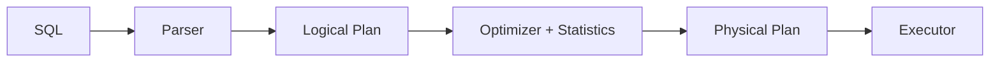

# Database Systems 101 (8/10): 쿼리 최적화

이 글은 Database Systems 101 시리즈의 여덟 번째 글입니다.

같은 SQL이 어제는 1ms였는데 오늘은 10초가 되는 일은 생각보다 흔합니다. 대부분의 경우 애플리케이션 코드가 갑자기 나빠진 것이 아니라, 옵티마이저가 다른 실행 계획을 골랐기 때문입니다. 통계가 낡았거나, 데이터 분포가 바뀌었거나, 인덱스가 추가되거나 사라졌거나, 파라미터 조건이 달라졌기 때문입니다.

그래서 쿼리 최적화의 핵심은 “더 멋진 SQL을 쓰는 법”보다 “옵티마이저가 무슨 근거로 이 계획을 골랐는지 읽는 법”에 가깝습니다. 이 글에서는 통계, 비용 모델, 계획 노드, EXPLAIN ANALYZE를 하나의 흐름으로 묶어 보겠습니다.

## 먼저 던지는 질문

- 옵티마이저는 어떤 큰 그림으로 실행 계획을 고를까요?
- 통계는 왜 그렇게 결정적인 역할을 할까요?
- EXPLAIN과 EXPLAIN ANALYZE는 어떻게 읽어야 할까요?

## 큰 그림


*Database Systems 101 8장 흐름 개요*

## 이 글에서 배울 내용

- 옵티마이저가 실행 계획을 고르는 큰 그림
- 통계가 결정적인 이유
- EXPLAIN과 EXPLAIN ANALYZE 읽는 법
- 실무 튜닝에서 반복해서 보는 네 가지 신호

## 왜 중요한가

같은 SQL이 갑자기 느려질 때 원인은 대개 “옵티마이저가 다른 길을 택했기 때문”입니다. 통계, 데이터 양, 인덱스 변화, 데이터 분포 변화가 모두 그 선택을 흔듭니다. EXPLAIN 없이 튜닝을 시도하는 것은 지도 없이 길을 맞추려는 일과 비슷합니다.

> 튜닝의 대부분은 “옵티마이저가 지금 무엇을 알고 있고, 무엇을 모르고 있는가”를 이해하는 데서 시작합니다.

## 핵심 개념 한눈에 보기



하나의 논리 계획에서 여러 물리 계획이 나올 수 있습니다. 옵티마이저는 통계 기반 비용 모델을 사용해 그중 하나를 선택합니다.

## 핵심 용어

- **옵티마이저**: 후보 실행 계획들 중 가장 싸 보이는 계획을 고르는 모듈입니다.
- 통계: 컬럼 값 분포, 행 수, 인덱스 선택성 같은 메타데이터입니다.
- **카디널리티 추정**: 각 계획 단계에서 몇 행이 나올지에 대한 옵티마이저의 예상입니다.
- **계획 노드**: Seq Scan, Index Scan, Hash Join, Nested Loop, Sort, Aggregate 같은 실행 단계입니다.
- **EXPLAIN ANALYZE**: 계획과 함께 실제 실행 수치까지 보여 주는 명령입니다.

## Before/After

**Before — stale stats lead to a full scan**

```sql
EXPLAIN ANALYZE SELECT * FROM orders WHERE user_id = 7;
-- Seq Scan on orders ... (cost=... rows=50000) (actual rows=50)
```

**After — ANALYZE then index scan**

```sql
ANALYZE orders;
EXPLAIN ANALYZE SELECT * FROM orders WHERE user_id = 7;
-- Index Scan using idx_user on orders ... (cost=... rows=60) (actual rows=50)
```

예상 행 수와 실제 행 수가 가까워지자, 옵티마이저는 인덱스 계획이 더 낫다고 판단합니다.

## 실습: EXPLAIN으로 계획 읽기

### 1단계 — 데이터와 인덱스 준비

```python
# setup.py
import sqlite3, random

with sqlite3.connect("opt.db") as db:
    db.executescript("""
        DROP TABLE IF EXISTS orders;
        CREATE TABLE orders (
            id INTEGER PRIMARY KEY,
            user_id INTEGER NOT NULL,
            status TEXT NOT NULL,
            total INTEGER NOT NULL
        );
    """)
    rows = [
        (i, random.randint(1, 1000), random.choice(["paid","pending","cancelled"]), random.randint(1,1000))
        for i in range(1, 100001)
    ]
    db.executemany("INSERT INTO orders VALUES (?,?,?,?)", rows)
    db.execute("CREATE INDEX idx_user ON orders(user_id)")
    db.execute("ANALYZE")
```

이 준비 단계는 이후의 모든 설명을 가능하게 합니다. 통계가 살아 있고 인덱스가 있을 때 옵티마이저가 어떻게 판단하는지를 관찰할 수 있기 때문입니다.

### 2단계 — 단순 인덱스 스캔

```python
import sqlite3
with sqlite3.connect("opt.db") as db:
    plan = db.execute("EXPLAIN QUERY PLAN SELECT * FROM orders WHERE user_id=7").fetchall()
    for row in plan:
        print(row)
```

플랜에 `SEARCH orders USING INDEX idx_user`가 보이면, 최소한 이 쿼리에서는 인덱스가 실제로 채택되었다는 뜻입니다.

### 3단계 — 조인 알고리즘 비교

```sql
EXPLAIN ANALYZE
SELECT u.email, count(*)
FROM users u
JOIN orders o ON o.user_id = u.id
GROUP BY u.email;
```

데이터 양과 인덱스 상태에 따라 Nested Loop, Hash Join, Merge Join 중 하나가 선택됩니다. 좋은 튜닝 감각은 “왜 이 방식이 선택됐는가”를 통계로 설명할 수 있는 상태입니다.

### 4단계 — 통계 갱신 효과 보기

```sql
-- after a bulk INSERT
ANALYZE orders;
EXPLAIN ANALYZE SELECT * FROM orders WHERE user_id = 7;
```

ANALYZE는 옵티마이저가 보는 세계의 해상도를 높입니다. 자동 통계가 있더라도, 대량 데이터 변경 직후에는 수동 ANALYZE가 유효한 경우가 많습니다.

### 5단계 — 함수 호출이 인덱스를 죽이는 패턴

```sql
EXPLAIN ANALYZE SELECT * FROM users WHERE lower(email) = 'a@x.com';
-- Seq Scan (the index is not used)

CREATE INDEX idx_users_email_lower ON users (lower(email));
EXPLAIN ANALYZE SELECT * FROM users WHERE lower(email) = 'a@x.com';
-- Index Scan
```

WHERE 컬럼을 함수로 감싸면 일반 인덱스는 보통 무력화됩니다. 함수형 인덱스나 계산된 컬럼 같은 별도 설계가 필요합니다.

## 이 코드에서 먼저 봐야 할 점

- 옵티마이저의 가장 중요한 입력은 통계입니다. 통계가 낡으면 좋은 계획도 나오지 않습니다.
- 예상 행 수와 실제 행 수의 큰 차이는 거의 항상 문제 신호입니다.
- 같은 쿼리도 데이터 분포가 바뀌면 다른 계획으로 갈 수 있습니다.
- WHERE의 함수 호출과 형 변환은 인덱스가 무시되는 가장 흔한 원인입니다.

## 자주 하는 실수 5가지

1. **EXPLAIN도 보지 않고 “느리다”고 말한다.** 추측 기반 튜닝은 대부분 실패합니다.
2. **인덱스만 추가하고 ANALYZE를 하지 않는다.** 옵티마이저는 새 인덱스를 통계와 함께 봐야 제대로 판단합니다.
3. **WHERE 컬럼을 함수로 감싼다.** `WHERE lower(email)=?` 패턴은 인덱스를 쉽게 죽입니다.
4. **`SELECT *`를 남발한다.** 커버링 인덱스 기회를 잃고 네트워크 비용도 커집니다.
5. **OR 조건과 IN을 같은 것으로 취급한다.** 옵티마이저는 다르게 다룰 수 있으므로 항상 EXPLAIN으로 확인해야 합니다.

## 실무에서는 이렇게 드러납니다

쿼리 튜닝은 보통 네 단계 루프로 굴러갑니다. 먼저 슬로우 쿼리 로그나 APM, `pg_stat_statements`로 느린 쿼리를 찾고, 대표 쿼리에 EXPLAIN ANALYZE를 돌리며, 추정과 실제의 차이를 바탕으로 통계·인덱스·쿼리 형태를 조정한 뒤, 변경 전후를 측정합니다.

운영에서는 “튜닝” 못지않게 “회귀 감지”가 중요합니다. 원래 1ms이던 쿼리가 어느 날 100ms가 되었다면, 그 원인은 대개 코드가 아니라 통계 변화나 데이터 분포 변화입니다. 자동 통계 갱신, 인덱스 모니터링, 슬로우 쿼리 알람은 함께 묶여 움직여야 합니다.

## 시니어 엔지니어는 이렇게 생각합니다

- 새 쿼리는 머지 전에 EXPLAIN ANALYZE로 검증합니다.
- estimate와 actual이 10배 이상 벌어지면 바로 통계 또는 분포 문제를 의심합니다.
- 인덱스 PR에는 반드시 어떤 쿼리를 위한 것인지 설명을 남깁니다.
- optimizer hint는 최후의 수단으로 보고, 먼저 모델·인덱스·통계를 바로잡습니다.
- “오늘 빠르다”는 “내일도 빠르다”를 뜻하지 않음을 전제로 모니터링합니다.

## 체크리스트

- [ ] 핵심 쿼리에 EXPLAIN ANALYZE를 최소 한 번은 실행해 봤는가?
- [ ] 통계가 정기적으로 갱신되고 있는가?
- [ ] WHERE 컬럼에 함수 호출이나 형 변환이 없는가?
- [ ] 슬로우 쿼리 로그를 모니터링하는가?
- [ ] 인덱스를 추가할 때 어떤 쿼리를 위한 것인지 기록하는가?

## 연습 문제

1. EXPLAIN ANALYZE에서 `rows=10`으로 추정했지만 `actual rows=10000`이 나왔다면, 가장 먼저 무엇을 의심해야 할까요?
2. `SELECT *` 대신 필요한 컬럼만 나열하면 옵티마이저가 활용할 수 있는 최적화 한 가지를 적어 보세요.
3. `WHERE id IN (1,2,3)`과 `WHERE id=1 OR id=2 OR id=3`이 다르게 동작할 수 있는 이유를 한 문장으로 설명해 보세요.

## 정리 및 다음 단계

옵티마이저는 통계 기반 비용 모델로 여러 후보 계획 중 하나를 선택하고, EXPLAIN ANALYZE는 그 결정을 검증하는 가장 신뢰할 만한 창입니다. 다음 글에서는 단일 데이터베이스 내부를 넘어, 시스템을 빠르면서도 안전하게 유지하는 두 축인 복제와 백업을 다룹니다.

## 실전 보강: 실행 계획과 트랜잭션 설계를 한 번에 보는 연습

아래 예시는 관계형 데이터베이스를 운영할 때 자주 만나는 세 가지 질문을 한 번에 다룹니다. 첫째, 이 쿼리가 왜 느린지, 둘째, 어떤 인덱스가 실제로 선택되는지, 셋째, 실패 시 데이터가 어디까지 보존되는지입니다.

### 1) 조건과 정렬을 함께 고려한 인덱스 전략

```sql
-- 주문 조회 API: 특정 사용자 최근 주문 20건
SELECT id, user_id, status, created_at, total_amount
FROM orders
WHERE user_id = 42 AND status = 'paid'
ORDER BY created_at DESC
LIMIT 20;
```

이 쿼리는 보통 `user_id`, `status`, `created_at`의 순서를 가진 복합 인덱스 후보를 만듭니다.

```sql
CREATE INDEX idx_orders_user_status_created
ON orders (user_id, status, created_at DESC);
```

핵심은 **필터링 컬럼을 앞쪽에**, 정렬 컬럼을 그다음에 배치하는 것입니다. 이렇게 하면 WHERE와 ORDER BY를 동시에 만족해 추가 정렬 비용을 줄일 수 있습니다.

### 2) EXPLAIN으로 계획 비교하기

```sql
EXPLAIN ANALYZE
SELECT id, user_id, status, created_at, total_amount
FROM orders
WHERE user_id = 42 AND status = 'paid'
ORDER BY created_at DESC
LIMIT 20;
```

계획을 읽을 때는 다음 순서를 고정해 확인합니다.

| 확인 항목 | 의미 | 실무 해석 |
| --- | --- | --- |
| Scan 종류 | Seq Scan / Index Scan / Index Only Scan | 인덱스가 실제 사용되는지 |
| Rows (estimate vs actual) | 예상 행 수와 실제 행 수 차이 | 통계 갱신 필요 여부 판단 |
| Sort 노드 유무 | 별도 정렬 발생 여부 | 인덱스 컬럼 순서 재검토 |
| Loop 횟수 | 반복 수행 정도 | Nested Loop 과비용 여부 |

예상 행 수와 실제 행 수가 크게 어긋나면 `ANALYZE` 또는 통계 정책을 먼저 점검합니다. 인덱스를 추가하기 전에 통계부터 정상화하는 편이 안전합니다.

### 3) 트랜잭션 경계와 실패 처리 패턴

```python
import sqlite3

def create_order(db: sqlite3.Connection, user_id: int, amount: int) -> None:
    try:
        db.execute("BEGIN")
        db.execute(
            "INSERT INTO orders(user_id, status, total_amount) VALUES (?, 'paid', ?)",
            (user_id, amount),
        )
        db.execute(
            "UPDATE inventory SET stock = stock - 1 WHERE sku = ? AND stock > 0",
            ("SKU-001",),
        )
        changed = db.execute("SELECT changes()").fetchone()[0]
        if changed != 1:
            raise RuntimeError("재고 부족")
        db.execute("COMMIT")
    except Exception:
        db.execute("ROLLBACK")
        raise
```

이 패턴의 의도는 명확합니다. 주문 생성과 재고 차감을 **하나의 원자 단위**로 묶고, 조건이 맞지 않으면 전체를 되돌립니다. 트랜잭션 안에서 외부 API 호출을 하지 않는 것도 중요합니다. 잠금 시간이 길어지면 동시성 충돌이 급격히 늘어납니다.

### 4) 운영에서 자주 쓰는 진단 SQL

```sql
-- 값 분포 확인(선택성 감각)
SELECT status, COUNT(*) FROM orders GROUP BY status;

-- 최근 7일 데이터 비율 확인(파티션/인덱스 필요성 판단)
SELECT COUNT(*) FILTER (WHERE created_at >= NOW() - INTERVAL '7 days') AS recent,
       COUNT(*) AS total
FROM orders;

-- 특정 조건의 실제 데이터량 확인
SELECT COUNT(*)
FROM orders
WHERE user_id = 42 AND status = 'paid';
```

인덱스 설계는 문법 문제가 아니라 **분포 문제**입니다. 어떤 값이 얼마나 자주 등장하는지 모르면, 좋은 인덱스 순서를 고르기 어렵습니다.

### 5) 읽기/쓰기 균형 체크

| 판단 질문 | 읽기 중심 시스템 | 쓰기 중심 시스템 |
| --- | --- | --- |
| 인덱스 수 | 상대적으로 많아도 감당 가능 | 최소화가 우선 |
| 커버링 인덱스 | 적극 검토 | 신중 검토 |
| 배치 업데이트 | 야간 일괄 가능 | 짧은 배치로 분할 필요 |
| 통계 갱신 | 주기적 자동 갱신 | 대량 쓰기 직후 즉시 갱신 |

결론적으로 데이터베이스 튜닝은 “인덱스를 늘린다”가 아니라 “실행 계획을 읽고, 트랜잭션 경계를 짧게 유지하고, 분포를 근거로 선택한다”의 반복입니다.

## 처음 질문으로 돌아가기

- **옵티마이저는 어떤 큰 그림으로 실행 계획을 고를까요?**
  - 본문의 기준은 쿼리 최적화를 한 덩어리 개념으로 보지 않고 입력, 처리, 검증, 운영 신호가 만나는 경계로 나누어 확인하는 것입니다.
- **통계는 왜 그렇게 결정적인 역할을 할까요?**
  - 예제와 그림에서는 어떤 값이 들어오고, 어느 단계에서 바뀌며, 어떤 기준으로 통과 또는 실패하는지를 먼저 확인해야 합니다.
- **EXPLAIN과 EXPLAIN ANALYZE는 어떻게 읽어야 할까요?**
  - 운영에서는 이 판단을 체크리스트, 로그, 테스트로 남겨 다음 변경에서도 같은 실패가 반복되지 않게 막아야 합니다.

<!-- toc:begin -->
## 시리즈 목차

- [Database Systems 101 (1/10): 데이터베이스 시스템이란 무엇인가?](./01-what-is-a-database.md)
- [Database Systems 101 (2/10): 관계형 모델](./02-relational-model.md)
- [Database Systems 101 (3/10): SQL과 쿼리 처리](./03-sql-and-query-processing.md)
- [Database Systems 101 (4/10): 인덱스](./04-indexes.md)
- [Database Systems 101 (5/10): 트랜잭션과 ACID](./05-transactions-and-acid.md)
- [Database Systems 101 (6/10): 격리 수준](./06-isolation-levels.md)
- [Database Systems 101 (7/10): 정규화와 모델링](./07-normalization-and-modeling.md)
- **쿼리 최적화 (현재 글)**
- 복제와 백업 (예정)
- OLTP와 OLAP (예정)

<!-- toc:end -->

## 참고 자료

- [PostgreSQL — Using EXPLAIN](https://www.postgresql.org/docs/current/using-explain.html)
- [PostgreSQL — Statistics Used by the Planner](https://www.postgresql.org/docs/current/planner-stats.html)
- [Use The Index, Luke!](https://use-the-index-luke.com/)
- [SQLite — The Next-Generation Query Planner](https://www.sqlite.org/queryplanner-ng.html)

Tags: Computer Science, Database, 옵티마이저, 통계, EXPLAIN, 튜닝
