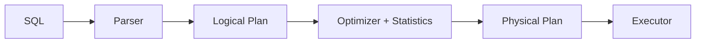

# Database Systems 101 (8/10): 쿼리 최적화

같은 SQL이 어제는 1ms였는데 오늘은 10초가 되는 일은 생각보다 흔합니다. 대부분의 경우 애플리케이션 코드가 갑자기 나빠진 것이 아니라, 옵티마이저가 다른 실행 계획을 골랐기 때문입니다. 통계가 낡았거나, 데이터 분포가 바뀌었거나, 인덱스가 추가되거나 사라졌거나, 파라미터 조건이 달라졌기 때문입니다.

이 글은 Database Systems 101 시리즈의 8번째 글입니다.

그래서 쿼리 최적화의 핵심은 "더 멋진 SQL을 쓰는 법"보다 "옵티마이저가 무슨 근거로 이 계획을 골랐는지 읽는 법"에 가깝습니다. 이 글에서는 통계, 비용 모델, 계획 노드, EXPLAIN ANALYZE를 하나의 흐름으로 묶어 보겠습니다.


*Database Systems 101 8장 흐름 개요*

## 이 글에서 다룰 문제

- 옵티마이저는 어떤 큰 그림으로 실행 계획을 고를까요?
- 통계는 왜 그렇게 결정적인 역할을 할까요?
- EXPLAIN과 EXPLAIN ANALYZE는 어떻게 읽어야 할까요?
- 이 개념을 실무에서 잘못 적용하면 어떤 문제가 생길까요?
- 이 주제에서 초보자가 가장 자주 놓치는 포인트는 무엇일까요?

## 이 글에서 배울 내용

- 옵티마이저가 실행 계획을 고르는 큰 그림
- 통계가 결정적인 이유
- EXPLAIN과 EXPLAIN ANALYZE 읽는 법
- 실무 튜닝에서 반복해서 보는 네 가지 신호

같은 SQL이 갑자기 느려질 때 원인은 대개 "옵티마이저가 다른 길을 택했기 때문"입니다. 통계, 데이터 양, 인덱스 변화, 데이터 분포 변화가 모두 그 선택을 흔듭니다. EXPLAIN 없이 튜닝을 시도하는 것은 지도 없이 길을 맞추려는 일과 비슷합니다.

> 튜닝의 대부분은 "옵티마이저가 지금 무엇을 알고 있고, 무엇을 모르고 있는가"를 이해하는 데서 시작합니다.


```mermaid
flowchart LR
    A["SQL"] --> B["Parser"]
    B --> C["Logical Plan"]
    C --> D["Optimizer + Statistics"]
    D --> E["Physical Plan"]
    E --> F["Executor"]
```

하나의 논리 계획에서 여러 물리 계획이 나올 수 있습니다. 옵티마이저는 통계 기반 비용 모델을 사용해 그중 하나를 선택합니다.

- **옵티마이저**: 후보 실행 계획들 중 가장 싸 보이는 계획을 고르는 모듈입니다.
- **통계**: 컬럼 값 분포, 행 수, 인덱스 선택성 같은 메타데이터입니다.
- **카디널리티 추정**: 각 계획 단계에서 몇 행이 나올지에 대한 옵티마이저의 예상입니다.
- **계획 노드**: Seq Scan, Index Scan, Hash Join, Nested Loop, Sort, Aggregate 같은 실행 단계입니다.
- **EXPLAIN ANALYZE**: 계획과 함께 실제 실행 수치까지 보여 주는 명령입니다.

## 통계 갱신으로 계획 변화 확인

**Before — stale stats lead to a full scan**

```sql
EXPLAIN ANALYZE SELECT * FROM orders WHERE user_id = 7;
-- Seq Scan on orders ... (cost=... rows=50000) (actual rows=50)
-- 예상 50,000 vs 실제 50 → 통계가 낡음
```

**After — ANALYZE then index scan**

```sql
ANALYZE orders;
EXPLAIN ANALYZE SELECT * FROM orders WHERE user_id = 7;
-- Index Scan using idx_user on orders ... (cost=... rows=60) (actual rows=50)
-- 예상 60 vs 실제 50 → 훨씬 정확해진 통계
```

예상 행 수와 실제 행 수가 가까워지자, 옵티마이저는 인덱스 계획이 더 낫다고 판단합니다.

## 실습: 실행 계획으로 경로 읽기

### 1단계 — 데이터와 인덱스 준비

```python
# setup.py
import sqlite3, random

with sqlite3.connect("opt.db") as db:
    db.executescript("""
        DROP TABLE IF EXISTS orders;
        CREATE TABLE orders (
            id INTEGER PRIMARY KEY,
            user_id INTEGER NOT NULL,
            status TEXT NOT NULL,
            total INTEGER NOT NULL
        );
    """)
    rows = [
        (i, random.randint(1, 1000), random.choice(["paid","pending","cancelled"]), random.randint(1,1000))
        for i in range(1, 100001)
    ]
    db.executemany("INSERT INTO orders VALUES (?,?,?,?)", rows)
    db.execute("CREATE INDEX idx_user ON orders(user_id)")
    db.execute("ANALYZE")
```

### 2단계 — 단순 인덱스 스캔

```python
import sqlite3
with sqlite3.connect("opt.db") as db:
    plan = db.execute("EXPLAIN QUERY PLAN SELECT * FROM orders WHERE user_id=7").fetchall()
    for row in plan:
        print(row)
```

플랜에 `SEARCH orders USING INDEX idx_user`가 보이면, 최소한 이 쿼리에서는 인덱스가 실제로 채택되었다는 뜻입니다.

### 3단계 — 조인 알고리즘 비교

```sql
-- 두 조인 방식의 실행 계획 비교
EXPLAIN ANALYZE
SELECT u.email, count(*) AS order_count
FROM users u
JOIN orders o ON o.user_id = u.id
GROUP BY u.email;
```

데이터 양과 인덱스 상태에 따라 Nested Loop, Hash Join, Merge Join 중 하나가 선택됩니다. "왜 이 방식이 선택됐는가"를 통계로 설명할 수 있어야 합니다.

### 4단계 — 통계 갱신 효과 보기

```sql
-- 대량 INSERT 후 통계 갱신
ANALYZE orders;
EXPLAIN ANALYZE SELECT * FROM orders WHERE user_id = 7;
```

ANALYZE는 옵티마이저가 보는 세계의 해상도를 높입니다. 자동 통계가 있더라도, 대량 데이터 변경 직후에는 수동 ANALYZE가 유효한 경우가 많습니다.

### 5단계 — 함수 호출이 인덱스를 죽이는 패턴

```sql
-- 인덱스가 있어도 함수 적용 시 Seq Scan 발생
EXPLAIN ANALYZE SELECT * FROM users WHERE lower(email) = 'a@x.com';
-- Seq Scan (인덱스 미사용)

-- 함수 기반 인덱스로 해결
CREATE INDEX idx_users_email_lower ON users (lower(email));

EXPLAIN ANALYZE SELECT * FROM users WHERE lower(email) = 'a@x.com';
-- Index Scan (함수 기반 인덱스 사용)
```

WHERE 컬럼을 함수로 감싸면 일반 인덱스는 보통 무력화됩니다.

## EXPLAIN ANALYZE 읽는 법

```sql
EXPLAIN (ANALYZE, BUFFERS, FORMAT TEXT)
SELECT o.id, o.total, u.email
FROM orders o
JOIN users u ON u.id = o.user_id
WHERE o.status = 'PAID'
  AND o.created_at >= now() - interval '7 days'
ORDER BY o.created_at DESC
LIMIT 100;
```

```text
Limit  (cost=245.13..245.38 rows=100 width=52) (actual time=12.3..12.4 rows=100 loops=1)
  -> Sort  (cost=245.13..246.88 rows=700 width=52) (actual time=12.3..12.3 rows=100)
     Sort Key: o.created_at DESC
     Sort Method: top-N heapsort  Memory: 45kB
     -> Hash Join  (cost=8.31..230.50 rows=700 width=52) (actual time=0.8..11.2 rows=700)
          Hash Cond: (o.user_id = u.id)
          Buffers: shared hit=142
          -> Bitmap Heap Scan on orders o  (cost=4.51..220.00 rows=700)
               Recheck Cond: (status = 'PAID')
               Filter: (created_at >= (now() - '7 days'::interval))
               Rows Removed by Filter: 1230
               -> Bitmap Index Scan on idx_orders_status (cost=0.00..4.34)
          -> Hash  (cost=2.50..2.50 rows=104) (actual time=0.4..0.4 rows=104)
               -> Seq Scan on users u
Planning Time: 0.8 ms
Execution Time: 12.5 ms
```

이 출력에서 읽어야 할 핵심 지점:
- `rows=700` vs 실제 `rows=700`: 추정이 정확함 → 통계 양호
- `Sort Method: top-N heapsort Memory: 45kB`: 메모리 내 정렬 → 디스크 스필 없음
- `Buffers: shared hit=142`: 디스크 읽기 없음 → 캐시 효율 좋음
- `Rows Removed by Filter: 1230`: 인덱스 후 추가 필터링 비용 존재 → 복합 인덱스로 개선 가능

## 통계 오차가 계획을 바꾸는 사례

```sql
ANALYZE orders;

EXPLAIN ANALYZE
SELECT * FROM orders
WHERE status = 'FAILED' AND created_at >= now() - interval '1 day';
```

```text
Bitmap Heap Scan on orders
  Recheck Cond: (status = 'FAILED')
  (rows=182 actual, rows=12450 estimated)
  -- 예상과 실제가 68배 차이 → 다중 컬럼 통계 필요
```

```sql
-- 다중 컬럼 통계 생성 (PostgreSQL 10+)
CREATE STATISTICS stat_orders_status_created
ON status, created_at FROM orders;

ANALYZE orders;
-- 이후 통계 정확도 향상
```

## 실행 계획 회귀 감지 체크리스트

계획 회귀는 보통 코드 배포 직후보다 데이터 분포가 변한 시점에 터집니다.

```sql
-- 핵심 쿼리 실행 계획 저장 (PostgreSQL auto_explain 확장)
LOAD 'auto_explain';
SET auto_explain.log_min_duration = 100;  -- 100ms 이상 쿼리 자동 로깅
SET auto_explain.log_analyze = true;

-- 슬로우 쿼리 현황
SELECT
    query,
    calls,
    mean_exec_time,
    stddev_exec_time,
    rows / calls AS avg_rows
FROM pg_stat_statements
WHERE mean_exec_time > 100  -- 100ms 이상
ORDER BY mean_exec_time DESC
LIMIT 20;

-- 예상 행 수 오차 비율 확인 (EXPLAIN ANALYZE 결과 파싱 필요)
-- 오차 10배 이상 시 통계 갱신 또는 통계 목표 상향
ALTER TABLE orders ALTER COLUMN status SET STATISTICS 500;
ANALYZE orders (status);
```

## 자주 하는 실수

| 실수 | 증상 | 올바른 접근 |
|------|------|-------------|
| EXPLAIN 없이 "느리다"고 판단 | 추측 기반 튜닝, 반복 실패 | EXPLAIN ANALYZE로 계획 먼저 확인 |
| 인덱스만 추가하고 ANALYZE 미실행 | 새 인덱스를 옵티마이저가 잘 활용 못함 | 인덱스 추가 후 ANALYZE 실행 |
| WHERE 컬럼을 함수로 감싼다 | 인덱스 무력화, 풀스캔 발생 | 함수 기반 인덱스 또는 계산 컬럼 사용 |
| `SELECT *` 남발 | 커버링 인덱스 기회 손실, 네트워크 비용 | 필요한 컬럼만 명시 |
| OR 조건과 IN을 같은 것으로 취급 | 옵티마이저가 다르게 처리 가능 | 항상 EXPLAIN으로 확인 |

## 핵심 요약

- 옵티마이저의 가장 중요한 입력은 통계입니다. 통계가 낡으면 좋은 계획도 나오지 않습니다.
- 예상 행 수와 실제 행 수의 큰 차이는 거의 항상 문제 신호입니다.
- 같은 쿼리도 데이터 분포가 바뀌면 다른 계획으로 갈 수 있습니다.
- WHERE의 함수 호출과 형 변환은 인덱스가 무시되는 가장 흔한 원인입니다.
- "오늘 빠르다"는 "내일도 빠르다"를 뜻하지 않음을 전제로 모니터링합니다.

## 시니어 엔지니어는 이렇게 생각합니다

- 새 쿼리는 머지 전에 EXPLAIN ANALYZE로 검증합니다.
- estimate와 actual이 10배 이상 벌어지면 바로 통계 또는 분포 문제를 의심합니다.
- 인덱스 PR에는 반드시 어떤 쿼리를 위한 것인지 설명을 남깁니다.
- optimizer hint는 최후의 수단으로 보고, 먼저 모델·인덱스·통계를 바로잡습니다.
- 자동 통계 갱신, 인덱스 모니터링, 슬로우 쿼리 알람은 함께 묶여 움직여야 합니다.

## 운영 체크리스트

- [ ] 핵심 쿼리에 EXPLAIN ANALYZE를 최소 한 번은 실행해 봤는가?
- [ ] 통계가 정기적으로 갱신되고 있는가?
- [ ] WHERE 컬럼에 함수 호출이나 형 변환이 없는가?
- [ ] 슬로우 쿼리 로그를 모니터링하는가?
- [ ] 인덱스를 추가할 때 어떤 쿼리를 위한 것인지 기록하는가?

## 연습 문제

1. EXPLAIN ANALYZE에서 `rows=10`으로 추정했지만 `actual rows=10000`이 나왔다면, 가장 먼저 무엇을 의심해야 할까요?
2. `SELECT *` 대신 필요한 컬럼만 나열하면 옵티마이저가 활용할 수 있는 최적화 한 가지를 적어 보세요.
3. `WHERE id IN (1,2,3)`과 `WHERE id=1 OR id=2 OR id=3`이 다르게 동작할 수 있는 이유를 한 문장으로 설명해 보세요.

## 정리 및 다음 단계

옵티마이저는 통계 기반 비용 모델로 여러 후보 계획 중 하나를 선택하고, EXPLAIN ANALYZE는 그 결정을 검증하는 가장 신뢰할 만한 창입니다. 다음 글에서는 단일 데이터베이스 내부를 넘어, 시스템을 빠르면서도 안전하게 유지하는 두 축인 복제와 백업을 다룹니다.

<!-- toc:begin -->
## 시리즈 목차

- [Database Systems 101 (1/10): 데이터베이스 시스템이란 무엇인가?](./01-what-is-a-database.md)
- [Database Systems 101 (2/10): 관계형 모델](./02-relational-model.md)
- [Database Systems 101 (3/10): SQL과 쿼리 처리](./03-sql-and-query-processing.md)
- [Database Systems 101 (4/10): 인덱스](./04-indexes.md)
- [Database Systems 101 (5/10): 트랜잭션과 ACID](./05-transactions-and-acid.md)
- [Database Systems 101 (6/10): 격리 수준](./06-isolation-levels.md)
- [Database Systems 101 (7/10): 정규화와 모델링](./07-normalization-and-modeling.md)
- **Database Systems 101 (8/10): 쿼리 최적화 (현재 글)**
- [Database Systems 101 (9/10): 복제와 백업](./09-replication-and-backup.md)
- [Database Systems 101 (10/10): OLTP와 OLAP](./10-oltp-and-olap.md)

<!-- toc:end -->

## 참고 자료

- [database-systems-101 예제 코드 (book-examples)](https://github.com/yeongseon-books/book-examples/tree/main/database-systems-101/ko)
- [PostgreSQL — Using EXPLAIN](https://www.postgresql.org/docs/current/using-explain.html)
- [PostgreSQL — Statistics Used by the Planner](https://www.postgresql.org/docs/current/planner-stats.html)
- [Use The Index, Luke!](https://use-the-index-luke.com/)
- [SQLite — The Next-Generation Query Planner](https://www.sqlite.org/queryplanner-ng.html)

Tags: Computer Science, Database, 옵티마이저, 통계, EXPLAIN, 튜닝
