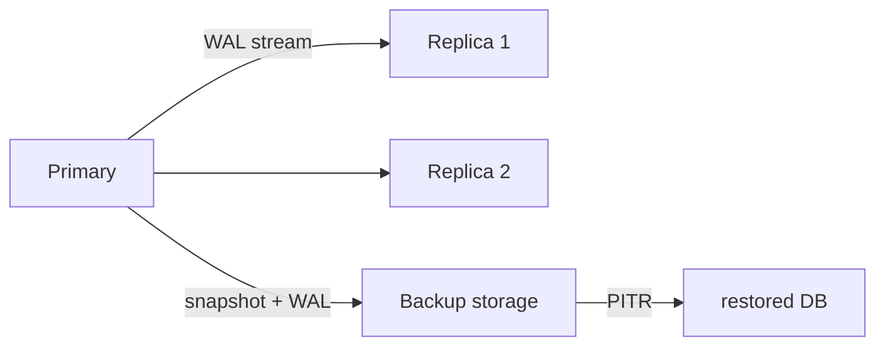

# Database Systems 101 (9/10): 복제와 백업

운영 중인 데이터베이스는 언젠가 반드시 사고를 만납니다. 디스크가 고장 나고, 사람이 잘못된 DELETE를 실행하고, 네트워크 구간이나 리전 전체가 흔들릴 수 있습니다. 이때 중요한 것은 “장애는 드물다”는 위안이 아니라, 그 장애가 왔을 때 얼마를 잃고 얼마나 빨리 복구할 수 있는지를 미리 숫자로 정해 두는 일입니다.

복제와 백업은 모두 데이터를 지키는 수단이지만, 보호하는 축이 다릅니다. 복제는 같은 시점의 데이터를 여러 노드에 퍼뜨려 가용성을 높이고, 백업은 시간을 거슬러 복원할 수 있게 해 줍니다. 둘 중 하나만으로는 충분하지 않습니다.


*Database Systems 101 9장 흐름 개요*

## 먼저 던지는 질문

- Primary-Replica 복제는 어떻게 동작하고 각 노드는 무슨 역할을 할까요?
- 동기 복제와 비동기 복제는 무엇을 주고받을까요?
- 전체 백업, 증분 백업, WAL 기반 PITR은 어떻게 다를까요?

## 이 글에서 배울 내용

- Primary-Replica 복제의 동작 원리와 역할 분담
- 동기 복제와 비동기 복제의 트레이드오프
- 전체 백업, 증분 백업, WAL 기반 PITR의 차이
- RPO와 RTO를 정의하는 방법

## 왜 중요한가

장애는 반드시 일어납니다. 중요한 질문은 “그때 얼마나 많은 데이터를 잃을 수 있는가?”와 “몇 분 안에 복구해야 하는가?”입니다. 복제와 백업은 이 질문에 대한 기술적 답이며, 결국은 비즈니스 약속(RPO/RTO)을 시스템 설계로 번역하는 작업입니다.

> 복원 절차를 한 번도 연습해 보지 않은 백업은 백업이 아니라 희망 사항에 가깝습니다.

## 핵심 개념 한눈에 보기



복제는 같은 시점의 데이터를 여러 노드에 퍼뜨리고, 백업은 스냅샷과 로그를 이용해 과거의 특정 시점으로 되돌리는 경로를 제공합니다.

## 핵심 용어

- **Primary/Replica**: 쓰기를 받는 원본 노드와 그 변경을 따라가는 복제 노드입니다.
- **동기/비동기 복제**: COMMIT이 레플리카 확인을 기다릴지 여부에 대한 차이입니다.
- **PITR**: 베이스 백업과 WAL 재생으로 원하는 시점까지 복원하는 방식입니다.
- **RPO**: 허용 가능한 데이터 손실량을 시간으로 표현한 값입니다.
- **RTO**: 허용 가능한 장애 복구 시간을 시간으로 표현한 값입니다.

## 변경 전/변경 후

**Before — single instance, backups only**

- 디스크 장애가 나면 지난밤 백업 이후의 데이터는 잃고, 복구에는 30분이 걸립니다.

**After — replica plus regular PITR backups**

- 자동 페일오버로 30초 안에 쓰기 서비스가 복귀합니다.
- 잘못된 DELETE는 PITR로 몇 분 단위까지 되돌릴 수 있습니다.

즉 같은 데이터를 공간과 시간 두 축에서 동시에 보호하게 됩니다.

## 실습: 복제와 시점 복구 흉내내기

### 1단계 — 원본 노드 설정

```ini
# postgresql.conf
wal_level = replica
max_wal_senders = 10
archive_mode = on
archive_command = 'cp %p /var/lib/pgsql/wal_archive/%f'
```

이 설정은 WAL을 외부 저장소로 내보냅니다. 복제와 PITR 모두 결국 WAL이 핵심 채널이 됩니다.

### 2단계 — 복제 노드 만들기

```bash
pg_basebackup -h primary.host -D /var/lib/pgsql/replica -U replicator -P -X stream
```

베이스 백업을 받은 뒤 스트리밍 복제를 시작하면, 레플리카는 Primary의 WAL을 계속 따라갑니다.

### 3단계 — 동기 복제 활성화

```ini
# postgresql.conf
synchronous_commit = on
synchronous_standby_names = 'replica1'
```

이제 Primary는 `replica1`이 WAL 수신을 확인할 때까지 COMMIT을 완료하지 않습니다. 데이터 손실 위험은 줄지만, 느린 레플리카 하나가 전체 쓰기 지연으로 이어질 수 있습니다.

### 4단계 — 기준 백업과 로그 보관

```bash
pg_basebackup -D /backup/base/$(date +%F) -Ft -z -P
ls /var/lib/pgsql/wal_archive | tail
```

베이스 백업은 시점 t0의 스냅샷이고, WAL 아카이브는 그 이후 변경 내역입니다. PITR은 둘을 함께 써야만 성립합니다.

### 5단계 — 임의 시점 복구

```ini
# recovery.conf or postgresql.auto.conf
restore_command = 'cp /var/lib/pgsql/wal_archive/%f %p'
recovery_target_time = '2026-05-04 03:00:00'
```

베이스 백업을 복원한 뒤 WAL을 원하는 시점까지 재생하면, 잘못된 DELETE 직전 상태로 되돌아갈 수 있습니다.

## 이 코드에서 먼저 봐야 할 점

- 복제는 대개 **WAL 스트리밍**으로 구현됩니다. 트랜잭션 로그가 곧 복제 채널입니다.
- 동기 복제는 데이터 손실 가능성을 줄이는 대신 느린 노드의 영향을 전체 쓰기가 함께 받습니다.
- PITR을 위해서는 베이스 백업과 WAL을 **둘 다** 보관해야 합니다.
- 실제 복원 시간은 백업 크기, 네트워크 속도, WAL 양의 함수입니다.

## 자주 하는 실수 5가지

1. **레플리카를 백업으로 착각한다.** 잘못된 DELETE는 레플리카에도 즉시 복제됩니다.
2. **백업 복원을 한 번도 해 보지 않는다.** 복원 가능성은 연습을 통해서만 증명됩니다.
3. **RPO/RTO를 합의 없이 정한다.** 비즈니스 요구와 인프라 비용이 어긋나면 설계가 흔들립니다.
4. **동기 복제만 믿는다.** 느린 레플리카 하나가 전체 쓰기를 멈추게 할 수 있습니다.
5. **백업을 같은 리전이나 같은 계정에만 둔다.** 리전 단위 사고나 계정 사고에 취약합니다.

## 실무에서는 이렇게 드러납니다

대부분의 OLTP 서비스는 “1 primary + N async replica + 정기 PITR 백업” 구조에서 시작합니다. 읽기 부하는 레플리카로 분산하고, 즉시 일관성이 필요한 경로만 Primary에서 읽습니다. 동기 복제는 정말 데이터 손실 허용치가 낮은 경로에 제한적으로 넣는 경우가 많습니다.

중요한 것은 장애 대응을 즉흥적으로 하지 않는다는 점입니다. 페일오버 훈련과 백업 복원 훈련은 정기 일정으로 운영되어야 합니다. “백업이 있다”는 말은 “최근에 실제로 복원했다”는 사실이 동반될 때만 믿을 수 있습니다.

## 시니어 엔지니어는 이렇게 생각합니다

- RPO와 RTO를 “대략”이 아니라 숫자로 합의합니다.
- 분기마다 최소 한 번은 복원 절차를 실제로 실행합니다.
- 백업은 다른 리전과 다른 계정에도 둡니다.
- 동기 복제 대상 노드에는 별도 헬스 모니터링을 붙입니다.
- 페일오버는 자동화하지만, 수동 절차도 문서로 남깁니다.

## 체크리스트

- [ ] RPO/RTO가 명시적으로 정의되어 있는가?
- [ ] 정기 백업과 WAL 아카이브가 모두 준비되어 있는가?
- [ ] 백업이 별도 위치에 저장되는가?
- [ ] 최근 6개월 안에 복원 훈련을 했는가?
- [ ] 페일오버 절차가 문서화되어 있고 자동화되어 있는가?

## 연습 문제

1. 동기 복제의 가장 큰 위험 한 가지와 비동기 복제의 가장 큰 위험 한 가지를 각각 한 문장으로 적어 보세요.
2. 잘못된 `DELETE FROM users`가 실행됐습니다. 레플리카만 있고 백업이 없다면 무엇이 가능하고 무엇이 불가능한지 설명해 보세요.
3. 많은 시스템에서 RPO 0이 비현실적인 이유를 한 단락으로 설명해 보세요.

## 정리 및 다음 단계

복제는 공간 축에서 가용성을 맡고, 백업은 시간 축에서 복구 가능성을 맡습니다. 둘이 함께 있어야 시스템이 장애를 견딜 수 있습니다. 다음 글에서는 같은 데이터를 두고도 완전히 다른 요구를 갖는 두 세계, OLTP와 OLAP를 비교하며 시리즈를 마무리합니다.

## 복제 구성 예시와 장애 전환 기준

복제는 읽기 분산만을 위한 기능이 아닙니다. 장애 전환 시간을 줄이는 데 핵심입니다. 아래는 PostgreSQL 기반의 단순 예시입니다.

```conf
# primary
wal_level = replica
max_wal_senders = 10
archive_mode = on
archive_command = 'test ! -f /archive/%f && cp %p /archive/%f'

# replica
primary_conninfo = 'host=10.0.0.10 port=5432 user=replicator password=***'
primary_slot_name = 'replica_1'
hot_standby = on
```

운영에서는 복제 지연을 초 단위로 감시해야 합니다. 지연이 길어지면 읽기 정합성과 장애 전환 시 데이터 유실 가능성이 커집니다.

```sql
SELECT now() - pg_last_xact_replay_timestamp() AS replication_lag;
```

## 백업과 복구 리허설

백업 파일이 존재하는 것과 복구가 실제로 되는 것은 다른 문제입니다. 반드시 주기적 리허설을 수행해야 합니다.

1. 베이스 백업 복원
2. WAL 재적용으로 특정 시점 복구
3. 애플리케이션 핵심 질의 검증
4. 복구 시간과 유실 범위 기록

복제는 가용성 축, 백업은 시간 축입니다. 두 축을 함께 설계해야 운영 사고에서 살아남습니다.

## 실전 운영 점검표

운영 환경에서 데이터베이스 품질을 안정적으로 유지하려면, 기능 개발과 별개로 점검 루틴을 명확하게 가져가야 합니다. 아래 항목은 서비스 규모와 상관없이 바로 적용할 수 있는 기준입니다.

- 변경 전에는 항상 기준 지표를 남깁니다. 평균 지연 시간, P95, P99, 초당 트랜잭션 수, 잠금 대기 시간 같은 숫자를 캡처해 둬야 변경 이후를 비교할 수 있습니다.
- 쿼리 튜닝은 SQL 문장 자체보다 실행 계획의 변화를 중심으로 추적합니다. 계획 노드가 바뀌었는지, 예상 행 수와 실제 행 수의 차이가 커졌는지, 정렬이나 해시가 디스크로 내려갔는지를 우선 확인합니다.
- 스키마 변경은 단계적으로 진행합니다. 컬럼 추가, 백필, 코드 전환, 제약 강화 순서로 나누면 장애 반경을 줄일 수 있습니다.
- 장애 대응 문서는 운영자가 밤중에도 바로 실행할 수 있는 형태여야 합니다. 복구 절차, 롤백 절차, 검증 SQL을 같은 문서에 둬야 실제 상황에서 흔들리지 않습니다.

아래 예시는 팀이 릴리스 전후에 반복적으로 실행하는 최소 점검 SQL입니다.

```sql
-- 최근 10분 동안 느린 쿼리 확인(엔진별 뷰 이름은 다를 수 있음)
SELECT query, calls, mean_exec_time, rows
FROM pg_stat_statements
ORDER BY mean_exec_time DESC
LIMIT 20;

-- 잠금 대기 체인 확인
SELECT now(), pid, wait_event_type, wait_event, state, query
FROM pg_stat_activity
WHERE wait_event_type IS NOT NULL;

-- 인덱스 사용률 점검
SELECT relname AS table_name, seq_scan, idx_scan
FROM pg_stat_user_tables
ORDER BY seq_scan DESC
LIMIT 20;
```

이 점검 루틴을 자동화 파이프라인에 연결하면, 성능 저하를 "느낌"이 아니라 "증거"로 관리할 수 있습니다. 결국 장기 운영에서 중요한 것은 뛰어난 한 번의 튜닝이 아니라, 작은 검증을 꾸준히 반복해 위험을 조기에 감지하는 습관입니다.
## 운영 리허설 시나리오

문서만 읽고 끝내면 운영에서 다시 같은 실수를 반복하기 쉽습니다. 아래 시나리오는 팀 온보딩과 장애 대응 훈련에 바로 사용할 수 있는 공통 리허설 절차입니다.

### 시나리오 1: 느려진 조회 원인 찾기

1. 문제 쿼리를 식별합니다. 애플리케이션 로그의 요청 식별자와 데이터베이스 쿼리 로그를 매칭합니다.
2. 같은 파라미터로 `EXPLAIN ANALYZE`를 실행합니다.
3. 계획 노드 중 시간이 큰 지점을 찾고, 해당 노드가 인덱스/통계/정렬 중 무엇과 관련 있는지 분류합니다.
4. 개선안을 한 번에 하나만 적용합니다. 인덱스 추가, 통계 갱신, 질의문 재작성 가운데 하나만 바꿔 결과를 비교합니다.

```text
개선 전
Seq Scan on events  (actual time=0.030..842.112 rows=12000)

개선 후
Index Scan using idx_events_tenant_created on events
(actual time=0.041..21.553 rows=12000)
```

### 시나리오 2: 동시성 문제 재현과 완화

1. 두 세션에서 같은 행을 거의 동시에 수정합니다.
2. 격리 수준을 바꿔 가며 결과를 비교합니다.
3. 필요하면 `FOR UPDATE` 잠금 조회 또는 낙관적 잠금 버전 컬럼을 적용합니다.
4. 재시도 정책과 타임아웃 기준을 코드와 운영 문서에 같이 기록합니다.

```sql
-- 낙관적 잠금 예시
UPDATE inventory
SET qty = qty - 1, version = version + 1
WHERE sku = 'A-100' AND version = 17;
```

영향 받은 행 수가 0이면 이미 다른 트랜잭션이 갱신한 것이므로, 재조회 후 재시도합니다. 이 패턴은 잠금 경합을 낮추면서도 정합성을 지키는 데 효과적입니다.

### 시나리오 3: 복구 가능성 검증

1. 최신 베이스 백업으로 테스트 인스턴스를 띄웁니다.
2. 지정 시점까지 로그를 재적용합니다.
3. 핵심 비즈니스 검증 SQL을 실행합니다.
4. 복구 시간(RTO)과 데이터 유실 허용치(RPO)를 실제 숫자로 기록합니다.

```sql
-- 검증 SQL 예시
SELECT COUNT(*) FROM orders WHERE created_at >= now() - interval '1 day';
SELECT SUM(amount) FROM payments WHERE status = 'SUCCESS';
SELECT COUNT(*) FROM users WHERE deleted_at IS NULL;
```

복구 리허설에서 가장 중요한 점은 성공 여부 자체보다, 누가 어떤 순서로 무엇을 확인했는지를 재현 가능하게 남기는 것입니다. 절차가 사람마다 다르면 실제 장애에서 속도와 품질이 동시에 무너집니다.

## 체크리스트: 배포 전 최소 검증

- 대표 조회 5개에 대해 실행 계획을 저장합니다.
- 트랜잭션 경계가 긴 코드 경로를 식별합니다.
- 잠금 대기 알람 임계치를 설정합니다.
- 스키마 변경의 롤백 경로를 문서화합니다.
- 백업 복구 리허설 최근 실행일을 확인합니다.

이 체크리스트는 거창한 체계를 요구하지 않습니다. 작은 팀도 주 1회 반복하면 데이터 사고 빈도를 눈에 띄게 줄일 수 있습니다. 데이터베이스 운영의 본질은 "고급 기능을 많이 아는 것"이 아니라, "반복 가능한 검증 루프를 끊기지 않게 유지하는 것"입니다.

## 추가 실습 기록 템플릿

아래 템플릿은 팀 위키에 그대로 붙여 넣어 실습 결과를 남길 때 사용합니다.

```text
[실습 이름]
- 실행 일시:
- 실행 환경:
- 입력 데이터 규모:
- 대표 SQL:
- EXPLAIN ANALYZE 핵심 노드:
- 개선 전/후 실행 시간:
- 적용 변경 사항:
- 부작용 또는 주의점:
- 다음 점검 항목:
```

실습 기록을 남기면 지식이 개인 경험으로 소모되지 않고 팀 자산으로 누적됩니다. 특히 실행 계획 캡처와 복구 절차 검증 결과를 함께 보관하면, 다음 장애 대응에서 판단 속도를 크게 높일 수 있습니다.

## 심화: 복구 우선순위와 의사결정

장애 시점에는 기술 선택보다 의사결정 순서가 더 중요합니다. 아래 순서를 미리 합의해 두면 혼선을 줄일 수 있습니다.

1. 서비스 지속이 우선인지, 데이터 정합성 보존이 우선인지 결정합니다.
2. 복제 승격 시 허용 가능한 데이터 유실 범위를 확인합니다.
3. 복구 목표 시점과 검증 범위를 명시합니다.
4. 복구 후 재동기화 절차를 바로 실행합니다.

```text
장애 대응 브리지 로그 예시
- 02:11 원본 노드 장애 감지
- 02:13 복제 지연 3초 확인
- 02:15 읽기 전용 해제 후 승격
- 02:21 핵심 결제/주문 검증 SQL 통과
- 02:30 애플리케이션 라우팅 전환 완료
```

복구는 기술 데모가 아니라 비즈니스 연속성 작업입니다. 결국 좋은 팀은 "어떻게 고쳤는가"보다 "왜 그 순서로 판단했는가"를 문서화합니다.

## 점검 메모

복제와 백업의 설계가 아무리 좋아도, 실제 운영에서는 권한 관리와 실행 자동화가 빠지면 절차가 멈춥니다. 복구 계정 권한, 백업 저장소 접근 정책, 복구 스크립트 실행 위치를 사전에 검증해 두어야 합니다. 작은 항목처럼 보이지만, 실제 사고에서는 이 준비 여부가 복구 시간을 크게 가릅니다.

## 처음 질문으로 돌아가기

- **Primary-Replica 복제는 어떻게 동작하고 각 노드는 무슨 역할을 할까요?**
  - 본문의 기준은 복제와 백업를 한 덩어리 개념으로 보지 않고 입력, 처리, 검증, 운영 신호가 만나는 경계로 나누어 확인하는 것입니다.
- **동기 복제와 비동기 복제는 무엇을 주고받을까요?**
  - 예제와 그림에서는 어떤 값이 들어오고, 어느 단계에서 바뀌며, 어떤 기준으로 통과 또는 실패하는지를 먼저 확인해야 합니다.
- **전체 백업, 증분 백업, WAL 기반 PITR은 어떻게 다를까요?**
  - 운영에서는 이 판단을 체크리스트, 로그, 테스트로 남겨 다음 변경에서도 같은 실패가 반복되지 않게 막아야 합니다.

<!-- toc:begin -->
## 시리즈 목차

- [Database Systems 101 (1/10): 데이터베이스 시스템이란 무엇인가?](./01-what-is-a-database.md)
- [Database Systems 101 (2/10): 관계형 모델](./02-relational-model.md)
- [Database Systems 101 (3/10): SQL과 쿼리 처리](./03-sql-and-query-processing.md)
- [Database Systems 101 (4/10): 인덱스](./04-indexes.md)
- [Database Systems 101 (5/10): 트랜잭션과 ACID](./05-transactions-and-acid.md)
- [Database Systems 101 (6/10): 격리 수준](./06-isolation-levels.md)
- [Database Systems 101 (7/10): 정규화와 모델링](./07-normalization-and-modeling.md)
- [Database Systems 101 (8/10): 쿼리 최적화](./08-query-optimization.md)
- **복제와 백업 (현재 글)**
- OLTP와 OLAP (예정)

<!-- toc:end -->

## 참고 자료

- [database-systems-101 예제 코드 (book-examples)](https://github.com/yeongseon-books/book-examples/tree/main/database-systems-101/ko)
- [PostgreSQL — High Availability, Replication](https://www.postgresql.org/docs/current/high-availability.html)
- [PostgreSQL — Continuous Archiving and PITR](https://www.postgresql.org/docs/current/continuous-archiving.html)
- [Designing Data-Intensive Applications — Chapter 5](https://dataintensive.net/)
- [Google SRE Book — Backup and Disaster Recovery](https://sre.google/sre-book/data-integrity/)

Tags: Computer Science, Database, 복제, 백업, 복구, 고가용성
