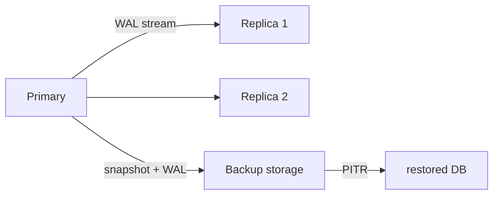

# 복제와 백업

이 글은 Database Systems 101 시리즈의 아홉 번째 글입니다.

운영 중인 데이터베이스는 언젠가 반드시 사고를 만납니다. 디스크가 고장 나고, 사람이 잘못된 DELETE를 실행하고, 네트워크 구간이나 리전 전체가 흔들릴 수 있습니다. 이때 중요한 것은 “장애는 드물다”는 위안이 아니라, 그 장애가 왔을 때 얼마를 잃고 얼마나 빨리 복구할 수 있는지를 미리 숫자로 정해 두는 일입니다.

복제와 백업은 모두 데이터를 지키는 수단이지만, 보호하는 축이 다릅니다. 복제는 같은 시점의 데이터를 여러 노드에 퍼뜨려 가용성을 높이고, 백업은 시간을 거슬러 복원할 수 있게 해 줍니다. 둘 중 하나만으로는 충분하지 않습니다.

## 이 글에서 다룰 문제

- Primary-Replica 복제는 어떻게 동작하고 각 노드는 무슨 역할을 할까요?
- 동기 복제와 비동기 복제는 무엇을 주고받을까요?
- 전체 백업, 증분 백업, WAL 기반 PITR은 어떻게 다를까요?
- RPO와 RTO는 어떻게 정의해야 할까요?

> **멘탈 모델**: 복제는 공간 축에서 데이터를 복제해 서비스 연속성을 지키고, 백업은 시간 축에서 데이터를 되감아 복구 가능성을 지킵니다. 즉 복제는 “옆으로”, 백업은 “뒤로” 움직이는 보호 장치입니다.

## 이 글에서 배울 내용

- Primary-Replica 복제의 동작 원리와 역할 분담
- 동기 복제와 비동기 복제의 트레이드오프
- 전체 백업, 증분 백업, WAL 기반 PITR의 차이
- RPO와 RTO를 정의하는 방법

## 왜 중요한가

장애는 반드시 일어납니다. 중요한 질문은 “그때 얼마나 많은 데이터를 잃을 수 있는가?”와 “몇 분 안에 복구해야 하는가?”입니다. 복제와 백업은 이 질문에 대한 기술적 답이며, 결국은 비즈니스 약속(RPO/RTO)을 시스템 설계로 번역하는 작업입니다.

> 복원 절차를 한 번도 연습해 보지 않은 백업은 백업이 아니라 희망 사항에 가깝습니다.

## 핵심 개념 한눈에 보기



복제는 같은 시점의 데이터를 여러 노드에 퍼뜨리고, 백업은 스냅샷과 로그를 이용해 과거의 특정 시점으로 되돌리는 경로를 제공합니다.

## 핵심 용어

- **Primary/Replica**: 쓰기를 받는 원본 노드와 그 변경을 따라가는 복제 노드입니다.
- **동기/비동기 복제**: COMMIT이 레플리카 확인을 기다릴지 여부에 대한 차이입니다.
- **PITR**: 베이스 백업과 WAL 재생으로 원하는 시점까지 복원하는 방식입니다.
- **RPO**: 허용 가능한 데이터 손실량을 시간으로 표현한 값입니다.
- **RTO**: 허용 가능한 장애 복구 시간을 시간으로 표현한 값입니다.

## Before/After

**Before — single instance, backups only**

- 디스크 장애가 나면 지난밤 백업 이후의 데이터는 잃고, 복구에는 30분이 걸립니다.

**After — replica plus regular PITR backups**

- 자동 페일오버로 30초 안에 쓰기 서비스가 복귀합니다.
- 잘못된 DELETE는 PITR로 몇 분 단위까지 되돌릴 수 있습니다.

즉 같은 데이터를 공간과 시간 두 축에서 동시에 보호하게 됩니다.

## 실습: 복제와 PITR 흉내내기

### 1단계 — Primary 설정(PostgreSQL)

```ini
# postgresql.conf
wal_level = replica
max_wal_senders = 10
archive_mode = on
archive_command = 'cp %p /var/lib/pgsql/wal_archive/%f'
```

이 설정은 WAL을 외부 저장소로 내보냅니다. 복제와 PITR 모두 결국 WAL이 핵심 채널이 됩니다.

### 2단계 — Replica 만들기

```bash
pg_basebackup -h primary.host -D /var/lib/pgsql/replica -U replicator -P -X stream
```

베이스 백업을 받은 뒤 스트리밍 복제를 시작하면, 레플리카는 Primary의 WAL을 계속 따라갑니다.

### 3단계 — 동기 복제 활성화

```ini
# postgresql.conf
synchronous_commit = on
synchronous_standby_names = 'replica1'
```

이제 Primary는 `replica1`이 WAL 수신을 확인할 때까지 COMMIT을 완료하지 않습니다. 데이터 손실 위험은 줄지만, 느린 레플리카 하나가 전체 쓰기 지연으로 이어질 수 있습니다.

### 4단계 — 베이스 백업과 WAL 보관

```bash
pg_basebackup -D /backup/base/$(date +%F) -Ft -z -P
ls /var/lib/pgsql/wal_archive | tail
```

베이스 백업은 시점 t0의 스냅샷이고, WAL 아카이브는 그 이후 변경 내역입니다. PITR은 둘을 함께 써야만 성립합니다.

### 5단계 — 임의 시점 PITR

```ini
# recovery.conf or postgresql.auto.conf
restore_command = 'cp /var/lib/pgsql/wal_archive/%f %p'
recovery_target_time = '2026-05-04 03:00:00'
```

베이스 백업을 복원한 뒤 WAL을 원하는 시점까지 재생하면, 잘못된 DELETE 직전 상태로 되돌아갈 수 있습니다.

## 이 코드에서 먼저 봐야 할 점

- 복제는 대개 **WAL 스트리밍**으로 구현됩니다. 트랜잭션 로그가 곧 복제 채널입니다.
- 동기 복제는 데이터 손실 가능성을 줄이는 대신 느린 노드의 영향을 전체 쓰기가 함께 받습니다.
- PITR을 위해서는 베이스 백업과 WAL을 **둘 다** 보관해야 합니다.
- 실제 복원 시간은 백업 크기, 네트워크 속도, WAL 양의 함수입니다.

## 자주 하는 실수 5가지

1. **레플리카를 백업으로 착각한다.** 잘못된 DELETE는 레플리카에도 즉시 복제됩니다.
2. **백업 복원을 한 번도 해 보지 않는다.** 복원 가능성은 연습을 통해서만 증명됩니다.
3. **RPO/RTO를 합의 없이 정한다.** 비즈니스 요구와 인프라 비용이 어긋나면 설계가 흔들립니다.
4. **동기 복제만 믿는다.** 느린 레플리카 하나가 전체 쓰기를 멈추게 할 수 있습니다.
5. **백업을 같은 리전이나 같은 계정에만 둔다.** 리전 단위 사고나 계정 사고에 취약합니다.

## 실무에서는 이렇게 드러납니다

대부분의 OLTP 서비스는 “1 primary + N async replica + 정기 PITR 백업” 구조에서 시작합니다. 읽기 부하는 레플리카로 분산하고, 즉시 일관성이 필요한 경로만 Primary에서 읽습니다. 동기 복제는 정말 데이터 손실 허용치가 낮은 경로에 제한적으로 넣는 경우가 많습니다.

중요한 것은 장애 대응을 즉흥적으로 하지 않는다는 점입니다. 페일오버 훈련과 백업 복원 훈련은 정기 일정으로 운영되어야 합니다. “백업이 있다”는 말은 “최근에 실제로 복원했다”는 사실이 동반될 때만 믿을 수 있습니다.

## 시니어 엔지니어는 이렇게 생각합니다

- RPO와 RTO를 “대략”이 아니라 숫자로 합의합니다.
- 분기마다 최소 한 번은 복원 절차를 실제로 실행합니다.
- 백업은 다른 리전과 다른 계정에도 둡니다.
- 동기 복제 대상 노드에는 별도 헬스 모니터링을 붙입니다.
- 페일오버는 자동화하지만, 수동 절차도 문서로 남깁니다.

## 체크리스트

- [ ] RPO/RTO가 명시적으로 정의되어 있는가?
- [ ] 정기 백업과 WAL 아카이브가 모두 준비되어 있는가?
- [ ] 백업이 별도 위치에 저장되는가?
- [ ] 최근 6개월 안에 복원 훈련을 했는가?
- [ ] 페일오버 절차가 문서화되어 있고 자동화되어 있는가?

## 연습 문제

1. 동기 복제의 가장 큰 위험 한 가지와 비동기 복제의 가장 큰 위험 한 가지를 각각 한 문장으로 적어 보세요.
2. 잘못된 `DELETE FROM users`가 실행됐습니다. 레플리카만 있고 백업이 없다면 무엇이 가능하고 무엇이 불가능한지 설명해 보세요.
3. 많은 시스템에서 RPO 0이 비현실적인 이유를 한 단락으로 설명해 보세요.

## 정리 및 다음 단계

복제는 공간 축에서 가용성을 맡고, 백업은 시간 축에서 복구 가능성을 맡습니다. 둘이 함께 있어야 시스템이 장애를 견딜 수 있습니다. 다음 글에서는 같은 데이터를 두고도 완전히 다른 요구를 갖는 두 세계, OLTP와 OLAP를 비교하며 시리즈를 마무리합니다.

<!-- toc:begin -->
- [데이터베이스 시스템이란 무엇인가?](./01-what-is-a-database.md)
- [관계형 모델](./02-relational-model.md)
- [SQL과 쿼리 처리](./03-sql-and-query-processing.md)
- [인덱스](./04-indexes.md)
- [트랜잭션과 ACID](./05-transactions-and-acid.md)
- [isolation level](./06-isolation-levels.md)
- [정규화와 모델링](./07-normalization-and-modeling.md)
- [쿼리 최적화](./08-query-optimization.md)
- **복제와 백업 (현재 글)**
- OLTP와 OLAP (예정)
<!-- toc:end -->

## 참고 자료

- [PostgreSQL — High Availability, Replication](https://www.postgresql.org/docs/current/high-availability.html)
- [PostgreSQL — Continuous Archiving and PITR](https://www.postgresql.org/docs/current/continuous-archiving.html)
- [Designing Data-Intensive Applications — Chapter 5](https://dataintensive.net/)
- [Google SRE Book — Backup and Disaster Recovery](https://sre.google/sre-book/data-integrity/)

Tags: Computer Science, Database, 복제, 백업, 복구, 고가용성
