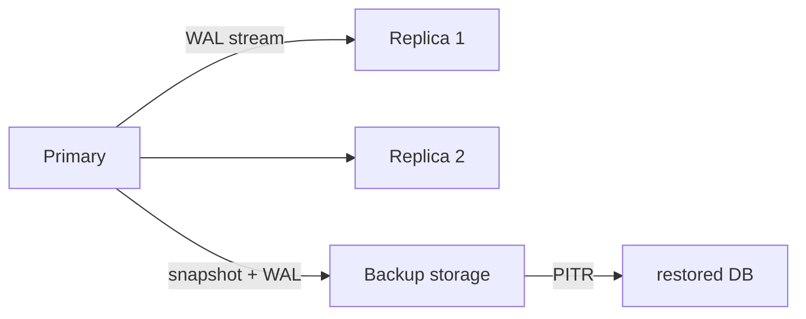

# Database Systems 101 (9/10): 복제와 백업

운영 중인 데이터베이스는 언젠가 반드시 사고를 만납니다. 디스크가 고장 나고, 사람이 잘못된 DELETE를 실행하고, 네트워크 구간이나 리전 전체가 흔들릴 수 있습니다. 이때 중요한 것은 "장애는 드물다"는 위안이 아니라, 그 장애가 왔을 때 얼마를 잃고 얼마나 빨리 복구할 수 있는지를 미리 숫자로 정해 두는 일입니다.

이 글은 Database Systems 101 시리즈의 9번째 글입니다.

복제와 백업은 모두 데이터를 지키는 수단이지만, 보호하는 축이 다릅니다. 복제는 같은 시점의 데이터를 여러 노드에 퍼뜨려 가용성을 높이고, 백업은 시간을 거슬러 복원할 수 있게 해 줍니다. 둘 중 하나만으로는 충분하지 않습니다.


*Database Systems 101 9장 흐름 개요*

## 이 글에서 다룰 문제

- Primary-Replica 복제는 어떻게 동작하고 각 노드는 무슨 역할을 할까요?
- 동기 복제와 비동기 복제는 무엇을 주고받을까요?
- 전체 백업, 증분 백업, WAL 기반 PITR은 어떻게 다를까요?
- 이 개념을 실무에서 잘못 적용하면 어떤 문제가 생길까요?
- 이 주제에서 초보자가 가장 자주 놓치는 포인트는 무엇일까요?

## 이 글에서 배울 내용

- Primary-Replica 복제의 동작 원리와 역할 분담
- 동기 복제와 비동기 복제의 트레이드오프
- 전체 백업, 증분 백업, WAL 기반 PITR의 차이
- RPO와 RTO를 정의하는 방법

장애는 반드시 일어납니다. 중요한 질문은 "그때 얼마나 많은 데이터를 잃을 수 있는가?"와 "몇 분 안에 복구해야 하는가?"입니다. 복제와 백업은 이 질문에 대한 기술적 답이며, 결국은 비즈니스 약속(RPO/RTO)을 시스템 설계로 번역하는 작업입니다.

> 복원 절차를 한 번도 연습해 보지 않은 백업은 백업이 아니라 희망 사항에 가깝습니다.


```mermaid
flowchart LR
    A["Primary"] -- "WAL stream" --> B["Replica 1"]
    A --> C["Replica 2"]
    A -- "snapshot + WAL" --> D["Backup storage"]
    D -- "PITR" --> E["restored DB"]
```

복제는 같은 시점의 데이터를 여러 노드에 퍼뜨리고, 백업은 스냅샷과 로그를 이용해 과거의 특정 시점으로 되돌리는 경로를 제공합니다.

- **Primary/Replica**: 쓰기를 받는 원본 노드와 그 변경을 따라가는 복제 노드입니다.
- **동기/비동기 복제**: COMMIT이 레플리카 확인을 기다릴지 여부에 대한 차이입니다.
- **PITR**: 베이스 백업과 WAL 재생으로 원하는 시점까지 복원하는 방식입니다.
- **RPO**: 허용 가능한 데이터 손실량을 시간으로 표현한 값입니다.
- **RTO**: 허용 가능한 장애 복구 시간을 시간으로 표현한 값입니다.

## 단일 인스턴스 vs 복제 + PITR

**Before — single instance, backups only**

- 디스크 장애가 나면 지난밤 백업 이후의 데이터는 잃고, 복구에는 30분이 걸립니다.
- RPO: 최대 24시간 / RTO: 30분 이상

**After — replica plus regular PITR backups**

- 자동 페일오버로 30초 안에 쓰기 서비스가 복귀합니다.
- 잘못된 DELETE는 PITR로 몇 분 단위까지 되돌릴 수 있습니다.
- RPO: 수 초~수 분 / RTO: 30초~5분

즉 같은 데이터를 공간과 시간 두 축에서 동시에 보호하게 됩니다.

## 실습: 복제와 시점 복구 설정하기

### 1단계 — Primary 설정

```ini
# postgresql.conf (Primary)
wal_level = replica
max_wal_senders = 10
archive_mode = on
archive_command = 'test ! -f /archive/%f && cp %p /archive/%f'
wal_keep_size = 1GB
```

이 설정은 WAL을 외부 저장소로 내보냅니다. 복제와 PITR 모두 결국 WAL이 핵심 채널이 됩니다.

### 2단계 — 복제 노드 만들기

```bash
# Replica 서버에서 실행
pg_basebackup \
    -h primary.host \
    -D /var/lib/pgsql/replica \
    -U replicator \
    -P \
    -X stream \
    --checkpoint=fast
```

베이스 백업을 받은 뒤 스트리밍 복제를 시작하면, 레플리카는 Primary의 WAL을 계속 따라갑니다.

### 3단계 — 동기 복제 활성화

```ini
# postgresql.conf (Primary)
synchronous_commit = on
synchronous_standby_names = 'replica1'
```

이제 Primary는 `replica1`이 WAL 수신을 확인할 때까지 COMMIT을 완료하지 않습니다. 데이터 손실 위험은 줄지만, 느린 레플리카 하나가 전체 쓰기 지연으로 이어질 수 있습니다.

### 4단계 — 기준 백업과 로그 보관

```bash
# 베이스 백업 (주기적으로 자동화)
pg_basebackup \
    -D /backup/base/$(date +%F) \
    -Ft -z -P \
    --checkpoint=fast

# WAL 아카이브 목록 확인
ls /archive | tail -20
```

베이스 백업은 시점 t0의 스냅샷이고, WAL 아카이브는 그 이후 변경 내역입니다. PITR은 둘을 함께 써야만 성립합니다.

### 5단계 — 임의 시점 복구

```ini
# recovery.conf (PostgreSQL 12 미만) 또는 postgresql.auto.conf
restore_command = 'cp /archive/%f %p'
recovery_target_time = '2026-05-04 03:00:00'
recovery_target_action = 'promote'
```

베이스 백업을 복원한 뒤 WAL을 원하는 시점까지 재생하면, 잘못된 DELETE 직전 상태로 되돌아갈 수 있습니다.

## 복제 지연 모니터링 SQL

```sql
-- Primary에서 복제 상태 확인
SELECT
    client_addr,
    state,
    sent_lsn,
    write_lsn,
    flush_lsn,
    replay_lsn,
    (sent_lsn - replay_lsn) AS replication_lag_bytes
FROM pg_stat_replication;

-- Replica에서 지연 시간 확인
SELECT
    now() - pg_last_xact_replay_timestamp() AS replication_lag,
    pg_is_in_recovery() AS is_replica;

-- 복제 슬롯 상태 (WAL 보관 현황)
SELECT
    slot_name,
    active,
    restart_lsn,
    confirmed_flush_lsn
FROM pg_replication_slots;
```

## 백업 전략 비교

| 전략 | 크기 | 복구 속도 | 복구 시점 정밀도 | 비고 |
|------|------|-----------|-----------------|------|
| 전체 백업 (Full) | 크다 | 빠름 | 백업 시점만 | pg_basebackup, pg_dump |
| 증분 백업 (Incremental) | 작다 | 중간 | 증분 단위 | pg_basebackup --incremental (PG17+) |
| WAL 기반 PITR | 중간 | 느림 (WAL 재생) | 초 단위 정밀 | 베이스 백업 + WAL 아카이브 필요 |
| 논리 백업 | 작다 | 매우 느림 | 백업 시점만 | pg_dump, 선택적 복원 가능 |

```sql
-- 논리 백업: 특정 테이블만 복원 가능
-- pg_dump -t orders -F c -f orders_backup.dump mydb

-- 복원
-- pg_restore -t orders -d mydb orders_backup.dump
```

## 장애 대응 의사결정 순서

```text
장애 감지 → 복제 지연 확인 → 복구 방식 결정

시나리오 1: Primary 다운
  → 복제 지연 확인 (replication lag)
  → 허용 범위 내이면 Replica 승격 (pg_promote())
  → 애플리케이션 연결 엔드포인트 전환

시나리오 2: 잘못된 DELETE
  → 레플리카에도 이미 복제됨 → 복제 소용없음
  → PITR로 삭제 시점 직전으로 복원
  → 복원된 인스턴스에서 삭제된 데이터 추출
  → 운영 DB에 선택적으로 재삽입

시나리오 3: 디스크 손상
  → 최신 베이스 백업 + WAL 아카이브로 복원
  → 검증 SQL 실행 후 서비스 전환
```

```sql
-- 복구 후 검증 SQL
SELECT COUNT(*) FROM orders WHERE created_at >= now() - interval '1 day';
SELECT SUM(amount) FROM payments WHERE status = 'SUCCESS';
SELECT COUNT(*) FROM users WHERE deleted_at IS NULL;
-- 예상 값과 비교하여 복구 완료 확인
```

## 자주 하는 실수

| 실수 | 증상 | 올바른 접근 |
|------|------|-------------|
| 레플리카를 백업으로 착각 | 잘못된 DELETE가 레플리카에도 즉시 복제 | 레플리카(가용성) + PITR 백업(시간 복구) 둘 다 필요 |
| 백업 복원을 한 번도 테스트 안 함 | 실제 장애 시 복원 불가 사태 | 분기마다 복원 훈련 필수 |
| RPO/RTO를 합의 없이 결정 | 인프라 비용과 비즈니스 요구 불일치 | 비즈니스 팀과 명시적 숫자 합의 |
| 동기 복제만 믿는다 | 느린 레플리카 하나가 전체 쓰기 지연 | 동기 + 비동기 혼합 또는 타임아웃 설정 |
| 백업을 같은 리전·계정에만 보관 | 리전/계정 단위 사고 시 백업도 소실 | 크로스 리전, 크로스 계정 백업 필수 |

## 핵심 요약

- 복제는 대개 **WAL 스트리밍**으로 구현됩니다. 트랜잭션 로그가 곧 복제 채널입니다.
- 동기 복제는 데이터 손실 가능성을 줄이는 대신 느린 노드의 영향을 전체 쓰기가 함께 받습니다.
- PITR을 위해서는 베이스 백업과 WAL을 **둘 다** 보관해야 합니다.
- 레플리카는 가용성을 위한 것이고, PITR은 시간 복구를 위한 것입니다. 역할이 다릅니다.
- 백업의 존재보다 복원 훈련 여부를 더 신뢰합니다.

## 시니어 엔지니어는 이렇게 생각합니다

- RPO와 RTO를 "대략"이 아니라 숫자로 합의합니다.
- 분기마다 최소 한 번은 복원 절차를 실제로 실행합니다.
- 백업은 다른 리전과 다른 계정에도 둡니다.
- 동기 복제 대상 노드에는 별도 헬스 모니터링을 붙입니다.
- 페일오버는 자동화하지만, 수동 절차도 문서로 남깁니다.

## 운영 체크리스트

- [ ] RPO/RTO가 명시적으로 정의되어 있는가?
- [ ] 정기 백업과 WAL 아카이브가 모두 준비되어 있는가?
- [ ] 백업이 별도 리전/계정에 저장되는가?
- [ ] 최근 6개월 안에 복원 훈련을 했는가?
- [ ] 페일오버 절차가 문서화되어 있고 자동화되어 있는가?

## 연습 문제

1. 동기 복제의 가장 큰 위험 한 가지와 비동기 복제의 가장 큰 위험 한 가지를 각각 한 문장으로 적어 보세요.
2. 잘못된 `DELETE FROM users`가 실행됐습니다. 레플리카만 있고 백업이 없다면 무엇이 가능하고 무엇이 불가능한지 설명해 보세요.
3. 많은 시스템에서 RPO 0이 비현실적인 이유를 한 단락으로 설명해 보세요.

## 정리 및 다음 단계

복제는 공간 축에서 가용성을 맡고, 백업은 시간 축에서 복구 가능성을 맡습니다. 둘이 함께 있어야 시스템이 장애를 견딜 수 있습니다. 다음 글에서는 같은 데이터를 두고도 완전히 다른 요구를 갖는 두 세계, OLTP와 OLAP를 비교하며 시리즈를 마무리합니다.

<!-- toc:begin -->
## 시리즈 목차

- [Database Systems 101 (1/10): 데이터베이스 시스템이란 무엇인가?](./01-what-is-a-database.md)
- [Database Systems 101 (2/10): 관계형 모델](./02-relational-model.md)
- [Database Systems 101 (3/10): SQL과 쿼리 처리](./03-sql-and-query-processing.md)
- [Database Systems 101 (4/10): 인덱스](./04-indexes.md)
- [Database Systems 101 (5/10): 트랜잭션과 ACID](./05-transactions-and-acid.md)
- [Database Systems 101 (6/10): 격리 수준](./06-isolation-levels.md)
- [Database Systems 101 (7/10): 정규화와 모델링](./07-normalization-and-modeling.md)
- [Database Systems 101 (8/10): 쿼리 최적화](./08-query-optimization.md)
- **Database Systems 101 (9/10): 복제와 백업 (현재 글)**
- [Database Systems 101 (10/10): OLTP와 OLAP](./10-oltp-and-olap.md)

<!-- toc:end -->

## 참고 자료

- [database-systems-101 예제 코드 (book-examples)](https://github.com/yeongseon-books/book-examples/tree/main/database-systems-101/ko)
- [PostgreSQL — High Availability, Replication](https://www.postgresql.org/docs/current/high-availability.html)
- [PostgreSQL — Continuous Archiving and PITR](https://www.postgresql.org/docs/current/continuous-archiving.html)
- [Designing Data-Intensive Applications — Chapter 5](https://dataintensive.net/)
- [Google SRE Book — Backup and Disaster Recovery](https://sre.google/sre-book/data-integrity/)

Tags: Computer Science, Database, 복제, 백업, 복구, 고가용성
