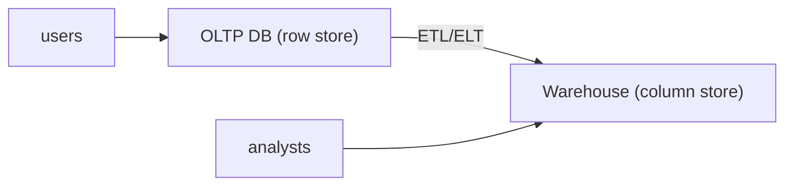

# Database Systems 101 (10/10): OLTP와 OLAP

이 글은 Database Systems 101 시리즈의 마지막 글입니다.

같은 주문 데이터인데도 운영 데이터베이스와 분석 데이터 웨어하우스가 서로 다른 모습으로 존재하는 이유는 무엇일까요? 입문 단계에서는 “같은 데이터를 두 군데나 두는 것은 비효율적 아닌가?”라는 생각이 자연스럽습니다. 하지만 실제 시스템에서는 짧고 빈번한 트랜잭션과 길고 넓은 집계 쿼리가 서로를 심각하게 방해합니다.

OLTP와 OLAP를 구분하면 이 질문이 훨씬 명확해집니다. 운영 쿼리는 한두 행을 빠르게 읽고 쓰는 데 최적화되어야 하고, 분석 쿼리는 수백만 행을 넓게 스캔하고 집계하는 데 최적화되어야 합니다. 이 글에서는 그 차이가 왜 데이터 모델, 저장 형식, 인덱스 전략, 시스템 분리로 이어지는지 정리합니다.


*Database Systems 101 10장 흐름 개요*

## 먼저 던지는 질문

- OLTP와 OLAP 워크로드의 근본 차이는 무엇일까요?
- 행 저장과 컬럼 저장은 어떤 트레이드오프를 가질까요?
- 데이터 웨어하우스와 ETL/ELT는 왜 필요한가요?

## 이 글에서 배울 내용

- OLTP와 OLAP 워크로드의 근본 차이
- 행 저장과 컬럼 저장의 트레이드오프
- 데이터 웨어하우스와 ETL/ELT의 역할
- 운영과 분석을 같은 데이터베이스에 둘 때의 문제

## 왜 중요한가

운영 데이터베이스가 분석 쿼리에 짓눌리는 일은 매우 흔합니다. 큰 집계 하나가 캐시를 날리고, 리소스를 잡아먹고, 다른 사용자의 요청을 느리게 만듭니다. OLTP와 OLAP의 차이를 이해하면 “이 쿼리는 어디서 실행되어야 하는가?”를 훨씬 빨리 판단할 수 있습니다.

> 운영과 분석을 같은 시스템에 두면 단기적으로는 편해 보이지만, 장기적으로는 거의 항상 두 워크로드가 서로의 발목을 잡습니다.

## 핵심 개념 한눈에 보기



OLTP는 단일 행 조회와 짧은 트랜잭션을 빠르게 처리하고, OLAP는 대규모 스캔과 집계를 빠르게 처리합니다. 둘이 다른 시스템으로 분리되는 이유가 여기에 있습니다.

## 핵심 용어

- **OLTP**: 주문 생성, 결제 처리처럼 짧고 빈번한 읽기/쓰기를 다루는 운영 처리입니다.
- **OLAP**: 일별 매출, 코호트 분석처럼 대규모 집계와 필터링을 다루는 분석 처리입니다.
- **행 저장 vs 컬럼 저장**: 데이터를 행 단위로 저장할지 컬럼 단위로 저장할지의 차이입니다. 분석에서는 컬럼 저장이 크게 유리합니다.
- **스타 스키마**: 사실 테이블과 차원 테이블로 구성되는 전형적인 분석 모델입니다.
- **ETL/ELT**: 운영 데이터를 분석 시스템으로 이동하고 가공하는 파이프라인입니다.

## 변경 전/변경 후

**Before — analytics directly on the operational database**

```sql
SELECT date_trunc('day', created_at), sum(total)
FROM orders
GROUP BY 1
ORDER BY 1;
-- 60s, lock contention, hurts production
```

**After — columnar warehouse**

```sql
-- BigQuery, Snowflake, Redshift, etc.
SELECT date_trunc('day', created_at), sum(total)
FROM warehouse.orders
GROUP BY 1
ORDER BY 1;
-- 2s, zero impact on the operational DB
```

같은 질의라도 저장 형식과 실행 환경이 바뀌면 성능과 운영 영향이 완전히 달라집니다.

## 실습: 행 저장과 컬럼 저장의 차이 보기

### 1단계 — 데이터 준비

```python
# seed.py
import sqlite3, random, time

with sqlite3.connect("oltp.db") as db:
    db.executescript("""
        DROP TABLE IF EXISTS orders;
        CREATE TABLE orders (
            id INTEGER PRIMARY KEY,
            user_id INTEGER, status TEXT,
            total INTEGER, country TEXT, created_at TEXT
        );
    """)
    rows = [
        (i, random.randint(1, 1000),
         random.choice(["paid","pending","cancelled"]),
         random.randint(1, 1000),
         random.choice(["KR","US","JP"]),
         f"2026-05-{random.randint(1,28):02d}")
        for i in range(1, 1_000_001)
    ]
    db.executemany("INSERT INTO orders VALUES (?,?,?,?,?,?)", rows)
```

SQLite 같은 행 저장 엔진에 백만 건 정도의 주문 데이터를 넣고 시작하면, 이후 차이가 꽤 분명하게 드러납니다.

### 2단계 — 온라인 거래 처리 스타일 단일 행 조회

```python
import sqlite3, time
with sqlite3.connect("oltp.db") as db:
    db.execute("CREATE INDEX IF NOT EXISTS idx_user ON orders(user_id)")
    t = time.time()
    print(db.execute("SELECT * FROM orders WHERE user_id=7").fetchall()[:3])
    print("OLTP query:", round((time.time()-t)*1000, 2), "ms")
```

인덱스 한 번 점프해서 즉시 결과를 얻는 것이 바로 행 저장과 OLTP의 강점입니다.

### 3단계 — 온라인 분석 처리 스타일 집계

```python
import sqlite3, time
with sqlite3.connect("oltp.db") as db:
    t = time.time()
    rows = db.execute("""
        SELECT country, sum(total)
        FROM orders
        WHERE status='paid'
        GROUP BY country
    """).fetchall()
    print(rows)
    print("OLAP query:", round((time.time()-t)*1000, 2), "ms")
```

이 경우에는 백만 행을 넓게 훑어야 합니다. 행 저장에서는 필요 없는 컬럼까지 끌고 오기 쉽지만, 컬럼 저장에서는 `country`, `total`, `status`만 읽으면 됩니다.

### 4단계 — 열 지향 저장 흉내내기

```python
import pandas as pd
df = pd.read_sql("SELECT * FROM orders", "sqlite:///oltp.db")
df.to_parquet("orders.parquet")

import duckdb, time
con = duckdb.connect()
t = time.time()
print(con.execute("""
    SELECT country, sum(total)
    FROM 'orders.parquet'
    WHERE status='paid'
    GROUP BY country
""").fetchall())
print("Parquet/DuckDB:", round((time.time()-t)*1000, 2), "ms")
```

같은 집계가 훨씬 빨라질 수 있습니다. DuckDB는 컬럼 저장과 벡터화 실행을 결합해 이런 분석 쿼리에 특히 강합니다.

### 5단계 — 스타 스키마 스케치

```sql
-- fact_orders + dim_user + dim_product + dim_date
SELECT d.country, sum(f.total)
FROM fact_orders f
JOIN dim_user d ON d.user_id = f.user_id
WHERE f.status='paid'
GROUP BY d.country;
```

분석 시스템은 조인 수를 줄이고 집계를 빠르게 하기 위해, 의도적으로 비정규화된 스타 스키마를 선택하는 경우가 많습니다.

## 이 코드에서 먼저 봐야 할 점

- OLTP의 핵심은 **짧은 인덱스 점프**이고, OLAP의 핵심은 **넓은 대규모 스캔**입니다.
- 컬럼 저장은 필요한 컬럼만 읽기 때문에 집계에서 압도적으로 유리합니다.
- 스타 스키마는 정규화의 반대편처럼 보이지만, 분석에서는 매우 합리적인 선택입니다.
- 운영과 분석을 분리하면 두 시스템 모두 더 단순해집니다.

## 자주 하는 실수 5가지

1. **운영 데이터베이스에 분석 쿼리를 그대로 실행한다.** 캐시, 잠금, 리소스가 모두 흔들립니다.
2. **OLTP 모델을 그대로 OLAP에 옮긴다.** 조인이 폭증하고 집계는 느려집니다.
3. **컬럼 저장이 만능이라고 생각한다.** 단일 행 UPDATE는 행 저장이 훨씬 잘합니다.
4. **ETL을 하루 한 번만 돌린다.** 분석 데이터가 늘 어제 기준이 되어 의사 결정이 늦어집니다.
5. **웨어하우스 비용을 보지 않는다.** 많은 컬럼 저장 시스템은 스캔량 기반으로 과금됩니다.

## 실무에서는 이렇게 드러납니다

운영 시스템은 PostgreSQL, MySQL 같은 행 저장 RDBMS를 기본으로 두고, 분석은 BigQuery, Snowflake, Redshift, ClickHouse 같은 컬럼 저장 시스템으로 분리하는 것이 일반적입니다. ETL/ELT 파이프라인은 이 둘을 잇는 핵심 다리입니다.

최근에는 데이터 레이크하우스라는 흐름도 강해졌습니다. Parquet 같은 컬럼 파일을 객체 스토리지에 저장하고, DuckDB, Trino, Spark, Snowflake 같은 엔진이 이를 질의합니다. 도구는 바뀌어도 원칙은 같습니다. 운영과 분석은 여전히 다른 워크로드이며, 경계를 분명히 해야 합니다.

## 시니어 엔지니어는 이렇게 생각합니다

- “이 쿼리는 OLTP인가, OLAP인가?”를 가장 먼저 묻습니다.
- 분석 쿼리는 분석 시스템에, 운영 쿼리는 운영 DB에 두는 것을 기본으로 봅니다.
- ETL/ELT의 신선도와 실패율을 핵심 운영 지표로 봅니다.
- 컬럼 저장 비용은 스캔 컬럼과 파티셔닝 전략으로 통제합니다.
- 스키마 변경은 운영과 분석 파이프라인 양쪽에 동시에 영향을 준다고 생각합니다.

## 체크리스트

- [ ] 분석 쿼리가 운영 DB에서 실행되지 않도록 분리되어 있는가?
- [ ] 별도 분석 모델(스타 스키마 등)이 준비되어 있는가?
- [ ] ETL/ELT의 데이터 신선도와 실패율을 모니터링하는가?
- [ ] 컬럼 저장 시스템의 스캔량 비용을 관리하는가?
- [ ] 스키마 변경이 분석 파이프라인에 미치는 영향까지 함께 검토하는가?

## 연습 문제

1. 같은 SELECT가 OLTP DB에서는 빠르고 OLAP 시스템에서는 느릴 수 있는 시나리오 하나를 설명해 보세요.
2. 컬럼 저장이 단일 행 UPDATE에 약한 이유를 한 문장으로 설명해 보세요.
3. 스타 스키마가 정규화 원칙과 어떻게 충돌하는지, 그런데도 분석에서 왜 정당화되는지 설명해 보세요.

## 정리 및 다음 단계

OLTP와 OLAP는 같은 데이터를 다루지만 전혀 다른 시간 규모와 접근 패턴을 가진 두 세계입니다. 행 저장은 단일 행 조회와 짧은 트랜잭션에 강하고, 컬럼 저장은 대규모 스캔과 집계에 강합니다. 그래서 둘을 분리하고 ETL/ELT로 연결하는 것이 오늘날의 표준 아키텍처입니다. 이 글로 Database Systems 101 시리즈를 마칩니다. 이제 데이터베이스라는 단어 뒤에 숨어 있던 모델, 트랜잭션, 인덱스, 복제, 분석의 큰 지도가 하나의 연결된 풍경으로 보이기 시작했다면 이 시리즈의 목적은 충분히 달성된 셈입니다.

## 실전 보강: 실행 계획과 트랜잭션 설계를 한 번에 보는 연습

아래 예시는 관계형 데이터베이스를 운영할 때 자주 만나는 세 가지 질문을 한 번에 다룹니다. 첫째, 이 쿼리가 왜 느린지, 둘째, 어떤 인덱스가 실제로 선택되는지, 셋째, 실패 시 데이터가 어디까지 보존되는지입니다.

### 1) 조건과 정렬을 함께 고려한 인덱스 전략

```sql
-- 주문 조회 API: 특정 사용자 최근 주문 20건
SELECT id, user_id, status, created_at, total_amount
FROM orders
WHERE user_id = 42 AND status = 'paid'
ORDER BY created_at DESC
LIMIT 20;
```

이 쿼리는 보통 `user_id`, `status`, `created_at`의 순서를 가진 복합 인덱스 후보를 만듭니다.

```sql
CREATE INDEX idx_orders_user_status_created
ON orders (user_id, status, created_at DESC);
```

핵심은 **필터링 컬럼을 앞쪽에**, 정렬 컬럼을 그다음에 배치하는 것입니다. 이렇게 하면 WHERE와 ORDER BY를 동시에 만족해 추가 정렬 비용을 줄일 수 있습니다.

### 2) 실행 계획 비교하기

```sql
EXPLAIN ANALYZE
SELECT id, user_id, status, created_at, total_amount
FROM orders
WHERE user_id = 42 AND status = 'paid'
ORDER BY created_at DESC
LIMIT 20;
```

계획을 읽을 때는 다음 순서를 고정해 확인합니다.

| 확인 항목 | 의미 | 실무 해석 |
| --- | --- | --- |
| Scan 종류 | Seq Scan / Index Scan / Index Only Scan | 인덱스가 실제 사용되는지 |
| Rows (estimate vs actual) | 예상 행 수와 실제 행 수 차이 | 통계 갱신 필요 여부 판단 |
| Sort 노드 유무 | 별도 정렬 발생 여부 | 인덱스 컬럼 순서 재검토 |
| Loop 횟수 | 반복 수행 정도 | Nested Loop 과비용 여부 |

예상 행 수와 실제 행 수가 크게 어긋나면 `ANALYZE` 또는 통계 정책을 먼저 점검합니다. 인덱스를 추가하기 전에 통계부터 정상화하는 편이 안전합니다.

### 3) 트랜잭션 경계와 실패 처리 패턴

```python
import sqlite3

def create_order(db: sqlite3.Connection, user_id: int, amount: int) -> None:
    try:
        db.execute("BEGIN")
        db.execute(
            "INSERT INTO orders(user_id, status, total_amount) VALUES (?, 'paid', ?)",
            (user_id, amount),
        )
        db.execute(
            "UPDATE inventory SET stock = stock - 1 WHERE sku = ? AND stock > 0",
            ("SKU-001",),
        )
        changed = db.execute("SELECT changes()").fetchone()[0]
        if changed != 1:
            raise RuntimeError("재고 부족")
        db.execute("COMMIT")
    except Exception:
        db.execute("ROLLBACK")
        raise
```

이 패턴의 의도는 명확합니다. 주문 생성과 재고 차감을 **하나의 원자 단위**로 묶고, 조건이 맞지 않으면 전체를 되돌립니다. 트랜잭션 안에서 외부 API 호출을 하지 않는 것도 중요합니다. 잠금 시간이 길어지면 동시성 충돌이 급격히 늘어납니다.

### 4) 운영에서 자주 쓰는 진단 질의문

```sql
-- 값 분포 확인(선택성 감각)
SELECT status, COUNT(*) FROM orders GROUP BY status;

-- 최근 7일 데이터 비율 확인(파티션/인덱스 필요성 판단)
SELECT COUNT(*) FILTER (WHERE created_at >= NOW() - INTERVAL '7 days') AS recent,
       COUNT(*) AS total
FROM orders;

-- 특정 조건의 실제 데이터량 확인
SELECT COUNT(*)
FROM orders
WHERE user_id = 42 AND status = 'paid';
```

인덱스 설계는 문법 문제가 아니라 **분포 문제**입니다. 어떤 값이 얼마나 자주 등장하는지 모르면, 좋은 인덱스 순서를 고르기 어렵습니다.

### 5) 읽기/쓰기 균형 체크

| 판단 질문 | 읽기 중심 시스템 | 쓰기 중심 시스템 |
| --- | --- | --- |
| 인덱스 수 | 상대적으로 많아도 감당 가능 | 최소화가 우선 |
| 커버링 인덱스 | 적극 검토 | 신중 검토 |
| 배치 업데이트 | 야간 일괄 가능 | 짧은 배치로 분할 필요 |
| 통계 갱신 | 주기적 자동 갱신 | 대량 쓰기 직후 즉시 갱신 |

결론적으로 데이터베이스 튜닝은 “인덱스를 늘린다”가 아니라 “실행 계획을 읽고, 트랜잭션 경계를 짧게 유지하고, 분포를 근거로 선택한다”의 반복입니다.

## 같은 데이터, 다른 저장 전략

OLTP와 OLAP는 같은 원천 데이터를 다루지만, 최적화 목표가 다릅니다.

- OLTP: 짧은 트랜잭션, 강한 정합성, 낮은 지연
- OLAP: 대량 스캔, 집계/조인 중심, 높은 압축 효율

행 저장은 한 레코드를 통째로 읽고 쓸 때 유리하고, 컬럼 저장은 필요한 컬럼만 읽어 대량 집계에 유리합니다.

```text
행 저장(OLTP 친화)
[order_id,user_id,status,amount,...]

컬럼 저장(OLAP 친화)
order_id: [1,2,3,...]
user_id : [10,10,11,...]
status  : ['PAID','PAID','CANCEL',...]
amount  : [12000,34000,5000,...]
```

## 분석 파이프라인의 최소 구성

```text
애플리케이션 DB(OLTP)
  -> 변경 데이터 캡처 또는 배치 추출
  -> 정제/스키마 표준화
  -> 분석 저장소(OLAP)
  -> 대시보드/리포트/탐색 쿼리
```

운영 시스템과 분석 시스템을 분리하면, 야간 대시보드 집계가 주문 트랜잭션을 방해하는 문제를 구조적으로 차단할 수 있습니다.

## 실전 운영 점검표

운영 환경에서 데이터베이스 품질을 안정적으로 유지하려면, 기능 개발과 별개로 점검 루틴을 명확하게 가져가야 합니다. 아래 항목은 서비스 규모와 상관없이 바로 적용할 수 있는 기준입니다.

- 변경 전에는 항상 기준 지표를 남깁니다. 평균 지연 시간, P95, P99, 초당 트랜잭션 수, 잠금 대기 시간 같은 숫자를 캡처해 둬야 변경 이후를 비교할 수 있습니다.
- 쿼리 튜닝은 SQL 문장 자체보다 실행 계획의 변화를 중심으로 추적합니다. 계획 노드가 바뀌었는지, 예상 행 수와 실제 행 수의 차이가 커졌는지, 정렬이나 해시가 디스크로 내려갔는지를 우선 확인합니다.
- 스키마 변경은 단계적으로 진행합니다. 컬럼 추가, 백필, 코드 전환, 제약 강화 순서로 나누면 장애 반경을 줄일 수 있습니다.
- 장애 대응 문서는 운영자가 밤중에도 바로 실행할 수 있는 형태여야 합니다. 복구 절차, 롤백 절차, 검증 SQL을 같은 문서에 둬야 실제 상황에서 흔들리지 않습니다.

아래 예시는 팀이 릴리스 전후에 반복적으로 실행하는 최소 점검 SQL입니다.

```sql
-- 최근 10분 동안 느린 쿼리 확인(엔진별 뷰 이름은 다를 수 있음)
SELECT query, calls, mean_exec_time, rows
FROM pg_stat_statements
ORDER BY mean_exec_time DESC
LIMIT 20;

-- 잠금 대기 체인 확인
SELECT now(), pid, wait_event_type, wait_event, state, query
FROM pg_stat_activity
WHERE wait_event_type IS NOT NULL;

-- 인덱스 사용률 점검
SELECT relname AS table_name, seq_scan, idx_scan
FROM pg_stat_user_tables
ORDER BY seq_scan DESC
LIMIT 20;
```

이 점검 루틴을 자동화 파이프라인에 연결하면, 성능 저하를 "느낌"이 아니라 "증거"로 관리할 수 있습니다. 결국 장기 운영에서 중요한 것은 뛰어난 한 번의 튜닝이 아니라, 작은 검증을 꾸준히 반복해 위험을 조기에 감지하는 습관입니다.
## 운영 리허설 시나리오

문서만 읽고 끝내면 운영에서 다시 같은 실수를 반복하기 쉽습니다. 아래 시나리오는 팀 온보딩과 장애 대응 훈련에 바로 사용할 수 있는 공통 리허설 절차입니다.

### 시나리오 1: 느려진 조회 원인 찾기

1. 문제 쿼리를 식별합니다. 애플리케이션 로그의 요청 식별자와 데이터베이스 쿼리 로그를 매칭합니다.
2. 같은 파라미터로 `EXPLAIN ANALYZE`를 실행합니다.
3. 계획 노드 중 시간이 큰 지점을 찾고, 해당 노드가 인덱스/통계/정렬 중 무엇과 관련 있는지 분류합니다.
4. 개선안을 한 번에 하나만 적용합니다. 인덱스 추가, 통계 갱신, 질의문 재작성 가운데 하나만 바꿔 결과를 비교합니다.

```text
개선 전
Seq Scan on events  (actual time=0.030..842.112 rows=12000)

개선 후
Index Scan using idx_events_tenant_created on events
(actual time=0.041..21.553 rows=12000)
```

### 시나리오 2: 동시성 문제 재현과 완화

1. 두 세션에서 같은 행을 거의 동시에 수정합니다.
2. 격리 수준을 바꿔 가며 결과를 비교합니다.
3. 필요하면 `FOR UPDATE` 잠금 조회 또는 낙관적 잠금 버전 컬럼을 적용합니다.
4. 재시도 정책과 타임아웃 기준을 코드와 운영 문서에 같이 기록합니다.

```sql
-- 낙관적 잠금 예시
UPDATE inventory
SET qty = qty - 1, version = version + 1
WHERE sku = 'A-100' AND version = 17;
```

영향 받은 행 수가 0이면 이미 다른 트랜잭션이 갱신한 것이므로, 재조회 후 재시도합니다. 이 패턴은 잠금 경합을 낮추면서도 정합성을 지키는 데 효과적입니다.

### 시나리오 3: 복구 가능성 검증

1. 최신 베이스 백업으로 테스트 인스턴스를 띄웁니다.
2. 지정 시점까지 로그를 재적용합니다.
3. 핵심 비즈니스 검증 SQL을 실행합니다.
4. 복구 시간(RTO)과 데이터 유실 허용치(RPO)를 실제 숫자로 기록합니다.

```sql
-- 검증 SQL 예시
SELECT COUNT(*) FROM orders WHERE created_at >= now() - interval '1 day';
SELECT SUM(amount) FROM payments WHERE status = 'SUCCESS';
SELECT COUNT(*) FROM users WHERE deleted_at IS NULL;
```

복구 리허설에서 가장 중요한 점은 성공 여부 자체보다, 누가 어떤 순서로 무엇을 확인했는지를 재현 가능하게 남기는 것입니다. 절차가 사람마다 다르면 실제 장애에서 속도와 품질이 동시에 무너집니다.

## 체크리스트: 배포 전 최소 검증

- 대표 조회 5개에 대해 실행 계획을 저장합니다.
- 트랜잭션 경계가 긴 코드 경로를 식별합니다.
- 잠금 대기 알람 임계치를 설정합니다.
- 스키마 변경의 롤백 경로를 문서화합니다.
- 백업 복구 리허설 최근 실행일을 확인합니다.

이 체크리스트는 거창한 체계를 요구하지 않습니다. 작은 팀도 주 1회 반복하면 데이터 사고 빈도를 눈에 띄게 줄일 수 있습니다. 데이터베이스 운영의 본질은 "고급 기능을 많이 아는 것"이 아니라, "반복 가능한 검증 루프를 끊기지 않게 유지하는 것"입니다.


## 추가 실습 기록 템플릿

아래 템플릿은 팀 위키에 그대로 붙여 넣어 실습 결과를 남길 때 사용합니다.

```text
[실습 이름]
- 실행 일시:
- 실행 환경:
- 입력 데이터 규모:
- 대표 SQL:
- EXPLAIN ANALYZE 핵심 노드:
- 개선 전/후 실행 시간:
- 적용 변경 사항:
- 부작용 또는 주의점:
- 다음 점검 항목:
```

실습 기록을 남기면 지식이 개인 경험으로 소모되지 않고 팀 자산으로 누적됩니다. 특히 실행 계획 캡처와 복구 절차 검증 결과를 함께 보관하면, 다음 장애 대응에서 판단 속도를 크게 높일 수 있습니다.


## 처음 질문으로 돌아가기

- **OLTP와 OLAP 워크로드의 근본 차이는 무엇일까요?**
  - 본문의 기준은 OLTP와 OLAP를 한 덩어리 개념으로 보지 않고 입력, 처리, 검증, 운영 신호가 만나는 경계로 나누어 확인하는 것입니다.
- **행 저장과 컬럼 저장은 어떤 트레이드오프를 가질까요?**
  - 예제와 그림에서는 어떤 값이 들어오고, 어느 단계에서 바뀌며, 어떤 기준으로 통과 또는 실패하는지를 먼저 확인해야 합니다.
- **데이터 웨어하우스와 ETL/ELT는 왜 필요한가요?**
  - 운영에서는 이 판단을 체크리스트, 로그, 테스트로 남겨 다음 변경에서도 같은 실패가 반복되지 않게 막아야 합니다.

<!-- toc:begin -->
## 시리즈 목차

- [Database Systems 101 (1/10): 데이터베이스 시스템이란 무엇인가?](./01-what-is-a-database.md)
- [Database Systems 101 (2/10): 관계형 모델](./02-relational-model.md)
- [Database Systems 101 (3/10): SQL과 쿼리 처리](./03-sql-and-query-processing.md)
- [Database Systems 101 (4/10): 인덱스](./04-indexes.md)
- [Database Systems 101 (5/10): 트랜잭션과 ACID](./05-transactions-and-acid.md)
- [Database Systems 101 (6/10): 격리 수준](./06-isolation-levels.md)
- [Database Systems 101 (7/10): 정규화와 모델링](./07-normalization-and-modeling.md)
- [Database Systems 101 (8/10): 쿼리 최적화](./08-query-optimization.md)
- [Database Systems 101 (9/10): 복제와 백업](./09-replication-and-backup.md)
- **OLTP와 OLAP (현재 글)**

<!-- toc:end -->

## 참고 자료

- [database-systems-101 예제 코드 (book-examples)](https://github.com/yeongseon-books/book-examples/tree/main/database-systems-101/ko)
- [Designing Data-Intensive Applications — Chapter 3](https://dataintensive.net/)
- [Snowflake — What Is a Data Warehouse?](https://www.snowflake.com/guides/what-data-warehouse/)
- [DuckDB — Why DuckDB?](https://duckdb.org/why_duckdb)
- [Wikipedia — Online Analytical Processing](https://en.wikipedia.org/wiki/Online_analytical_processing)

Tags: Computer Science, Database, OLTP, OLAP, 컬럼지향, 분석
