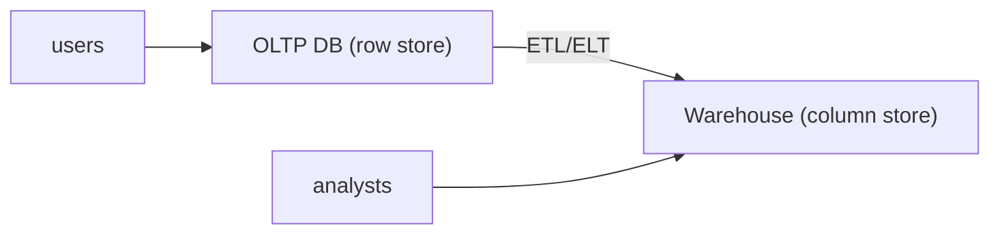

# Database Systems 101 (10/10): OLTP와 OLAP

이 글은 Database Systems 101 시리즈의 마지막 글입니다.

같은 주문 데이터인데도 운영 데이터베이스와 분석 데이터 웨어하우스가 서로 다른 모습으로 존재하는 이유는 무엇일까요? 입문 단계에서는 “같은 데이터를 두 군데나 두는 것은 비효율적 아닌가?”라는 생각이 자연스럽습니다. 하지만 실제 시스템에서는 짧고 빈번한 트랜잭션과 길고 넓은 집계 쿼리가 서로를 심각하게 방해합니다.

OLTP와 OLAP를 구분하면 이 질문이 훨씬 명확해집니다. 운영 쿼리는 한두 행을 빠르게 읽고 쓰는 데 최적화되어야 하고, 분석 쿼리는 수백만 행을 넓게 스캔하고 집계하는 데 최적화되어야 합니다. 이 글에서는 그 차이가 왜 데이터 모델, 저장 형식, 인덱스 전략, 시스템 분리로 이어지는지 정리합니다.

## 먼저 던지는 질문

- OLTP와 OLAP 워크로드의 근본 차이는 무엇일까요?
- 행 저장과 컬럼 저장은 어떤 트레이드오프를 가질까요?
- 데이터 웨어하우스와 ETL/ELT는 왜 필요한가요?

## 큰 그림


*Database Systems 101 10장 흐름 개요*

이 그림에서는 OLTP와 OLAP를 운영 흐름 안에서 어디에 배치해야 하는지 봅니다. 핵심은 개념을 따로 외우는 것이 아니라 입력, 처리, 검증, 운영 신호가 어떤 경계로 이어지는지 확인하는 데 있습니다.

> OLTP와 OLAP의 핵심은 기능 이름이 아니라, 어떤 경계에서 무엇을 검증하고 어떤 신호를 남길지 정하는 데 있습니다.

## 이 글에서 배울 내용

- OLTP와 OLAP 워크로드의 근본 차이
- 행 저장과 컬럼 저장의 트레이드오프
- 데이터 웨어하우스와 ETL/ELT의 역할
- 운영과 분석을 같은 데이터베이스에 둘 때의 문제

## 왜 중요한가

운영 데이터베이스가 분석 쿼리에 짓눌리는 일은 매우 흔합니다. 큰 집계 하나가 캐시를 날리고, 리소스를 잡아먹고, 다른 사용자의 요청을 느리게 만듭니다. OLTP와 OLAP의 차이를 이해하면 “이 쿼리는 어디서 실행되어야 하는가?”를 훨씬 빨리 판단할 수 있습니다.

> 운영과 분석을 같은 시스템에 두면 단기적으로는 편해 보이지만, 장기적으로는 거의 항상 두 워크로드가 서로의 발목을 잡습니다.

## 핵심 개념 한눈에 보기



OLTP는 단일 행 조회와 짧은 트랜잭션을 빠르게 처리하고, OLAP는 대규모 스캔과 집계를 빠르게 처리합니다. 둘이 다른 시스템으로 분리되는 이유가 여기에 있습니다.

## 핵심 용어

- **OLTP**: 주문 생성, 결제 처리처럼 짧고 빈번한 읽기/쓰기를 다루는 운영 처리입니다.
- **OLAP**: 일별 매출, 코호트 분석처럼 대규모 집계와 필터링을 다루는 분석 처리입니다.
- **행 저장 vs 컬럼 저장**: 데이터를 행 단위로 저장할지 컬럼 단위로 저장할지의 차이입니다. 분석에서는 컬럼 저장이 크게 유리합니다.
- **스타 스키마**: 사실 테이블과 차원 테이블로 구성되는 전형적인 분석 모델입니다.
- **ETL/ELT**: 운영 데이터를 분석 시스템으로 이동하고 가공하는 파이프라인입니다.

## Before/After

**Before — analytics directly on the operational database**

```sql
SELECT date_trunc('day', created_at), sum(total)
FROM orders
GROUP BY 1
ORDER BY 1;
-- 60s, lock contention, hurts production
```

**After — columnar warehouse**

```sql
-- BigQuery, Snowflake, Redshift, etc.
SELECT date_trunc('day', created_at), sum(total)
FROM warehouse.orders
GROUP BY 1
ORDER BY 1;
-- 2s, zero impact on the operational DB
```

같은 질의라도 저장 형식과 실행 환경이 바뀌면 성능과 운영 영향이 완전히 달라집니다.

## 실습: 행 저장과 컬럼 저장의 차이 보기

### 1단계 — 데이터 준비

```python
# seed.py
import sqlite3, random, time

with sqlite3.connect("oltp.db") as db:
    db.executescript("""
        DROP TABLE IF EXISTS orders;
        CREATE TABLE orders (
            id INTEGER PRIMARY KEY,
            user_id INTEGER, status TEXT,
            total INTEGER, country TEXT, created_at TEXT
        );
    """)
    rows = [
        (i, random.randint(1, 1000),
         random.choice(["paid","pending","cancelled"]),
         random.randint(1, 1000),
         random.choice(["KR","US","JP"]),
         f"2026-05-{random.randint(1,28):02d}")
        for i in range(1, 1_000_001)
    ]
    db.executemany("INSERT INTO orders VALUES (?,?,?,?,?,?)", rows)
```

SQLite 같은 행 저장 엔진에 백만 건 정도의 주문 데이터를 넣고 시작하면, 이후 차이가 꽤 분명하게 드러납니다.

### 2단계 — OLTP 스타일 단일 행 조회

```python
import sqlite3, time
with sqlite3.connect("oltp.db") as db:
    db.execute("CREATE INDEX IF NOT EXISTS idx_user ON orders(user_id)")
    t = time.time()
    print(db.execute("SELECT * FROM orders WHERE user_id=7").fetchall()[:3])
    print("OLTP query:", round((time.time()-t)*1000, 2), "ms")
```

인덱스 한 번 점프해서 즉시 결과를 얻는 것이 바로 행 저장과 OLTP의 강점입니다.

### 3단계 — OLAP 스타일 집계

```python
import sqlite3, time
with sqlite3.connect("oltp.db") as db:
    t = time.time()
    rows = db.execute("""
        SELECT country, sum(total)
        FROM orders
        WHERE status='paid'
        GROUP BY country
    """).fetchall()
    print(rows)
    print("OLAP query:", round((time.time()-t)*1000, 2), "ms")
```

이 경우에는 백만 행을 넓게 훑어야 합니다. 행 저장에서는 필요 없는 컬럼까지 끌고 오기 쉽지만, 컬럼 저장에서는 `country`, `total`, `status`만 읽으면 됩니다.

### 4단계 — Parquet로 컬럼 저장 흉내내기

```python
import pandas as pd
df = pd.read_sql("SELECT * FROM orders", "sqlite:///oltp.db")
df.to_parquet("orders.parquet")

import duckdb, time
con = duckdb.connect()
t = time.time()
print(con.execute("""
    SELECT country, sum(total)
    FROM 'orders.parquet'
    WHERE status='paid'
    GROUP BY country
""").fetchall())
print("Parquet/DuckDB:", round((time.time()-t)*1000, 2), "ms")
```

같은 집계가 훨씬 빨라질 수 있습니다. DuckDB는 컬럼 저장과 벡터화 실행을 결합해 이런 분석 쿼리에 특히 강합니다.

### 5단계 — 스타 스키마 스케치

```sql
-- fact_orders + dim_user + dim_product + dim_date
SELECT d.country, sum(f.total)
FROM fact_orders f
JOIN dim_user d ON d.user_id = f.user_id
WHERE f.status='paid'
GROUP BY d.country;
```

분석 시스템은 조인 수를 줄이고 집계를 빠르게 하기 위해, 의도적으로 비정규화된 스타 스키마를 선택하는 경우가 많습니다.

## 이 코드에서 먼저 봐야 할 점

- OLTP의 핵심은 **짧은 인덱스 점프**이고, OLAP의 핵심은 **넓은 대규모 스캔**입니다.
- 컬럼 저장은 필요한 컬럼만 읽기 때문에 집계에서 압도적으로 유리합니다.
- 스타 스키마는 정규화의 반대편처럼 보이지만, 분석에서는 매우 합리적인 선택입니다.
- 운영과 분석을 분리하면 두 시스템 모두 더 단순해집니다.

## 자주 하는 실수 5가지

1. **운영 데이터베이스에 분석 쿼리를 그대로 실행한다.** 캐시, 잠금, 리소스가 모두 흔들립니다.
2. **OLTP 모델을 그대로 OLAP에 옮긴다.** 조인이 폭증하고 집계는 느려집니다.
3. **컬럼 저장이 만능이라고 생각한다.** 단일 행 UPDATE는 행 저장이 훨씬 잘합니다.
4. **ETL을 하루 한 번만 돌린다.** 분석 데이터가 늘 어제 기준이 되어 의사 결정이 늦어집니다.
5. **웨어하우스 비용을 보지 않는다.** 많은 컬럼 저장 시스템은 스캔량 기반으로 과금됩니다.

## 실무에서는 이렇게 드러납니다

운영 시스템은 PostgreSQL, MySQL 같은 행 저장 RDBMS를 기본으로 두고, 분석은 BigQuery, Snowflake, Redshift, ClickHouse 같은 컬럼 저장 시스템으로 분리하는 것이 일반적입니다. ETL/ELT 파이프라인은 이 둘을 잇는 핵심 다리입니다.

최근에는 데이터 레이크하우스라는 흐름도 강해졌습니다. Parquet 같은 컬럼 파일을 객체 스토리지에 저장하고, DuckDB, Trino, Spark, Snowflake 같은 엔진이 이를 질의합니다. 도구는 바뀌어도 원칙은 같습니다. 운영과 분석은 여전히 다른 워크로드이며, 경계를 분명히 해야 합니다.

## 시니어 엔지니어는 이렇게 생각합니다

- “이 쿼리는 OLTP인가, OLAP인가?”를 가장 먼저 묻습니다.
- 분석 쿼리는 분석 시스템에, 운영 쿼리는 운영 DB에 두는 것을 기본으로 봅니다.
- ETL/ELT의 신선도와 실패율을 핵심 운영 지표로 봅니다.
- 컬럼 저장 비용은 스캔 컬럼과 파티셔닝 전략으로 통제합니다.
- 스키마 변경은 운영과 분석 파이프라인 양쪽에 동시에 영향을 준다고 생각합니다.

## 체크리스트

- [ ] 분석 쿼리가 운영 DB에서 실행되지 않도록 분리되어 있는가?
- [ ] 별도 분석 모델(스타 스키마 등)이 준비되어 있는가?
- [ ] ETL/ELT의 데이터 신선도와 실패율을 모니터링하는가?
- [ ] 컬럼 저장 시스템의 스캔량 비용을 관리하는가?
- [ ] 스키마 변경이 분석 파이프라인에 미치는 영향까지 함께 검토하는가?

## 연습 문제

1. 같은 SELECT가 OLTP DB에서는 빠르고 OLAP 시스템에서는 느릴 수 있는 시나리오 하나를 설명해 보세요.
2. 컬럼 저장이 단일 행 UPDATE에 약한 이유를 한 문장으로 설명해 보세요.
3. 스타 스키마가 정규화 원칙과 어떻게 충돌하는지, 그런데도 분석에서 왜 정당화되는지 설명해 보세요.

## 정리 및 다음 단계

OLTP와 OLAP는 같은 데이터를 다루지만 전혀 다른 시간 규모와 접근 패턴을 가진 두 세계입니다. 행 저장은 단일 행 조회와 짧은 트랜잭션에 강하고, 컬럼 저장은 대규모 스캔과 집계에 강합니다. 그래서 둘을 분리하고 ETL/ELT로 연결하는 것이 오늘날의 표준 아키텍처입니다. 이 글로 Database Systems 101 시리즈를 마칩니다. 이제 데이터베이스라는 단어 뒤에 숨어 있던 모델, 트랜잭션, 인덱스, 복제, 분석의 큰 지도가 하나의 연결된 풍경으로 보이기 시작했다면 이 시리즈의 목적은 충분히 달성된 셈입니다.

## 처음 질문으로 돌아가기

- **OLTP와 OLAP 워크로드의 근본 차이는 무엇일까요?**
  - 본문의 기준은 OLTP와 OLAP를 한 덩어리 개념으로 보지 않고 입력, 처리, 검증, 운영 신호가 만나는 경계로 나누어 확인하는 것입니다.
- **행 저장과 컬럼 저장은 어떤 트레이드오프를 가질까요?**
  - 예제와 그림에서는 어떤 값이 들어오고, 어느 단계에서 바뀌며, 어떤 기준으로 통과 또는 실패하는지를 먼저 확인해야 합니다.
- **데이터 웨어하우스와 ETL/ELT는 왜 필요한가요?**
  - 운영에서는 이 판단을 체크리스트, 로그, 테스트로 남겨 다음 변경에서도 같은 실패가 반복되지 않게 막아야 합니다.

<!-- toc:begin -->
## 시리즈 목차

- [Database Systems 101 (1/10): 데이터베이스 시스템이란 무엇인가?](./01-what-is-a-database.md)
- [Database Systems 101 (2/10): 관계형 모델](./02-relational-model.md)
- [Database Systems 101 (3/10): SQL과 쿼리 처리](./03-sql-and-query-processing.md)
- [Database Systems 101 (4/10): 인덱스](./04-indexes.md)
- [Database Systems 101 (5/10): 트랜잭션과 ACID](./05-transactions-and-acid.md)
- [Database Systems 101 (6/10): 격리 수준](./06-isolation-levels.md)
- [Database Systems 101 (7/10): 정규화와 모델링](./07-normalization-and-modeling.md)
- [Database Systems 101 (8/10): 쿼리 최적화](./08-query-optimization.md)
- [Database Systems 101 (9/10): 복제와 백업](./09-replication-and-backup.md)
- **OLTP와 OLAP (현재 글)**

<!-- toc:end -->

## 참고 자료

- [Designing Data-Intensive Applications — Chapter 3](https://dataintensive.net/)
- [Snowflake — What Is a Data Warehouse?](https://www.snowflake.com/guides/what-data-warehouse/)
- [DuckDB — Why DuckDB?](https://duckdb.org/why_duckdb)
- [Wikipedia — Online Analytical Processing](https://en.wikipedia.org/wiki/Online_analytical_processing)

Tags: Computer Science, Database, OLTP, OLAP, 컬럼지향, 분석
