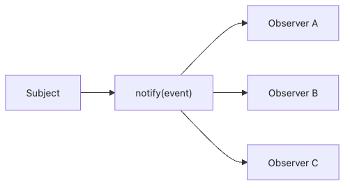

# The Observer Pattern

Code hardens quickly when one object directly calls every downstream action. A submitted order sends mail, posts to Slack, reserves inventory, and maybe queues analytics. As those side effects grow, the original object spends more time coordinating neighbors than doing its own work.

This is post 7 in the Design Patterns 101 series.

In this post, we'll look at Observer as a way to turn direct calls into notifications. The goal is to let a publisher announce what happened while subscribers decide whether and how to react.

## Questions this chapter answers

- The problem Observer solves (tight coupling)
- Subject, Observer, subscribe, notify
- Synchronous vs asynchronous notification
- The link to domain events
- What to watch for when scaling to pub/sub

## Why It Matters

If A *directly calls* B, C, and D when it changes, A knows all three. Observer turns those calls into *notifications*, so A no longer needs to know who is listening.

> Observer dissolves coupling into *notification*.

## Concept at a Glance


*Observer separates publication from reaction so a publisher can announce change without knowing which listeners will respond.*

## Key Terms

- **Subject**: the publisher of changes.
- **Observer**: the listener of notifications.
- **Subscribe/Unsubscribe**: registering and removing listeners.
- **Event**: the unit of data being notified.
- **Sync/Async**: in-process call vs queued processing.

## Before/After

**Before**

```python
class Order:
    def submit(self):
        self.save()
        send_email_to(self.user)        # direct call
        slack_notify(self.user)         # direct call
        warehouse.reserve(self.items)   # direct call
```

**After**

```python
class Order:
    def __init__(self, bus): self.bus = bus
    def submit(self):
        self.save()
        self.bus.publish("order_submitted", {"user": self.user, "items": self.items})
```

`Order` does not know who is listening.

## Hands-on: Five Steps to Practice Observer

### Step 1 — A simple EventBus

```python
# 1_bus.py
class EventBus:
    def __init__(self): self._subs = {}
    def subscribe(self, topic, fn): self._subs.setdefault(topic, []).append(fn)
    def publish(self, topic, event):
        for fn in self._subs.get(topic, []):
            fn(event)
```

The smallest possible Subject.

### Step 2 — Register subscribers

```python
# 2_subscribe.py
bus = EventBus()
bus.subscribe("order_submitted", lambda e: print("EMAIL:", e["user"]))
bus.subscribe("order_submitted", lambda e: print("SLACK:", e["user"]))
```

Add new channels — the Subject stays the same.

### Step 3 — Publish from the Subject

```python
# 3_publish.py
bus.publish("order_submitted", {"user": "u1", "items": ["a", "b"]})
```

Subject only announces "something happened".

### Step 4 — Sync vs async

```python
# 4_async.py
import queue, threading
q = queue.Queue()

def worker():
    while True:
        topic, event = q.get()
        for fn in bus._subs.get(topic, []):
            fn(event)

threading.Thread(target=worker, daemon=True).start()

def async_publish(topic, event): q.put((topic, event))
```

Move to async and the Subject is no longer hostage to handler latency.

### Step 5 — Unsubscribe

```python
# 5_unsubscribe.py
def unsubscribe(bus, topic, fn):
    bus._subs.get(topic, []).remove(fn)
```

Tests and dynamic handlers must be able to detach.

## What to Notice in This Code

- Subject knows neither the *number* nor the *kind* of Observers.
- Adding a new behavior is not a *Subject change*.
- A path to async notification stays open.

## Five Common Mistakes

1. **Cyclic notification.** A→B→A loops forever.
2. **Heavy work in synchronous notification.** Subject slows down.
3. **Observer mutating the Subject directly.** Notification becomes two-way.
4. **Free-form event schemas.** Producers and subscribers drift.
5. **Swallowing handler errors.** A failed Observer disappears silently.

## How This Shows Up in Production

Django signals, Spring's `ApplicationEventPublisher`, Kafka/Redis pub-sub, GitHub Webhooks — all bigger siblings of Observer. They often appear under the name *domain event*.

## Quick verification

Use this checklist when deciding whether Observer is improving the design.

- Count how many downstream actions the publisher currently calls directly.
- Temporarily disable one subscriber and confirm the publisher still completes its main responsibility.
- Check whether the event name and payload make sense without reading subscriber code.

**Expected outcome:** subscribers become optional extensions, and the publisher can describe the event without depending on who is listening.

## How a Senior Engineer Thinks

- Force notifications to flow one direction.
- Name events in *past tense* — `order_submitted`.
- Make schemas explicit — dataclasses, not free-form dicts.
- Report handler failures on a separate channel.
- Leave a path open for async dispatch.

## Checklist

- [ ] Does the Subject avoid knowing its subscribers?
- [ ] Are notifications one-directional?
- [ ] Do event names describe *what happened*?
- [ ] Are handler errors isolated?
- [ ] Is the structure ready to go async?

## Practice Problems

1. Split mail/Slack/warehouse-reserve actions on payment success into Observers.
2. Apply a dataclass-based event schema to your EventBus.
3. Implement `unsubscribe` and write a unit test for it.

## Wrap-up and Next Steps

Observer dissolves coupling into notification. The next post moves to object creation — Factory and Dependency Injection.

<!-- toc:begin -->
- [What Are Design Patterns?](./01-what-are-design-patterns.md)
- [Creational Patterns](./02-creational-patterns.md)
- [Structural Patterns](./03-structural-patterns.md)
- [Behavioral Patterns](./04-behavioral-patterns.md)
- [The Strategy Pattern](./05-strategy-pattern.md)
- [The Adapter Pattern](./06-adapter-pattern.md)
- **The Observer Pattern (current)**
- Factory and Dependency Injection (upcoming)
- Avoiding Pattern Overuse (upcoming)
- Pythonic Patterns (upcoming)
<!-- toc:end -->

## References

### Core references

- [Observer Pattern (refactoring.guru)](https://refactoring.guru/design-patterns/observer)
- [Domain Events (Martin Fowler)](https://martinfowler.com/eaaDev/DomainEvent.html)
- [Django Signals](https://docs.djangoproject.com/en/stable/topics/signals/)

### Practical follow-up

- [Publish-Subscribe Pattern (Wikipedia)](https://en.wikipedia.org/wiki/Publish%E2%80%93subscribe_pattern)
- [dataclasses — Data Classes (Python docs)](https://docs.python.org/3/library/dataclasses.html)

Tags: Computer Science, DesignPatterns, Observer, PubSub, Events, Behavioral
