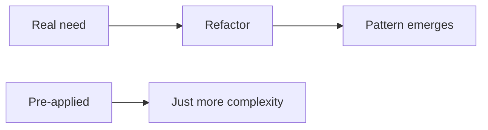

# Avoiding Pattern Overuse

This is post 9 in the Design Patterns 101 series.

> Design Patterns 101 series (9/10)

<!-- a-grade-intro:begin -->

**Core question**: How does a *good pattern* turn into *bad code*?

> When the pattern arrives before the problem. Patterns are *vocabulary*, not *answers*.

<!-- a-grade-intro:end -->

## What You Will Learn

- The antipattern that "patterns first" creates
- The power of the simpler alternative
- YAGNI and how it relates to patterns
- *Discovering* a pattern through refactoring
- Why senior engineers *delay* patterns

## Why It Matters

Pre-applied patterns easily become misapplied patterns. A simple piece of code can grow until a pattern *emerges* — applying it then is not too late.

> The best abstraction shows up *late*.

## Concept at a Glance



Need *summons* a pattern. The reverse direction is risky.

## Key Terms

- **YAGNI**: You Aren't Gonna Need It — not now.
- **Premature abstraction**: abstraction reached for too early.
- **Pattern fever**: the urge to reduce every piece of code to a pattern.
- **Cargo cult**: imitating only the shape.
- **Refactor to pattern**: a pattern emerging from polishing simple code.

## Before/After

**Before (overdone)**

```python
# Just one algorithm — but Strategy plus Factory plus Builder
class GreetStrategy: ...
class HelloStrategy(GreetStrategy): ...
class GreetFactory: ...
class GreetBuilder: ...
```

**After (simple)**

```python
def greet(name): return f"Hello, {name}"
```

The work that exists today is one line.

## Hands-on: Five Steps to Avoid Overuse

### Step 1 — Start from the simplest code

```python
# 1_simple.py
def discount(price, kind):
    return {"vip": price*0.7, "member": price*0.9}.get(kind, price)
```

A single branch is no place for a pattern.

### Step 2 — Abstract when change *repeats*

```python
# 2_when_repeats.py
# When tiers grow past six and per-tier policy starts diverging — then Strategy.
class Discount: ...
```

The third change is when abstraction earns its keep.

### Step 3 — Extract a function instead

```python
# 3_extract.py
def vip_price(p): return p * 0.7
def member_price(p): return p * 0.9
```

A one-line function often shows enough intent.

### Step 4 — *Discover* the pattern from existing code

```python
# 4_refactor_to_pattern.py
# When five branches grow into the same shape, *then* lift to Strategy.
```

Refactoring lets the pattern *emerge*.

### Step 5 — The courage to *remove* a pattern

```python
# 5_remove_pattern.py
# If only one usage remains, fold the Strategy/Factory back into a function.
```

Unused abstraction is *debt*.

## What to Notice in This Code

- A simple function is the strongest starting point.
- Patterns are justified by *repeated change*.
- Abstraction can wait one more iteration.

## Five Common Mistakes

1. **Abstraction faster than requirements.** Coding for an *imagined* future.
2. **Pattern in name only.** `XxxFactory` that just calls `new`.
3. **if/elif inside a Strategy.** The pattern fails to absorb the branch.
4. **Endless Decorator wrapping.** A debugging nightmare.
5. **DI container wiring everything automatically.** Invisible dependencies.

## How This Shows Up in Production

Good libraries use *few* patterns *precisely*. Look at requests, FastAPI, or pytest — they solve hard problems with small composition, not vast abstraction. The difference between a junior and a senior is not how many patterns they know, but knowing *when to wait*.

## How a Senior Engineer Thinks

- Start with *functions*.
- Abstract when change *repeats*.
- The pattern name is a *result*, not a *plan*.
- Delete unused abstractions.
- In code review, ask "why this pattern?"

## Checklist

- [ ] Is this abstraction needed *right now*?
- [ ] Has the change repeated three or more times?
- [ ] Would extracting a function be enough?
- [ ] Does the pattern name describe its *role* accurately?
- [ ] Can it be folded back if usage drops to one?

## Practice Problems

1. Find one *over-abstracted* place in your code and fold it back into a simple function.
2. Tally change frequencies and tabulate "abstraction candidates".
3. Add "why this pattern?" to your PR review checklist.

## Wrap-up and Next Steps

Patterns are *vocabulary*. The final post looks at how Python's first-class functions, modules, and Protocols dissolve many GoF patterns — Pythonic patterns.

<!-- toc:begin -->
- [What Are Design Patterns?](./01-what-are-design-patterns.md)
- [Creational Patterns](./02-creational-patterns.md)
- [Structural Patterns](./03-structural-patterns.md)
- [Behavioral Patterns](./04-behavioral-patterns.md)
- [The Strategy Pattern](./05-strategy-pattern.md)
- [The Adapter Pattern](./06-adapter-pattern.md)
- [The Observer Pattern](./07-observer-pattern.md)
- [Factory and Dependency Injection](./08-factory-and-di.md)
- **Avoiding Pattern Overuse (current)**
- Pythonic Patterns (upcoming)
<!-- toc:end -->

## References

- [YAGNI (Martin Fowler)](https://martinfowler.com/bliki/Yagni.html)
- [Refactoring to Patterns (Joshua Kerievsky)](https://www.industriallogic.com/xp/refactoring/)
- [Premature Abstraction (C2 wiki)](https://wiki.c2.com/?PrematureGeneralization)
- [Worse Is Better (Richard Gabriel)](https://www.dreamsongs.com/RiseOfWorseIsBetter.html)

Tags: Computer Science, DesignPatterns, Antipatterns, Simplicity, YAGNI, Refactoring
