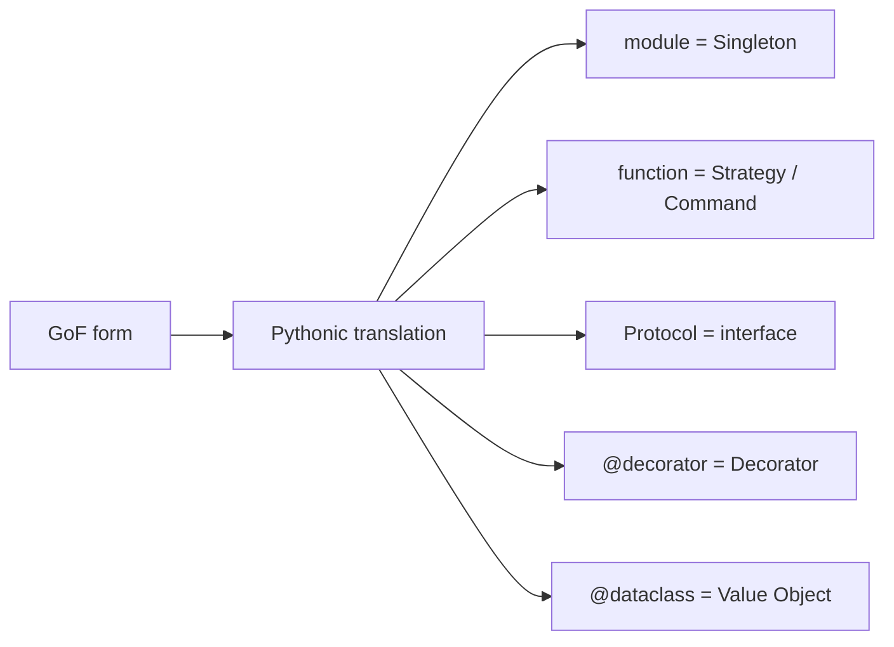

# Pythonic Patterns

> Design Patterns 101 series (10/10)

<!-- a-grade-intro:begin -->

**Core question**: Is it always right to *port GoF patterns* directly into Python?

> No. Python's first-class functions, modules, Protocols, and decorators dissolve many GoF patterns into *less code*.

<!-- a-grade-intro:end -->

## What You Will Learn

- Why a module is already a Singleton
- Strategy and Command expressed as functions
- Interfaces expressed as Protocols
- `@dataclass` and value objects
- Decorator (the pattern) expressed as `@decorator`

## Why It Matters

Python's basic tools — modules, functions, Protocols — already provide *runtime support* for many patterns. The same problem can be solved with *less code*.

> Reach for the language's tools first; pull out a pattern only when those fall short.

## Concept at a Glance



Same pattern, lighter expression.

## Key Terms

- **Module-as-singleton**: a module is loaded once and acts like a Singleton.
- **First-class function**: functions you can pass, return, and store.
- **Protocol**: structural typing (statically checked duck typing).
- **Decorator (`@`)**: a wrapper that adds behavior to a function or class.
- **dataclass**: a value object with built-in equality, repr, and immutability.

## Before/After

**Before (GoF as-is)**

```python
class SingletonConfig:
    _inst = None
    def __new__(cls):
        if cls._inst is None:
            cls._inst = super().__new__(cls)
        return cls._inst
```

**After (Pythonic)**

```python
# config.py
DEBUG = True
DB_URL = "postgres://..."
# elsewhere: from config import DEBUG, DB_URL
```

A module is already a Singleton.

## Hands-on: Five Steps to Pythonic Patterns

### Step 1 — Module = Singleton

```python
# 1_module_singleton.py
# settings.py
import os
ENV = os.getenv("ENV", "dev")
SECRET = os.getenv("SECRET", "x")
```

Import it anywhere — same value everywhere.

### Step 2 — Function = Strategy / Command

```python
# 2_function_strategy.py
def asc(d): return sorted(d)
def desc(d): return sorted(d, reverse=True)

def run(strategy, data): return strategy(data)
print(run(desc, [3, 1, 2]))
```

Classes were not necessary for clarity.

### Step 3 — Protocol = interface

```python
# 3_protocol.py
from typing import Protocol

class Mailer(Protocol):
    def send(self, to: str, body: str) -> None: ...

class SmtpMailer:
    def send(self, to, body): ...   # satisfies without inheritance
```

The balance of duck typing and static checking.

### Step 4 — `@dataclass` = value object

```python
# 4_dataclass.py
from dataclasses import dataclass

@dataclass(frozen=True)
class Money:
    amount: int
    currency: str
```

Equality, repr, and immutability in one line.

### Step 5 — `@decorator` = the Decorator pattern

```python
# 5_decorator.py
import time, functools

def timed(fn):
    @functools.wraps(fn)
    def wrap(*a, **k):
        t = time.time()
        try: return fn(*a, **k)
        finally: print(fn.__name__, time.time()-t)
    return wrap

@timed
def work(): time.sleep(0.1)
```

`@` adds responsibility *naturally*.

## What to Notice in This Code

- There is almost no class hierarchy.
- The pattern *emerges* from standard tools.
- The same intent is expressed in *fewer lines*.

## Five Common Mistakes

1. **Porting Java-style GoF directly.** A weight Python does not need.
2. **Singleton class instead of a module.** A second instance becomes possible — risky.
3. **Forcing ABC.** A Protocol is often enough.
4. **Decorator overuse muddying the call flow.** Forgetting `functools.wraps` is common.
5. **Hand-rolled class instead of dataclass.** Missing `__eq__` and `__repr__`.

## How This Shows Up in Production

`logging` is a module Singleton, `sorted(key=...)` is a function Strategy, `typing.Protocol` is an interface, `@app.route(...)` is a Decorator. The standard library and popular frameworks are *living examples* of Pythonic patterns.

## How a Senior Engineer Thinks

- Reach for the *language's* tools first.
- Prefer Protocol over ABC, module over Singleton class.
- A function is enough until it isn't.
- Use `functools.wraps` with every decorator.
- Patterns ultimately serve *readability*.

## Checklist

- [ ] Did you avoid Singleton classes where a module would do?
- [ ] Did you avoid Strategy classes where a function would do?
- [ ] Did you avoid forcing ABC where Protocol fits?
- [ ] Did you use a dataclass for value objects?
- [ ] Did you use `functools.wraps` in your decorators?

## Practice Problems

1. Fold a Singleton class into a module.
2. Simplify one Strategy class into a function.
3. Convert an ABC interface to a Protocol and pass mypy.

## Wrap-up and Next Steps

GoF is a *vocabulary*, not a *manual*. Look at Python's tools first, and reach for pattern names only where the tools fall short. The Design Patterns 101 series ends here — use these terms as *units of thought*, not as instruments.

<!-- toc:begin -->
- [What Are Design Patterns?](./01-what-are-design-patterns.md)
- [Creational Patterns](./02-creational-patterns.md)
- [Structural Patterns](./03-structural-patterns.md)
- [Behavioral Patterns](./04-behavioral-patterns.md)
- [The Strategy Pattern](./05-strategy-pattern.md)
- [The Adapter Pattern](./06-adapter-pattern.md)
- [The Observer Pattern](./07-observer-pattern.md)
- [Factory and Dependency Injection](./08-factory-and-di.md)
- [Avoiding Pattern Overuse](./09-avoiding-pattern-overuse.md)
- **Pythonic Patterns (current)**
<!-- toc:end -->

## References

- [PEP 544 — Protocols](https://peps.python.org/pep-0544/)
- [dataclasses (Python docs)](https://docs.python.org/3/library/dataclasses.html)
- [functools.wraps (Python docs)](https://docs.python.org/3/library/functools.html#functools.wraps)
- [Python 3 Patterns, Recipes and Idioms (Bruce Eckel)](https://python-3-patterns-idioms-test.readthedocs.io/)

Tags: Computer Science, DesignPatterns, Python, Idioms, Protocols, Decorators
