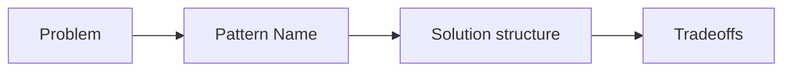

# 디자인 패턴이란 무엇인가?

디자인 패턴을 처음 배우면 대개 이름부터 외우기 시작합니다. Strategy, Adapter, Observer 같은 이름이 먼저 보이기 때문입니다. 하지만 실무에서 패턴이 힘을 발휘하는 순간은 암기 시험이 아니라, 같은 문제를 반복해서 만나는 시점입니다.

이 글은 Design Patterns 101 시리즈의 첫 번째 글입니다.

이번 글에서는 디자인 패턴을 “정답 모음집”이 아니라, 반복되는 설계 문제를 빠르게 설명하고 합의하기 위한 공통 어휘로 정리해 보겠습니다. 핵심은 패턴 이름보다 먼저, 그 이름이 어떤 문제와 어떤 트레이드오프를 함께 불러오는지 이해하는 것입니다.

## 이 글에서 다룰 문제

- 디자인 패턴을 한 문장으로 정의하면 무엇일까요?
- GoF가 정리한 23개 패턴은 어떤 기준으로 나뉠까요?
- 패턴은 왜 코드보다 대화에서 먼저 가치를 만들까요?
- 패턴은 언제 도움이 되고, 언제 오히려 단순한 코드를 망칠까요?
- 입문자가 패턴을 어떤 순서로 배우면 덜 헷갈릴까요?

> 멘탈 모델: 디자인 패턴은 코드를 대신 써 주는 정답이 아니라, 반복되는 설계 문제에 붙인 이름표입니다. 문제를 먼저 알아보고, 그다음에 이름을 붙여야 패턴이 힘을 발휘합니다.

## 왜 중요한가

패턴의 가장 큰 효용은 구현 자체보다 합의 속도에 있습니다. 코드 리뷰에서 “여기 분기가 계속 늘어나니 Strategy로 빼자”라고 말했을 때, 팀 전체가 비슷한 구조를 즉시 떠올릴 수 있다면 이미 절반은 해결된 셈입니다.

반대로 패턴 이름만 알고 문제를 모르면 실무에서는 오히려 더 위험합니다. 이름은 그럴듯한데 왜 도입했는지 설명하지 못하면, 패턴은 설계를 단순화하는 도구가 아니라 복잡성을 정당화하는 장식이 됩니다.

## 한눈에 보는 개념



좋은 패턴 학습 순서는 늘 같습니다. 먼저 문제를 알아보고, 그다음 이름을 붙이고, 구조를 이해한 뒤, 마지막으로 트레이드오프까지 함께 기억해야 합니다.

## 핵심 용어

- **디자인 패턴**: 반복해서 나타나는 설계 문제에 검증된 해법 구조를 붙인 이름입니다.
- **GoF**: Gang of Four를 뜻하며, 23개 패턴을 체계적으로 정리한 저자 그룹입니다.
- **Creational / Structural / Behavioral**: 생성, 구조, 행위를 기준으로 나눈 세 가지 패턴 계열입니다.
- **안티패턴**: 흔히 쓰이지만 결과적으로 해로운 접근입니다.
- **이디엄(idiom)**: 특정 언어의 문법과 관용구에 밀착된 작은 패턴입니다.

## Before / After

**Before**

```python
# "if kind" branching scattered everywhere
if kind == "credit": process_credit(...)
elif kind == "paypal": process_paypal(...)
```

**After**

```python
# Strategy pattern in one line
processor = PROCESSORS[kind]
processor.charge(...)
```

이 차이의 핵심은 코드 길이가 아닙니다. 의도가 이름 붙은 구조로 드러났다는 점입니다. 패턴은 종종 구현보다 설명을 먼저 정리해 줍니다.

## 패턴을 익히는 5단계

### 1단계 — 문제를 먼저 알아봅니다

```python
# 1_problem.py
# Same branch, same object construction, same notification flow recurring?
# That is the stage for a pattern.
```

패턴은 공중에서 떨어지지 않습니다. 같은 분기, 같은 생성 방식, 같은 알림 흐름이 반복될 때 비로소 패턴을 꺼낼 이유가 생깁니다.

### 2단계 — 문제에 이름을 붙입니다

```python
# 2_name.py
# Branching? Strategy. Construction? Factory. Notifications? Observer.
```

이름은 단순한 라벨이 아닙니다. 문제와 해법 구조를 함께 호출하는 압축된 설명입니다.

### 3단계 — 구조를 먼저 그립니다

```python
# 3_structure.py
# Draw the class diagram before writing code.
```

패턴은 코드 조각이 아니라 관계의 모양입니다. 클래스를 어떻게 나누고, 누가 누구를 알고, 어디서 확장되는지 먼저 그려 보면 과한 설계를 줄이기 쉽습니다.

### 4단계 — 작게 적용합니다

```python
# 4_small.py
# Try it in one module before applying it system-wide.
```

처음부터 시스템 전체에 패턴을 퍼뜨리면 실패 비용이 커집니다. 한 모듈, 한 경계, 한 분기부터 적용해 보고 실제 이득이 있는지 확인하는 편이 안전합니다.

### 5단계 — 트레이드오프를 적어 둡니다

```python
# 5_tradeoff.md
# - Gained: branching gone, easier to extend
# - Lost: more classes to read
```

패턴은 늘 무언가를 얻는 대신 다른 비용을 추가합니다. 그 비용을 적지 않는 순간, 팀은 복잡성을 공짜라고 착각하기 쉽습니다.

## 이 코드에서 주목할 점

- 패턴은 코드를 바꾸기 전에 팀의 대화 방식을 먼저 바꿉니다.
- 어떤 패턴이든 이득과 비용이 함께 움직입니다.
- 패턴 적용 범위는 대개 전역이 아니라 국소적입니다.

## 자주 하는 실수 5가지

1. **어디에나 패턴을 들이대는 경우**: 단순한 코드가 불필요하게 복잡해집니다.
2. **이름만 외우고 문제를 모르는 경우**: 적용해야 할 순간을 못 알아봅니다.
3. **언어 특성을 무시하는 경우**: Python에서 모듈이면 충분한데 Singleton 클래스를 억지로 만듭니다.
4. **트레이드오프를 빼먹는 경우**: 클래스만 늘고 설명 가능성은 오히려 떨어집니다.
5. **패턴이 곧 정답이라고 믿는 경우**: 더 단순한 해법을 놓칩니다.

## 실무에서는 이렇게 드러납니다

패턴은 보통 코드 리뷰 어휘로 가장 자주 등장합니다. “여긴 Adapter 경계가 필요합니다”, “이 분기는 Strategy 모양입니다” 같은 말이 팀 안에서 자연스럽게 통하면, 설계 대화의 해상도가 훨씬 높아집니다. 결국 패턴은 구현 세부보다 합의를 빠르게 만드는 도구입니다.

## 시니어 엔지니어는 이렇게 판단합니다

- 패턴을 해법이 아니라 공통 어휘로 다룹니다.
- 이름보다 문제를 먼저 봅니다.
- 전역 적용보다 작은 범위에서 효과를 검증합니다.
- 트레이드오프를 항상 함께 설명합니다.
- 마지막까지 더 단순한 해법이 없는지 다시 확인합니다.

## 체크리스트

- [ ] 내가 푸는 문제를 한 줄로 적을 수 있는가?
- [ ] 그 문제에 어울리는 패턴 이름이 자연스럽게 떠오르는가?
- [ ] 구조를 코드보다 먼저 설명할 수 있는가?
- [ ] 이득과 비용을 함께 적었는가?
- [ ] 패턴 없이 더 단순하게 풀 수는 없는가?

## 연습 문제

1. 현재 코드에서 같은 분기 구조가 세 번 이상 반복되는 지점을 하나 찾습니다.
2. 그 문제에 가장 잘 맞는 패턴 이름을 하나 붙여 봅니다.
3. 적용 후 얻은 점 두 가지와 잃은 점 두 가지를 적어 봅니다.

## 정리 및 다음 글

디자인 패턴은 정답이 아니라 어휘입니다. 다음 글부터는 GoF의 23개 패턴을 생성, 구조, 행위 세 묶음으로 나눠서 살펴보겠습니다. 먼저 객체를 어떻게 만들 것인가를 다루는 Creational 패턴부터 시작합니다.

<!-- toc:begin -->
- **디자인 패턴이란 무엇인가? (현재 글)**
- Creational 패턴 (예정)
- Structural 패턴 (예정)
- Behavioral 패턴 (예정)
- Strategy 패턴 (예정)
- Adapter 패턴 (예정)
- Observer 패턴 (예정)
- Factory와 의존성 주입 (예정)
- 패턴을 남용하지 않는 법 (예정)
- Python에 어울리는 패턴 (예정)
<!-- toc:end -->

## 참고 자료

- [Design Patterns: Elements of Reusable Object-Oriented Software (GoF)](https://en.wikipedia.org/wiki/Design_Patterns)
- [refactoring.guru — Design Patterns](https://refactoring.guru/design-patterns)
- [Patterns of Enterprise Application Architecture](https://martinfowler.com/eaaCatalog/)
- [Head First Design Patterns](https://www.oreilly.com/library/view/head-first-design/9781492077992/)

Tags: Computer Science, DesignPatterns, SoftwareDesign, GoF, Architecture, Foundations
