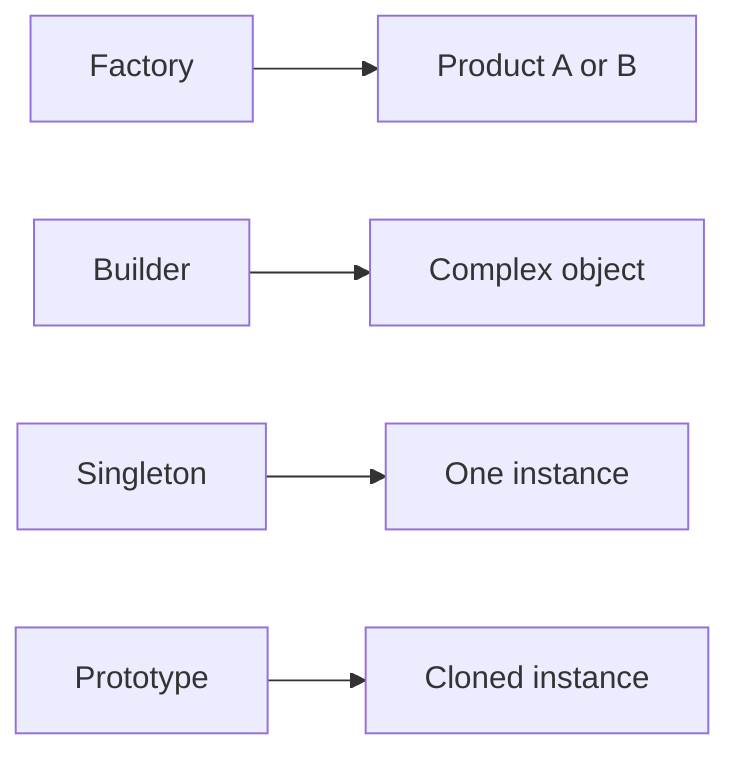

# Creational 패턴

> Design Patterns 101 시리즈 (2/10)


## 이 글에서 다룰 문제

`new SomeService()`가 코드 곳곳에 박혀 있다면 결합도는 이미 잠겨 있습니다. 생성을 한 곳에 모으면 교체가 쉬워집니다.

> 무엇을 만드느냐보다, 어디서 만드느냐가 중요하다.

## 개념 한눈에 보기



생성의 책임을 분리하는 네 가지 방식.

## Before/After

**Before**

```python
def make_notifier(kind):
    if kind == "email": return EmailNotifier(smtp_host="...")
    elif kind == "sms": return SmsNotifier(api_key="...")
```

**After**

```python
class NotifierFactory:
    def create(self, kind) -> Notifier: ...

# 호출자는 구체를 모른다
notifier = factory.create(kind)
```

생성 책임이 한 자리에 모입니다.

## 실습: Creational을 익히는 5단계

### 1단계 — Factory Method

```python
# 1_factory.py
class Notifier:
    def send(self, msg): ...

class NotifierFactory:
    def create(self, kind: str) -> Notifier:
        if kind == "email": return EmailNotifier()
        if kind == "sms": return SmsNotifier()
        raise ValueError(kind)
```

분기를 한 곳에.

### 2단계 — Abstract Factory

```python
# 2_abstract_factory.py
class UIFactory:
    def button(self) -> "Button": ...
    def textbox(self) -> "TextBox": ...

class MacFactory(UIFactory): ...
class WinFactory(UIFactory): ...
```

관련 객체 군을 함께.

### 3단계 — Builder

```python
# 3_builder.py
class QueryBuilder:
    def __init__(self): self.parts = []
    def select(self, *cols): self.parts.append(("SELECT", cols)); return self
    def from_(self, t): self.parts.append(("FROM", t)); return self
    def where(self, c): self.parts.append(("WHERE", c)); return self
    def build(self) -> str: ...
```

복잡한 조립을 단계적으로.

### 4단계 — Singleton (조심해서)

```python
# 4_singleton.py
# Python에서는 보통 모듈 자체가 싱글턴.
# 굳이 클래스로 만들 필요 없는 경우가 많다.
import logging
logger = logging.getLogger("app")
```

전역 상태는 늘 의심.

### 5단계 — Prototype

```python
# 5_prototype.py
import copy

class ReportTemplate:
    def __init__(self, layout): self.layout = layout

base = ReportTemplate({"header": "Q1", "rows": []})
def new_report():
    return copy.deepcopy(base)
```

생성보다 복제가 싸다면 Prototype.

## 이 코드에서 주목할 점

- 호출자는 구체 클래스를 모릅니다.
- 새 종류 추가가 호출자 코드를 바꾸지 않습니다.
- 복잡한 조립이 가독성 있는 단계로 분해됩니다.

## 자주 하는 실수 5가지

1. **Singleton 남용.** 사실상 전역 변수가 됨.
2. **Factory 안에 비즈니스 로직.** 생성과 정책이 섞임.
3. **Builder를 단순 객체에도 적용.** 코드량만 늘어남.
4. **Abstract Factory를 너무 일찍 도입.** 가족이 1개뿐.
5. **Prototype 깊은 복사 비용 무시.** 성능 함정.

## 실무에서는 이렇게 쓰입니다

DI 컨테이너, ORM 쿼리 빌더, UI 위젯 라이브러리 — Creational 패턴은 프레임워크 골격에 자주 등장합니다.

## 체크리스트

- [ ] 호출자가 구체 클래스를 모르는가?
- [ ] 새 종류 추가가 호출자 코드를 깨지 않는가?
- [ ] Singleton이 정말 필요한가?
- [ ] Builder가 복잡도를 정말 낮추는가?
- [ ] Prototype의 비용을 측정했는가?

## 정리 및 다음 단계

생성을 다스리면 결합이 풀립니다. 다음 글에서는 객체들을 *어떻게 묶을지* — Structural 패턴 — 를 봅니다.

<!-- toc:begin -->
- [디자인 패턴이란 무엇인가?](./01-what-are-design-patterns.md)
- **Creational 패턴 (현재 글)**
- Structural 패턴 (예정)
- Behavioral 패턴 (예정)
- Strategy 패턴 (예정)
- Adapter 패턴 (예정)
- Observer 패턴 (예정)
- Factory와 의존성 주입 (예정)
- 패턴을 남용하지 않는 법 (예정)
- Python에 어울리는 패턴 (예정)
<!-- toc:end -->

## 참고 자료

- [Factory Method (refactoring.guru)](https://refactoring.guru/design-patterns/factory-method)
- [Abstract Factory (refactoring.guru)](https://refactoring.guru/design-patterns/abstract-factory)
- [Builder (refactoring.guru)](https://refactoring.guru/design-patterns/builder)
- [Singleton — Why You Should Use It Sparingly](https://martinfowler.com/bliki/InversionOfControl.html)

Tags: Computer Science, DesignPatterns, Creational, Factory, Singleton, Builder
