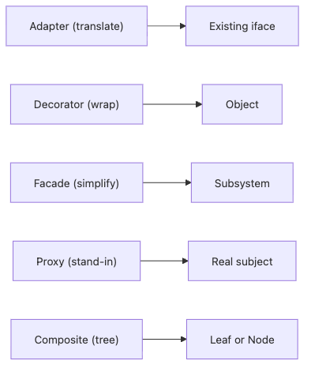

# Structural 패턴

생성 책임을 정리한 다음에는, 만들어진 객체들을 어떻게 엮을지가 다음 문제로 올라옵니다. 외부 라이브러리를 도메인에 바로 노출할지, 기존 객체에 기능을 덧씌울지, 복잡한 하위 시스템 앞에 단순한 입구를 둘지 같은 결정이 전부 구조의 문제입니다.

이 글은 Design Patterns 101 시리즈의 3번째 글입니다.

이번 글에서는 Structural 패턴을 “객체 합성의 이름표”로 보겠습니다. 핵심은 상속을 늘리는 대신 합성과 위임으로 구조를 조립해, 변경이 와도 전체 설계가 쉽게 굳어 버리지 않게 만드는 것입니다.

## 이 글에서 다룰 문제

- Structural 패턴은 어떤 구조적 문제를 풀까요?
- Adapter, Decorator, Facade는 각각 무엇을 단순화할까요?
- Proxy는 실제 객체 앞에서 어떤 책임을 대신 맡을까요?
- Composite는 언제 자연스럽고 언제 억지스러울까요?
- 왜 상속보다 합성이 기본값이어야 할까요?

> 멘탈 모델: Structural 패턴은 객체를 더 많이 상속시키는 기법이 아니라, 합성과 위임으로 책임을 조립하는 기법입니다. 구조를 고정하지 않고 연결 방식을 바꾸는 데 목적이 있습니다.

## 왜 중요한가

상속은 한번 뻗기 시작하면 구조를 빨리 굳혀 버립니다. 반면 합성은 같은 인터페이스를 유지한 채 구현을 감싸고, 바꾸고, 단순화하고, 트리로 엮을 수 있게 해 줍니다. 실무에서 구조 변경 비용을 낮추는 쪽은 대개 상속보다 합성입니다.

특히 외부 SDK, 미들웨어, 프록시 캐시, 하위 시스템 통합 같은 영역에서는 Structural 패턴이 거의 매일 등장합니다. 이름을 모르더라도 다들 이미 쓰고 있지만, 이름을 알고 보면 설계 의도를 훨씬 명확하게 설명할 수 있습니다.

## 한눈에 보는 개념


*Structural 패턴은 객체를 번역하고, 감싸고, 단순화하고, 대리하고, 트리로 묶는 다섯 가지 연결 방식을 한눈에 보여 줍니다.*

## 핵심 용어

- **Adapter**: 이미 있는 인터페이스를 우리가 원하는 모양으로 바꿉니다.
- **Decorator**: 객체를 감싸서 동적으로 책임을 추가합니다.
- **Facade**: 복잡한 하위 시스템 앞에 단순한 진입점을 둡니다.
- **Proxy**: 실제 객체를 대신해 접근 제어, 캐시, 지연 로딩을 맡습니다.
- **Composite**: 단일 객체와 객체 집합을 같은 방식으로 다룹니다.

## Before / After

**Before**

```python
# external library calls leak into the domain
import boto3
s3 = boto3.client("s3")
s3.put_object(Bucket="b", Key="k", Body=data)
```

**After**

```python
# Adapter aligns the dependency to a domain interface
class FileStore:
    def put(self, key, data): ...

class S3FileStore(FileStore):
    def put(self, key, data): self._s3.put_object(...)
```

이후 도메인은 boto3를 몰라도 됩니다. 외부 의존성이 구조 경계 뒤로 숨었기 때문에 테스트와 교체가 쉬워집니다.

## Structural 패턴을 익히는 5단계

### 1단계 — Adapter로 계약을 맞춥니다

```python
# 1_adapter.py
class LegacyPrinter:
    def write_line(self, s): ...

class NewPrinter:
    def print(self, s): ...

class PrinterAdapter(NewPrinter):
    def __init__(self, legacy): self.legacy = legacy
    def print(self, s): self.legacy.write_line(s)
```

예전 계약을 새 계약으로 번역해 주는 얇은 층입니다. 기존 코드를 대대적으로 바꾸지 않고도 호환성을 얻을 수 있습니다.

### 2단계 — Decorator로 기능을 덧씌웁니다

```python
# 2_decorator.py
class Logger:
    def __init__(self, inner): self.inner = inner
    def send(self, msg):
        print("LOG:", msg); self.inner.send(msg)

notifier = Logger(EmailNotifier())
```

기존 객체를 수정하지 않고도 로깅 같은 횡단 기능을 추가할 수 있습니다. 인터페이스를 유지한 채 감싼다는 점이 중요합니다.

### 3단계 — Facade로 복잡한 흐름을 단순화합니다

```python
# 3_facade.py
class CheckoutFacade:
    def buy(self, user, item):
        cart.add(user, item); pay.charge(user); ship.send(user, item)
```

하위 시스템이 여러 개라도 호출자는 단일 진입점만 보면 됩니다. 복잡한 흐름을 숨기되, 새로운 기능을 무작정 떠안는 만능 객체가 되어서는 안 됩니다.

### 4단계 — Proxy로 실제 객체 앞에 책임을 둡니다

```python
# 4_proxy.py
class CachedRepo:
    def __init__(self, real): self.real = real; self.cache = {}
    def get(self, k):
        if k not in self.cache: self.cache[k] = self.real.get(k)
        return self.cache[k]
```

실제 객체를 대신해 캐시, 접근 제어, 지연 로딩을 붙일 때 유용합니다. 호출자 입장에서는 같은 계약처럼 보여야 합니다.

### 5단계 — Composite로 트리 구조를 통일합니다

```python
# 5_composite.py
class Node:
    def total(self): ...

class File(Node):
    def __init__(self, size): self.size = size
    def total(self): return self.size

class Folder(Node):
    def __init__(self, children): self.children = children
    def total(self): return sum(c.total() for c in self.children)
```

파일과 폴더처럼 단일 항목과 집합을 같은 연산으로 다뤄야 할 때 Composite가 자연스럽습니다. 실제 데이터가 트리가 아닐 때는 오히려 어색해집니다.

## 이 코드에서 주목할 점

- 다섯 패턴 모두 핵심 도구는 상속보다 합성입니다.
- 인터페이스는 안정적으로 유지하고 구현만 교체합니다.
- 상속 트리를 키우지 않고도 책임을 조립할 수 있습니다.

## 자주 하는 실수 5가지

1. **Adapter 안에 비즈니스 로직을 넣는 경우**: 번역과 정책이 뒤엉킵니다.
2. **Decorator를 너무 깊게 겹치는 경우**: 디버깅이 급격히 어려워집니다.
3. **Facade가 만능 객체로 커지는 경우**: 단순화가 아니라 책임 폭발이 됩니다.
4. **Proxy의 시그니처가 실제 객체와 달라지는 경우**: 호출자가 깨집니다.
5. **트리가 아닌 곳에 Composite를 억지로 맞추는 경우**: 모델이 부자연스러워집니다.

## 실무에서는 이렇게 드러납니다

Flask 미들웨어 체인은 Decorator 모양이고, `requests.Session`은 Facade처럼 읽히며, ORM의 지연 로딩 객체는 Proxy의 성격을 띱니다. 외부 서비스 SDK를 도메인 인터페이스 뒤로 숨기는 순간에는 Adapter가 등장합니다. Structural 패턴은 조용하지만 거의 모든 라이브러리 안에 들어 있습니다.

## 빠르게 검증해 보기

Structural 패턴을 넣기 전에 아래를 점검해 보세요.

- 지금 어려운 점이 외부 경계, 래핑, 하위 시스템 단순화, 캐시/대리 책임 중 어디에 있는지 먼저 적습니다.
- 새 구조가 호출자 계약을 더 단순하게 만드는지 확인합니다.
- 합성이 실제로 호출자의 지식을 줄이는지, 아니면 복잡성을 옆으로 옮기기만 하는지 비교합니다.

**기대 결과:** 리팩터링 뒤에는 호출자가 더 안정적인 인터페이스만 보고, 구현 세부는 구조 경계 뒤에 남아 있어야 합니다.

## 시니어 엔지니어는 이렇게 판단합니다

- 합성을 기본값으로 둡니다.
- Adapter는 외부 경계에만 둡니다.
- Decorator는 같은 인터페이스 위에서만 겹칩니다.
- Facade의 목적을 기능 추가가 아니라 단순화로 제한합니다.
- Composite는 데이터가 진짜 트리일 때만 도입합니다.

## 체크리스트

- [ ] Adapter가 외부 경계에만 존재하는가?
- [ ] Decorator 체인이 과도하게 깊지 않은가?
- [ ] Facade가 호출을 단순화하는가?
- [ ] Proxy가 실제 객체와 같은 계약을 유지하는가?
- [ ] Composite가 실제 트리 구조를 반영하는가?

## 연습 문제

1. 외부 SaaS 호출 하나를 도메인 인터페이스 뒤에 Adapter로 감싸 봅니다.
2. 기존 Notifier에 Logger Decorator를 덧붙여 봅니다.
3. 폴더/파일 같은 트리 구조를 Composite로 모델링해 봅니다.

## 정리 및 다음 글

합성은 구조를 변경 가능하게 유지하는 가장 실용적인 기본값입니다. 다음 글에서는 구조에서 한 걸음 더 나아가, 객체들이 어떻게 협력하고 행동하는지를 다루는 Behavioral 패턴으로 넘어가겠습니다.

<!-- toc:begin -->
- [디자인 패턴이란 무엇인가?](./01-what-are-design-patterns.md)
- [Creational 패턴](./02-creational-patterns.md)
- **Structural 패턴 (현재 글)**
- Behavioral 패턴 (예정)
- Strategy 패턴 (예정)
- Adapter 패턴 (예정)
- Observer 패턴 (예정)
- Factory와 의존성 주입 (예정)
- 패턴을 남용하지 않는 법 (예정)
- Python에 어울리는 패턴 (예정)
<!-- toc:end -->

## 참고 자료

### 핵심 자료

- [Adapter Pattern (refactoring.guru)](https://refactoring.guru/design-patterns/adapter)
- [Decorator Pattern (refactoring.guru)](https://refactoring.guru/design-patterns/decorator)
- [Facade Pattern (refactoring.guru)](https://refactoring.guru/design-patterns/facade)
- [Composite Pattern (refactoring.guru)](https://refactoring.guru/design-patterns/composite)

### 실무 확장 읽을거리

- [The Python Tutorial — Classes (Python docs)](https://docs.python.org/3/tutorial/classes.html)

Tags: Computer Science, DesignPatterns, Structural, Adapter, Decorator, Facade
