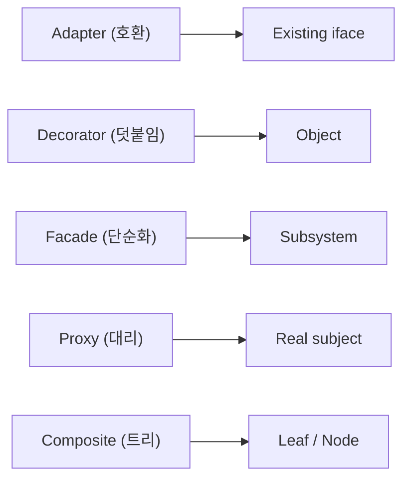

# Structural 패턴

> Design Patterns 101 시리즈 (3/10)


## 이 글에서 다룰 문제

상속만으로는 구조가 빨리 굳습니다. 합성으로 책임을 조립하면 변경에 강해집니다.

> 상속보다 합성을.

## 전체 흐름


다섯 가지 합성 방식.

## Before/After

**Before**

```python
# 외부 라이브러리 호출이 도메인 곳곳에 박힘
import boto3
s3 = boto3.client("s3")
s3.put_object(Bucket="b", Key="k", Body=data)
```

**After**

```python
# Adapter로 도메인 인터페이스에 맞춘다
class FileStore:
    def put(self, key, data): ...

class S3FileStore(FileStore):
    def put(self, key, data): self._s3.put_object(...)
```

도메인은 외부 라이브러리를 모릅니다.

## Structural을 익히는 5단계

### 1단계 — Adapter

```python
# 1_adapter.py
class LegacyPrinter:
    def write_line(self, s): ...

class NewPrinter:
    def print(self, s): ...

class PrinterAdapter(NewPrinter):
    def __init__(self, legacy): self.legacy = legacy
    def print(self, s): self.legacy.write_line(s)
```

옛 객체를 새 약속에 맞춥니다.

### 2단계 — Decorator

```python
# 2_decorator.py
class Logger:
    def __init__(self, inner): self.inner = inner
    def send(self, msg):
        print("LOG:", msg); self.inner.send(msg)

notifier = Logger(EmailNotifier())
```

기능을 *둘러서* 덧붙입니다.

### 3단계 — Facade

```python
# 3_facade.py
class CheckoutFacade:
    def buy(self, user, item):
        cart.add(user, item); pay.charge(user); ship.send(user, item)
```

복잡한 흐름을 한 입구로.

### 4단계 — Proxy

```python
# 4_proxy.py
class CachedRepo:
    def __init__(self, real): self.real = real; self.cache = {}
    def get(self, k):
        if k not in self.cache: self.cache[k] = self.real.get(k)
        return self.cache[k]
```

진짜 객체를 대신해 책임을 추가.

### 5단계 — Composite

```python
# 5_composite.py
class Node:
    def total(self): ...

class File(Node):
    def __init__(self, size): self.size = size
    def total(self): return self.size

class Folder(Node):
    def __init__(self, children): self.children = children
    def total(self): return sum(c.total() for c in self.children)
```

단일과 묶음을 동일하게.

## 이 코드에서 주목할 점

- 모든 패턴이 *합성*을 도구로 씁니다.
- 인터페이스는 안정적, 구현은 갈아 끼울 수 있습니다.
- 상속 트리 깊이가 거의 늘지 않습니다.

## 자주 하는 실수 5가지

1. **Adapter에 비즈니스 로직.** 변환과 정책 혼재.
2. **Decorator를 너무 깊게 쌓음.** 디버깅 지옥.
3. **Facade가 점점 신(神) 객체로.** 책임 폭발.
4. **Proxy가 본체와 시그니처가 다름.** 호출자가 깨진다.
5. **Composite를 트리가 아닌 곳에 강요.** 부자연스러움.

## 실무에서는 이렇게 쓰입니다

Flask middleware = Decorator 사슬, requests의 Session = Facade, ORM의 Lazy proxy = Proxy. 라이브러리 곳곳이 Structural의 무대입니다.

## 체크리스트

- [ ] Adapter가 외부 경계에 있는가?
- [ ] Decorator의 깊이가 합리적인가?
- [ ] Facade가 단순화 역할만 하는가?
- [ ] Proxy 시그니처가 본체와 동일한가?
- [ ] Composite가 자연스러운 트리에 적용되는가?

## 정리 및 다음 단계

구조를 합성으로 짜면 변경이 쉬워집니다. 다음 글에서는 객체들의 *행동* 을 다스리는 — Behavioral 패턴 — 을 봅니다.

<!-- toc:begin -->
- [디자인 패턴이란 무엇인가?](./01-what-are-design-patterns.md)
- [Creational 패턴](./02-creational-patterns.md)
- **Structural 패턴 (현재 글)**
- Behavioral 패턴 (예정)
- Strategy 패턴 (예정)
- Adapter 패턴 (예정)
- Observer 패턴 (예정)
- Factory와 의존성 주입 (예정)
- 패턴을 남용하지 않는 법 (예정)
- Python에 어울리는 패턴 (예정)
<!-- toc:end -->

## 참고 자료

- [Adapter Pattern (refactoring.guru)](https://refactoring.guru/design-patterns/adapter)
- [Decorator Pattern (refactoring.guru)](https://refactoring.guru/design-patterns/decorator)
- [Facade Pattern (refactoring.guru)](https://refactoring.guru/design-patterns/facade)
- [Composite Pattern (refactoring.guru)](https://refactoring.guru/design-patterns/composite)

Tags: Computer Science, DesignPatterns, Structural, Adapter, Decorator, Facade
