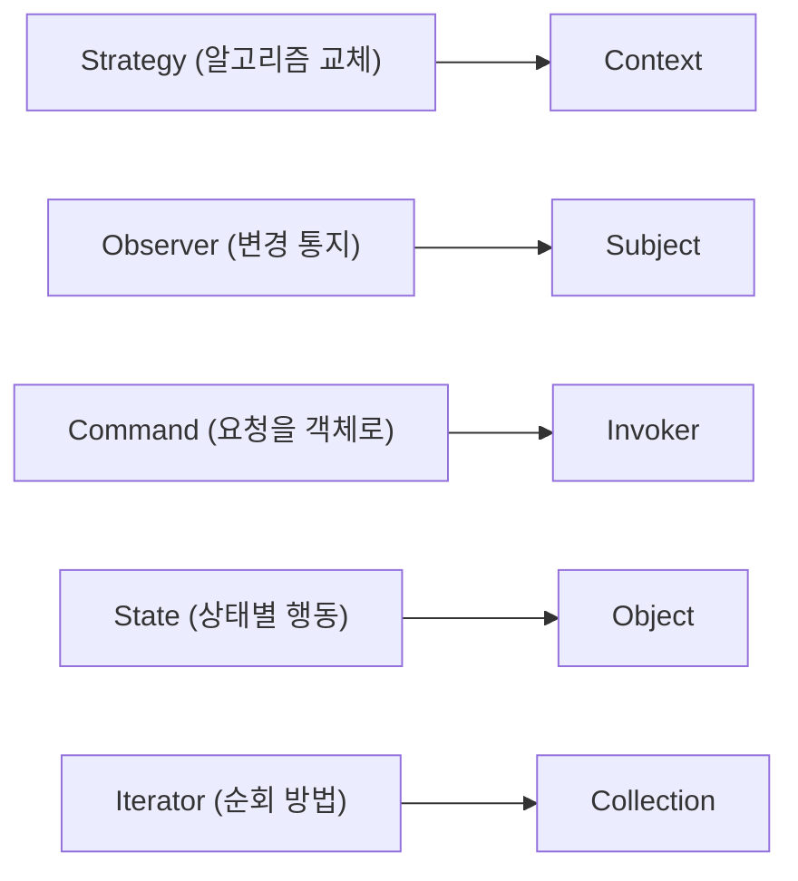

# Behavioral 패턴

> Design Patterns 101 시리즈 (4/10)

<!-- a-grade-intro:begin -->

**핵심 질문**: 객체들이 어떻게 서로의 *행동*을 조정할까요?

> 알고리즘을 갈아끼우거나, 통지를 흘려보내거나, 명령을 객체로 만드는 — 이름 붙은 방식들이 Behavioral 패턴입니다.

<!-- a-grade-intro:end -->

## 이 글에서 배울 것

- Behavioral 패턴이 푸는 문제
- Strategy / Observer / Command
- State와 Iterator
- 흐름을 *데이터처럼* 다룬다는 사고
- 패턴 선택의 기준

## 왜 중요한가

객체 사이의 협력은 if/elif 더미로 빠르게 굳습니다. Behavioral 패턴은 그 협력에 *이름*과 *모양*을 줍니다.

> 흐름을 객체로 바꾸면 흐름도 테스트할 수 있습니다.

## 개념 한눈에 보기



다섯 가지 협력 양식.

## 핵심 용어 정리

- **Strategy**: 알고리즘을 객체로 만들어 교체 가능하게.
- **Observer**: 한 객체의 변경을 여러 구독자에게 통지.
- **Command**: 요청 자체를 객체로 만들어 큐/실행취소를 가능하게.
- **State**: 상태 객체로 행동을 분리.
- **Iterator**: 컬렉션 내부 구조 없이 순회.

## Before/After

**Before**

```python
def discount(kind, price):
    if kind == "vip":
        return price * 0.7
    elif kind == "member":
        return price * 0.9
    return price
```

**After**

```python
class Discount:
    def apply(self, p): return p

class Vip(Discount):
    def apply(self, p): return p * 0.7

class Member(Discount):
    def apply(self, p): return p * 0.9
```

새 등급이 생겨도 기존 코드를 건드리지 않습니다.

## 실습: Behavioral을 익히는 5단계

### 1단계 — Strategy

```python
# 1_strategy.py
class Sorter:
    def __init__(self, strategy): self.strategy = strategy
    def sort(self, data): return self.strategy(data)

asc = Sorter(sorted)
desc = Sorter(lambda d: sorted(d, reverse=True))
```

함수도 일급 객체이므로 Python에서 Strategy는 종종 그냥 함수입니다.

### 2단계 — Observer

```python
# 2_observer.py
class Subject:
    def __init__(self): self._subs = []
    def subscribe(self, fn): self._subs.append(fn)
    def notify(self, e):
        for fn in self._subs: fn(e)

s = Subject()
s.subscribe(lambda e: print("LOG:", e))
s.notify("created")
```

Subject는 구독자를 모르고도 통지를 보냅니다.

### 3단계 — Command

```python
# 3_command.py
class Command:
    def execute(self): ...

class SendEmail(Command):
    def __init__(self, to, body): self.to, self.body = to, body
    def execute(self): mailer.send(self.to, self.body)

queue = [SendEmail("a@x", "hi"), SendEmail("b@x", "hi")]
for c in queue: c.execute()
```

요청을 객체로 만들면 큐, 재시도, 실행취소가 가능해집니다.

### 4단계 — State

```python
# 4_state.py
class Order:
    def __init__(self): self.state = Draft()
    def submit(self): self.state = self.state.submit()

class Draft:
    def submit(self): return Pending()

class Pending:
    def submit(self): return self  # idempotent
```

상태 분기를 if 더미가 아닌 객체 교체로 표현.

### 5단계 — Iterator

```python
# 5_iterator.py
class Bag:
    def __init__(self, items): self.items = items
    def __iter__(self):
        for x in self.items: yield x

for x in Bag([1, 2, 3]):
    print(x)
```

내부 구조를 노출하지 않고 순회 약속만 제공합니다.

## 이 코드에서 주목할 점

- 분기(if/elif)가 객체로 *압축*됩니다.
- 알고리즘과 컨텍스트가 분리됩니다.
- 흐름이 데이터(객체)가 되어 큐/저장/리플레이가 가능합니다.

## 자주 하는 실수 5가지

1. **Strategy를 위한 클래스 폭발.** 함수면 충분한 경우가 많다.
2. **Observer 순환 통지.** A→B→A 무한 루프.
3. **Command에 비즈니스 로직 산개.** Command는 *요청* 객체일 뿐.
4. **State 객체가 서로를 강하게 안다.** 결합도 폭발.
5. **Iterator 대신 인덱스 노출.** 클라이언트가 내부 구조를 안다.

## 실무에서는 이렇게 쓰입니다

Django signals = Observer, Celery task = Command, FSM 라이브러리 = State, Python의 모든 컬렉션 = Iterator. 일상적인 도구의 기반에 Behavioral이 있습니다.

## 시니어 엔지니어는 이렇게 생각합니다

- Strategy의 첫 후보는 *함수*.
- Observer는 통지 *방향*을 단방향으로.
- Command는 단순 요청에는 과합니다.
- State는 진짜 상태기계일 때만.
- Iterator는 내부 자료 구조를 숨기는 약속.

## 체크리스트

- [ ] Strategy가 함수보다 클래스가 나은 이유가 있는가?
- [ ] Observer가 순환 통지를 만들지 않는가?
- [ ] Command가 *요청*만 담고 있는가?
- [ ] State 전이가 한 곳에서 보이는가?
- [ ] Iterator가 내부 구조를 숨기는가?

## 연습 문제

1. 현재 if/elif 분기를 Strategy로 정리해 보세요.
2. 도메인 이벤트 발행을 Observer로 모델링해 보세요.
3. 외부 API 호출 큐를 Command로 표현해 보세요.

## 정리 및 다음 단계

행동을 객체로 표현하면 분기가 줄고 협력이 보입니다. 다음 글은 가장 실용적인 행동 패턴인 Strategy를 깊게 봅니다.

<!-- toc:begin -->
- [디자인 패턴이란 무엇인가?](./01-what-are-design-patterns.md)
- [Creational 패턴](./02-creational-patterns.md)
- [Structural 패턴](./03-structural-patterns.md)
- **Behavioral 패턴 (현재 글)**
- Strategy 패턴 (예정)
- Adapter 패턴 (예정)
- Observer 패턴 (예정)
- Factory와 의존성 주입 (예정)
- 패턴을 남용하지 않는 법 (예정)
- Python에 어울리는 패턴 (예정)
<!-- toc:end -->

## 참고 자료

- [Strategy Pattern (refactoring.guru)](https://refactoring.guru/design-patterns/strategy)
- [Observer Pattern (refactoring.guru)](https://refactoring.guru/design-patterns/observer)
- [Command Pattern (refactoring.guru)](https://refactoring.guru/design-patterns/command)
- [State Pattern (refactoring.guru)](https://refactoring.guru/design-patterns/state)

Tags: Computer Science, DesignPatterns, Behavioral, Strategy, Observer, Command
