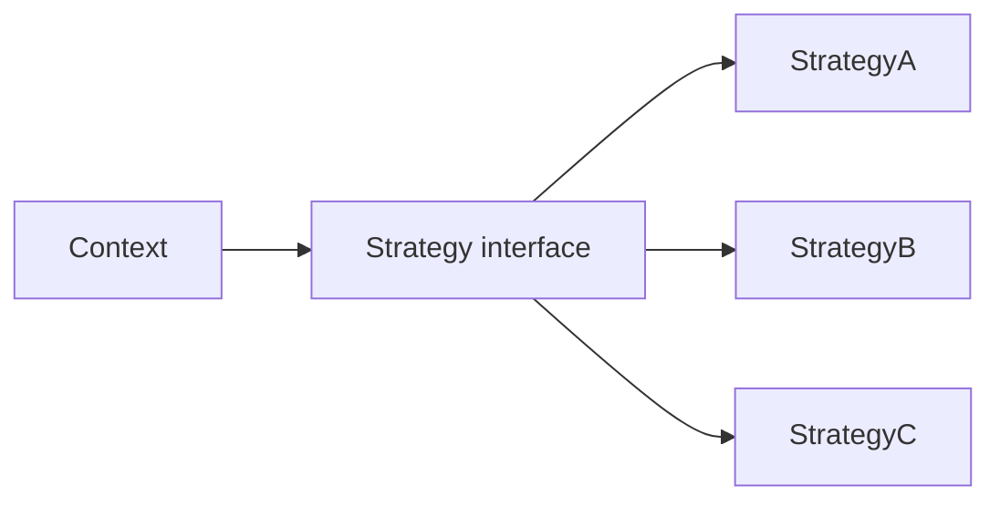

# Strategy 패턴

같은 일을 하는 방법이 여러 개일 때 코드는 쉽게 분기문으로 기울어집니다. 처음에는 `if kind == ...` 한두 줄로 시작하지만, 옵션이 늘고 정책이 갈라지기 시작하면 수정 포인트가 한곳에 몰리고 새 요구사항이 들어올 때마다 기존 코드를 열어야 합니다.

이 글은 Design Patterns 101 시리즈의 5번째 글입니다.

이번 글에서는 Strategy 패턴을 “알고리즘을 교체 가능한 단위로 분리하는 방법”으로 보겠습니다. 핵심은 분기를 계속 늘리는 대신, 알고리즘을 객체나 함수로 바꾸고 그것을 컨텍스트에 주입하는 것입니다.

## 이 글에서 다룰 문제

- Strategy 패턴은 어떤 종류의 분기 폭발을 줄여 줄까요?
- Open/Closed Principle과 Strategy는 어떻게 이어질까요?
- Python에서는 클래스 Strategy와 함수 Strategy를 어떻게 구분할까요?
- 런타임 교체와 테스트에서 Strategy는 어떤 이점을 줄까요?
- 언제는 Strategy가 과한 추상화가 될까요?

> 멘탈 모델: Strategy는 알고리즘을 사용하는 코드와 알고리즘 자체를 분리하는 패턴입니다. 컨텍스트는 계약만 알고, 실제 계산 방식은 바깥에서 갈아 끼웁니다.

## 왜 중요한가

분기 기반 알고리즘은 옵션이 늘 때마다 기존 코드를 계속 수정하게 만듭니다. 이는 기능 추가가 곧 기존 로직 편집으로 이어진다는 뜻이고, 테스트 범위도 그만큼 넓어집니다.

Strategy는 이 분기를 교체 가능한 단위로 바꿉니다. 새 알고리즘을 넣을 때 기존 컨텍스트를 뜯지 않고 새 구현을 추가하는 방향으로 움직이므로, OCP(Open/Closed Principle)를 코드 모양으로 드러내는 대표적인 예가 됩니다.

## 한눈에 보는 개념



컨텍스트는 인터페이스만 알고, 실제 알고리즘은 상황에 따라 바뀝니다. 설계 포인트는 “누가 계산하느냐”가 아니라 “누가 선택하느냐”입니다.

## 핵심 용어

- **Context**: Strategy를 사용해 실제 작업을 수행하는 객체입니다.
- **Strategy interface**: 알고리즘이 따라야 하는 계약입니다.
- **Concrete Strategy**: 실제 알고리즘 구현입니다.
- **Injection point**: Strategy를 주입하는 지점입니다.
- **Default strategy**: 별도 선택이 없을 때 쓰는 기본 동작입니다.

## Before / After

**Before**

```python
def price(kind, base):
    if kind == "vip":
        return base * 0.7
    elif kind == "member":
        return base * 0.9
    elif kind == "guest":
        return base
    raise ValueError(kind)
```

**After**

```python
class Pricing:
    def apply(self, base): return base

class Vip(Pricing):
    def apply(self, base): return base * 0.7

class Member(Pricing):
    def apply(self, base): return base * 0.9
```

이후 `price` 함수는 더 이상 구체 알고리즘을 알 필요가 없습니다. 알고리즘을 추가하는 일이 기존 분기문을 늘리는 일이 아니라, 새 전략을 하나 더 만드는 일이 됩니다.

## Strategy 패턴을 익히는 5단계

### 1단계 — 인터페이스를 먼저 정의합니다

```python
# 1_iface.py
from typing import Protocol

class ShipCost(Protocol):
    def for_weight(self, kg: float) -> int: ...
```

Python에서는 ABC보다 `Protocol`이 더 자연스러운 경우가 많습니다. 상속보다 구조적 타이핑으로 계약을 표현할 수 있기 때문입니다.

### 2단계 — 구체 전략을 나눕니다

```python
# 2_strategies.py
class StandardShip:
    def for_weight(self, kg): return int(3000 + 500 * kg)

class ExpressShip:
    def for_weight(self, kg): return int(6000 + 800 * kg)
```

두 클래스는 상속 없이도 같은 Protocol을 만족합니다. 중요한 것은 같은 계약 아래 서로 다른 알고리즘을 표현한다는 점입니다.

### 3단계 — 컨텍스트에 주입합니다

```python
# 3_inject.py
class Order:
    def __init__(self, ship: ShipCost): self.ship = ship
    def total(self, items, kg):
        return sum(items) + self.ship.for_weight(kg)
```

생성자 주입은 가장 흔하고 읽기 쉬운 방식입니다. `Order`는 운송비 계산을 쓰기만 할 뿐, 어떤 계산식인지 직접 고르지 않습니다.

### 4단계 — 함수 Strategy도 적극적으로 씁니다

```python
# 4_func.py
def standard(kg): return int(3000 + 500 * kg)
def express(kg):  return int(6000 + 800 * kg)

class Order2:
    def __init__(self, ship): self.ship = ship
    def total(self, items, kg): return sum(items) + self.ship(kg)

o = Order2(standard)
```

Python에서는 함수 하나가 가장 자연스러운 Strategy인 경우가 많습니다. 클래스가 아니어도 역할이 충분히 드러난다면 그 편이 더 Python답습니다.

### 5단계 — 런타임 교체와 테스트를 단순화합니다

```python
# 5_runtime.py
order = Order2(standard)
print(order.total([10000], 2))
order.ship = express
print(order.total([10000], 2))
```

테스트에서는 결정적인(fake) Strategy를 넣어 외부 의존성을 잘라낼 수 있습니다. 런타임 교체가 쉬워진다는 점도 운영상 큰 장점입니다.

## 이 코드에서 주목할 점

- 컨텍스트는 알고리즘 내부를 모릅니다.
- 새 알고리즘 추가는 기존 코드 수정이 아니라 코드 추가로 끝나기 쉽습니다.
- 테스트가 쉬워집니다. 가짜 Strategy 하나 주입하면 됩니다.

## 자주 하는 실수 5가지

1. **두 줄짜리 로직에도 Strategy를 쓰는 경우**: 과잉 일반화입니다.
2. **Strategy가 Context 상태를 직접 바꾸는 경우**: 책임 경계가 샙니다.
3. **클래스가 불필요하게 늘어나는 경우**: 함수로 충분한데 구조만 무거워집니다.
4. **기본 Strategy를 두지 않는 경우**: 단순한 호출자도 매번 선택을 떠안게 됩니다.
5. **전략끼리 서로 내부를 아는 경우**: Strategy 간 결합이 생깁니다.

## 실무에서는 이렇게 드러납니다

`sorted(key=...)`의 `key`, `pandas.apply`에 넘기는 함수, 결제 수단별 처리기 선택, 알림 채널별 전송기 선택은 모두 Strategy 모양으로 읽을 수 있습니다. 이름만 다를 뿐, 실무에서는 생각보다 자주 만나는 구조입니다.

## 시니어 엔지니어는 이렇게 판단합니다

- “분기가 하나 더 오겠다”는 감이 들면 Strategy 후보로 봅니다.
- 클래스보다 함수가 먼저인지부터 따집니다.
- 기본 Strategy를 둬서 단순한 호출자를 더 단순하게 유지합니다.
- 상태가 거의 없는 Strategy를 선호합니다.
- 이름은 동작보다 역할 중심으로 붙입니다.

## 체크리스트

- [ ] 컨텍스트가 알고리즘 내부를 모르고 있는가?
- [ ] 새 알고리즘 추가가 코드 추가로 끝나는가?
- [ ] Strategy가 Context 상태를 직접 바꾸지 않는가?
- [ ] 기본 Strategy가 합리적인가?
- [ ] 함수로 충분한데 클래스를 만들지는 않았는가?

## 연습 문제

1. 카드/계좌이체/포인트 결제 분기를 Strategy로 바꿔 봅니다.
2. 정렬 기준 하나를 함수 Strategy로 표현해 봅니다.
3. 기본 구현을 포함한 알림 채널 선택기를 Strategy로 설계해 봅니다.

## 정리 및 다음 글

Strategy는 OCP를 눈에 보이게 만드는 패턴입니다. 다음 글에서는 외부 인터페이스를 도메인이 원하는 계약으로 바꾸는 Structural 패턴, Adapter를 자세히 보겠습니다.

<!-- toc:begin -->
- [디자인 패턴이란 무엇인가?](./01-what-are-design-patterns.md)
- [Creational 패턴](./02-creational-patterns.md)
- [Structural 패턴](./03-structural-patterns.md)
- [Behavioral 패턴](./04-behavioral-patterns.md)
- **Strategy 패턴 (현재 글)**
- Adapter 패턴 (예정)
- Observer 패턴 (예정)
- Factory와 의존성 주입 (예정)
- 패턴을 남용하지 않는 법 (예정)
- Python에 어울리는 패턴 (예정)
<!-- toc:end -->

## 참고 자료

- [Strategy Pattern (refactoring.guru)](https://refactoring.guru/design-patterns/strategy)
- [Open/Closed Principle (Wikipedia)](https://en.wikipedia.org/wiki/Open%E2%80%93closed_principle)
- [PEP 544 — Protocols](https://peps.python.org/pep-0544/)
- [sorted(key=...) (Python docs)](https://docs.python.org/3/howto/sorting.html)

Tags: Computer Science, DesignPatterns, Strategy, Polymorphism, Behavioral, OCP
