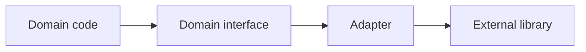

# Adapter 패턴

> Design Patterns 101 시리즈 (6/10)


## 이 글에서 다룰 문제

도메인 코드 안에 외부 라이브러리 호출이 흩어져 있으면, 라이브러리 한 줄이 바뀔 때마다 도메인이 흔들립니다. Adapter는 그 흔들림을 *경계 한 줄*에 가둡니다.

> Adapter는 *경계의 얇은 외투*입니다.

## 전체 흐름


도메인은 인터페이스만, Adapter가 외부 호출을 책임집니다.

## Before/After

**Before**

```python
import boto3
def save_report(data):
    s3 = boto3.client("s3")
    s3.put_object(Bucket="reports", Key="r.json", Body=data)
```

**After**

```python
class FileStore:
    def put(self, key, data): ...

class S3FileStore(FileStore):
    def __init__(self, bucket): self._s3 = boto3.client("s3"); self.bucket = bucket
    def put(self, key, data): self._s3.put_object(Bucket=self.bucket, Key=key, Body=data)

def save_report(store: FileStore, data):
    store.put("r.json", data)
```

`save_report`는 더 이상 boto3를 모릅니다.

## Adapter를 익히는 5단계

### 1단계 — 도메인 인터페이스부터

```python
# 1_iface.py
from typing import Protocol

class FileStore(Protocol):
    def put(self, key: str, data: bytes) -> None: ...
    def get(self, key: str) -> bytes: ...
```

도메인이 *원하는* 모양을 먼저 정의합니다.

### 2단계 — 외부 호출 감싸기

```python
# 2_s3_adapter.py
class S3FileStore:
    def __init__(self, client, bucket):
        self.client, self.bucket = client, bucket
    def put(self, key, data):
        self.client.put_object(Bucket=self.bucket, Key=key, Body=data)
    def get(self, key):
        return self.client.get_object(Bucket=self.bucket, Key=key)["Body"].read()
```

S3 호출은 이 한 클래스 안에만 존재합니다.

### 3단계 — 도메인 코드 사용

```python
# 3_domain.py
def archive(store, key, data):
    store.put(key, data)
```

테스트에서는 fake store를 주입할 수 있습니다.

### 4단계 — 다른 백엔드 추가

```python
# 4_local_adapter.py
import os, pathlib
class LocalFileStore:
    def __init__(self, root): self.root = pathlib.Path(root)
    def put(self, key, data):
        (self.root / key).write_bytes(data)
    def get(self, key):
        return (self.root / key).read_bytes()
```

도메인을 손대지 않고 새 Adapter만 추가합니다.

### 5단계 — 테스트 더블

```python
# 5_fake.py
class InMemoryFileStore:
    def __init__(self): self._d = {}
    def put(self, k, v): self._d[k] = v
    def get(self, k): return self._d[k]
```

가짜 Adapter로 단위 테스트가 빠르고 결정론적이 됩니다.

## 이 코드에서 주목할 점

- 외부 SDK 호출이 *오직* Adapter 안에만 존재합니다.
- 도메인 코드는 Protocol에만 의존합니다.
- 테스트 더블이 자연스럽게 같은 자리에 들어갑니다.

## 자주 하는 실수 5가지

1. **Adapter 안에 비즈니스 로직.** 변환과 정책이 섞임.
2. **외부 타입을 그대로 노출.** 도메인이 외부 타입을 알게 됨.
3. **Adapter가 다른 Adapter를 직접 호출.** 경계 침범.
4. **에러를 외부 예외 그대로 던짐.** 도메인 예외로 *번역*해야 한다.
5. **Adapter가 점점 두꺼워짐.** 책임이 *경계*만이 아니게 됨.

## 실무에서는 이렇게 쓰입니다

S3/GCS/Local을 같은 FileStore로, 결제 PG(스트라이프/토스/포트원)을 같은 PaymentGateway로, 메일 발송기(SES/SendGrid/SMTP)를 같은 Mailer로 — 모두 Adapter입니다. 운영 환경 전환의 자유는 여기서 옵니다.

## 체크리스트

- [ ] 도메인 코드가 외부 SDK를 import하지 않는가?
- [ ] Adapter가 비즈니스 결정을 하지 않는가?
- [ ] 외부 타입이 경계 밖으로 새지 않는가?
- [ ] 외부 예외가 도메인 예외로 번역되는가?
- [ ] InMemory Adapter가 존재하는가?

## 정리 및 다음 단계

Adapter는 *경계의 외투*입니다. 다음 글은 객체 사이의 통지를 다루는 — Observer 패턴 — 을 깊게 봅니다.

<!-- toc:begin -->
- [디자인 패턴이란 무엇인가?](./01-what-are-design-patterns.md)
- [Creational 패턴](./02-creational-patterns.md)
- [Structural 패턴](./03-structural-patterns.md)
- [Behavioral 패턴](./04-behavioral-patterns.md)
- [Strategy 패턴](./05-strategy-pattern.md)
- **Adapter 패턴 (현재 글)**
- Observer 패턴 (예정)
- Factory와 의존성 주입 (예정)
- 패턴을 남용하지 않는 법 (예정)
- Python에 어울리는 패턴 (예정)
<!-- toc:end -->

## 참고 자료

- [Adapter Pattern (refactoring.guru)](https://refactoring.guru/design-patterns/adapter)
- [Hexagonal Architecture (Alistair Cockburn)](https://alistair.cockburn.us/hexagonal-architecture/)
- [Ports and Adapters (Wikipedia)](https://en.wikipedia.org/wiki/Hexagonal_architecture_(software))
- [PEP 544 — Protocols](https://peps.python.org/pep-0544/)

Tags: Computer Science, DesignPatterns, Adapter, Structural, Compatibility, Wrapper
