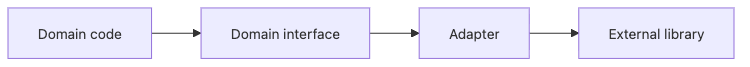

# Adapter 패턴

실무 코드는 우리가 직접 설계한 인터페이스만 쓰지 않습니다. 결제 게이트웨이 SDK, 스토리지 클라이언트, 메일 전송 라이브러리처럼 바꿀 수 없는 외부 인터페이스를 매일 끌어다 씁니다. 문제는 그 호출이 도메인 곳곳에 새기 시작하는 순간, 외부 API의 변화가 내부 설계까지 흔들기 시작한다는 점입니다.

이 글은 Design Patterns 101 시리즈의 6번째 글입니다.

이번 글에서는 Adapter 패턴을 외부 의존성을 경계 뒤에 가두는 얇은 번역층으로 설명하겠습니다. 핵심은 도메인이 외부 SDK의 언어를 배우지 않게 만드는 것입니다.

## 이 글에서 다룰 문제

- Adapter 패턴은 어떤 경계 문제를 해결할까요?
- 도메인 인터페이스를 먼저 정의해야 하는 이유는 무엇일까요?
- Object Adapter와 Class Adapter는 어떻게 다를까요?
- 테스트 더블과 Adapter는 왜 잘 맞을까요?
- Adapter가 두꺼워지기 시작하면 어떤 신호로 봐야 할까요?

> 멘탈 모델: Adapter는 외부 시스템과 도메인 사이에 입히는 얇은 코트입니다. 도메인은 자기 계약만 알고, 외부 호출의 세부는 Adapter 안에만 머물러야 합니다.

## 왜 중요한가

외부 라이브러리 호출이 도메인 곳곳에 퍼지면, 라이브러리의 시그니처 변화나 예외 모델 변화가 곧 도메인 변경으로 이어집니다. 이 상태에서는 테스트도 외부 SDK에 끌려다니고, 백엔드 교체도 사실상 불가능해집니다.

Adapter는 이 움직임을 한 줄의 경계에 고정합니다. 도메인은 `FileStore`, `PaymentGateway`, `Mailer` 같은 자기 언어만 알면 되고, boto3나 Stripe SDK는 Adapter 안에만 남게 됩니다.

## 한눈에 보는 개념


*도메인은 자기 계약만 알고, 외부 라이브러리 호출은 Adapter가 맡을 때 테스트성과 교체 가능성이 함께 올라갑니다.*

## 핵심 용어

- **Target**: 도메인이 원하고 기대하는 인터페이스입니다.
- **Adaptee**: 우리가 바꿀 수 없는 외부 인터페이스입니다.
- **Adapter**: Target을 구현하면서 Adaptee를 호출하는 객체입니다.
- **Object Adapter**: 합성으로 외부 객체를 들고 있는 방식입니다.
- **Class Adapter**: 다중 상속으로 외부 타입을 흡수하는 방식이며 Python에서는 드뭅니다.

## Before / After

**Before**

```python
import boto3
def save_report(data):
    s3 = boto3.client("s3")
    s3.put_object(Bucket="reports", Key="r.json", Body=data)
```

**After**

```python
class FileStore:
    def put(self, key, data): ...

class S3FileStore(FileStore):
    def __init__(self, bucket):
        self._s3 = boto3.client("s3"); self.bucket = bucket
    def put(self, key, data):
        self._s3.put_object(Bucket=self.bucket, Key=key, Body=data)

def save_report(store: FileStore, data):
    store.put("r.json", data)
```

이제 `save_report`는 boto3를 모릅니다. 외부 구현이 바뀌어도 도메인 함수 시그니처를 유지하기 쉬워집니다.

## Adapter 패턴을 익히는 5단계

### 1단계 — 도메인 인터페이스를 먼저 세웁니다

```python
# 1_iface.py
from typing import Protocol

class FileStore(Protocol):
    def put(self, key: str, data: bytes) -> None: ...
    def get(self, key: str) -> bytes: ...
```

외부 SDK를 보기 전에 도메인이 원하는 계약부터 정해야 합니다. 그래야 경계의 주도권을 도메인이 가져올 수 있습니다.

### 2단계 — 외부 호출을 한 클래스 안에 가둡니다

```python
# 2_s3_adapter.py
class S3FileStore:
    def __init__(self, client, bucket):
        self.client, self.bucket = client, bucket
    def put(self, key, data):
        self.client.put_object(Bucket=self.bucket, Key=key, Body=data)
    def get(self, key):
        return self.client.get_object(Bucket=self.bucket, Key=key)["Body"].read()
```

S3 관련 세부는 이 클래스 밖으로 새지 않아야 합니다. 그래야 예외 변환, 타입 정리, 백엔드 교체 지점도 분명해집니다.

### 3단계 — 도메인은 인터페이스만 사용하게 합니다

```python
# 3_domain.py
def archive(store, key, data):
    store.put(key, data)
```

이 구조 덕분에 테스트에서는 실제 S3 대신 가짜 저장소를 주입할 수 있습니다. 도메인은 파일 저장이라는 역할만 알면 충분합니다.

### 4단계 — 다른 백엔드를 같은 계약으로 끼웁니다

```python
# 4_local_adapter.py
import pathlib
class LocalFileStore:
    def __init__(self, root): self.root = pathlib.Path(root)
    def put(self, key, data):
        (self.root / key).write_bytes(data)
    def get(self, key):
        return (self.root / key).read_bytes()
```

새 Adapter를 추가해도 도메인 코드는 바뀌지 않습니다. 이 지점이 Adapter가 주는 가장 현실적인 가치입니다.

### 5단계 — 테스트 더블도 같은 이음새에 올립니다

```python
# 5_fake.py
class InMemoryFileStore:
    def __init__(self): self._d = {}
    def put(self, k, v): self._d[k] = v
    def get(self, k): return self._d[k]
```

InMemory Adapter는 단위 테스트를 빠르고 결정적으로 만듭니다. 좋은 Adapter 설계는 운영 백엔드와 테스트 백엔드를 같은 자리에서 교체할 수 있게 합니다.

## 이 코드에서 주목할 점

- 외부 SDK 호출은 Adapter 안에만 있습니다.
- 도메인은 Protocol 같은 계약에만 의존합니다.
- 테스트 더블이 같은 경계에 자연스럽게 끼워집니다.

## 자주 하는 실수 5가지

1. **Adapter 안에 비즈니스 로직을 넣는 경우**: 번역층이 정책층으로 비대해집니다.
2. **외부 타입을 경계 밖으로 흘리는 경우**: 도메인이 SDK를 배우기 시작합니다.
3. **Adapter가 다른 Adapter를 직접 호출하는 경우**: 경계 책임이 흐려집니다.
4. **외부 예외를 그대로 다시 던지는 경우**: 도메인 예외 모델이 오염됩니다.
5. **Adapter가 점점 두꺼워지는 경우**: 경계 밖 책임이 잘못 들어왔다는 신호입니다.

## 실무에서는 이렇게 드러납니다

S3/GCS/로컬 파일시스템을 하나의 `FileStore` 뒤에 두는 구조, Stripe/Toss/PortOne을 하나의 `PaymentGateway` 뒤에 두는 구조, SES/SendGrid/SMTP를 `Mailer` 뒤에 두는 구조가 전부 Adapter입니다. 백엔드 교체 자유도는 여기서 시작됩니다.

## 빠르게 검증해 보기

Adapter가 경계를 제대로 만들고 있는지 다음 항목으로 확인해 보세요.

- 도메인 계층에서 외부 SDK 타입이나 클라이언트를 직접 import하는 곳이 남아 있는지 찾습니다.
- 테스트에서 실제 Adapter 대신 InMemory 구현을 끼워 넣어도 도메인 코드가 그대로 동작하는지 확인합니다.
- 외부 예외, 식별자, payload 모양이 경계 밖으로 새지 않는지 점검합니다.

**기대 결과:** 도메인은 안정적인 계약만 보고, 인프라 세부는 교체 가능한 Adapter 뒤로 밀려나야 합니다.

## 시니어 엔지니어는 이렇게 판단합니다

- 도메인 인터페이스를 먼저 스케치합니다.
- Adapter는 번역과 호출만 하는 얇은 층으로 유지합니다.
- 외부 예외와 타입은 경계 안에서 번역합니다.
- Fake/InMemory Adapter를 같이 만듭니다.
- Adapter가 비대해지면 경계 밖 책임이 잘못 들어온 것으로 봅니다.

## 체크리스트

- [ ] 도메인이 외부 SDK를 직접 import하지 않는가?
- [ ] Adapter가 비즈니스 결정을 하지 않는가?
- [ ] 외부 타입이 경계 밖으로 새지 않는가?
- [ ] 외부 예외가 도메인 예외로 번역되는가?
- [ ] InMemory Adapter가 존재하는가?

## 연습 문제

1. 메일 전송 로직을 `Mailer` 인터페이스와 SMTP Adapter 뒤로 숨겨 봅니다.
2. 두 개 이상의 결제 게이트웨이를 같은 `PaymentGateway` 계약으로 표현해 봅니다.
3. 두 인터페이스 모두에 InMemory 구현을 추가하고 단위 테스트를 써 봅니다.

## 정리 및 다음 글

Adapter는 외부 경계에 입히는 얇은 번역층입니다. 다음 글에서는 한 객체의 변화가 여러 구독자에게 어떻게 퍼지는지, Observer 패턴으로 넘어가겠습니다.

<!-- toc:begin -->
- [디자인 패턴이란 무엇인가?](./01-what-are-design-patterns.md)
- [Creational 패턴](./02-creational-patterns.md)
- [Structural 패턴](./03-structural-patterns.md)
- [Behavioral 패턴](./04-behavioral-patterns.md)
- [Strategy 패턴](./05-strategy-pattern.md)
- **Adapter 패턴 (현재 글)**
- Observer 패턴 (예정)
- Factory와 의존성 주입 (예정)
- 패턴을 남용하지 않는 법 (예정)
- Python에 어울리는 패턴 (예정)
<!-- toc:end -->

## 참고 자료

### 핵심 자료

- [Adapter Pattern (refactoring.guru)](https://refactoring.guru/design-patterns/adapter)
- [Hexagonal Architecture (Alistair Cockburn)](https://alistair.cockburn.us/hexagonal-architecture/)
- [Ports and Adapters (Wikipedia)](https://en.wikipedia.org/wiki/Hexagonal_architecture_(software))

### 실무 확장 읽을거리

- [PEP 544 — Protocols](https://peps.python.org/pep-0544/)
- [Boto3 S3 `put_object` reference](https://boto3.amazonaws.com/v1/documentation/api/latest/reference/services/s3/client/put_object.html)

Tags: Computer Science, DesignPatterns, Adapter, Structural, Compatibility, Wrapper
