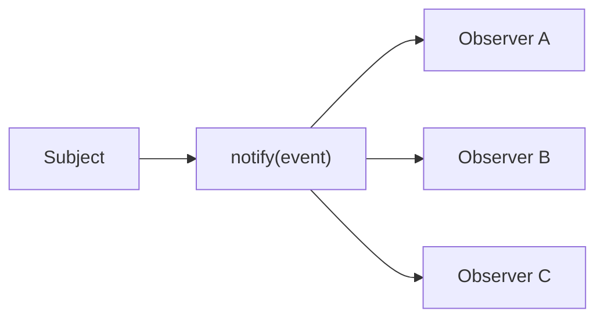

# Observer 패턴

> Design Patterns 101 시리즈 (7/10)


## 이 글에서 다룰 문제

A가 변할 때 B, C, D를 직접 호출하면 A는 셋을 모두 압니다. Observer는 그 호출을 통지로 바꿔, A는 누가 듣는지 알지 않아도 됩니다.

> Observer는 결합을 통지로 풀어줍니다.

## 전체 흐름


Subject는 메시지를 흘리고, Observer는 자유롭게 듣습니다.

## Before/After

**Before**

```python
class Order:
    def submit(self):
        self.save()
        send_email_to(self.user)        # 직접 호출
        slack_notify(self.user)         # 직접 호출
        warehouse.reserve(self.items)   # 직접 호출
```

**After**

```python
class Order:
    def __init__(self, bus): self.bus = bus
    def submit(self):
        self.save()
        self.bus.publish("order_submitted", {"user": self.user, "items": self.items})
```

`Order`는 누가 듣는지 모릅니다.

## Observer를 익히는 5단계

### 1단계 — 단순 EventBus

```python
# 1_bus.py
class EventBus:
    def __init__(self): self._subs = {}
    def subscribe(self, topic, fn): self._subs.setdefault(topic, []).append(fn)
    def publish(self, topic, event):
        for fn in self._subs.get(topic, []):
            fn(event)
```

가장 작은 형태의 Subject.

### 2단계 — 구독자 등록

```python
# 예시 파일: 2_subscribe.py
bus = EventBus()
bus.subscribe("order_submitted", lambda e: print("EMAIL:", e["user"]))
bus.subscribe("order_submitted", lambda e: print("SLACK:", e["user"]))
```

알림 채널이 늘어나도 Subject는 그대로.

### 3단계 — Subject에서 발행

```python
# 예시 파일: 3_publish.py
bus.publish("order_submitted", {"user": "u1", "items": ["a", "b"]})
```

Subject는 "무슨 일이 일어났다"만 알립니다.

### 4단계 — 동기 vs 비동기

```python
# 예시 파일: 4_async.py
import queue, threading
q = queue.Queue()

def worker():
    while True:
        topic, event = q.get()
        for fn in bus._subs.get(topic, []):
            fn(event)

threading.Thread(target=worker, daemon=True).start()

def async_publish(topic, event): q.put((topic, event))
```

비동기로 옮기면 Subject가 처리 시간에 발목 잡히지 않습니다.

### 5단계 — 구독 해지

```python
# 예시 파일: 5_unsubscribe.py
def unsubscribe(bus, topic, fn):
    bus._subs.get(topic, []).remove(fn)
```

테스트나 동적 핸들러에서는 해지가 반드시 필요합니다.

## 이 코드에서 주목할 점

- Subject는 Observer의 수와 종류를 모두 모릅니다.
- 새 행동 추가가 Subject 수정으로 이어지지 않습니다.
- 통지를 비동기로 옮기는 길이 열려 있습니다.

## 자주 하는 실수 5가지

1. **순환 통지.** A→B→A 무한 루프.
2. **동기 통지에 무거운 작업.** Subject가 느려짐.
3. **Observer가 Subject를 직접 변경.** 통지가 양방향이 됨.
4. **이벤트 스키마가 자유 형식.** 구독자 간 합의가 깨짐.
5. **에러 전파를 안 함.** 한 Observer 실패가 조용히 묻힘.

## 실무에서는 이렇게 쓰입니다

Django signals, Spring `ApplicationEventPublisher`, Kafka/Redis pub-sub, GitHub Webhooks — 모두 Observer의 큰 형제들입니다. 도메인 이벤트라는 이름으로도 자주 등장합니다.

## 체크리스트

- [ ] Subject가 구독자를 알지 않는가?
- [ ] 통지가 단방향인가?
- [ ] 이벤트 이름이 발생한 일을 가리키는가?
- [ ] 핸들러 에러가 격리되는가?
- [ ] 비동기 전환이 가능한 구조인가?

## 정리 및 다음 단계

Observer는 결합을 통지로 푸는 사고입니다. 다음 글은 객체 생성 책임을 다루는 — Factory와 의존성 주입 — 을 봅니다.

<!-- toc:begin -->
- [디자인 패턴이란 무엇인가?](./01-what-are-design-patterns.md)
- [Creational 패턴](./02-creational-patterns.md)
- [Structural 패턴](./03-structural-patterns.md)
- [Behavioral 패턴](./04-behavioral-patterns.md)
- [Strategy 패턴](./05-strategy-pattern.md)
- [Adapter 패턴](./06-adapter-pattern.md)
- **Observer 패턴 (현재 글)**
- Factory와 의존성 주입 (예정)
- 패턴을 남용하지 않는 법 (예정)
- Python에 어울리는 패턴 (예정)
<!-- toc:end -->

## 참고 자료

- [Observer Pattern (refactoring.guru)](https://refactoring.guru/design-patterns/observer)
- [Domain Events (Martin Fowler)](https://martinfowler.com/eaaDev/DomainEvent.html)
- [Django Signals](https://docs.djangoproject.com/en/stable/topics/signals/)
- [Publish-Subscribe Pattern (Wikipedia)](https://en.wikipedia.org/wiki/Publish%E2%80%93subscribe_pattern)

Tags: Computer Science, DesignPatterns, Observer, PubSub, Events, Behavioral
