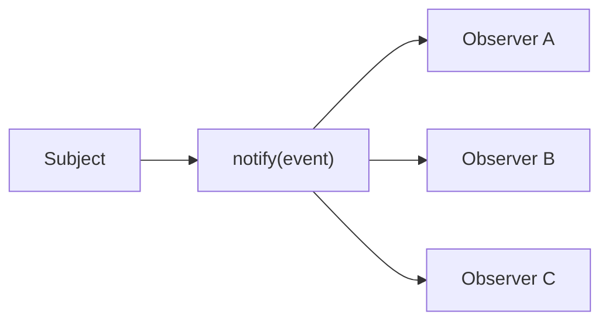

# Observer 패턴

한 객체의 변화에 여러 후속 동작이 매달리기 시작하면 코드는 쉽게 직접 호출 사슬로 굳습니다. 주문이 제출되면 메일을 보내고, 슬랙에 알리고, 창고를 예약하는 식의 작업이 전부 `Order.submit()` 안에 들어가면, 주문 객체는 자기 일보다 주변 시스템을 더 많이 알게 됩니다.

이 글은 Design Patterns 101 시리즈의 7번째 글입니다.

이번 글에서는 Observer 패턴을 직접 호출을 통지로 바꾸는 구조로 설명하겠습니다. 핵심은 발행자가 구독자를 몰라도 되게 만들어, 변경의 파급을 느슨한 연결로 바꾸는 것입니다.

## 이 글에서 다룰 문제

- Observer 패턴은 어떤 결합 문제를 줄여 줄까요?
- Subject, Observer, subscribe, notify는 각각 어떤 역할일까요?
- 동기 알림과 비동기 알림은 어디서 갈릴까요?
- 도메인 이벤트와 Observer는 어떻게 이어질까요?
- pub/sub 규모로 커질 때 무엇을 조심해야 할까요?

> 멘탈 모델: Observer는 “A가 B, C, D를 직접 호출한다”를 “A는 일이 일어났다고 알리고, B, C, D는 듣고 싶으면 구독한다”로 바꾸는 패턴입니다. 결합이 호출에서 통지로 바뀌는 순간 설계가 느슨해집니다.

## 왜 중요한가

발행자가 후속 처리기를 직접 호출하면, 변화 하나가 곧 의존성 목록의 확장을 뜻합니다. 알림 채널이 추가될 때마다 원래 객체를 열어야 하고, 어떤 후속 작업이 느려지거나 실패하면 발행자까지 영향을 받기 쉽습니다.

Observer는 이 연결을 약하게 만듭니다. 발행자는 “무슨 일이 일어났다”만 알리고, 누가 들을지는 바깥으로 밀어냅니다. 이때부터 확장은 발행자 수정이 아니라 구독자 추가로 바뀝니다.

## 한눈에 보는 개념



Subject는 메시지를 밀어 넣고, Observer는 원할 때 구독합니다. 이 단순한 구조가 확장 지점을 깔끔하게 나눠 줍니다.

## 핵심 용어

- **Subject**: 변화를 발행하는 주체입니다.
- **Observer**: 통지를 받아 반응하는 구독자입니다.
- **Subscribe / Unsubscribe**: 구독자 등록과 해지입니다.
- **Event**: 통지되는 데이터 단위입니다.
- **Sync / Async**: 같은 프로세스 안의 즉시 호출인지, 큐를 거친 비동기 처리인지의 차이입니다.

## Before / After

**Before**

```python
class Order:
    def submit(self):
        self.save()
        send_email_to(self.user)        # direct call
        slack_notify(self.user)         # direct call
        warehouse.reserve(self.items)   # direct call
```

**After**

```python
class Order:
    def __init__(self, bus): self.bus = bus
    def submit(self):
        self.save()
        self.bus.publish("order_submitted", {"user": self.user, "items": self.items})
```

이제 `Order`는 누가 듣는지 몰라도 됩니다. 메일, 슬랙, 창고 예약은 모두 구독자 쪽으로 이동합니다.

## Observer 패턴을 익히는 5단계

### 1단계 — 가장 작은 EventBus부터 만듭니다

```python
# 1_bus.py
class EventBus:
    def __init__(self): self._subs = {}
    def subscribe(self, topic, fn): self._subs.setdefault(topic, []).append(fn)
    def publish(self, topic, event):
        for fn in self._subs.get(topic, []):
            fn(event)
```

핵심은 복잡한 프레임워크가 아닙니다. “토픽에 대해 함수 목록을 보관하고 순회한다”는 최소 구조만 있어도 Observer의 본질을 볼 수 있습니다.

### 2단계 — 구독자를 등록합니다

```python
# 2_subscribe.py
bus = EventBus()
bus.subscribe("order_submitted", lambda e: print("EMAIL:", e["user"]))
bus.subscribe("order_submitted", lambda e: print("SLACK:", e["user"]))
```

새 채널을 추가해도 Subject는 바뀌지 않습니다. 확장이 발행자 수정이 아니라 구독자 추가로 이동하는 지점이 중요합니다.

### 3단계 — Subject에서 이벤트를 발행합니다

```python
# 3_publish.py
bus.publish("order_submitted", {"user": "u1", "items": ["a", "b"]})
```

Subject는 “무슨 일이 일어났는가”만 알립니다. 후속 동작을 직접 열거하지 않기 때문에 책임이 훨씬 선명해집니다.

### 4단계 — 동기와 비동기를 분리합니다

```python
# 4_async.py
import queue, threading
q = queue.Queue()

def worker():
    while True:
        topic, event = q.get()
        for fn in bus._subs.get(topic, []):
            fn(event)

threading.Thread(target=worker, daemon=True).start()

def async_publish(topic, event): q.put((topic, event))
```

비동기로 넘기면 발행자는 핸들러 지연 시간에 덜 묶입니다. 다만 순서, 재시도, 에러 보고 같은 운영 문제가 새로 생긴다는 점도 함께 봐야 합니다.

### 5단계 — 구독 해지를 지원합니다

```python
# 5_unsubscribe.py
def unsubscribe(bus, topic, fn):
    bus._subs.get(topic, []).remove(fn)
```

테스트나 동적 핸들러 환경에서는 해지가 반드시 필요합니다. 구독만 있고 해지가 없으면 시스템 수명 주기 관리가 금방 지저분해집니다.

## 이 코드에서 주목할 점

- Subject는 구독자의 수와 종류를 모릅니다.
- 새 동작 추가가 Subject 변경으로 이어지지 않습니다.
- 구조를 크게 바꾸지 않고도 비동기 알림으로 확장할 길이 열려 있습니다.

## 자주 하는 실수 5가지

1. **순환 알림이 생기는 경우**: A→B→A 루프가 끝나지 않습니다.
2. **동기 알림 안에서 무거운 작업을 하는 경우**: Subject까지 느려집니다.
3. **Observer가 Subject를 직접 다시 바꾸는 경우**: 단방향 통지가 양방향 결합으로 변합니다.
4. **이벤트 스키마를 즉흥적인 dict로만 두는 경우**: 생산자와 소비자가 쉽게 어긋납니다.
5. **핸들러 실패를 조용히 삼키는 경우**: 실패한 Observer가 사라진 것처럼 보입니다.

## 실무에서는 이렇게 드러납니다

Django signals, Kafka/Redis pub-sub, GitHub Webhook, Spring의 이벤트 발행기는 전부 Observer의 확장판으로 볼 수 있습니다. 특히 도메인 이벤트를 설계할 때 Observer를 이해하고 있으면, “무슨 일이 일어났는가”와 “그 뒤에 무엇을 할 것인가”를 명확히 분리하기 쉬워집니다.

## 시니어 엔지니어는 이렇게 판단합니다

- 통지 흐름을 한 방향으로만 흘리게 합니다.
- 이벤트 이름은 과거형으로 붙입니다.
- 스키마를 명시적으로 둡니다.
- 핸들러 실패는 별도 채널로 보고합니다.
- 나중에 비동기로 넘길 수 있는 경로를 열어 둡니다.

## 체크리스트

- [ ] Subject가 구독자를 직접 알지 않는가?
- [ ] 알림이 한 방향으로만 흐르는가?
- [ ] 이벤트 이름이 “무슨 일이 일어났는가”를 설명하는가?
- [ ] 핸들러 실패가 격리되는가?
- [ ] 필요할 때 비동기로 확장할 수 있는가?

## 연습 문제

1. 결제 성공 후 메일·슬랙·재고 예약을 Observer로 분리해 봅니다.
2. `dataclass` 기반 이벤트 스키마를 EventBus에 적용해 봅니다.
3. `unsubscribe`를 구현하고 단위 테스트를 작성해 봅니다.

## 정리 및 다음 글

Observer는 직접 호출을 통지로 바꿔 결합을 녹여 냅니다. 다음 글에서는 객체 생성 책임을 어디에 둘지 다루는 Factory와 의존성 주입으로 넘어가겠습니다.

<!-- toc:begin -->
- [디자인 패턴이란 무엇인가?](./01-what-are-design-patterns.md)
- [Creational 패턴](./02-creational-patterns.md)
- [Structural 패턴](./03-structural-patterns.md)
- [Behavioral 패턴](./04-behavioral-patterns.md)
- [Strategy 패턴](./05-strategy-pattern.md)
- [Adapter 패턴](./06-adapter-pattern.md)
- **Observer 패턴 (현재 글)**
- Factory와 의존성 주입 (예정)
- 패턴을 남용하지 않는 법 (예정)
- Python에 어울리는 패턴 (예정)
<!-- toc:end -->

## 참고 자료

- [Observer Pattern (refactoring.guru)](https://refactoring.guru/design-patterns/observer)
- [Domain Events (Martin Fowler)](https://martinfowler.com/eaaDev/DomainEvent.html)
- [Django Signals](https://docs.djangoproject.com/en/stable/topics/signals/)
- [Publish-Subscribe Pattern (Wikipedia)](https://en.wikipedia.org/wiki/Publish%E2%80%93subscribe_pattern)

Tags: Computer Science, DesignPatterns, Observer, PubSub, Events, Behavioral
