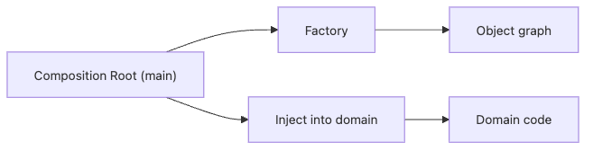

# Factory와 의존성 주입

객체를 잘 만들고 잘 조합하는 문제는 결국 한 질문으로 모입니다. “이 객체는 누가 만들고, 어디서 연결하고, 누가 넘겨줘야 하는가?” 도메인 코드가 스스로 의존성을 만들기 시작하면 생성 책임과 사용 책임이 섞이고, 테스트와 교체가 급격히 어려워집니다.

이 글은 Design Patterns 101 시리즈의 8번째 글입니다.

이번 글에서는 Factory와 Dependency Injection을 함께 보겠습니다. 핵심은 조립은 바깥 한곳에서 하고, 도메인은 주어진 의존성을 사용만 하게 만드는 것입니다. 그 조립 지점을 Composition Root라고 부릅니다.

## 이 글에서 다룰 문제

- 생성 책임이 흩어져 있으면 왜 변경 비용이 커질까요?
- Factory는 어떤 생성 분기를 캡슐화할까요?
- Dependency Injection은 어떤 사고방식을 요구할까요?
- Composition Root는 왜 한곳이어야 할까요?
- DI 컨테이너는 언제부터 값어치를 하기 시작할까요?

> 멘탈 모델: Factory와 DI의 핵심은 “사용”과 “조립”을 분리하는 데 있습니다. 도메인은 협력자를 고르지 않고 받기만 하며, 조립은 시스템 바깥의 한 진입점에서 일어납니다.

## 왜 중요한가

도메인 객체가 자신의 의존성을 직접 만들면, 도메인은 기능뿐 아니라 생성 방식과 환경 차이까지 알게 됩니다. 이 순간부터 테스트는 실제 인프라를 더 많이 끌고 오게 되고, 운영 환경에 따라 다른 구현을 선택하는 분기도 도메인 안에 스며듭니다.

Factory와 DI는 이 문제를 끊어 냅니다. 도메인은 “무엇을 쓸지”만 알고, “어떻게 만들지”는 바깥으로 밀어냅니다. 그 결과 테스트에서는 가짜 객체를 쉽게 넣을 수 있고, 운영에서는 환경별 구현을 한곳에서 관리할 수 있습니다.

## 한눈에 보는 개념


*조립은 한곳에서 하고 사용은 여러 곳에서 하도록 나누면, 객체 그래프를 읽는 비용과 테스트 비용이 함께 내려갑니다.*

## 핵심 용어

- **Factory**: 생성 과정을 감싸는 함수나 객체입니다.
- **Dependency Injection**: 의존성을 외부에서 제공하는 방식입니다.
- **Composition Root**: 객체 그래프를 한 번에 연결하는 단일 진입점입니다.
- **Constructor injection**: `__init__`를 통해 의존성을 받는 방식입니다.
- **DI container**: 자동 배선을 돕는 도구이며, 필요할 때만 써야 합니다.

## Before / After

**Before**

```python
class OrderService:
    def __init__(self):
        self.repo = PostgresOrderRepo("dsn")
        self.mailer = SmtpMailer("smtp.example.com")
        self.bus = EventBus()
```

**After**

```python
class OrderService:
    def __init__(self, repo, mailer, bus):
        self.repo, self.mailer, self.bus = repo, mailer, bus
```

`OrderService`는 더 이상 협력자를 스스로 고르지 않습니다. 덕분에 테스트, 환경별 교체, 수명 주기 관리가 훨씬 쉬워집니다.

## Factory와 DI를 익히는 5단계

### 1단계 — 생성 분기를 Factory로 뺍니다

```python
# 1_factory.py
def make_mailer(env):
    if env == "prod":
        return SmtpMailer("smtp.example.com")
    return InMemoryMailer()
```

환경 분기를 도메인 바깥으로 끌어내는 첫 단계입니다. 생성 차이를 한곳에 모으면 읽기도 쉽고 변경도 안전합니다.

### 2단계 — 생성자 주입으로 도메인을 단순화합니다

```python
# 2_ctor.py
class OrderService:
    def __init__(self, repo, mailer):
        self.repo, self.mailer = repo, mailer
```

도메인은 받은 협력자를 사용하기만 합니다. 이 단순한 차이가 테스트성과 교체 가능성에 큰 영향을 줍니다.

### 3단계 — Composition Root를 한곳에 둡니다

```python
# 3_main.py
def main():
    repo = PostgresOrderRepo(os.environ["DSN"])
    mailer = make_mailer(os.environ["ENV"])
    service = OrderService(repo, mailer)
    service.run()

if __name__ == "__main__":
    main()
```

`main`이나 부트스트랩 함수처럼 한곳에서 객체 그래프를 연결하면, 시스템 조립 방식을 읽는 비용이 크게 줄어듭니다.

### 4단계 — 테스트는 직접 조립하게 둡니다

```python
# 4_test.py
def test_submit():
    repo = InMemoryOrderRepo()
    mailer = InMemoryMailer()
    svc = OrderService(repo, mailer)
    svc.submit(...)
    assert mailer.sent == 1
```

테스트는 `main`을 우회하고 필요한 가짜 객체를 직접 조립하면 됩니다. 좋은 DI 설계는 테스트가 가장 먼저 편해집니다.

### 5단계 — DI 컨테이너는 정말 필요할 때만 씁니다

```python
# 5_container.py
# A tiny hand-rolled container — only when truly needed.
class Container:
    def __init__(self): self._reg = {}
    def register(self, key, factory): self._reg[key] = factory
    def get(self, key): return self._reg[key]()
```

프로젝트 규모가 작다면 수동 배선이 훨씬 읽기 쉽습니다. 컨테이너는 편의 도구이지, 설계 문제를 가려 주는 마법이 아닙니다.

## 이 코드에서 주목할 점

- 도메인은 의존성을 받기만 합니다.
- 환경 차이는 Composition Root의 단일 분기로 모입니다.
- 테스트는 가짜 객체를 직접 만들어 주입합니다.

## 자주 하는 실수 5가지

1. **도메인 코드가 환경 변수를 직접 읽는 경우**: 조립 책임이 안으로 샙니다.
2. **Factory 안에 비즈니스 정책을 넣는 경우**: 생성과 규칙이 섞입니다.
3. **DI 컨테이너를 과하게 쓰는 경우**: 보이지 않는 마법이 디버깅 비용을 키웁니다.
4. **순환 의존성을 컨테이너로 우회하는 경우**: 설계 문제를 숨길 뿐입니다.
5. **컨테이너 자체를 everywhere 주입하는 경우**: 단순한 구조를 불필요하게 무겁게 만듭니다.

## 실무에서는 이렇게 드러납니다

FastAPI의 `Depends`, Spring의 `@Autowired`, Django 설정 기반 백엔드 선택, 마이크로서비스 부트스트랩 코드는 모두 DI와 Factory의 변형입니다. 대규모 시스템일수록 “객체를 누가 만들었는가”를 읽어내는 능력이 중요해집니다.

## 빠르게 검증해 보기

조립이 정말 도메인 밖에 있는지 아래 항목으로 확인해 보세요.

- 도메인 서비스 안에서 환경 변수 읽기, SDK 생성, 인프라 import가 남아 있는지 찾습니다.
- 테스트 하나를 골라 InMemory 협력자만으로 서비스를 직접 조립해 봅니다.
- 운영/테스트 배선 차이가 Composition Root 한곳에만 있는지 확인합니다.

**기대 결과:** 애플리케이션 서비스는 테스트에서 쉽게 인스턴스화되고, 환경별 선택은 부트스트랩 경계에만 남아 있어야 합니다.

## 시니어 엔지니어는 이렇게 판단합니다

- 항상 “이 객체는 누가 만드는가?”를 먼저 묻습니다.
- 조립은 바깥에 두고 사용은 안에 둡니다.
- 컨테이너는 실제 규모가 생긴 뒤에만 도입합니다.
- 환경 차이는 Composition Root로 모읍니다.
- Factory는 생성만 하고 정책 판단은 도메인에 둡니다.

## 체크리스트

- [ ] 도메인이 환경 변수를 직접 읽지 않는가?
- [ ] Composition Root가 한곳에 모여 있는가?
- [ ] Factory가 정책 판단까지 품고 있지 않은가?
- [ ] 컨테이너가 정말 필요한가?
- [ ] 테스트가 객체를 직접 조립할 수 있는가?

## 연습 문제

1. 환경에 따라 다른 Mailer를 반환하는 Factory를 작성해 봅니다.
2. `OrderService`를 생성자 주입 형태로 바꾸고 테스트를 추가해 봅니다.
3. DB, mailer, event bus를 Composition Root 하나에서 연결해 봅니다.

## 정리 및 다음 글

Factory와 DI는 조립과 사용을 분리합니다. 다음 글에서는 패턴 자체가 언제 비용이 되기 시작하는지, 패턴 남용을 피하는 법을 살펴보겠습니다.

<!-- toc:begin -->
- [디자인 패턴이란 무엇인가?](./01-what-are-design-patterns.md)
- [Creational 패턴](./02-creational-patterns.md)
- [Structural 패턴](./03-structural-patterns.md)
- [Behavioral 패턴](./04-behavioral-patterns.md)
- [Strategy 패턴](./05-strategy-pattern.md)
- [Adapter 패턴](./06-adapter-pattern.md)
- [Observer 패턴](./07-observer-pattern.md)
- **Factory와 의존성 주입 (현재 글)**
- 패턴을 남용하지 않는 법 (예정)
- Python에 어울리는 패턴 (예정)
<!-- toc:end -->

## 참고 자료

### 핵심 자료

- [Factory Method (refactoring.guru)](https://refactoring.guru/design-patterns/factory-method)
- [Inversion of Control Containers and the Dependency Injection pattern (Martin Fowler)](https://martinfowler.com/articles/injection.html)
- [Composition Root (Mark Seemann)](https://blog.ploeh.dk/2011/07/28/CompositionRoot/)

### 실무 확장 읽을거리

- [FastAPI Dependencies](https://fastapi.tiangolo.com/tutorial/dependencies/)
- [Dependency Injector providers overview](https://python-dependency-injector.ets-labs.org/providers/index.html)

Tags: Computer Science, DesignPatterns, Factory, DependencyInjection, Composition, IoC
