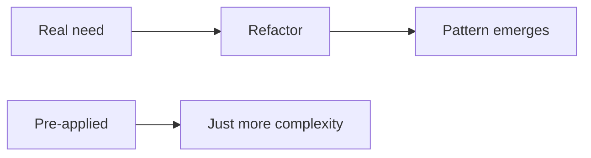

# 패턴을 남용하지 않는 법

디자인 패턴을 배우고 나면 한동안은 세상이 전부 패턴 후보로 보입니다. 작은 함수도 Strategy로 보이고, 단순한 생성도 Factory로 보이며, 래퍼 하나에도 Decorator라는 이름을 붙이고 싶어집니다. 문제는 이 열정이 종종 미래 요구사항을 상상한 추상화로 이어진다는 점입니다.

이 글은 Design Patterns 101 시리즈의 9번째 글입니다.

이번 글에서는 패턴을 잘 아는 것과 패턴을 잘 쓰는 것이 왜 다른지 정리하겠습니다. 핵심은 패턴이 문제를 부르는 것이 아니라, 반복되는 문제가 패턴을 불러야 한다는 사실입니다.

## 이 글에서 다룰 문제

- 좋은 패턴이 어떻게 나쁜 코드로 바뀔까요?
- 단순한 대안은 왜 종종 더 강할까요?
- YAGNI는 패턴 선택과 어떤 관계가 있을까요?
- 리팩터링을 통해 패턴을 “발견한다”는 말은 무슨 뜻일까요?
- 왜 시니어 엔지니어는 패턴 도입을 일부러 늦출까요?

> 멘탈 모델: 패턴은 답안지가 아니라 어휘입니다. 문제보다 먼저 도착한 패턴은 대개 추상화 비용만 남깁니다. 좋은 추상화는 늦게 나타납니다.

## 왜 중요한가

미리 적용한 패턴은 쉽게 잘못 적용한 패턴이 됩니다. 아직 변화가 한 번도 반복되지 않았는데 구조부터 일반화하면, 시스템은 미래를 대비한다는 명분 아래 현재의 단순함을 잃습니다.

반대로 단순한 코드에서 시작해 반복되는 변화가 정말 생겼을 때 패턴으로 끌어올리면, 추상화의 근거를 실제 코드에서 찾을 수 있습니다. 이 차이가 패턴을 설계 도구로 쓰는 팀과 장식으로 쓰는 팀을 가릅니다.

## 한눈에 보는 개념



패턴은 필요가 부를 때 등장해야 합니다. 반대 방향은 대부분 복잡성 증가로 끝납니다.

## 핵심 용어

- **YAGNI**: 지금 당장 필요하지 않다면 아직 만들지 않는다는 원칙입니다.
- **Premature abstraction**: 너무 이른 시점의 추상화입니다.
- **Pattern fever**: 모든 코드를 패턴으로 환원하고 싶어지는 상태입니다.
- **Cargo cult**: 모양만 흉내 내고 문제와 이유를 놓치는 태도입니다.
- **Refactor to pattern**: 단순한 코드를 다듬는 과정에서 패턴이 자연스럽게 드러나는 접근입니다.

## Before / After

**Before (overdone)**

```python
# Just one algorithm — but Strategy plus Factory plus Builder
class GreetStrategy: ...
class HelloStrategy(GreetStrategy): ...
class GreetFactory: ...
class GreetBuilder: ...
```

**After (simple)**

```python
def greet(name): return f"Hello, {name}"
```

지금 존재하는 요구사항이 한 줄이라면, 그 한 줄이 가장 정확한 설계일 수 있습니다. 추상화는 요구가 생긴 뒤에 올려도 늦지 않습니다.

## 패턴 남용을 피하는 5단계

### 1단계 — 가장 단순한 코드에서 시작합니다

```python
# 1_simple.py
def discount(price, kind):
    return {"vip": price*0.7, "member": price*0.9}.get(kind, price)
```

분기 하나짜리 코드에 패턴부터 들이대면 거의 항상 과합니다. 단순함은 나중에 얻기 어려운 장점이므로 시작점부터 잃지 않는 편이 좋습니다.

### 2단계 — 변화가 반복될 때만 추상화합니다

```python
# 2_when_repeats.py
# When tiers grow past six and per-tier policy starts diverging — then Strategy.
class Discount: ...
```

세 번째 변화쯤에서야 추상화가 값을 하기 시작하는 경우가 많습니다. 반복되지 않은 미래 요구를 위해 현재 코드를 비틀 필요는 없습니다.

### 3단계 — 먼저 함수 추출로 의도를 드러냅니다

```python
# 3_extract.py
def vip_price(p): return p * 0.7
def member_price(p): return p * 0.9
```

이름 있는 함수만으로도 충분히 많은 의도를 표현할 수 있습니다. 클래스 계층을 올리기 전에 함수 분리만으로 해결되는지 먼저 보는 습관이 중요합니다.

### 4단계 — 리팩터링 과정에서 패턴을 발견합니다

```python
# 4_refactor_to_pattern.py
# When five branches grow into the same shape, *then* lift to Strategy.
```

같은 형태의 분기가 정말 반복된다면 그때 패턴 이름이 붙습니다. 패턴은 계획서의 첫 줄보다 리팩터링의 결과로 나오는 편이 더 건강합니다.

### 5단계 — 필요 없어지면 패턴도 지웁니다

```python
# 5_remove_pattern.py
# If only one usage remains, fold the Strategy/Factory back into a function.
```

한때 맞았던 추상화가 지금도 맞는다고 보장할 수는 없습니다. 사용처가 줄었다면 오히려 다시 접어 넣는 편이 더 좋은 설계일 수 있습니다.

## 이 코드에서 주목할 점

- 가장 강한 시작점은 대개 단순한 함수입니다.
- 패턴은 반복되는 변화가 생겼을 때 정당화됩니다.
- 추상화는 한 번 더 미뤄도 되는 경우가 많습니다.

## 자주 하는 실수 5가지

1. **요구보다 추상화가 먼저 달리는 경우**: 상상한 미래를 위해 현재 코드를 복잡하게 만듭니다.
2. **이름만 패턴인 경우**: `XxxFactory`가 사실상 `new` 한 번 감싼 수준입니다.
3. **Strategy 안에 다시 if/elif가 있는 경우**: 패턴이 분기를 흡수하지 못했습니다.
4. **Decorator를 끝없이 겹치는 경우**: 디버깅이 악몽이 됩니다.
5. **DI 컨테이너가 모든 배선을 자동으로 처리하는 경우**: 보이지 않는 의존성이 쌓입니다.

## 실무에서는 이렇게 드러납니다

좋은 라이브러리는 패턴을 많이 쓰는 대신 정확하게 씁니다. requests, FastAPI, pytest 같은 도구를 보면 어렵지 않은 조합으로 큰 문제를 해결합니다. 주니어와 시니어의 차이는 패턴 이름을 많이 아느냐보다, 언제 기다려야 하는지 아느냐에 더 가깝습니다.

## 시니어 엔지니어는 이렇게 판단합니다

- 함수에서 시작합니다.
- 변화가 반복될 때만 추상화합니다.
- 패턴 이름은 계획이 아니라 결과라고 봅니다.
- 쓰이지 않는 추상화는 지웁니다.
- 코드 리뷰에서 “왜 이 패턴인가?”를 끝까지 묻습니다.

## 체크리스트

- [ ] 이 추상화가 지금 정말 필요한가?
- [ ] 변화가 세 번 이상 반복되었는가?
- [ ] 함수 추출만으로 충분하지 않은가?
- [ ] 패턴 이름이 역할을 정확히 설명하는가?
- [ ] 사용처가 하나로 줄면 다시 접어 넣을 수 있는가?

## 연습 문제

1. 코드베이스에서 과하게 추상화된 지점 하나를 골라 단순 함수로 되돌려 봅니다.
2. 최근 변경 빈도를 세어 보고 추상화 후보와 단순 유지 대상을 나눠 봅니다.
3. PR 리뷰 체크리스트에 “왜 이 패턴인가?” 질문을 추가해 봅니다.

## 정리 및 다음 글

패턴은 어휘이지 정답이 아닙니다. 마지막 글에서는 Python의 함수, 모듈, Protocol 같은 언어 도구가 많은 GoF 패턴을 어떻게 더 가볍게 녹여 내는지 살펴보겠습니다.

<!-- toc:begin -->
- [디자인 패턴이란 무엇인가?](./01-what-are-design-patterns.md)
- [Creational 패턴](./02-creational-patterns.md)
- [Structural 패턴](./03-structural-patterns.md)
- [Behavioral 패턴](./04-behavioral-patterns.md)
- [Strategy 패턴](./05-strategy-pattern.md)
- [Adapter 패턴](./06-adapter-pattern.md)
- [Observer 패턴](./07-observer-pattern.md)
- [Factory와 의존성 주입](./08-factory-and-di.md)
- **패턴을 남용하지 않는 법 (현재 글)**
- Python에 어울리는 패턴 (예정)
<!-- toc:end -->

## 참고 자료

- [YAGNI (Martin Fowler)](https://martinfowler.com/bliki/Yagni.html)
- [Refactoring to Patterns (Joshua Kerievsky)](https://www.industriallogic.com/xp/refactoring/)
- [Premature Abstraction (C2 wiki)](https://wiki.c2.com/?PrematureGeneralization)
- [Worse Is Better (Richard Gabriel)](https://www.dreamsongs.com/RiseOfWorseIsBetter.html)

Tags: Computer Science, DesignPatterns, Antipatterns, Simplicity, YAGNI, Refactoring
